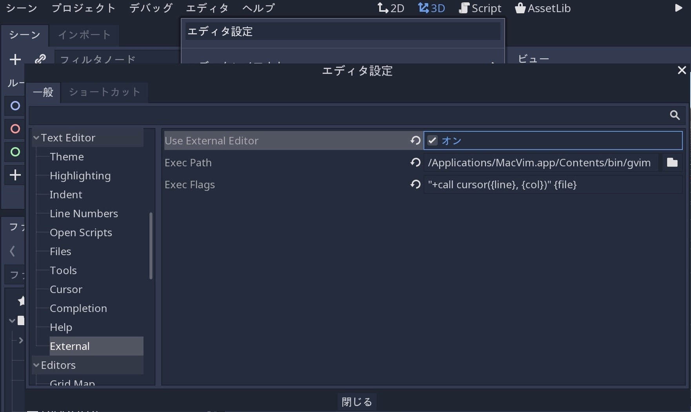

.. _doc_external_editor_jp:

外部テキストエディタの使用
====================================================

Godotは、Sublime TextやVisual Studio Codeなどの外部テキストエディタから操作可能だ。
外部テキストエディタを有効にするには、 ``エディタ ⇒ エディタ設定 ⇒ Text Editor -> External`` で関連するエディタ設定を参照する。

2つのフィールドがある：実行可能Path(Exec Path)とコマンドラインフラグ(Exec Flags)
フラグを使用する場合、エディタをGodotに統合し、開くファイルPathとその他の関連する引数を渡すことができる。
Godotは、フラグ文字列の次のプレースホルダを置き換える。

.. csv-table:: 
   :header: Exec Flags欄, 説明
   :widths: 1, 5

   ``{project}`` , プロジェクトディレクトリへの絶対Path
   ``{file}`` , ファイルへの絶対Path
   ``{col}`` , エラーの列番号
   ``{line}`` , エラーの行番号

さまざまなエディタ用の実行フラグ例を以下に示す。

.. csv-table:: 
   :header: エディタ, Exec Flags欄
   :widths: 1, 5

   Geany/Kate, ``{file} --line {line} --column {col}``
   Atom/Sublime Text, ``{file}:{line}``
   JetBrains Rider, ``--line {line} {file}``
   Visual Studio Code, ``{project} --goto {file}:{line}:{col}``
   Vim (gVim), ``"+call cursor({line}, {col})" {file}``

.. note::

   Visual Studio Codeの場合、 ``code.cmd`` ファイルを指定する必要がある。

.. 英語の原文：外部テキストエディタの使用
   Using an external text editor
   ==============================

   Godot can be used with an external text editor, such as Sublime Text or Visual Studio Code.
   To enable an external text editor, browse to the relevant editor settings via:
   ``Editor -> Editor Settings -> Text Editor -> External``

   .. image:: img/editor_settings.png

   There are two fields: the executable path and command line flags. The flags
   allow you to integrate the editor with Godot, passing it the file path to open
   and other relevant arguments. Godot will replace the following placeholders in
   the flags string:

   +---------------------+-----------------------------------------------------+
   | Field in Exec Flags | Is replaced with                                    |
   +=====================+=====================================================+
   | ``{project}``       | The absolute path to the project directory          |
   +---------------------+-----------------------------------------------------+
   | ``{file}``          | The absolute path to the file                       |
   +---------------------+-----------------------------------------------------+
   | ``{col}``           | The column number of the error                      |
   +---------------------+-----------------------------------------------------+
   | ``{line}``          | The line number of the error                        |
   +---------------------+-----------------------------------------------------+

   Some example Exec Flags for various editors include:

   +---------------------+-----------------------------------------------------+
   | Editor              | Exec Flags                                          |
   +=====================+=====================================================+
   | Geany/Kate          | ``{file} --line {line} --column {col}``             |
   +---------------------+-----------------------------------------------------+
   | Atom/Sublime Text   | ``{file}:{line}``                                   |
   +---------------------+-----------------------------------------------------+
   | JetBrains Rider     | ``--line {line} {file}``                            |
   +---------------------+-----------------------------------------------------+
   | Visual Studio Code  | ``{project} --goto {file}:{line}:{col}``            |
   +---------------------+-----------------------------------------------------+
   | Vim (gVim)          | ``"+call cursor({line}, {col})" {file}``            |
   +---------------------+-----------------------------------------------------+

   .. note:: For Visual Studio Code you will have to point to the ``code.cmd`` file.

.. vim:set ts=3 sw=3 tw=0 fenc=utf-8:
