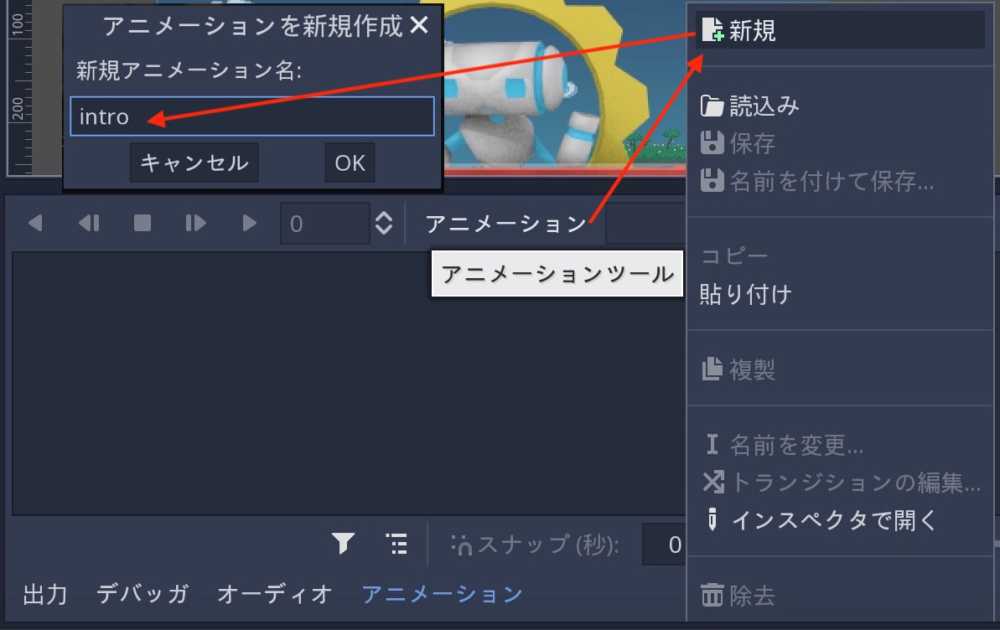
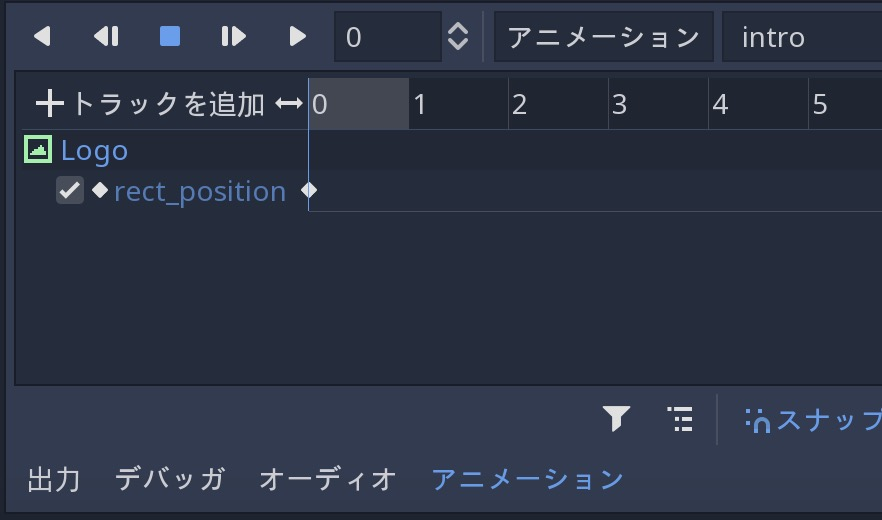

.. _doc_animations_jp:

アニメーション
============================

.. 英語の原文：アニメーション
   Animations
   ==========

概論
------------

Godotのアニメーションシステムは非常に強力で柔軟に使える。

今回の説明に入る前に、前の説明( :ref:`起動画面 <doc_splash_screen_jp>` )のシーンを流用するため、準備しておくこと。
目標は、スプラッシュ画像に "fade-in" アニメーションを追加することだ。
念のため、原本(英語)を次に示す。
:download:`robisplash.zip <files/robisplash.zip>`

.. 英語の原文：概論
   Introduction
   ------------

   Godot's animation system is extremely powerful and flexible.

   To begin, let's use the scene from the previous tutorial (:ref:`doc_splash_screen`).
   The goal is to add a "fade-in" animation to the splash image. Here's a copy
   just in case: :download:`robisplash.zip <files/robisplash.zip>`.

アニメーションプレイヤーの追加
------------------------------------------------------------

まず、 :ref:`AnimationPlayer <class_AnimationPlayer>` ノードを "background" (ルートノード)の子としてシーンに追加する。

このタイプのノードを選択したとき、アニメーションエディタパネルが起動する。

アニメーションエディタパネルは、手動で非表示にするまで、表示され続ける。

.. todo::

   リンクの確認。

.. 英語の原文：アニメーションプレイヤーの追加
   Add an animation player
   -----------------------

   First of all, add an :ref:`AnimationPlayer <class_AnimationPlayer>`
   node to the scene as a child of "background" (the root node):

   .. image:: img/robisplash_anim_inspector.png

   When a node of this type is selected, the animation editor panel will
   appear:

   .. image:: img/robisplash_anim_editor.png

   The animation editor panel stays visible until manually hidden.

アニメーションの作成
----------------------------------------

新しいアニメーションの作成に取りかかる。
アニメーションボタンを押し、メニューから新規を選択する。
ダイアログの表示にて、アニメーションに "intro" と言う名前を付ける。

アニメーションが完成したことで、プロパティエディタは "animation editing" モードに突入する。
このモードでは、プロパティエディタのすべてのプロパティの横に鍵アイコンが表示される。
Godotでは、オブジェクトのプロパティをアニメーションさせられる。

訳者： "アニメーションエディタパネル" を開いた状態でノードを選択しなければ、鍵アイコンは表示されない。

.. 英語の原文：アニメーションの作成
   Creating the animation
   ----------------------

   It's time to create a new animation! Press the Animation button then select
   new from the menu. Name the animation "intro" when the dialog appears.

   .. image:: img/robisplash_anim_button.png

   .. image:: img/robisplash_anim_new.png

   Now that we have an animation, the property editor enters
   "animation editing" mode. In this mode, a key icon appears next to
   every property of the property editor. In Godot, any property of an object
   can be animated:

   .. image:: img/robisplash_anim_property_keys.png

アニメーションの編集
----------------------------------------

画面の上部からロゴが表示される。

アニメーションエディタパネルを開いた状態から "logo" ノードを選択し、 "Rect / Position" プロパティを ``(118, -400)`` に設定し、プロパティの横にある鍵ボタンを押してキーフレームを追加する。

.. image:: img_jp/robisplash_anim_logo_inspector_key_jp.jpg

ダイアログから新しいトラックの作成を行う。

キーフレームがアニメーションプレイヤーエディタに追加される。
（訳者：原画では、0.5刻みだが、私の環境では1刻みから変更できない）

ここをクリックして、エディタカーソルを時間的に前方に移動する。
（訳者：こことはどこ？）

.. image:: img/robisplash_anim_editor_track_cursor.png

ロゴの位置を ``(118, 0)`` に変更し、キーフレームを再度追加する。
異なる値を持つ2つのキーフレームを使用したとき、アニメーションが生成される。

アニメーションパネルの "選択したアニメーションを最初から作成する。 (Shift-D)" ボタンクリックにて、ロゴが下降する。

"Autoplay on Load" ボタンをクリックし、シーンの開始時にアニメーションが自動的に開始されるように設定する。

最後に、シーンを実行したとき、アニメーションは次のようになる。

.. image:: img/out.gif

.. 英語の原文：アニメーションの編集
   Editing the animation
   ---------------------

   The logo will appear from the top of the screen.

   With the animation editor panel open, select the "logo" node and set the
   "Rect / Position" property to ``(118, -400)`` and press the key button next
   to the property to add a keyframe:

   .. image:: img/robisplash_anim_logo_inspector_key.png

   When the dialog appears, confirm that you are creating a new track.

   The keyframe will be added in the animation player editor:

   .. image:: img/robisplash_anim_editor_keyframe.png

   Move the editor cursor forward in time by clicking here:

   .. image:: img/robisplash_anim_editor_track_cursor.png

   Change the logo position to ``(118, 0)`` and add a keyframe again. With two
   keyframes with different values, the animation happens.

   .. image:: img/robisplash_anim_editor_keyframe_2.png

   Pressing "Play selected animation from start. (Shift-D)" on the animation panel
   will make the logo descend.

   .. image:: img/robisplash_anim_editor_play_start.png

   Click the "Autoplay on Load" button to set the animation to start automatically
   when the scene starts.

   .. image:: img/robisplash_anim_editor_autoplay.png

   And finally, when running the scene, the animation should look like
   this:

   .. image:: img/out.gif

.. vim:set ts=3 sw=3 tw=0 fenc=utf-8:
