.. _doc_exporting_jp:

エクスポート
========================

.. 英語の原文：エクスポート
   Exporting
   =========

概要
------------

動くゲームができあがったことで、その成功体験を含めて周りの人に共有したいと考える自己顕示欲の強い人もいることだろう。
しかし、Godotプロジェクトを渡し、 "〜〜.tscn" ファイルを実行させるのは無理があるだろう。
そのため、プロジェクトを *エクスポート* させることで "パッケージ化" させ、渡しやすくなり、実行してもらいやすくなる。

ちなみに、 "project.godot" を実行した場合は、プロジェクトが開くため、開発に携われる。

エクスポート方法は、実行してもらう環境(プラットフォーム)によって異なる。
今回のチュートリアルでは、先に作った "クリープをかわす!" ゲームからエクスポートする。
そして、最初の作業は、ゲームの動作にいくつかの変更を加えることから始める。

.. note:: "クリープをかわす!" を作っていない場合は、
          :ref:`doc_your_first_game_jp` を読むこと。

.. 英語の原文：概要
   Overview
   --------

   Now that you have a working game, you probably want to share your success with
   others. However, it's not practical to ask your friends to download Godot
   just so they can open your project. Instead, you can *export* your project,
   converting it into a "package" that can be run by anyone.

   The way you export your game depends on what platform you are targeting. In
   this tutorial, you'll learn how to export the "Dodge the Creeps" game for a
   variety of platforms. First, however, we need to make some changes to the
   way the game works.

   .. note:: If you haven't made "Dodge the Creeps" yourself yet, please read
             :ref:`doc_your_first_game` before continuing with this tutorial.

プロジェクトの準備
------------------------------------

"クリープをかわす!" では、キーボード操作からキャラクタ(プレイヤー)を動かした。
パソコンで遊ぶ分には問題ない。
しかし、携帯電話(スマートフォン)やタブレットでは、タッチ操作を有効にしなければ遊んでくれないだろう。
Godotでは、問題なく柔軟に対応できるため、マウスクリックをタッチ操作用に変換が可能だ。

標準機能として、タッチ入力からマウス入力に疑似操作へ置き換える(エミュレート)。
要は、タッチ操作のイベント発生検知処理をマウス操作に置き換えができると言うこと。
また、無効にする理由がある場合も対応が可能になっている。
その方法は、 "プロジェクトの設定" から *Input Devices* 及び *Pointing* で変更できる。

（有効にしておくこと。そうしなければ、以下のプログラム変更後のゲームを動かせない）

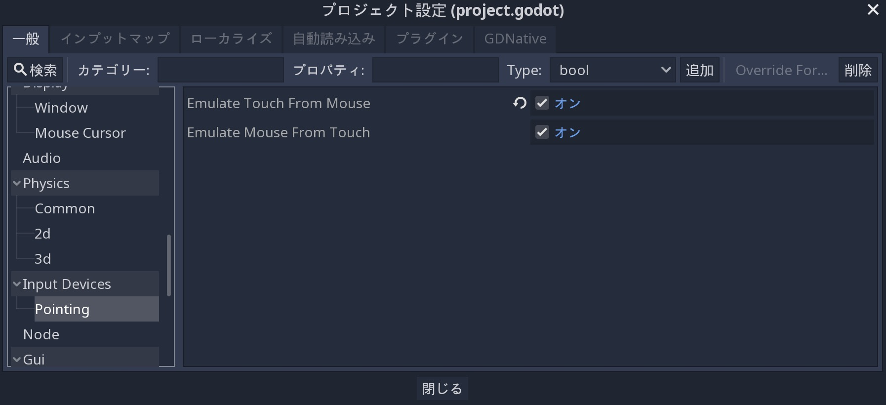

エミュレート対応作業前に、プロジェクト設定で *Display ⇒ Window* から *Stretch* オプションを開き、 *Mode* を "2D" に変更し、 *Aspect* を "keep" に変更すること。
これにより、様々な大きさのディスプレイに対し、必要に応じてゲーム画面の大きさが変わる。

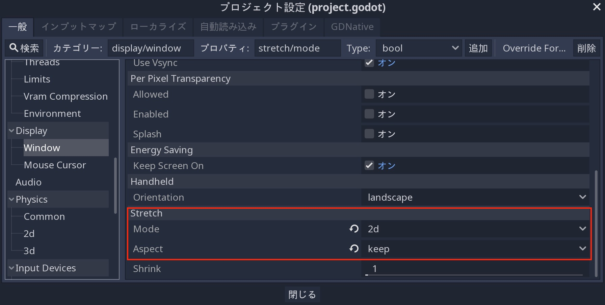

次に、 ``Player.gd`` スクリプトの変更で、画面操作方法を変える。
キー入力を削除し、タッチ(またはクリック)イベントで設定された "ターゲット(プラットフォーム)" にプレイヤーを移動させる。

プレイヤーの完全なスクリプトを以下に提示する。
変更点はコメントに記載している。

.. tabs::
   .. code-tab:: gdscript GDScript

      extends Area2D

      signal hit

      export var speed = 400  # ←訳者：追加対象のはずなのに、何の説明も無いように思うぞ。
      var velocity = Vector2()
      var screen_size

      # クリック位置変数の宣言
      var target = Vector2()

      func _ready():
          hide()
          screen_size = get_viewport_rect().size

      func start(pos):
          position = pos

          # 開始位置にターゲットを配置する。  ←訳者：どういう意味？　ターゲットとはプレイヤーのこと？
          target = pos
          show()
          $CollisionShape2D.disabled = false

      # タッチイベントのたびにターゲットを変更する。  ←訳者：ターゲットとは移動場所のこと？
      func _input(event):
          if event is InputEventScreenTouch and event.pressed:
              target = event.position

      func _process(delta):
          # ターゲットに向かって移動し、近づいたときに停止する。  ←訳者：ターゲットとは移動場所のこと？
          if position.distance_to(target) > 10:
              velocity = (target - position).normalized() * speed
          else:
              velocity = Vector2()

      # キーボード操作処理を削除(コメントアウト)する。
      #    if Input.is_action_pressed("ui_right"):
      #       velocity.x += 1
      #    if Input.is_action_pressed("ui_left"):
      #        velocity.x -= 1
      #    if Input.is_action_pressed("ui_down"):
      #        velocity.y += 1
      #    if Input.is_action_pressed("ui_up"):
      #        velocity.y -= 1

          if velocity.length() > 0:
              velocity = velocity.normalized() * speed
              $AnimatedSprite.play()
          else:
              $AnimatedSprite.stop()

          position += velocity * delta
          # 画面の外側には触れないため、
          # プレイヤーの位置を固定化する必要は無い。
          # position.x = clamp(position.x, 0, screensize.x)
          # position.y = clamp(position.y, 0, screensize.y)

          if velocity.x != 0:
              $AnimatedSprite.animation = "右"
              $AnimatedSprite.flip_v = false
              $AnimatedSprite.flip_h = velocity.x < 0
          elif velocity.y != 0:
              $AnimatedSprite.animation = "上"
              $AnimatedSprite.flip_v = velocity.y > 0

      func _on_Player_body_entered( body ):
          hide()
          emit_signal("hit")
          $CollisionShape2D.set_deferred("disabled", true)

（訳者：エミュレート操作を優先する際に、キーボード操作を無効化した。そのため、マウスクリックのみでプレイヤーを動かすことになった。キー入力で動かせないorz）

.. 英語の原文：プロジェクトの準備
   Preparing the project
   ---------------------

   In "Dodge the Creeps" we used keyboard controls to move the player's character.
   This is fine if your game is being played on a PC platform, but on a phone
   or tablet, you need to support touchscreen input. Because a click event can
   be treated the same as a touch event, we'll convert the game to a click-and-move
   input style.

   By default Godot emulates mouse input from touch input. That means if anything
   is coded to happen on a mouse event, touch will trigger it as well. If you wish to
   disable that for whatever reason, or emulate touch from mouse input, you can do that
   in the "Project Settings" under *Input Devices* and *Pointing*

   .. image:: img/export_touchsettings.png

   Before we change the input method, in the project settings go to *Display*,
   then click on *Window*. In the *Stretch* options, set *Mode* to "2d" and *Aspect* to 
   "keep". This ensures that the game scales consistently on different sized screens.

   .. image:: img/export_stretchsettings.png

   Next, we need to modify the ``Player.gd`` script to change the input method.
   We'll remove the key inputs and make the player move towards a "target" that's
   set by the touch (or click) event.

   Here is the full script for the player, with comments noting what we've
   changed:

   .. tabs::
    .. code-tab:: gdscript GDScript

       extends Area2D

       signal hit

       export var speed = 400
       var velocity = Vector2()
       var screen_size
       # Add this variable to hold the clicked position.
       var target = Vector2()

       func _ready():
           hide()
           screen_size = get_viewport_rect().size

       func start(pos):
           position = pos
           # Initial target is the start position.
           target = pos
           show()
           $CollisionShape2D.disabled = false

       # Change the target whenever a touch event happens.
       func _input(event):
           if event is InputEventScreenTouch and event.pressed:
               target = event.position

       func _process(delta):
           # Move towards the target and stop when close.
           if position.distance_to(target) > 10:
               velocity = (target - position).normalized() * speed
           else:
               velocity = Vector2()

       # Remove keyboard controls.
       #    if Input.is_action_pressed("ui_right"):
       #       velocity.x += 1
       #    if Input.is_action_pressed("ui_left"):
       #        velocity.x -= 1
       #    if Input.is_action_pressed("ui_down"):
       #        velocity.y += 1
       #    if Input.is_action_pressed("ui_up"):
       #        velocity.y -= 1

           if velocity.length() > 0:
               velocity = velocity.normalized() * speed
               $AnimatedSprite.play()
           else:
               $AnimatedSprite.stop()

           position += velocity * delta
           # We don't need to clamp the player's position
           # because you can't click outside the screen.
           # position.x = clamp(position.x, 0, screensize.x)
           # position.y = clamp(position.y, 0, screensize.y)

           if velocity.x != 0:
               $AnimatedSprite.animation = "right"
               $AnimatedSprite.flip_v = false
               $AnimatedSprite.flip_h = velocity.x < 0
           elif velocity.y != 0:
               $AnimatedSprite.animation = "up"
               $AnimatedSprite.flip_v = velocity.y > 0

       func _on_Player_body_entered( body ):
           hide()
           emit_signal("hit")
           $CollisionShape2D.set_deferred("disabled", true)

テンプレートのエクスポート
----------------------------------------------------

エクスポートするには、 http://godotengine.org/download から *export templates* をダウンロードする必要がある。
これらのテンプレートは、各プラットフォーム用にエディタが組み込まれていない最適化版エンジンになる。
Godotから *エディタ ⇒ Manage Export Templates* で入手することもできる。

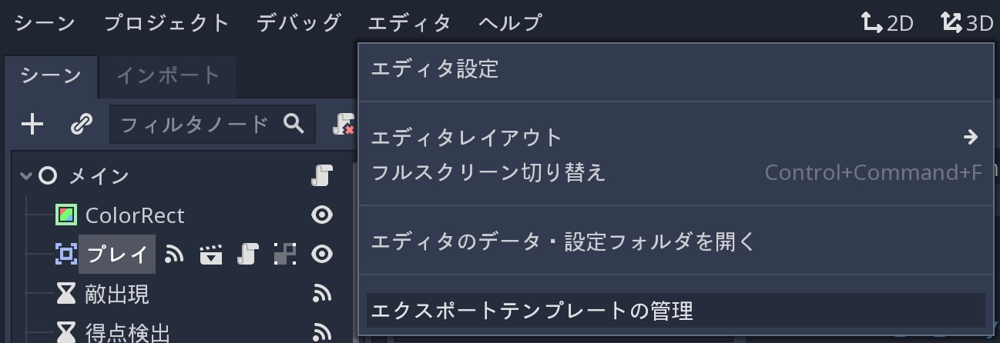

表示されたウィンドウから *ダウンロード* を選び、Godotの利用バージョンに一致するテンプレートを取得すること。

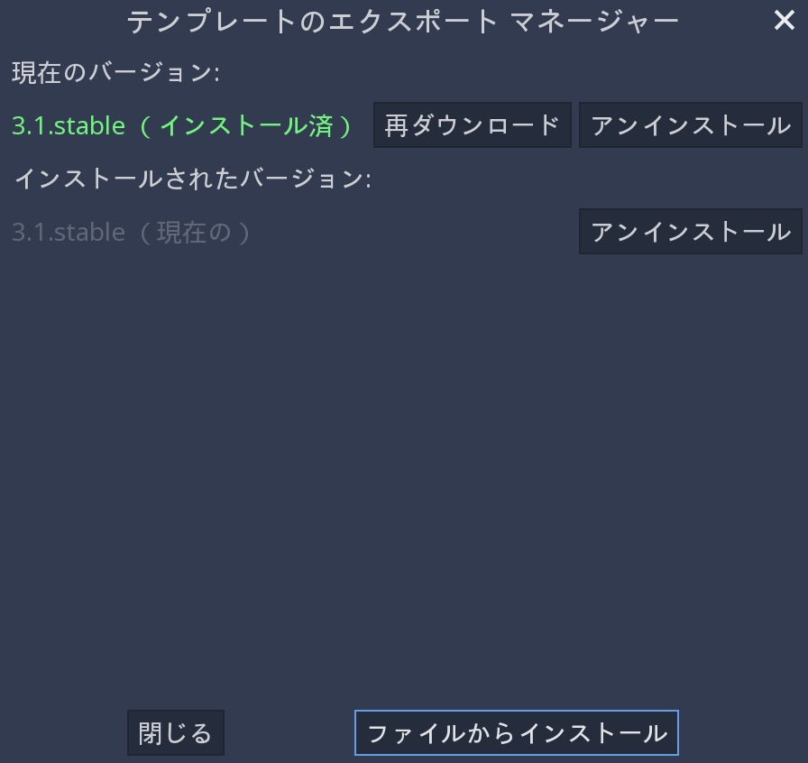

（上記は、既にダウンロード済みの画像になる）

.. note:: Godotをアップグレードする場合、テンプレートのバージョンも合わせる(ダウンロードし直す)必要がある。
          異なるバージョンを利用する場合、正常に動かない可能性がある。

.. 英語の原文：テンプレートのエクスポート
   Export templates
   ----------------

   In order to export, you need to download the *export templates* from the
   http://godotengine.org/download. These templates are optimized versions of the engine
   without the editor pre-compiled for each platform . You can also
   download them in Godot by clicking on *Editor -> Manage Export Templates*:

   .. image:: img/export_template_menu.png

   In the window that appears, you can click "Download" to get the template
   version that matches your version of Godot.

   .. image:: img/export_template_manager.png

   .. note:: If you upgrade Godot, you must download templates that match the new version
             or your exported projects may not work correctly.

.. _ドピュドピュ出すjump:

プリセットのエクスポート
------------------------------------------------

次に、 *プロジェクト ⇒ エクスポート* からエクスポート設定を変更できる。

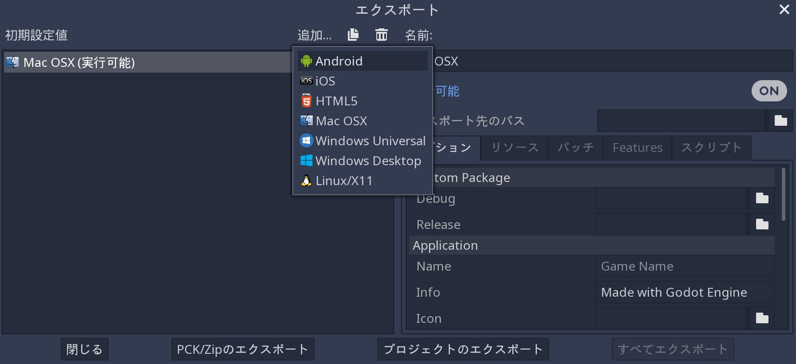

"追加..." をクリックしてプラットフォームを選び、新しいエクスポートプリセットを作成する。
様々な設定で、好きなだけプリセットの作成が可能だ。

ウィンドウ下部には2つのボタンがある。
"PCK/ZIPのエクスポート" は、プロジェクトデータのパックバージョンのみを作成する。
これには、実行可能ファイルが含まれないため、プロジェクトの単独実行はできない。

2番目のボタン "プロジェクトのエクスポート" は、Androidには、 `.apk` 形式・Windowsには `.exe` 形式などの完全なゲーム実行可能環境を出力する。

"リソース" タブと "Features" タブでは、プラットフォームごとにゲームのエクスポート方法を指定できる。
現時点では、これらの設定を変更せずに説明を続ける。

.. 英語の原文：プリセットのエクスポート
   Export presets
   --------------

   Next, you can configure the export settings by clicking on *Project -> Export*:

   .. image:: img/export_presets_window.png

   Create a new export preset by clicking "Add..." and selecting a platform. You
   can make as many presets as you like with different settings.

   At the bottom of the window are two buttons. "Export PCK/ZIP" only creates
   a packed version of your project's data. This doesn't include an executable
   so the project can't be run on its own.

   The second button, "Export Project", creates a complete executable version
   of your game, such as an `.apk` for Android or an `.exe` for Windows.

   In the "Resources" and "Features" tabs, you can customize how the game is
   exported for each platform. We can leave those settings alone for now.

プラットフォームごとのエクスポート
--------------------------------------------------------------------

ここの説明では、必要なソフトウェアの追加または要件そして各プラットフォームの経緯を説明する。

.. 英語の原文：プラットフォームごとのエクスポート
   Exporting by platform
   ---------------------

   In this section, we'll walk through the process for each platform,
   including any additional software or requirements you'll need.

PC (Linux/macOS/Windows)
~~~~~~~~~~~~~~~~~~~~~~~~~~~~~~~~~~~~~~~~~~~~~~~~

パソコン向けのエクスポートは、サポート可能な3つのオペレーションシステム(OS)で同じように動く。
エクスポートウィンドウを開き、 "追加..." から作成対象のプリセットを選ぶ。
次に、 "プロジェクトのエクスポート" から名前とエクスポート先フォルダを選ぶ。
そのとき、プロジェクトフォルダ *以外* を選ぶこと。

"保存" をクリックすることでエンジンがエクスポートファイルを作成する。

.. note:: MacOS用のエクスポートは、MacOS上でエクスポートすることで `.dmg` ファイルが出力できる。
          それ以外のOS(Windows・Linux)からMacOS用に出力する場合は、 `.zip` が作成される。
          しかし、圧縮ファイルになっているだけで、展開することにより、 MacOS用の `.app` を入手できる。

.. note:: Windowsでは、エクスポートされた実行可能ファイルのアイコンを手動ではあるが変更できる。
          :ref:`doc_changing_application_icon_for_windows_jp` を参照すること。

私の環境では実行できなかった。
MacOS標準のセキュリティが働いているのか分からないが、解除することもできず、実行できずじまいになった。

しかし、Windows環境では動いたため、MacOS側に問題があるのだろう。

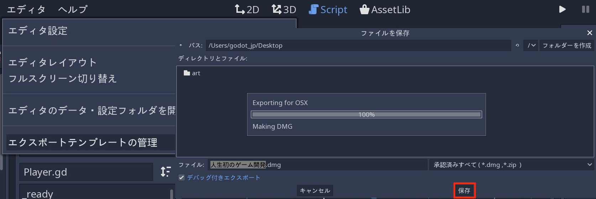

.. 英語の原文：PC (Linux/macOS/Windows)
   PC (Linux/macOS/Windows)
   ~~~~~~~~~~~~~~~~~~~~~~~~

   Exporting PC platforms works the same across the three supported operating
   systems. Open the export window and click "Add.." to create the preset(s) you
   want to make. Then click "Export Project" and choose a name and destination
   folder. Choose a location *outside* of your project folder.

   Click "Save" and the engine will build the export files.

   .. note:: When exporting for macOS, if you export on a macOS computer, you'll
             end up with a `.dmg` file, while using Linux or Windows
             produces a `.zip`. In either case, the compressed file contains
             a macOS `.app` that you can double-click and run.

   .. note:: On Windows, if you want your exported executable to have a different
             icon than the default one, you need to change it manually. See:
             :ref:`doc_changing_application_icon_for_windows`.

Android
~~~~~~~

.. tip:: モバイル機器には、さまざまな機能が備わっている。
         基本的には、Godotの標準設定のままで動くはずだが、モバイル開発は科学よりも芸術性を重視する必要があり、すべてを活用するにはヘルプページの熟読や多少の検証が必要になるかもしれない。

Android用にプロジェクトをエクスポートする前に、次のソフトウェアをダウンロードする必要がある。

* Android SDK： https://developer.android.com/studio/
* Java JDK： http://www.oracle.com/technetwork/java/javase/downloads/index.html

初めてAndroid Studioを実行するときは、 *Configure -> SDK Manager* から "Android SDK Platform Tools" をインストールすること。
これにより、Godotとのデバイス通信用 `adb` コマンドラインツールが手に入る。

（訳者：どこの何を説明しているのか理解できないが、以下の画像になっていれば問題ないと思う）

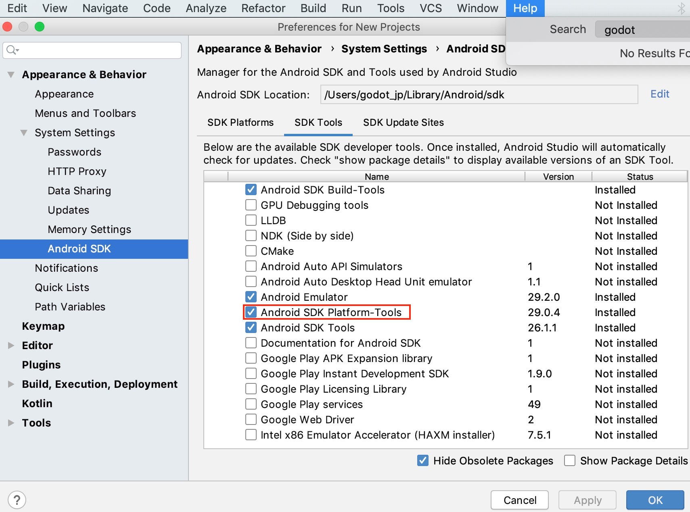

.. _陰部への秘密鍵jump:

次に、開発環境のコマンドラインから次のコマンドを実行し、デバッグキーストアを作成する。
（実行したディレクトリにファイルが作られる）

::

   keytool -keyalg RSA -genkeypair -alias androiddebugkey -keypass android -keystore debug.keystore -storepass android -dname "CN=Android Debug,O=Android,C=US" -validity 9999

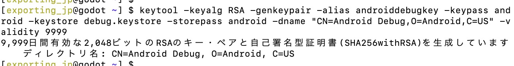

次に、Godotから *エディタ ⇒ エディタ設定* をたどり、 *Export ⇒ Android* を開く。
ここで、システム上のAndroid SDKアプリケーションへのパスと作成したキーストアの場所を設定する必要がある。

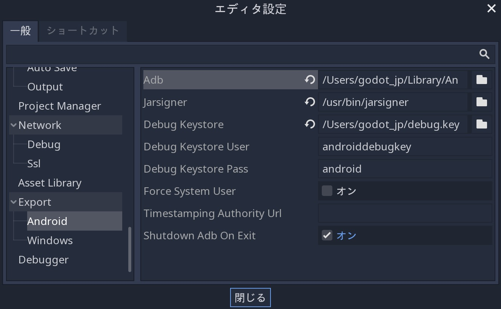

Adb欄へのPathは、Android Studioで以下から確認できる(これだけでは不足している)。
adbファイルそのものは、その配下の "platform-tools" ディレクトリに存在する。

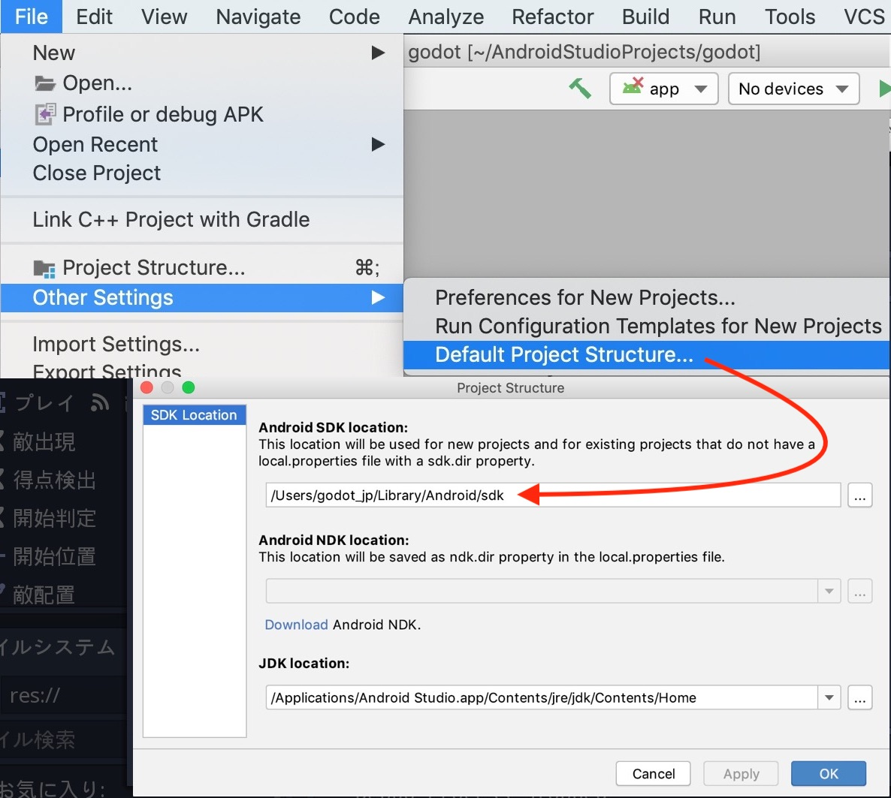

jarsigner欄へのPathは、コマンドライン上で `which jarsigner` と打ち込むことにより、ファイル名を含むPathが表示される。

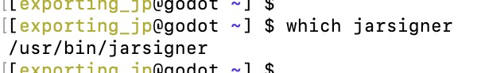

Debug Keystore欄へのPathは、上記で実行した :ref:`コマンド <陰部への秘密鍵jump>` の場所を指定する(ファイルを移動させたならば、移動後のPathを指定する)。

これでエクスポート準備が整った。
*プロジェクト ⇒ エクスポート* をクリックし、Android用のプリセットを追加する。
（ :ref:`上記参照 <ドピュドピュ出すjump>` ）

"プロジェクトのエクスポート" ボタンをクリックすることで、GodotがAndroid向けのAPKをビルドする。

エラーが出る場合は、以下のように名前を付けておくこと。

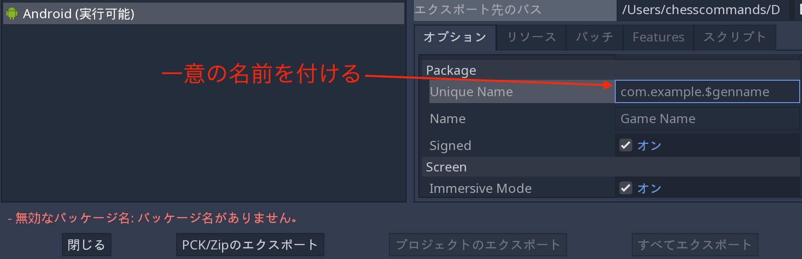

コマンドラインで同じことをするには、次のコマンドを使う(ようだ。By.訳者)。

::

   adb install dodge.apk

.. note:: Android端末は、 *開発者モード* にしておく必要がある。
          設定方法などの詳細は、各端末のマニュアルを参照すること。

開発環境(端末)が対応している場合、互換性のあるAndroid端末を接続したときに、 "One-click Deploy" ボタンがGodotのプレイテストボタン領域に表示される。

.. image:: img/export_android_oneclick.png

このボタンをククリックすることでAPKファイルが作成され、その直後にAndroid端末にコピーされる。

.. 英語の原文：Android
   Android
   ~~~~~~~

   .. tip:: Mobile devices come with a wide variety of capabilities.
             In most cases, Godot's default settings will work, but mobile
             development is sometimes more art than science, and you may
             need to do some experimenting and searching for help in order
             to get everything working.

   Before you can export your project for Android, you must download the following
   software:

   * Android SDK: https://developer.android.com/studio/
   * Java JDK: http://www.oracle.com/technetwork/java/javase/downloads/index.html

   When you run Android Studio for the first time, click on *Configure -> SDK Manager*
   and install "Android SDK Platform Tools". This installs the `adb` command-line
   tool that Godot uses to communicate with your device.

   Next, create a debug keystore by running the following command on your
   system's command line:

   ::

       keytool -keyalg RSA -genkeypair -alias androiddebugkey -keypass android -keystore debug.keystore -storepass android -dname "CN=Android Debug,O=Android,C=US" -validity 9999

   Click on *Editor -> Editor Settings* in Godot and select the *Export/Android*
   section. Here, you need to set the paths to the Android SDK applications on
   your system and the location of the keystore you just created.

   .. image:: img/export_editor_android_settings.png

   Now you're ready to export. Click on *Project -> Export* and add a preset
   for Android (see above).

   Click the "Export Project" button and Godot will build an APK you can download
   on your device. To do this on the command line, use the following:

   ::

       adb install dodge.apk

   .. note:: Your device may need to be in *developer mode*. Consult your
             device's documentation for details.

   If your system supports it, connecting a compatible Android device will cause
   a "One-click Deploy" button to appear in Godot's playtest button area:

   .. image:: img/export_android_oneclick.png

   Clicking this button builds the APK and copies it onto your device in one step.

iOS
~~~~~~

訳者：i何とかPhoneを持っていないため、きっと以下の説明に従えばできると思っている。

.. note:: iOS用のゲーム開発には、Xcodeが導入済みのMac端末を利用する必要がある。

エクスポート前に設定しなければならない作業がいくつかある。
まず、 "App Store Team Id" を確認するために、Apple開発者アカウントにログインして、 "Membership" を確認する。

以下に示すように、アイコンとスプラッシュ画面の画像を提供する必要がある。

.. image:: img/export_ios_settings.png

*プロジェクトのエクスポート* をクリックし、出力先フォルダを決める。

プロジェクトを正常にエクスポートしたとき、上記の決定場所にフォルダとファイルが作成される。

.. image:: img/export_xcode_project_folders.png

これでプロジェクトをXcodeで開き、iOS用のプロジェクトをビルドできるようになった。
しかし、Xcodeのビルド手順は、このチュートリアルの範囲外になる。
詳細については、
https://help.apple.com/xcode/mac/current/#/devc8c2a6be1
(英語)を参照すること。

.. 英語の原文：iOS
   iOS
   ~~~

   .. note:: In order to build your game for iOS, you must have a computer running
             macOS with Xcode installed.

   Before exporting, there are some settings that you *must* complete for the project
   to export successfully. First, the "App Store Team Id", which you can find by
   logging in to your Apple developer account and looking in the "Membership" section.

   You must also provide icons and splash screen images as shown below:

   .. image:: img/export_ios_settings.png

   Click "Export Project" and select a destination folder.

   Once you have successfully exported the project, you'll find the following
   folders and files have been created in your selected location:

   .. image:: img/export_xcode_project_folders.png

   You can now open the project in Xcode and build the project for iOS. Xcode
   build procedure is beyond the scope of this tutorial. See
   https://help.apple.com/xcode/mac/current/#/devc8c2a6be1 for
   more information.

HTML5 (web)
~~~~~~~~~~~

HTML5プリセットの "プロジェクトのエクスポート" をクリックする。
標準設定の変更は必要ない。

エクスポート完了により、次のファイルを含むフォルダが作成される。

.. image:: img/export_web_files.png

`.html` ファイルをブラウザで表示したときには、ゲームができるようになっている。
ただし、ファイルを直接開くことはできない。
ファイルは、Webサーバによって提供される必要があるためだ。
コンピュータにその機能が無い場合、ネット検索から特定のOS候補を見つける必要がある。

.. todo::

   サーバーを立ち上げる作業が必要になるようだ。

ブラウザで HTMLファイルの配置パスを指定する。
開始画面が表示されるまでに待ち時間の発生がある。ゲームの読み込みに時間が掛かるためだ。

.. image:: img/export_web_example.png

問題が発生した場合、ゲーム下のコンソールウィンドウに、その旨が表示される。
プロジェクトのエクスポート時に、 "Export With Debug" の設定を切ることで無効化できる。

.. note:: WASMのブラウザサポートは普及していない。
          FirefoxとChromeの両方に対応しているが、動作しないバージョンもあるかもしれない。
          そのときは、最新のブラウザに更新する必要がある。

          仕様を完璧に理解したにもかかわらず、仕様と異なる動きを発見した場合、 `Godot Github repository <https://github.com/godotengine/godot/issues>`_ にバグ報告すること。

          以下、常識の報告方法(私が最低限身につけるべき事柄でもある)。

          * そのときの環境
          * 結果予想
          * 実際の結果
          * そのときの作業方法
          * 実際には何が起きたのか
          * もしくは、何が起きなかったのか
          * 事象報告であり、感情を含めた報告は論外
          * 言葉を正確に(一般用語なのかその環境特有なのか)
          * 再現手順をできる限りわかりやすく伝える。

.. 英語の原文：HTML5 (web)
   HTML5 (web)
   ~~~~~~~~~~~

   Click "Export Project" on the HTML5 preset. We don't need to change any
   of the default settings.

   When the export is complete, you'll have a folder containing the following
   files:

   .. image:: img/export_web_files.png

   Viewing the `.html` file in your browser lets you play the game. However, you
   can't open the file directly, it needs to be served by a web server. If you don't
   have one set up on your computer, you can use Google to find suggestions for
   your specific OS.

   Point your browser at the URL where you've placed the html file. You may have
   to wait a few moments while the game loads before you see the start screen.

   .. image:: img/export_web_example.png

   The console window beneath the game tells you if anything goes wrong. You can
   disable it by setting "Export With Debug" off when you export the project.

   .. note:: Browser support for WASM is not very widespread. Firefox and Chrome
             both support it, but you may still find some things that don't work.
             Make sure you have updated your browser to the most recent version,
             and report any bugs you find at the `Godot Github repository <https://github.com/godotengine/godot/issues>`_.

.. vim:set tabstop=3 shiftwidth=3 textwidth=0 fenc=utf-8:
   tabstop：タブを画面で表示する際の幅。
   softtabstop：0でないなら、タブを入力時、その数値分だけ半角スペースを挿入する。
   shiftwidth：インデント時に使用されるスペースの数。
   textwidth：0でないなら、このオプションで設定された幅で行を改行する。
