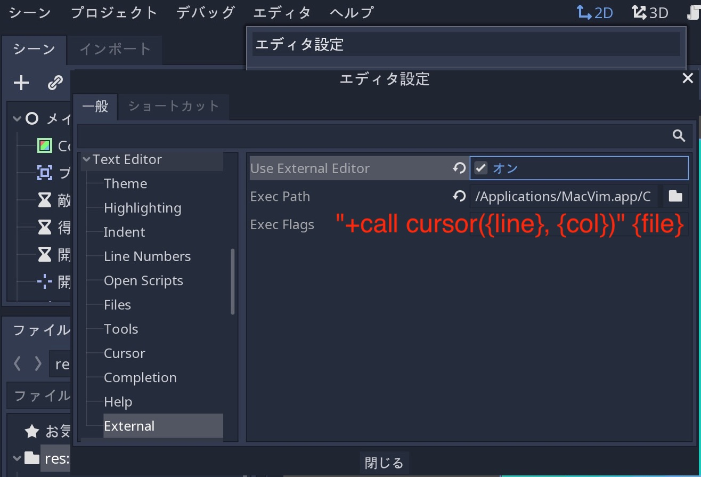

.. _doc_godot_design_philosophy_jp:

Godotの設計哲学
==============================

苦労してここまで来たことで手に汗をかいているだろう。
今回は、手を動かすのはひとまず置いておき、Godotの設計について説明する。

**すべてのゲームエンジンはそれぞれ異なり、多様な要求に適合する。**
そして、さまざまな機能を提供するだけで無く、各エンジンの設計は独特になっている。
これは、ゲーム構造を形成するいろいろなワークフローと手を替え品を替えて繋がることを表している。
これらのすべては、それぞれの設計哲学に由来する。

今回の説明は、Godotの仕組みを理解するのに役立つ。
その中核部分から説明を始める。
使用可能な機能一覧では無く、エンジンの比較でもない。
作成したいプロジェクトにGodotエンジンが適しているかどうかを知るには、自分で試し、設計と制限を理解する必要がある。

エンジン機能の概要は、 `Discover Godot 3, the Free game engine <https://youtu.be/4v3qge-3CqQ>`_ (英語解説のYouTube動画)を参照すること。

.. 英語の原文：Godotの設計哲学
   Godot’s design philosophy
   =========================

   Now that you've gotten your hands wet, let's talk about Godot's design.

   **Every game engine is different and fits different needs.**
   Not only do they offer a range of features, but the design of each engine
   is unique. This leads to different workflows and different ways to form
   your games’ structures. This all stems from their respective design philosophies.

   This page is here to help you understand how Godot works, starting
   with some of its core pillars. It is not a list of available features, nor
   is it an engine comparison. To know if any engine can be a good fit for
   your project, you need to try it out for yourself and
   understand its design and limitations.

   Please watch `Discover Godot 3, the Free game engine <https://youtu.be/4v3qge-3CqQ>`_
   if you're looking for an overview of the engine's features.

オブジェクト指向の設計と構成
--------------------------------------------------------

Godotは、柔軟なシーンシステムとノード階層により、オブジェクト指向の設計をその中核に取り入れている。
それは、ゲーム開発に直感的な方法を提供するためであり、厳密なプログラミングパターンから離れるためでもある。

例えば、Godotを使う場合、シーンを **構成または集約** ができる。
ネストされたプレハブのようなもの。

.. note::

   プレハブとは、オブジェクトのコンポーネントやプロパティを一つに格納したもののこと。
   そして、プレハブとは、作成済みのオブジェクトを複製する目的でもある。

ネストされたプレハブとは、まさにオブジェクト指向のことであり、以下の仕組みになっている。

- BlinkingLightシーンとBlinkingLightを使うBrokenLanternシーンを作成する。

- BrokenLanternsで満たされた都市を作成する。

- BlinkingLightの色を変更して保存したとき、市内のすべてのBrokenLanternsが即座に更新される。

さらに、どのシーンからも **inherit** できる。

Godotのシーンは、武器・プレイヤー・アイテム・ドア・レベル・レベルの一部などあらゆるものになる。
純粋なコードのクラスのように機能するが、エディタを使用するかコードのみを使用するか、もしくは2つを組み合わせることも自由にできる。

いくつかの3Dエンジンにあるプレハブとは異なる。
これらのシーンを継承して拡張できることがGodot用のプレハブの特徴になっている。
プレイヤーを拡張する手品師に職替えもできる。
エディタで大本のキャラクタ像を変更したとき、当然手品師も影響を受ける(変更される)。
その構造がゲームのデザインに一致するようにできる。

訳者：大本を変更した場合は、すべてのプレイヤーに反映されるため、根本から覆るような仕様変更にも耐えられる。その一方で、個々のプレイヤーには一切干渉せず、個々の設定は、そのまま継続する。当然個々のプレイヤーを変更した場合は他のプレイヤーに影響を与えずに変更が反映される。と言うことかな。

.. image:: ./img/engine_design_01.png

また、Godotには、ノードと呼ばれる様々なタイプのオブジェクトがあり、それぞれ特定の目的があることに注意すること。
各ノードはツリーの一部であり、常に親のNodeクラスを継承する。
エンジンには衝突形状などのコンポーネントがあり、それらは例外であり、標準仕様ではない。

.. image:: ./img/engine_design_02.png

上記の例で言えば、SpriteはNode2D・CanvasItem・Nodeの3種類の機能を継承している。
トランスフォームやカスタムシェイプを描画し、カスタムシェーダーでレンダリングする機能など3つの親クラスのすべてのプロパティと機能がある。

.. todo::

   カスタムシェーダなどは、CanvasItemノードかNode2Dノードの機能だと思うが、見つけられない。
   ⇒探すこと。

.. 英語の原文：オブジェクト指向の設計と構成
   Object-oriented design and composition
   --------------------------------------

   Godot embraces object-oriented design at its core with its flexible
   scene system and Node hierarchy. It tries to stay away from strict
   programming patterns to offer an intuitive way to structure your game.

   For one, Godot lets you **compose or aggregate** scenes.
   It's like nested prefabs: you can create a BlinkingLight scene and
   a BrokenLantern scene that uses the BlinkingLight.
   Then, create a city filled with BrokenLanterns.
   Change the BlinkingLight's color, save, and all the
   BrokenLanterns in the city will update instantly.

   On top of that, you can **inherit** from any scene.

   A Godot scene could be a Weapon, a Character, an Item, a Door, a Level,
   part of a level… anything you’d like. It works like a class in pure code,
   except you’re free to design it by using the editor, using only the
   code, or mixing and matching the two.

   It’s different from prefabs you find in several 3D engines, as you can
   then inherit from and extend those scenes. You may create a Magician
   that extends your Character. Modify the Character in the editor and the Magician
   will update as well. It helps you build your projects so that their
   structure matches the game’s design.

   |image0|

   Also note that Godot offers many different types of objects called
   nodes, each with a specific purpose. Nodes are part of a tree and always
   inherit from their parents up to the Node class. Although the engine
   does feature components like collision shapes, they’re the
   exception, not the norm.

   |image1|

   Sprite is a Node2D, a CanvasItem and a Node. It has all the properties
   and features of its three parent classes, like transforms or the ability
   to draw custom shapes and render with a custom shader.

包括的なパッケージ
------------------------------------

Godotは、最も一般的なニーズに応えるために独自のツールを提供しようとする。
今まで、専用のスクリプティングワークスペース・アニメーションエディタ・タイルマップエディタ・シェーダーエディタ・デバッガ・プロファイラ・ローカル及びリモートデバイスでのホットリロード機能などを用意してきた。

.. image:: ./img/engine_design_03.png

目標は、ゲームと継続的なユーザエクスペリエンスを作成するためのフルパッケージを提供すること。
インポートプラグインがある限り、外部プログラムを使用できる。
また、 `Tiled Map Importer <https://github.com/vnen/godot-tiled-importer>`_ のように作成できる。

ここで、 :ref:`外部エディタ <doc_external_editor_jp>` の利用を説明する。

**エディタ ⇒ エディタ設定 ⇒ Text Editor ⇒ External** から "Use External Editor" をオンにする。その直下の "Exec Path" に、エディタを指定する。

これだけではエディタだけが起動し、スクリプトそのものに紐付けられずに起動するため、使い物にならない。
そのため、 "Exec Flags" 欄に起動引数を指定し、スクリプトファイルが開くように設定する。

`"+call cursor({line}, {col})" {file}`

訳者：私の環境では、Godotプロジェクトを起動直後に、スクリプトファイルがすべて開く。ただ単に迷惑だが、きっと改善されることだろう(何回か起動をやり直したときに、無駄なエディタ起動がなくなった)。

そして、Godotが独自のプログラミング言語GDScriptおよびVisualScriptをC#とともに提供している理由の1つでもある(訳者：GDScriptだけではないことを言いたい？)。
ゲーム開発者とゲームデザイナーの要求に応じて設計され、エンジンとエディタに緊密に統合されている。

GDScriptを使う場合、Pythonのような構文を使用して簡単なコードを記述できるだけでなく、型を検出し、静的言語の自動補完の使いやすさが実感できるだろう。
なおかつ、VectorsやColorsなどの組み込み型を使用したゲームプレイコード用に最適化もなされる。
（訳者：何の筐体を指しているのか不明）

GDNativeを使う場合、エンジンを再コンパイルなしに、C・C++・Rust・Python(Cythonコンパイラ利用)などのコンパイル済み言語を使用して高性能コードを作成できる。

.. image:: ./img/engine_design_visual_script.png

*VisualScriptは、ノードベースのプログラミング言語で、エディタに旨く統合されている。
ノードまたはリソースをグラフにドラッグ&ドロップ後に、新しいコードブロックを作成する。*

3Dワークスペースは2Dワークスペースほど多くのツールを備えていないことに注意すること。
地形の編集・複雑なプレイヤーのアニメーションを行うには外部のプログラムまたはアドオンが必要になる。
Godotは、ゲームコードを使用してエディタの機能を拡張するための完全なAPIを提供する。
次の `GodotエディタはGodotゲーム`_ を参照すること。

.. image:: ./img/engine_design_fsm_plugin.png

*kubecz3kによるGodot2のState Machineエディタプラグインは、状態と遷移を視覚的に管理できる。*

.. 英語の原文：包括的なパッケージ
   All-inclusive package
   ---------------------

   Godot tries to provide its own tools to answer most common
   needs. It has a dedicated scripting workspace, an animation editor, a
   tilemap editor, a shader editor, a debugger, a profiler,
   the ability to hot-reload locally and on remote devices, etc.

   |image2|

   The goal is to offer a full package to create games and a continuous
   user experience. You can still work with external programs as long as
   there is an import plugin for it. Or you can create one, like the `Tiled
   Map Importer <https://github.com/vnen/godot-tiled-importer>`__.

   That is also partly why Godot offers its own programming languages
   GDscript and VisualScript, along with C#. They’re designed for the needs
   of game developers and game designers, and they’re tightly integrated in
   the engine and the editor.

   GDscript lets you write simple code using Python-like syntax,
   yet it detects types and offers a static language's quality of auto-completion.
   It is also optimized for gameplay code with built-in types like Vectors and Colors.

   Note that with GDNative, you can write high-performance code using compiled
   languages like C, C++, Rust, or Python (using the Cython compiler)
   without recompiling the engine.

   |image3|

   *VisualScript is a node-based programming language that integrates well
   in the editor. You can drag and drop nodes or resources into the graph
   to create new code blocks.*

   Note that the 3D workspace doesn’t feature as many tools as the 2D workspace.
   You’ll need external programs or add-ons to edit terrains, animate complex characters, and so on.
   Godot provides a complete API to extend the editor’s functionality using
   game code. See `The Godot editor is a Godot game`_ below.

   |image4|

   *A State Machine editor plugin in Godot 2 by kubecz3k. It lets you
   manage states and transitions visually.*

オープンソース
----------------------------

Godotは、 **MIT license** に基づき、完全にオープンソースのコードベースを提供している。
これは、同梱されるすべてのテクノロジーも自由でなければならないことを意味する。
ほとんどの場合、それらは貢献者によってゼロから開発されている。

プロジェクトの要求に合わせて誰でも独自のツールをプラグインできる。
エンジンには同梱されない。
これには、Google AdMobまたはFMODが含まれるため。
これらはいずれも代わりのサードパーティのプラグインとして提供される。

一方、オープンなコードベースは、 **エンジンから学び** エンジンを心ゆくまで拡張できることを意味する。
また、Godotはエンジン自体からのエラーであってもスタックトレースでエラーを出力するため、ゲームを簡単にデバッグできる。

.. note::

   これは、 **Godotで行う作業** には影響しない。
   エンジンに接続する文字列やエンジンで作成する物はないため。

.. 英語の原文：オープンソース
   Open source
   -----------

   Godot offers a fully open source codebase under the **MIT license**.
   This means all the technologies that ship with it have to be Free
   (as in freedom) as well.
   For the most part, they’re developed from the ground up by contributors.

   Anyone can plug in proprietary tools for the needs of their projects —
   they just won’t ship with the engine. This may include Google AdMob,
   or FMOD. Any of these can come as
   third-party plugins instead.

   On the other hand, an open codebase means you can **learn from and extend
   the engine** to your heart’s content. You can also debug games easily,
   as Godot will print errors with a stack trace, even if they come from the engine itself.

   .. note::

      This **does not affect the work you do with Godot** in any way: there’s
      no strings attached to the engine or anything you make with it.

コミュニティ主導
--------------------------------

**Godotは、コミュニティ・およびすべてのゲームクリエイタのために作成されている。**
コアアップデートを推進するのは、ユーザとオープンディスカッションの要求からだ。
コア開発者からの新機能は、多くの場合、最初にほとんどのユーザに利益をもたらす部分に焦点を絞る。

とはいえ、少数のコア開発者がフルタイムでの勤務をしているのに比べ、プロジェクトには600人以上の貢献者がいる(訳者：現在はもっとか？)。
慈善的なプログラマはコア開発者が必要とする可能性のある機能に取り組んでいるため、すべてのメジャーリリースで同時にエンジンの隅々まで改善が認められる。

.. 英語の原文：コミュニティ主導
   Community-driven
   ----------------

   **Godot is made by its community, for the community, and for all game
   creators out there.** It’s the needs of the users and open discussions
   that drive the core updates. New features from the core developers often
   focus on what will benefit the most users first.

   That said, although a handful of core developers work on it full-time,
   the project has over 600 contributors at the time of writing. Benevolent
   programmers work on features they may need themselves, so you’ll see
   improvements in all corners of the engine at the same time in every
   major release.

GodotエディタはGodotゲーム
----------------------------------------------------

Godotエディタはゲームエンジンで実行される。
エンジンの独自のUIシステムを使用し、プロジェクトのテストやエディタでゲームコードを実行するときに、コードとシーンをホットリロードできる。
これは、 **同じコードとシーンをゲームに使用する** または **プラグインをビルドしてエディタを拡張する** ことができることを意味する。

これにより、エディタ自体が強化されるため、信頼性の高い柔軟なUIシステムが実現する。
``tool`` キーワードを使う場合、エディタで任意のゲームコードを実行できる。

.. image:: ./img/engine_design_rpg_in_a_box.png

*RPG in a Boxは、Godot2で作成されたボクセルRPGエディタになる。
ノードベースのプログラミングシステムおよびその他のインタフェイスにGodotのUIツールを使う。*

GDScripファイルの先頭に、 ``tool`` キーワードを記入したとき、エディタで実行される。
これにより、プラグインのインポート・エクスポート・カスタムレベルエディタのようなプラグインの作成または、プロジェクトで使用する同じノードとAPIを使用したスクリプトの作成が可能になる。

.. 英語の原文：GodotエディタはGodotゲーム
   The Godot editor is a Godot game
   --------------------------------

   The Godot editor runs on the game engine. It uses the engine’s own UI
   system, it can hot-reload code and scenes when you test your projects,
   or run game code in the editor. This means you can **use the same code**
   and scenes for your games, or **build plugins and extend the editor.**

   This leads to a reliable and flexible UI system, as it powers the editor
   itself. With the ``tool`` keyword, you can run any game code in the editor.

   |image5|

   *RPG in a Box is a voxel RPG editor made with Godot 2. It uses Godot’s
   UI tools for its node-based programming system and for the rest of the
   interface.*

   Put the ``tool`` keyword at the top of any GDScript file and it will run
   in the editor. This lets you import and export plugins, create plugins
   like custom level editors, or create scripts with the same nodes and API
   you use in your projects.

個別の2Dおよび3Dエンジン
------------------------------------------------

Godotは、専用の2Dおよび3Dレンダリングエンジンを提供している。
その結果、 **2Dシーンの基本単位はピクセルで扱う** 。
エンジンは分離されているが、2Dを3D・3Dを2Dでレンダリングし、2Dスプライトとインタフェイスを3D環境に持ち込める。

.. 英語の原文：個別の2Dおよび3Dエンジン
   Separate 2D and 3D engines
   --------------------------

   Godot offers dedicated 2D and 3D rendering engines. As a result, **the
   base unit for 2D scenes is pixels.** Even though the engines are
   separate, you can render 2D in 3D, 3D in 2D, and overlay 2D sprites and
   interfaces over your 3D world.

   .. |image0| image:: ./img/engine_design_01.png
   .. |image1| image:: ./img/engine_design_02.png
   .. |image2| image:: ./img/engine_design_03.png
   .. |image3| image:: ./img/engine_design_visual_script.png
   .. |image4| image:: ./img/engine_design_fsm_plugin.png
   .. |image5| image:: ./img/engine_design_rpg_in_a_box.png

.. vim:set ts=3 sw=3 tw=0 fenc=utf-8:
