.. _doc_instancing_jp:

インスタンス化
============================

.. 英語の原文：インスタンス化
   Instancing
   ==========

前書き
------------

単一のシーンを作成し、そこにノードを追加するとき、小さなプロジェクトで完結する場合がある。
そして、プロジェクトのサイズと複雑さが大きくなるにつれ、ノードの数がすぐに管理不能に陥ることだろう。
Godotでの対処方法は、プロジェクトを任意の数のシーンに分割することで解決に導く。
これにより、ゲームの様々なコンポーネントを管理するのに役立つ強力なツールが提供されている。

:ref:`doc_scenes_and_nodes_jp` では、シーンはツリー構造で編成されたノードのコレクションであり、単一のノードがツリールートであることを説明済みだ。

.. image:: img/tree.png

好きなだけシーンを作成して、ディスクに保存できる。
この方法で保存されたシーンは "パックされたシーン" と呼ばれ、 ``.tscn`` と言うファイル名の拡張子が付く。

.. image:: img/instancingpre.png

シーンを保存したとき、他のノードであるかのように、別のシーンにインスタンス化ができるようになる。

.. image:: img/instancing.png

上図では、シーンBがインスタンスとしてシーンAに追加されている。
次に、例を交えて説明する。

.. 英語の原文：前書き
   Introduction
   ------------

   Creating a single scene and adding nodes into it might work for small
   projects, but as a project grows in size and complexity, the number of nodes
   can quickly become unmanageable. To address this, Godot allows a project
   to be separated into any number of scenes. This provides you with a powerful
   tool that helps you organize the different components of your game.

   In :ref:`doc_scenes_and_nodes` you learned that a scene is a collection of
   nodes organized in a tree structure, with a single node as the tree root.

   .. image:: img/tree.png

   You can create as many scenes as you like and save them to disk. Scenes
   saved in this manner are called "Packed Scenes" and have a ``.tscn`` filename
   extension.

   .. image:: img/instancingpre.png

   Once a scene has been saved, it can be instanced into another scene as
   if it were any other node.

   .. image:: img/instancing.png

   In the above picture, Scene B was added to Scene A as an instance.

インスタンス化の例
------------------------------------

インスタンス化の仕組みを学ぶために、サンプルプロジェクトをダウンロードすること。
:download:`instancing.zip <files/instancing.zip>`.

このプロジェクトを好きな場所に展開する。
次に、Godotを開き、 'インポート' ボタンを使用し、このプロジェクトをプロジェクトマネージャに追加する。
（画像に表示されているプロジェクトは今回と無関係）

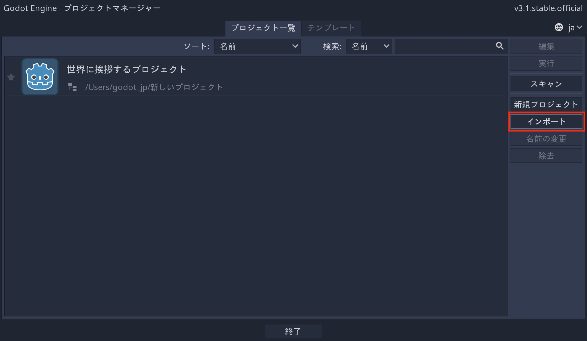

展開後のフォルダを参照し、その中にある "project.godot" ファイルを開く。
これを実行したとき、プロジェクトのリストに、今回実行したプロジェクトが(自動的に追加されて)表示される。
'編集' ボタンをクリックして、プロジェクトの編集を始める。

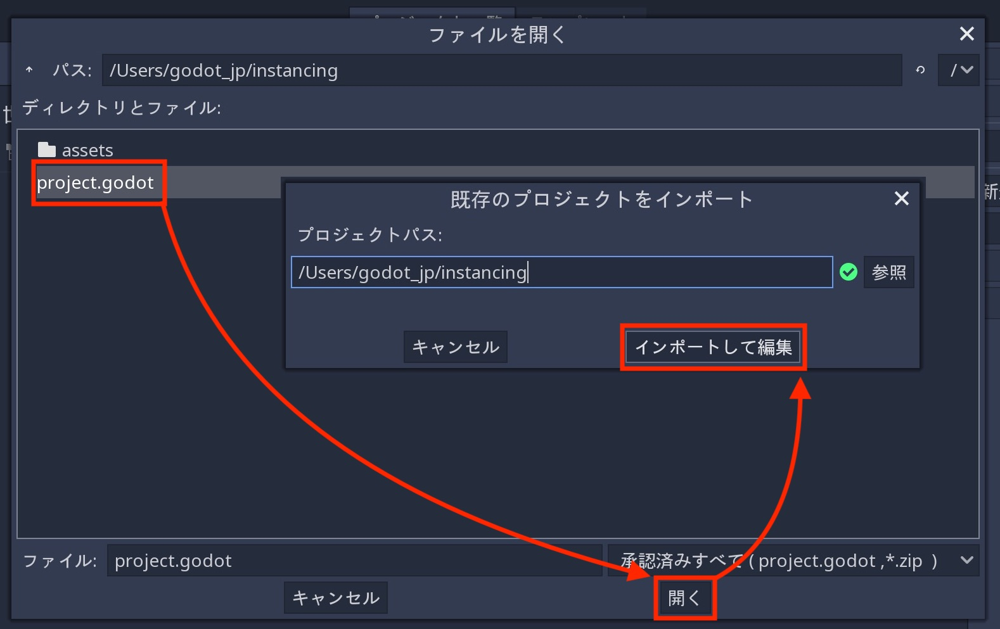

このプロジェクトには、 "Ball.tscn" と "Main.tscn" の2つのシーンが含まれている。
Ballシーンには、 :ref:`RigidBody2D <class_RigidBody2D>` を使用して物理動作を提供する。
そのときのメインシーンでは、ボールが衝突するための障害物も用意されている( :ref:`StaticBody2D <class_StaticBody2D>` )。

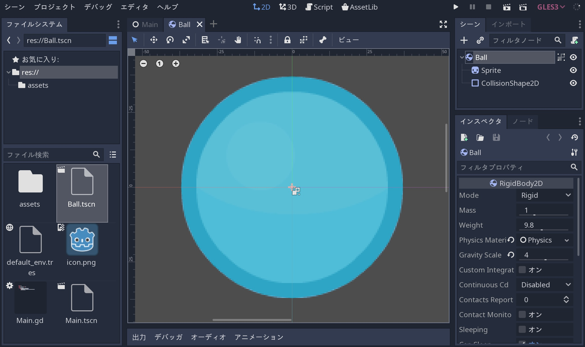

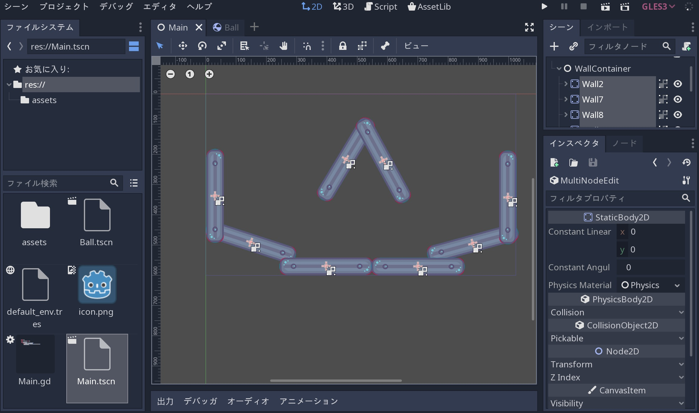

``Main`` シーンを開き、ルートノードを選択する。

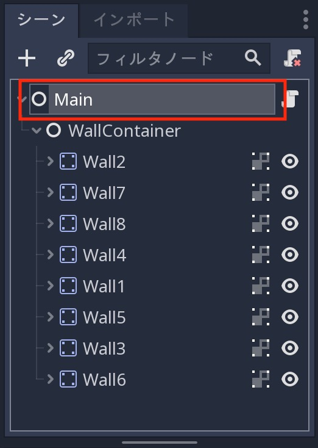

``Ball`` シーンのインスタンスを ``Main`` の子として追加する。
"リンク" の形をしたインスタンスボタン(ホバーテキスト表示： "Instance a scene file as a Node. 〜〜" )をクリックし、 ``Ball.tscn`` ファイルを選択する。 

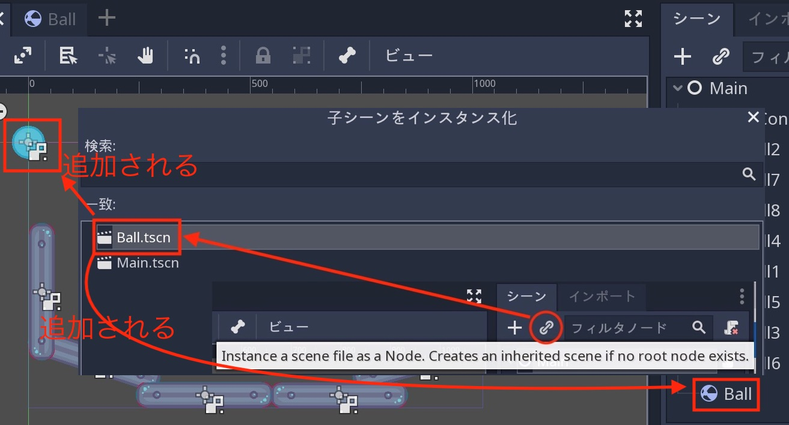

ボールは、画面領域の左上隅に配置される(画面座標では ``(0, 0)`` に当たる)。
シーンの上部中央付近まで、ボールを移動(クリック&ドラッグ)する。

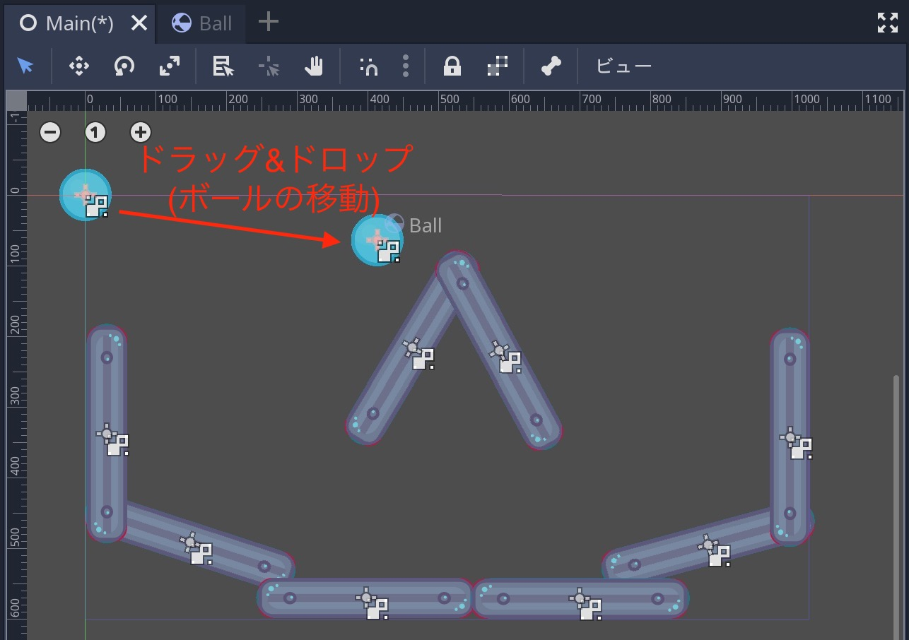

"再生" ボタンをクリック後、ボールが画面の下部に落ちるのを確認する。

.. todo::

   リンクの確認。

.. 英語の原文：インスタンス化の例
   Instancing by example
   ---------------------

   To learn how instancing works, let's start by downloading a sample
   project: :download:`instancing.zip <files/instancing.zip>`.

   Unzip this project anywhere you like. Then open Godot and add this project to
   the project manager using the 'Import' button:

   .. image:: img/instancing_import.png

   Browse to the folder you extracted and open the "project.godot" file you
   can find inside it. After doing this, the new project will appear on the list
   of projects. Edit the project by pressing the 'Edit' button.

   This project contains two scenes: "Ball.tscn" and "Main.tscn". The ball
   scene uses a :ref:`RigidBody2D <class_RigidBody2D>` to provide physics
   behavior while the main scene has a set of obstacles for the ball to
   collide with (using :ref:`StaticBody2D <class_StaticBody2D>`).

   .. image:: img/instancing_ballscene.png

   .. image:: img/instancing_mainscene.png

   Open the ``Main`` scene, and then select the root node:

   .. image:: img/instancing_mainroot.png

   We want to add an instance of the ``Ball`` scene as a child of ``Main``.
   Click the "link"-shaped button (its hover-text says "Instance a scene file
   as a Node.") and select the ``Ball.tscn`` file.

   .. image:: img/instancing_linkbutton.png

   The ball will be placed at the top-left corner of the screen area (this is
   ``(0, 0)`` in screen coordinates). Click and drag the ball somewhere near
   the top-center of the scene:

   .. image:: img/instancing_placeball.png

   Press "Play" and watch the ball fall to the bottom of the screen:

   .. image:: img/instancing_playbutton.png

複数のインスタンス
------------------------------------

再度 "インスタンス" ボタンをクリックするか、シーンタブのボールインスタンスを右クリックして、 "複製" をクリック(もしくは、Ctrl-D押下)により、シーンに好きなだけインスタンスの追加ができる。

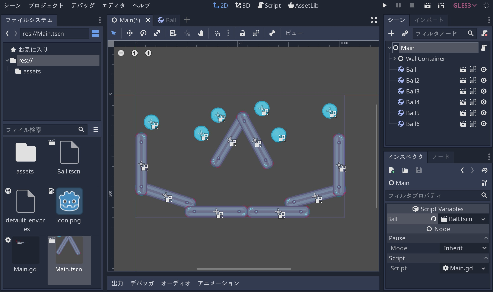

シーンをもう一度実行した場合、すべてのボールが落下する。

.. image:: img/instancing_multiball.gif

.. 英語の原文：複数のインスタンス
   Multiple instances
   ------------------

   You can add as many instances as you like to a scene, either by using the
   "Instance" button again, or by clicking on the ball instance and pressing
   "Duplicate" (Ctrl-D):

   .. image:: img/instancing_multiball.png

   Run the scene again and all of the balls will fall.

   .. image:: img/instancing_multiball.gif

インスタンスの編集
------------------------------------

``Ball`` シーンを開き、下矢印をクリックし、 "新規 PhysicsMaterial" を選択後、 ``PhysicsMaterial`` を追加する。
（この作業は、最新版では不要なのかもしれない。既に選択済みのため）

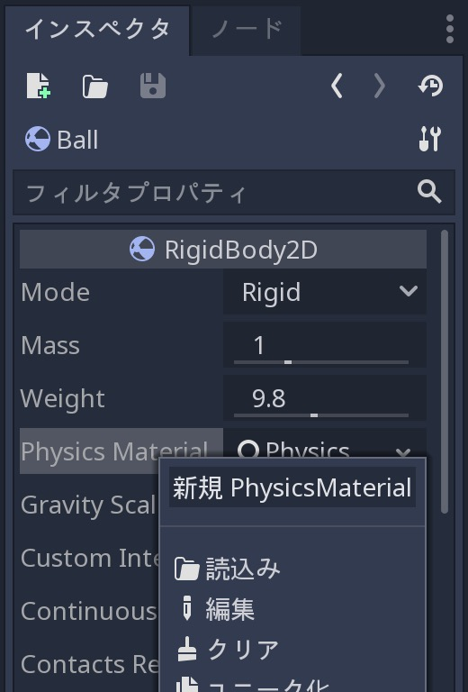

次に、そのまま下矢印から "編集" をクリックして展開し、``Bounce`` プロパティを ``1`` に設定する。

.. todo:: 

   下記画像の差し替えをしたい。
   （展開後の画面が隠されないようにしたい）

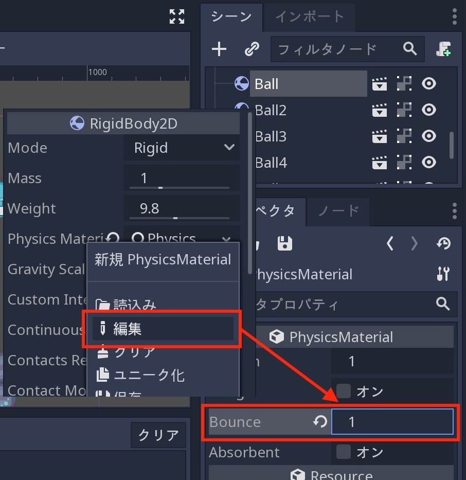

"実行" をクリックしたとき、インスタンス化されたボールがすべて弾むようになる(それを確認するには、ある程度の高さから落とす必要がある)。
インスタンス化されたボールは保存されたシーンに基づいているため、オリジナルシーンの変更はすべてのインスタンスに影響する(ようだ)。
（訳者：わざわざ "ようだ" の文言を追加したのは、確認できなかったからだ。変更したボール1つのみが弾んだ）

.. image:: img/instancing_property.png

（訳者：インスタンス化されたボールのBounce値の変更が反映されない忠告がなされるため、インスタンス化されたすべてのボールが弾む挙動をするのだろう）

それとは逆に、個々のインスタンス化されたボールのBounce値をそれぞれ調整することもできる。
(上記で1にした)Bounce値を ``0`` に戻し、 ``メイン`` シーンでインスタンス化されたボールの一つを選択する。
``PhysicsMaterial`` のようなリソースは標準でインスタンス間を共有するため、一意(ユニーク)にする必要がある。

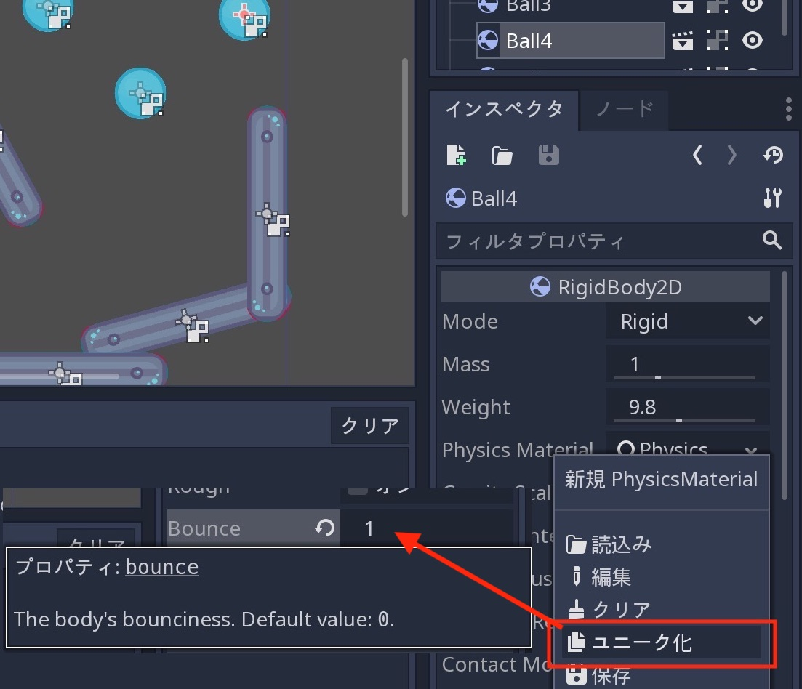

調整されたプロパティの横に灰色の "復帰" ボタンが表示されている。
このボタンが存在する場合、インスタンス化されたシーンのプロパティを変更し、保存されたシーンの値が上書き(オーバーライド)されることを意味する。
そのプロパティが元のシーンで変更された場合でも変更値は残る。
復帰ボタンをクリックすることで、変更前の値(tresファイルに保存済みの値)に戻る。

.. 英語の原文：インスタンスの編集
   Editing instances
   -----------------

   Open the ``Ball`` scene and add a ``PhysicsMaterial`` by clicking on the down
   arrow and selecting "New PhysicsMaterial".

   .. image:: img/instancing_physicsmat1.png

   Then, expand the material by clicking on it, and set the ``Bounce`` property
   to ``1``.

   .. image:: img/instancing_physicsmat2.png

   Press "Play" and notice that all of the instanced balls are now
   much more bouncy. Because the instanced balls are based on the saved scene,
   changes to that scene will affect all instances.

   You can also adjust individual instances. Set the bounce value back to ``0``
   and then in the ``Main`` scene, select one of the instanced balls. Resources
   like ``PhysicsMaterial`` are shared between instances by default, so we need
   to make it unique. Click on the down arrow and select "Make Unique". Set its
   ``Bounce`` to ``1`` and press "Play".

   .. image:: img/instancing_property.png

   Notice that a grey "revert" button appears next to the adjusted property. When
   this button is present, it means you modified a property in the
   instanced scene to override its value in the saved scene. Even
   if that property is modified in the original scene, the custom value
   will remain. Pressing the revert button will restore the property to the
   value in the saved scene.

結論
------------

インスタンス化は、同じオブジェクトを複数作成する場合に役立つ。
GDScriptを使用して、コード内にインスタンス作成することも可能になっている。
:ref:`doc_instancing_continued_jp` を参照のこと。

.. 英語の原文：結論
   Conclusion
   ----------

   Instancing can be useful when you want to create many copies of the
   same object. It is also possible to create instances in code by using
   GDScript, see :ref:`doc_instancing_continued`.

.. vim:set ts=3 sw=3 tw=0 fenc=utf-8:
