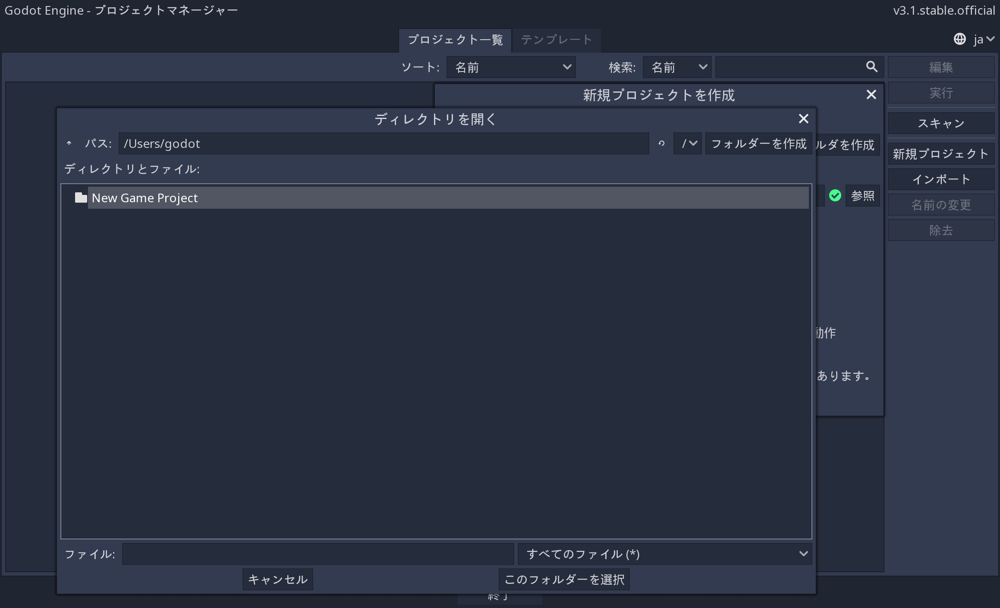
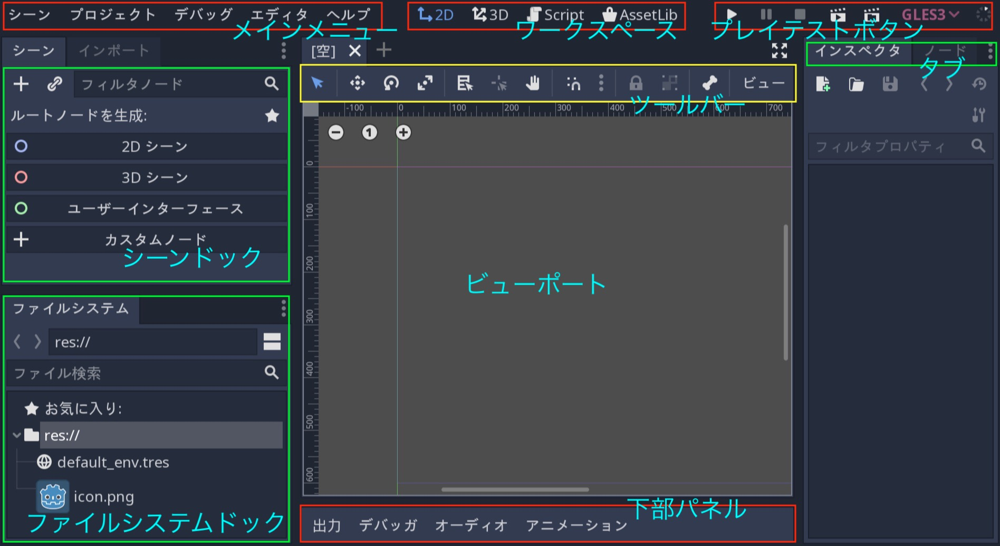
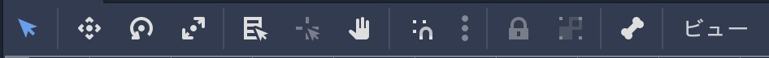

.. _doc_intro_to_the_editor_interface_jp:

.. role:: strike

Godotでのエディタ利用導入編
==============================

このチュートリアルでは、Godotを通じて、**プロジェクトマネージャ** ・ **ドックス(タブで振り分けられた機能群)** ・ **ワークスペース** などを確認する。
これは、Godotエンジンを使い始めるために必要な入門になる。

.. 英語の原文：Godotでのエディタ利用導入編
   Introduction to Godot’s editor
   ==============================

   This tutorial will run you through Godot’s interface. We’re going to
   look at the **Project Manager, docks, workspaces** and everything you
   need to know to get started with the engine.

プロジェクトマネージャ
-----------------------

Godotの起動直後の画面はプロジェクトが表示される。
そのプロジェクトでは、作成・削除・取り込み、もしくはゲームで遊ぶことが可能になっている。

右上隅のドロップダウンメニューで、操作する言語を切り替えることができる。

**テンプレート** タブからオープンソースプロジェクトのテンプレートを入手できる。
手っ取り早くデモンストレーションが実行できる。

.. 英語の原文：プロジェクトマネージャ
   Project manager
   ---------------

   When you launch Godot, the first window you’ll see is the Project
   Manager. It lets you create, remove, import or play game projects.

   |image0|

   In the top-right corner you’ll find a drop-down menu to change the
   editor’s language.

   |image1|

   From the **Templates** tab you can download open source project templates and
   demos to help you get started faster.

   |image2|

プロジェクトを作成もしくは取り込み
~~~~~~~~~~~~~~~~~~~~~~~~~~~~~~~~~~~

新しいプロジェクト作成には、右側の ``新規プロジェクト`` ボタンをクリックする。プロジェクト名を付けて、空ディレクトリとして作成("作成して編集"ボタン押下)する。

作成ディレクトリを変更する場合は、参照ボタンをクリック後、Godotのファイルブラウザを開き、任意の場所を選択する("このフォルダーを選択"ボタン押下)。

"プロジェクトパス:" 右側の緑色のチェックマークが表示されている場合 ``作成して編集`` ボタンがクリック可能になる(上記の画像)。そして、エディタが開かれる。

:strike:`次回Godotを開いたときに、そのプロジェクトが開く。`  (訳者：執筆時点では、プロジェクト作成直後に、自動でディタが開くようになっている)。 :strike:`そして、それをダブルクリックして、エディタを開く。`
以下の画像は、Godotを起動した直後のプロジェクト一覧になる。

上記は新規作成だったが、既存プロジェクトを取り込むこと(インポート)も可能になっている。プロジェクトが含まれているzipファイルもしくは、インポート可能な ``project.godot`` ファイルを選択する。

上記で選んだディレクトリ構造が正しい場合は、緑色のチェックマークが表示される。

.. 英語の原文：プロジェクトを作成もしくは取り込み
   Create or import a project
   ~~~~~~~~~~~~~~~~~~~~~~~~~~

   To create a new project, click the ``New Project`` button on the right. Give
   it a name and choose an empty folder on your computer to save it.

   |image3|

   Click the Browse button to open Godot’s file browser and pick a location
   or type the folder’s path in the Project Path field.

   |image4|

   When you see the green tick on the right, it means the engine detects an
   empty folder and you may click ``Create``. Godot will create the project
   for you and open it in the editor.

   The next time you’ll open Godot, you’ll see your new project in the
   list. Double click on it to open it in the editor.

   |image5|

   You can import existing projects in a similar way, using the Import
   button. Locate the folder that contains the project or the
   ``project.godot`` file to import and edit it.

   |image7|

   When the folder path is correct, you'll see a green checkmark.

   |image8|

あなたは生まれて初めてGodotエディタを目にした
----------------------------------------------

Godotへようこそ！
プロジェクトを開いたとき、3Dビューポートの状態でエディタが表示される。
インタフェイスの上部で現在のワークスペース(3Dビューポート)を変更できる。
3Dから2Dに切り替えるには、上部にあるそのボタンをクリックし、2Dワークスペースに切り替える。
ここ以降、エディタという表現を使う場合は、ソースコードを打ち込む場所を指すわけでは無く、Godot全体を表すことにする。

切り替えたことで、画面中央に変化が現れた。

上部の左から右に、 **メインメニュー** ・ **ワークスペース** ・ **プレイテストボタン** が用意されている。

.. _縦の沈黙jump: 

英語版(原本)のスクリーンショットと実際のGodotの画面が異なるため、配置を合わせることにした。
ドックに存在するタブの右側にある「・・・(一連の3つの垂直ドット)」の部分をクリックし、ドックを移動させることができる。

以下の配置になった。もしかしたら、初期配置に戻すかもしれないが、今回は以下の配置で進める。
（このレイアウトは、メインメニューから "エディタ ⇒ エディタレイアウト ⇒ レイアウトを保存" で保存できる。読み込む場合は、その下側に、保存した名前のレイアウトが表示されるため、それを選ぶ）

左側には、 **ファイルシステムドック** があり、そこでプロジェクトファイルとアセットを管理する。
※アセットとは、素材や部品のこと。広義の意味では環境を構成するハードウェアやソフトウェアなども含む。

また、原本と実際の配置が異なっていたように、表示形式(アイコンの表示項目)も異なっているため、上記の赤い矢印部分をクリックしてアイコン表示の見た目を合わせた。

右側には、 **シーンドック** がある。
画面右下に表示される **インスペクタ** には、そのシーンドックで選択したコンテンツ(今回"ユーザインタフェース(緑色の○印)"を選んだ状態)のインスペクタ一覧が表示される。

中央にはビューポートがあり、その上部に **ツールバー** が付き、シーンのオブジェクトを移動・拡大・縮小・またはロックするためのツールがある。
別のワークスペースに移動するとツールが変化する。

**下部パネル** は、デバッグコンソール・アニメーションエディタ・オーディオミキサのツールが控えている。言わば、下部配置のツールバーと言えるだろう。
これらは幅が広く、貴重な場所を占有している。そのため、故意に開かない限り折りたたまれている。

.. 英語の原文：あなたは生まれて初めてGodotエディタを目にした
   Your first look at Godot’s editor
   ---------------------------------

   Welcome to Godot! With your project open, you should see the editor’s
   interface with the 3D viewport active. You can change the current
   workspace at the top of the interface. Click on 2D to switch to the 2D
   workspace.

   |image9|

   Now you should see this interface, with empty docks on the right side.

   |image10|

   At the top, from left to right, you can see the **main menus**, the
   **workspaces**, and the **playtest buttons**.

   On the left side, you have the **FileSystem dock**, where you’ll manage
   your project files and assets.

   |image11|

   On the right side, you’ll find the **Scene dock**, which lists the active
   scene’s content and the **Inspector** in the bottom right corner.

   |image12|

   In the center, you have the **Toolbar** at the top, where you’ll find
   tools to move, scale or lock your scene’s objects. It changes as you
   jump to different workspaces.

   |image13|

   The **Bottom Panel** is the host for the debug console, the animation
   editor, the audio mixer… They are wide and can take precious space.
   That’s why they’re folded by default.

   |image14|

ワークスペース
---------------

上部には、2D・3D・スクリプト・AssetLib(アセットライブラリのこと)の4つのワークスペースボタンがある。

すべての種類のゲームに **2Dワークスペース** を使用する。
2Dゲームに加えて、2Dワークスペースはインタフェイスを構築する場所にもなる。
F1キー押下にてその場所に切り替えられる(WindowsOS専用？)。

|image15|

.. todo:: 訳者：どのようにこのようなサンプルを作ればいいのだろうか。

**3Dワークスペース** では、3Dゲームのメッシュ・ライト・デザインレベルを操作する。
F2キー押下にてその場所に切り替えられる(WindowsOS専用？)。

今回の説明は、ツールバーの下のテキスト[透視投影(パースペクティブ)]に注目をして欲しい。
3Dビューポートに関連すオプションのリストを開くボタンがある。

.. note:: **3Dワークスペース** の詳細については :ref:`doc_introduction_to_3d_jp` を参照すること。

**スクリプト** ワークスペースは、デバッガ・豊富な自動補完・組み込みのコードリファレンスを備えた完全なコードエディタが用意されている。
F3キー押下にてその場所に切り替えられる(WindowsOS専用？)。
そして、F4キー押下で、参照を検索できる(WindowsOS専用？)。

.. image:: img_jp/editor_ui_intro_editor_06_script_workspace_expanded_jp.jpg

最後に、 **AssetLib** は、プロジェクトで使用する無料のアドオン・スクリプト・およびアセットのライブラリがある。

.. 英語の原文：ワークスペース
   The workspaces
   --------------

   You can see four workspace buttons at the top: 2D, 3D, Script and
   AssetLib.

   You’ll use the **2D workspace** for all types of games. In addition to 2D games,
   the 2D workspace is where you'll build your interfaces. Press F1 to access it.

   |image15|

   In the **3D workspace**, you can work with meshes, lights, and design
   levels for 3D games. Press F2 to access it.

   |image16|

   Notice the text [perspective] under the toolbar, it is a button that opens a list of options related to the 3D viewport.

   |image20|

   .. note:: Read :ref:`doc_introduction_to_3d` for more detail about **3D workspace**.

   The **Script** workspace is a complete code editor with a debugger, rich
   auto-completion, and built-in code reference. Press F3 to access it, and
   F4 to search the reference.

   |image17|

   Finally the **AssetLib** is a library of Free add-ons, scripts and
   assets to use in your projects.

インタフェイスの変更方法
-------------------------

Godotのインタフェイスは1つのウィンドウのみから操作する。
例えば、AtomやVisual Studioなどの外部コードエディタで作業可能ではあるが、複数の画面に分割して作業はできない。

.. 英語の原文：インタフェイスの変更方法
   Modify the interface
   --------------------

   Godot’s interface lives in a single window. You cannot split it across
   multiple screens although you can work with an external code editor like
   Atom or Visual Studio for instance.

ドックの移動とサイズ変更
~~~~~~~~~~~~~~~~~~~~~~~~~

ドックまたはパネルの端をクリック&ドラッグすることにより、水平もしくは垂直に大きさが変わる。

|image18|

ドックの上部にある3つの点線アイコンをクリックして、配置場所を変更できる( `縦の沈黙jump`_ )。

|image19|

``エディタ`` メニューと ``エディタの設定`` を開き、エディタの外観を微調整できる。

.. 英語の原文：ドックの移動とサイズ変更
   Move and resize docks
   ~~~~~~~~~~~~~~~~~~~~~

   Click and drag on the edge of any dock or panel to resize it
   horizontally or vertically.

   |image18|

   Click the three-dotted icon at the top of any dock to change its
   location.

   |image19|

   Go to the ``Editor`` menu and ``Editor Settings`` to fine-tune the look
   and feel of the editor.

.. |image0| image:: ./img/editor_ui_intro_project_manager_01.png
.. |image1| image:: ./img/editor_ui_intro_project_manager_02.png
.. |image2| image:: ./img/editor_ui_intro_project_manager_03.png
.. |image3| image:: ./img/editor_ui_intro_project_manager_04.png
.. |image4| image:: ./img/editor_ui_intro_project_manager_05.png
.. |image5| image:: ./img/editor_ui_intro_project_manager_06.png
.. |image7| image:: ./img/editor_ui_intro_project_manager_08.png
.. |image8| image:: ./img/editor_ui_intro_project_manager_09.png
.. |image9| image:: ./img/editor_ui_intro_editor_01.png
.. |image10| image:: ./img/editor_ui_intro_editor_interface_overview.png
.. |image11| image:: ./img/editor_ui_intro_dock_filesystem.png
.. |image12| image:: ./img/editor_ui_intro_dock_inspector.png
.. |image13| image:: img/editor_ui_intro_editor_02_toolbar.png
.. |image14| image:: ./img/editor_ui_intro_editor_03_animation_player.png
.. |image15| image:: ./img/editor_ui_intro_editor_04_2d_workspace.png
.. |image16| image:: ./img/editor_ui_intro_editor_05_3d_workspace.png
.. |image17| image:: ./img/editor_ui_intro_editor_06_script_workspace_expanded.png
.. |image18| image:: ./img/editor_ui_intro_editor_07.png
.. |image19| image:: ./img/editor_ui_intro_editor_08.png
.. |image20| image:: ./img/editor_ui_intro_editor_06_3d_workspace.png

原本
~~~~~~~~~~~~

https://github.com/godotengine/godot-docs/tree/master/getting_started/step_by_step

配下に、

https://github.com/godotengine/godot-docs/blob/master/getting_started/step_by_step/intro_to_the_editor_interface.rst

が、ある。

以上。

コンパイル日： |today|

.. vim:set ts=3 sw=3 tw=0 fenc=utf-8:
