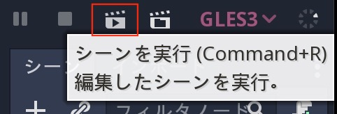

.. _doc_scenes_and_nodes_jp:

場面(シーン)と結び目(ノード)
========================================================

導入編
============

.. image:: img/chef.png

想像力を膨らませることが大事だ。
あなたは既にゲーム開発から解放されたのだから。
その代わりに、あなたは料理人になった。そして、ファッション界の先駆者の衣装をコック帽とボタンが2列になったコート(訳者：要は、日本人が想像するナポレオンジャケットを改良したコックコートのことと思われる)に置き換える必要がある。

では、料理人はどのように調理手順書を作るのか？
具体的な調理手順書は2種類存在する。
　一つ目は、原料。
　二つ目は、原料を準備するための指示。
これらがあれば、誰でも調理手順書に従うことができ、あなたの素晴らしい創造物を味わうことが可能になる。

Godotでゲームを作ることはほとんど同じように感じる。
Godotエンジンを使うことは台所にいるように感じる。
この台所で作業するために、原料とその準備指示をつなぎ合わせる保管庫として冷蔵庫がある。その冷蔵庫は、まるで *ノード(結び目)* のようじゃないか。

ノードには多くの種類が存在する。
画像を表示する・サウンドを再生する・3Dモデルを表示するものなどがある。

.. 用語メモ

   double-breasted coat：https://www.fashion-press.net/words/738

   > ダブルブレストコートとは、ボタンが2列になっているコートのこと。ダブルブレストとは、服の上着、コートなどの前身が広く、ボタンが2列になっているものを指す。

.. 英語の原文：導入編
   Introduction
   ------------

   .. image:: img/chef.png

   Imagine for a second that you are not a game developer anymore. Instead,
   you're a chef! Change your hipster outfit for a toque and a double
   breasted jacket. Now, instead of making games, you create new and
   delicious recipes for your guests.

   So, how does a chef create a recipe? Recipes are divided into two
   sections: the first is the ingredients and the second is the
   instructions to prepare it. This way, anyone can follow the recipe and
   savor your magnificent creation.

   Making games in Godot feels pretty much the same way. Using the engine
   feels like being in a kitchen. In this kitchen, *nodes* are like a
   refrigerator full of fresh ingredients with which to cook.

   There are many types of nodes. Some show images, others play sound,
   other nodes display 3D models, etc. There are dozens of them.

接点(ノード)
========================

料理を始める場合、基礎から入る。ゲーム作りも同様に土台作りから始める。
ノードはゲームを作成する上で欠かせない構成要素になる。
前述のように、ノードは様々な特殊処理を実行できる関数だ。ただし、特定のノードには常に次の属性がある。

- 名前がある
- 編集可能なプロパティがある
- すべてのフレームを処理するコールバックを受信できる
- 拡張可能(より多くの機能を持つため)
- 子として別のノードに追加ができる

.. image:: img/tree.png

最後の一つが重要になる。ノードは他のノードを上記画像のように所持できる。
このように配置する場合、ノードは **木構造** になる。

Godotでは、このように、ノードを配置する機能により、強力なプロジェクトを整理するためのツールの一つだ。異なるノードは関数の組み合わせで、より複雑な関数を作成できる。
いきなりの難問で頭を抱えることになったと思うかもしれないが、心配する必要はない。
引き続き説明は続くが、今回覚えてもらいたい重要な事実は、ノードが存在し、木構造の方法で配置できると言うこと。

.. 英語の原文：接点
   Nodes
   -----

   But let's start with the basics. Nodes are fundamental building blocks for
   creating a game. As mentioned above, a node can perform a variety of specialized
   functions. However, any given node always has the following attributes:

   -  It has a name.
   -  It has editable properties.
   -  It can receive a callback to process every frame.
   -  It can be extended (to have more functions).
   -  It can be added to another node as a child.

   .. image:: img/tree.png

   The last one is important. Nodes can have other nodes as
   children. When arranged in this way, the nodes become a **tree**.

   In Godot, the ability to arrange nodes in this way creates a powerful
   tool for organizing projects. Since different nodes have different
   functions, combining them allows for the creation of more complex functions.

   Don't worry if this doesn't click yet. We will continue to explore this over
   the next few sections. The most important fact to remember for now is that
   nodes exist and can be arranged this way.

場面(シーン)
------------------------

.. image:: img/scene_tree_example.png

ノードの概念を説明した次は、シーンについて説明を始める。

シーンは、階層的に編成されたノードのグループで構成される(ツリーファッション)。

- 常に一つのルートノードが存在する
- それを保存し、使い回すことができる
- *インスタンス化* も可能(詳細は後述)

ゲームを実行することは、シーンを実行することと同義になる。プロジェクトには複数のシーンを含めることが可能だが、そのうちの一つをメインシーンとして選択しておく必要がある。

基本的に、Godotエディタは **シーンエディタ** と言い換えてもいいぐらいだ。
大量のツールを使い、2Dおよび3Dシーンとユーザインタフェイスを作成し、そしてエディタはシーンとそれを構成するノードを編集する。

.. 英語の原文：場面(シーン)
   Scenes
   ------

   .. image:: img/scene_tree_example.png

   Now that the concept of nodes has been defined, the next logical
   step is to explain what a Scene is.

   A scene is composed of a group of nodes organized hierarchically (in
   tree fashion). Furthermore, a scene:

   -  always has one root node.
   -  can be saved to disk and loaded back.
   -  can be *instanced* (more on that later).

   Running a game means running a scene. A project can contain several scenes,
   but for the game to start, one of them must be selected as the main scene.

   Basically, the Godot editor is a **scene editor**. It has plenty of tools for
   editing 2D and 3D scenes as well as user interfaces, but the editor is based on
   the concept of editing a scene and the nodes that compose it.

新しいプロジェクトの作成
------------------------------------------------

上記の抽象的な概念の説明を以下の例で具体的なものにする。
プログラミング言語の登龍門とも言うべき第一歩は、伝統ある "Hello World" プロジェクトから始まる。
今からエディタの使用方法を紹介する。

プロジェクト外でGodot実行可能ファイルを実行する場合、プロジェクトマネージャが起動する。
これは、開発者がプロジェクトを管理するのに役立つ。

新しいプロジェクトの作成には、 "新しいプロジェクト" オプションをクリックする。
作成場所としてPathを選び、プロジェクト名に "世界に挨拶するプロジェクト" を入力する。

.. 英語の原文：新しいプロジェクトの作成
   Creating a new project
   ----------------------

   Let's make these abstract concepts more concrete with an example. Following a
   long tradition in tutorials, we'll start with a "Hello World" project.
   This will introduce us to using the editor.

   If you run the Godot executable outside of a project, the Project Manager
   appears. This helps developers manage their projects.

   .. image:: img/project_manager.png

   To create a new project, click the "New Project" option. Choose and create a
   path for the project and specify the project name "New Project":

   .. image:: img/create_new_project.png

エディタ
----------------

"新規プロジェクト" の作成後に、それを開く。
これで、Godotが開く。

冒頭通り、Godotでのゲーム開発は、キッチンにある冷蔵庫から新鮮なノードを取り出すことのように簡単になっている。
まず、 "Hello　World。" メッセージ画面を出力することから始める。

.. _子作り求むjump:

最初の一歩は、 "子ノードを追加" (プラス記号のように見える)ボタンをクリックする。

これにより、ノード用の作成ダイアログが開き、ノードの長いリストが表示される。

そこから "label" ノードを選択する。検索で見つけるのが最速だろう。

"作成" ボタンのクリックにより、ラベルが作成される。

まず、シーンが2Dエディタに変わり(ラベルが2Dノードタイプのため)、ビューポートの左上隅にラベルが表示され、選択された状態になる。

ノードがシーンツリーエディタ(右上隅のドック)に表示され、ラベルプロパティがインスペクタ(右下隅のドック)に表示される。
（ドックの位置を変更済みであればの話）

次の段階として、ラベルの "Text" プロパティを変更する。
"Hello　World。" (全角スペースに全角句点)に変更する。

これで、シーンを実行する準備がそろった。
トップバーの "シーンを実行" ボタンをクリックする。もしくは、 "F6" キーを押すことで、同様の処理が行われる(WindowsOS専用？)。

油断する事なかれ。

実行前の作業として、シーンを保存する必要がある。
シーンを "シーン -> 名前を付けてシーンを保存..." の "やぁ.tscn" などの名前にして保存する。

そのときに、奇妙な発見をするだろう。
ファイルダイアログは特別な存在で、プロジェクト内に保存することが強制される。
プロジェクトのルートは "res://" で、 "リソースパス" を意味する。つまり、ファイルはプロジェクト内のみの保存になる。
今後の注意点として、Godotでファイル操作を行う場合、 "res://" がリソースパスであり、プラットフォームやインストール場所に関係なく、リソースファイルを見つけることがゲームの起点を見つける方法であることを忘れないこと。

シーンを保存し、再度シーンを実行するとき、 "Hello　World。" が実行される。

失敗だ。
多バイト文字を表示させることはできそうにない。

日本語部分を含めない文字列(1バイト文字)であれば、問題なく表示された。

.. note::

   すぐに機能せず、少なくとも1つのモニタにhiDPIディスプレイがある場合、
   **プロジェクト ⇒ プロジェクトの設定 ⇒ Display ⇒ Window** 配下の
   **Dpi** にある **Allow Hidpi** のチェックボックスを許可(チェック)する必要がある。

.. _doc_scenes_and_nodes-configuring_the_project_jp:

.. 英語の原文：エディタ
   Editor
   ------

   Once you've created the "New Project", then open it. This will open the Godot
   editor:

   .. image:: img/empty_editor.png

   As mentioned before, making games in Godot feels like being in a
   kitchen, so let's open the refrigerator and add some fresh nodes to the
   project. We'll begin with a "Hello World" message that we'll put on the
   screen.

   To do this, press the "New Node" button (which looks like a plus symbol):

   .. image:: img/newnode_button.png

   This will open the Create Node dialog, showing the long list of nodes
   that can be created:

   .. image:: img/node_classes.png

   From there, select the "Label" node first. Searching for it is probably
   the fastest way:

   .. image:: img/node_search_label.png

   And finally, create the Label! A lot happens when Create is pressed:

   .. image:: img/editor_with_label.png

   First of all, the scene changes to the 2D editor (because Label is a 2D Node
   type), and the Label appears, selected, at the top left corner of the viewport.

   The node appears in the scene tree editor (box in the top right
   corner), and the label properties appear in the Inspector (box in the
   bottom right corner).

   The next step will be to change the "Text" Property of the label. Let's
   change it to "Hello World":

   .. image:: img/hw.png

   Ok, everything's ready to run the scene! Press the PLAY SCENE Button on
   the top bar (or hit F6):

   .. image:: img/playscene.png

   Aaaand... Oops.

   .. image:: img/neversaved.png

   Scenes need to be saved to be run, so save the scene to something like
   Hello.tscn in Scene -> Save:

   .. image:: img/save_scene.png

   And here's when something funny happens. The file dialog is a special
   file dialog, and only allows you to save inside the project. The project
   root is "res://" which means "resource path". This means that files can
   only be saved inside the project. For the future, when doing file
   operations in Godot, remember that "res://" is the resource path, and no
   matter the platform or install location, it is the way to locate where
   resource files are from inside the game.

   After saving the scene and pressing run scene again, the "Hello World"
   demo should finally execute:

   .. image:: img/helloworld.png

   Success!

   .. note::

       If this doesn't immediately work and you have a hiDPI display on
       at least one of your monitors, go to
       **Project → Project Settings → Display → Window** then enable
       **Allow Hidpi** under **Dpi**.

   .. _doc_scenes_and_nodes-configuring_the_project:

プロジェクトの構成
------------------------------------

プロジェクトの設定に手を加える段階にまで来た。
現在実行する唯一の方法は、目に見えているシーンを実行することだけだ。しかし、実際のプロジェクトには複数のシーンがある(場合があり)、そのうちの1つをメインシーンとして設定する必要がある。この設定により、プロジェクトを実行するたびに呼び出すシーンとなる。

これらの設定は、すべて **project.godot** ファイルに保存される。
このファイルは、簡単に編集可能なように、win.ini形式のプレーンテキストファイルになっている。
このファイルでは、プロジェクトの実行方法を変更するための設定も多数備えている。そして、このファイルを直接扱わずに済むよう、プロジェクト設定ダイアログを用意している。
これは、project.godotファイルを編集するための画面操作から動かせることを意味する。

そのダイアログにアクセスするには、 "プロジェクト ⇒ プロジェクトの設定" を選択する。

ウィンドウが開いたとき、以下の説明をたどり、メインシーンを選択する。
`Application ⇒ Run` 配下の `Main Scene` プロパティを探し出してクリックし、 "やぁ.tscn" を選択する。

この変更により、通常の再生ボタン(もしくはF5キー)を押した時に、どのシーンがアクティブに編集されているかにかかわらず、メインシーンが実行される。

プロジェクト設定ダイアログには、project.godotファイルに保存できる多くのオプションがあり、デフォルト値が表示される。 値を変更した場合、名前の左側にチェックマークが付く。そして、プロパティがproject.godotファイルに保存され、記憶されることを意味する。

サイドノートとして、カスタム設定オプションを追加し、実行時に :ref:`ProjectSettings <class_ProjectSettings>` シングルトンを使用して読み込むことも可能だ。

.. 英語の原文：プロジェクトの構成
   Configuring the project
   -----------------------

   Ok, it's time to configure the project. Right now, the only way to run
   something is to execute the current scene. Projects, however, may have several
   scenes, so one of them must be set as the main scene. This is the scene that
   will be loaded any time the project is run.

   These settings are all stored in a project.godot file, which is a plaintext
   file in win.ini format (for easy editing). There are dozens of settings that
   you can change in this file to alter how a project executes. To simplify this
   process, Godot provides a project settings dialog, which acts as a sort of
   frontend to editing a project.godot file.

   To access that dialog, select Project -> Project Settings. Try it now.

   Once the window opens, let's select a main scene. Locate the
   `Application/Run/Main Scene` property and click on it to select 'Hello.tscn'.

   .. image:: img/main_scene.png

   Now, with this change, when you press the regular Play button (or F5), this
   scene will run, no matter which scene is actively being edited.

   The project settings dialog provides a lot of options that can be saved to a
   project.godot file and shows their default values. If you change a value, a
   tick is marked to the left of its name. This means that the property will be
   saved to the project.godot file and remembered.

   As a side note, it is also possible to add custom configuration options and
   read them in at run-time using the :ref:`ProjectSettings <class_ProjectSettings>` singleton.

まとめ
------------

今回は "シーンとノード" について説明したが、これまでのところ *ワンシーン* と *ワンノード* のみだった。
次の説明ではその話題を広げるため、Godotをつまらないものだとは思わないでいただきたい。

To be continued...

.. 英語の原文：まとめ
   To be continued...
   ------------------

   This tutorial talked about "scenes and nodes", but so far there has been
   only *one* scene and *one* node! Don't worry, the next tutorial will
   expand on that...

.. vim:set ts=3 sw=3 tw=0 fenc=utf-8:
