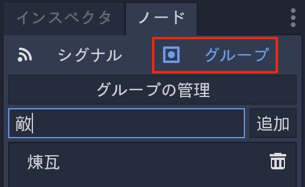
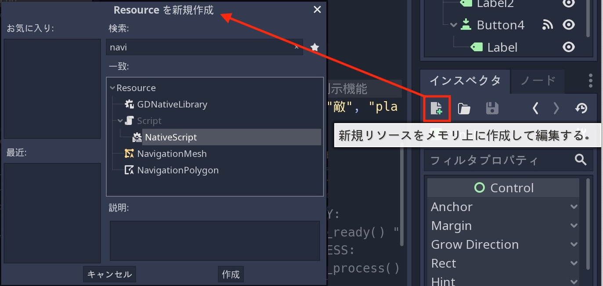
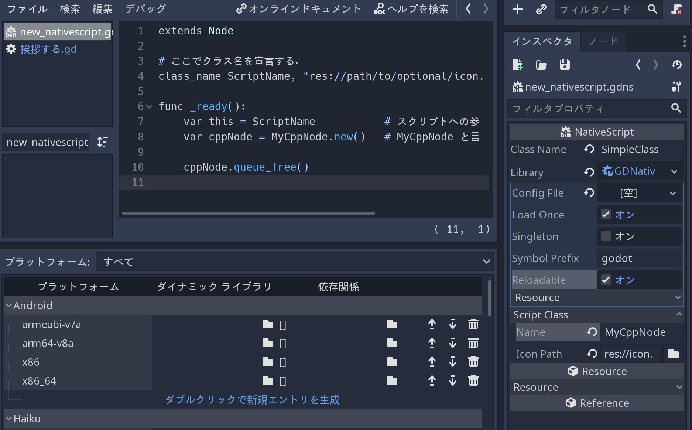

.. _doc_scripting_continued_jp:

スクリプト言語によるプログラミング(の続き)
====================================================================================

.. 英語の原文：スクリプト言語によるプログラミング(の続き)
   Scripting (continued)
   =====================

処理
------------

Godotのいくつかの処理は、コールバックまたは仮想関数によって起動されるため、常に実行されるコードを記述する必要は無い。

ただし、すべてのフレームでスクリプトを処理する必要があることは依然として一般的になっている。
処理には、アイドル処理と物理処理の2種類がある。

メソッド :ref:`Node._process() <class_Node_method__process>` スクリプトで処理される場合、待機期間が解除され、起動する。
:ref:`Node.set_process() <class_Node_method_set_process>` 関数を使用して、起動もしくは待機を切り替える。

このメソッドは、フレームが描画されるたびに呼び出される。

.. tabs::
   .. code-tab:: gdscript GDScript

      func _process(delta):
          # 何かしらの処理...
          pass

   .. code-tab:: csharp

      public override void _Process(float delta)
      {
          // Do something...
      }

``_process()`` が呼び出される頻度は、アプリケーションが実行されている1秒あたりのフレーム数(フレームレート・FPS)に依存することを記憶に留めておく必要がある。
このフレーム数は、時間とデバイスによって異なる(変動性)。

この変動性を管理しやすくするため ``delta`` 引数には、前回の ``_process()`` で呼び出されてからの経過時間(秒単位)が浮動小数点として含まれている。

この引数を使用して、ゲームのFPS(端末性能)に関係なく、常に同じ時間が流れるようにできる。

例えば、移動速度を一定にしたり、フレーム数に依存しないようにするため移動に時間差をかけることがよくある。

``_physics_process()`` による物理処理は似ているが、キャラクタの制御などの各物理処理の前に行う手順が必要である。
常に物理処理の前に実行され、一定の時間間隔で呼び出される。
通常は毎秒60回が設定されている。
変更は、 "プロジェクト ⇒ プロジェクトの設定 ⇒ Physics ⇒ Common" 配下の
"Physics Fps" の値を変更することで間隔を変更できる。

ただし、 ``_process()`` 関数は、物理学と同期していない。
フレーム数は一定では無く、ハードウェアとゲームの最適化に依存している。
その実行は、シングルスレッドゲームの物理処理後に行われる。

作業中の ``_process()`` 関数を見る簡単な方法は、次のスクリプトで単一のLabelノードを持つシーンを作成することで得られる。

.. tabs::
   .. code-tab:: gdscript GDScript

      extends Label

      var accum = 0

      func _process(delta):
          accum += delta
          text = str(accum) # 'text'は組み込みのラベルプロパティ

   .. code-tab:: csharp

      public class CustomLabel : Label
      {
          private float _accum;

          public override void _Process(float delta)
          {
              _accum += delta;
              Text = _accum.ToString(); // 'Text' is a built-in label property.
          }
      }

各フレームを増加させるカウンターが表示される。

.. todo::

   リンクの確認。

.. 英語の原文：処理
   Processing
   ----------

   Several actions in Godot are triggered by callbacks or virtual functions,
   so there is no need to write code that runs all the time.

   However, it is still common to need a script to be processed on every
   frame. There are two types of processing: idle processing and physics
   processing.

   Idle processing is activated when the method :ref:`Node._process() <class_Node_method__process>`
   is found in a script. It can be turned off and on with the
   :ref:`Node.set_process() <class_Node_method_set_process>` function.

   This method will be called every time a frame is drawn:

   .. tabs::
    .. code-tab:: gdscript GDScript

       func _process(delta):
           # Do something...
           pass

    .. code-tab:: csharp

       public override void _Process(float delta)
       {
           // Do something...
       }

   It's important to bear in mind that the frequency with which ``_process()``
   will be called depends on how many frames per second (FPS) your application
   is running at. This rate can vary over time and devices.

   To help manage this variability the ``delta`` parameter contains the time
   elapsed in seconds, as a floating point, since the previous call to ``_process()``.

   This parameter can be used to make sure things always take the same
   amount of time, regardless of the game's FPS.

   For example, movement is often multiplied with a time delta to make movement
   speed both constant and independent from the frame rate.

   Physics processing with ``_physics_process()`` is similar, but it should be used for processes that
   must happen before each physics step, such as controlling a character.
   It always runs before a physics step and it is called at fixed time intervals:
   60 times per second by default. You can change the interval from the Project Settings, under
   Physics -> Common -> Physics Fps.

   The function ``_process()``, however, is not synced with physics. Its frame rate is not constant and is dependent
   on hardware and game optimization. Its execution is done after the physics step on single-threaded games.

   A simple way to see the ``_process()`` function at work is to create a scene with a single Label node,
   with the following script:

   .. tabs::
    .. code-tab:: gdscript GDScript

       extends Label

       var accum = 0

       func _process(delta):
           accum += delta
           text = str(accum) # 'text' is a built-in label property.

    .. code-tab:: csharp

       public class CustomLabel : Label
       {
           private float _accum;

           public override void _Process(float delta)
           {
               _accum += delta;
               Text = _accum.ToString(); // 'Text' is a built-in label property.
           }
       }

   Which will show a counter increasing each frame.

グループ
----------------

Godotのグループは、他のソフトウェアで遭遇したタグのように機能する。
ノードは、必要な数のグループに追加できる。
これは、大きなシーンを整理するのに便利だ。
グループにノードを追加するには、2つの方法がある。
1つ目は、ノードドックのグループボタンを使用したUIから利用する方法。

2つ目は、コーディングになる。
次のスクリプトは、現在のノードがシーンツリーに表示されたすぐに ``敵`` グループに追加される。
（この関数単体で使用する場合は、ルートノードにのみ適応される）

※どうやら2バイト文字が使えるようだ。

.. tabs::
   .. code-tab:: gdscript GDScript

      func _ready():
          add_to_group("敵")

   .. code-tab:: csharp

      public override void _Ready()
      {
          base._Ready();

          AddToGroup("enemies");
      }

ここでは、プレイヤーの敵地への忍び込みが発見された場合、すべての敵は :ref:`SceneTree.call_group() <class_SceneTree_method_call_group>` を使用して警報とともに通知される。
（訳者：急にゲームの世界の話なるのはどうにかならないのか。TOC有明19階への東証開発現場に供連れ入館するのは問題ないから面白い）

.. tabs::
   .. code-tab:: gdscript GDScript

      func _on_discovered(): # 例示機能
          get_tree().call_group("敵", "player_was_discovered")

   .. code-tab:: csharp

      public void _OnDiscovered() // This is a purely illustrative function.
      {
          GetTree().CallGroup("enemies", "player_was_discovered");
      }

上記のコードは、 ``敵`` グループのすべてのメンバで ``player_was_discovered`` 関数を呼び出す。

:ref:`SceneTree.get_nodes_in_group() <class_SceneTree_method_get_nodes_in_group>` を呼び出すことで、 ``敵`` ノードの完全なリストを取得することもできる。

.. tabs::
   .. code-tab:: gdscript GDScript

      var enemies = get_tree().get_nodes_in_group("敵")

   .. code-tab:: csharp

      var enemies = GetTree().GetNodesInGroup("enemies");

:ref:`SceneTree <class_SceneTree>` クラスは、シーン・ノードの階層・ノードのグループとの対話など多くの便利なメソッドを提供する。
シーンを簡単に切り替えたり、読み込み直したり、ゲームを終了したり、一時停止やその解除もできる。
興味深いシグナル(信号)もあるため、興味があれば閲覧するように。
（訳者：急にシグナルの話になるが、Nodeメソッド全般を指しているのだろうか）

また、上記ではルートノードのみグループに追加可能だが、それだけでは満足しないことも知っている。
:ref:`get_node <class_Node_method_get_node>` 関数を使い、そのメソッドから子ノードを使うことで、親だけで無く、子ノードもグループに追加できるようになる。

`get_node("Label").add_to_group("敵")` のように、Path指定を行えば好きなノードをグループに追加できる。

.. todo::

   リンクの確認。

.. 英語の原文：グループ
   Groups
   ------

   Groups in Godot work like tags you might have come across in other software.
   A node can be added to as many groups as desired. This is a useful feature for
   organizing large scenes. There are two ways to add nodes to groups. The
   first is from the UI, using the Groups button under the Node panel:

   .. image:: img/groups_in_nodes.png

   And the second way is from code. The following script would add the current
   node to the ``enemies`` group as soon as it appeared in the scene tree.

   .. tabs::
    .. code-tab:: gdscript GDScript

       func _ready():
           add_to_group("enemies")

    .. code-tab:: csharp

       public override void _Ready()
       {
           base._Ready();

           AddToGroup("enemies");
       }

   This way, if the player is discovered sneaking into a secret base,
   all enemies can be notified about its alarm sounding by using
   :ref:`SceneTree.call_group() <class_SceneTree_method_call_group>`:

   .. tabs::
    .. code-tab:: gdscript GDScript

       func _on_discovered(): # This is a purely illustrative function.
           get_tree().call_group("enemies", "player_was_discovered")

    .. code-tab:: csharp

       public void _OnDiscovered() // This is a purely illustrative function.
       {
           GetTree().CallGroup("enemies", "player_was_discovered");
       }

   The above code calls the function ``player_was_discovered`` on every
   member of the group ``enemies``.

   It is also possible to get the full list of ``enemies`` nodes by
   calling
   :ref:`SceneTree.get_nodes_in_group() <class_SceneTree_method_get_nodes_in_group>`:

   .. tabs::
    .. code-tab:: gdscript GDScript

       var enemies = get_tree().get_nodes_in_group("enemies")

    .. code-tab:: csharp

       var enemies = GetTree().GetNodesInGroup("enemies");

   The :ref:`SceneTree <class_SceneTree>` class provides many useful methods,
   like interacting with scenes, their node hierarchy and groups of nodes.
   It allows you to easily switch scenes or reload them,
   to quit the game or pause and unpause it.
   It even comes with interesting signals.
   So check it out if you have some time!

通知
------------

Godotには通知システムがあり、これらは低レベルであり、それらのほとんどに仮想機能が提供されているため、通常はスクリプトには必要ない。
しかし、それらの存在を知ることはいいことだと判断している。
例えば、スクリプトに :ref:`Object._notification() <class_Object_method__notification>` 関数を追加できる。

.. tabs::
   .. code-tab:: gdscript GDScript

      func _notification(what):
          match what:
              NOTIFICATION_READY:
                  print("これは _ready() のオーバーライドと同じ")
              NOTIFICATION_PROCESS:
                  print("これは _process() のオーバーライドと同じ")

   .. code-tab:: csharp

      public override void _Notification(int what)
      {
          base._Notification(what);

          switch (what)
          {
              case NotificationReady:
                  GD.Print("This is the same as overriding _Ready()...");
                  break;
              case NotificationProcess:
                  var delta = GetProcessDeltaTime();
                  GD.Print("This is the same as overriding _Process()...");
                  break;
          }
      }

:ref:`Class Reference <toc-class-ref>` の各クラスのドキュメントには、受信できる通知の説明がある。
ただし、ほとんどの場合は、GDScriptは、より単純なオーバーライド可能な関数を提供している。

.. todo::

   リンクの確認。

.. 英語の原文：通知
   Notifications
   -------------

   Godot has a system of notifications. These are usually not needed for
   scripting, as it's too low-level and virtual functions are provided for
   most of them. It's just good to know they exist. For example,
   you may add an
   :ref:`Object._notification() <class_Object_method__notification>`
   function in your script:

   .. tabs::
    .. code-tab:: gdscript GDScript

       func _notification(what):
           match what:
               NOTIFICATION_READY:
                   print("This is the same as overriding _ready()...")
               NOTIFICATION_PROCESS:
                   print("This is the same as overriding _process()...")

    .. code-tab:: csharp

       public override void _Notification(int what)
       {
           base._Notification(what);

           switch (what)
           {
               case NotificationReady:
                   GD.Print("This is the same as overriding _Ready()...");
                   break;
               case NotificationProcess:
                   var delta = GetProcessDeltaTime();
                   GD.Print("This is the same as overriding _Process()...");
                   break;
           }
       }

   The documentation of each class in the :ref:`Class Reference <toc-class-ref>`
   shows the notifications it can receive. However, in most cases GDScript
   provides simpler overrideable functions.

オーバーライド可能な関数
------------------------------------------------

次の説明のようなオーバーライド可能な関数は、ノードに適用できる。

.. tabs::
   .. code-tab:: gdscript GDScript

      func _enter_tree():
          # ノードがシーンツリーに入ったとき、ノードが有効化され、
          # この関数が呼び出される。
          # 子ノードはまだ有効化されたシーンに追加されない。
          # ほとんどの場面で _ready() を使用する方が適切になる。
          pass

      func _ready():
          # この関数は、 _enter_tree の後に呼び出されるが、
          # すべての子ノードもシーンツリーで有効化される。
          pass

      func _exit_tree():
          # ノードがシーンツリーを終了したとき、この関数が呼び出される。
          # この時点で子ノードはすべてのシーンツリーを終了し、
          # 無効化される。
          pass

      func _process(delta):
          # この関数は、フレームごとに呼び出される。
          pass

      func _physics_process(delta):
          # この関数は、すべての物理フレームと呼ばされる。
          pass

   .. code-tab:: csharp

      public override void _EnterTree()
      {
          // When the node enters the Scene Tree, it becomes active
          // and  this function is called. Children nodes have not entered
          // the active scene yet. In general, it's better to use _ready()
          // for most cases.
          base._EnterTree();
      }

      public override void _Ready()
      {
          // This function is called after _enter_tree, but it ensures
          // that all children nodes have also entered the Scene Tree,
          // and became active.
          base._Ready();
      }

      public override void _ExitTree()
      {
          // When the node exits the Scene Tree, this function is called.
          // Children nodes have all exited the Scene Tree at this point
          // and all became inactive.
          base._ExitTree();
      }

      public override void _Process(float delta)
      {
          // This function is called every frame.
          base._Process(delta);
      }

      public override void _PhysicsProcess(float delta)
      {
          // This is called every physics frame.
          base._PhysicsProcess(delta);
      }

前述のように、通知システムの代わりにこれらの関数を使用する方が理に適っている。

.. 英語の原文：オーバーライド可能な関数
   Overrideable functions
   ----------------------

   Such overrideable functions, which are described as
   follows, can be applied to nodes:

   .. tabs::
    .. code-tab:: gdscript GDScript

       func _enter_tree():
           # When the node enters the Scene Tree, it becomes active
           # and  this function is called. Children nodes have not entered
           # the active scene yet. In general, it's better to use _ready()
           # for most cases.
           pass

       func _ready():
           # This function is called after _enter_tree, but it ensures
           # that all children nodes have also entered the Scene Tree,
           # and became active.
           pass

       func _exit_tree():
           # When the node exits the Scene Tree, this function is called.
           # Children nodes have all exited the Scene Tree at this point
           # and all became inactive.
           pass

       func _process(delta):
           # This function is called every frame.
           pass

       func _physics_process(delta):
           # This is called every physics frame.
           pass

    .. code-tab:: csharp

       public override void _EnterTree()
       {
           // When the node enters the Scene Tree, it becomes active
           // and  this function is called. Children nodes have not entered
           // the active scene yet. In general, it's better to use _ready()
           // for most cases.
           base._EnterTree();
       }

       public override void _Ready()
       {
           // This function is called after _enter_tree, but it ensures
           // that all children nodes have also entered the Scene Tree,
           // and became active.
           base._Ready();
       }

       public override void _ExitTree()
       {
           // When the node exits the Scene Tree, this function is called.
           // Children nodes have all exited the Scene Tree at this point
           // and all became inactive.
           base._ExitTree();
       }

       public override void _Process(float delta)
       {
           // This function is called every frame.
           base._Process(delta);
       }

       public override void _PhysicsProcess(float delta)
       {
           // This is called every physics frame.
           base._PhysicsProcess(delta);
       }

   As mentioned before, it's better to use these functions instead of
   the notification system.

ノードを作成する
--------------------------------

コードからノードを作成するには、他のクラスベースのプログラミング言語と同様に、 ``.new()`` メソッドを呼び出す。
例えば、

.. tabs::
   .. code-tab:: gdscript GDScript

      var s
      func _ready():
          s = Sprite.new() # 新しいスプライトを作成する。
          add_child(s) # それをノードの子として追加する(訳者：どこのノードに追加している？ルートノード？)。

   .. code-tab:: csharp

      private Sprite _sprite;

      public override void _Ready()
      {
          base._Ready();

          _sprite = new Sprite(); // Create a new sprite!
          AddChild(_sprite); // Add it as a child of this node.
      }

訳者：上記サンプルはSpriteだったが、Labelに置き換え後、ボタンクリックでそれの.txtに文字を代入(= "123"など)をしたとき、きちんとラベルに文字が表示された。
しかし、これ以降に出てくるfreeなどが実行されているかどうかの判断が付かない。

UI上からノードを追加する場合は、ノードの手動移動に他に影響するPathが自動変更される。
しかし、コードでノードを追加する場合は、他に影響するPathが自動変更されないため、気をつけなければならない(移動させなければいいだけのことだが)。

ノードを削除するには、シーンの内外問わず、 ``free()`` を使用する必要がある。

.. tabs::
   .. code-tab:: gdscript GDScript

      func _someaction():
          s.free() # 直ちにノードをシーンから削除し、解放する。

   .. code-tab:: csharp

      public void _SomeAction()
      {
          _sprite.Free(); // Immediately removes the node from the scene and frees it.
      }

訳者：ボタン押下時にfreeメソッドを実行させるようにしておけば、2回目のボタン押下で実行時エラーが発生する。
要は、1回目のボタン押下で解放されたことを意味するのだろう。

ノードが解放されたとき、そのすべての子ノードも解放される。
このため、ノードを手動で削除するのは見た目よりずっと簡単になっている。
親ノードを解放する場合は、サブツリー内のその他すべて解放される。
（訳者：他のプログラム言語と同様に、プログラムを終了した時点でメモリ解放されると思っていい？）

"blocked" されているノードを削除したい場合がある(訳者：blockedって何？)。
理由は、ノードがシグナルを出して、関数を呼び出していることに起因する。
これにより、ゲームがクラッシュする。
デバッガでプロジェクトを実行したとき、多くの場合、この事象を発見し、警告してくれる。

ノードを削除する最も安全な方法は、 :ref:`Node.queue_free() <class_Node_method_queue_free>` を使用することだろう。
これにより、処理が待機したときに安全な消去が行われる。

.. tabs::
   .. code-tab:: gdscript GDScript

      func _someaction():
          s.queue_free() # シーンからノードを削除し、安全になったときにノードを解放する。

   .. code-tab:: csharp

      public void _SomeAction()
      {
          _sprite.QueueFree(); // Removes the node from the scene and frees it when it becomes safe to do so.
      }

.. todo::

   リンクの確認。

.. 英語の原文：ノードを作成する
   Creating nodes
   --------------

   To create a node from code, call the ``.new()`` method, like for any
   other class-based datatype. For example:

   .. tabs::
    .. code-tab:: gdscript GDScript

       var s
       func _ready():
           s = Sprite.new() # Create a new sprite!
           add_child(s) # Add it as a child of this node.

    .. code-tab:: csharp

       private Sprite _sprite;

       public override void _Ready()
       {
           base._Ready();

           _sprite = new Sprite(); // Create a new sprite!
           AddChild(_sprite); // Add it as a child of this node.
       }

   To delete a node, be it inside or outside the scene, ``free()`` must be
   used:

   .. tabs::
    .. code-tab:: gdscript GDScript

       func _someaction():
           s.free() # Immediately removes the node from the scene and frees it.

    .. code-tab:: csharp

       public void _SomeAction()
       {
           _sprite.Free(); // Immediately removes the node from the scene and frees it.
       }

   When a node is freed, it also frees all its child nodes. Because of
   this, manually deleting nodes is much simpler than it appears. Free
   the base node and everything else in the subtree goes away with it.

   A situation might occur where we want to delete a node that
   is currently "blocked", because it is emitting a signal or calling a
   function. This will crash the game. Running Godot
   with the debugger will often catch this case and warn you about it.

   The safest way to delete a node is by using
   :ref:`Node.queue_free() <class_Node_method_queue_free>`.
   This erases the node safely during idle.

   .. tabs::
    .. code-tab:: gdscript GDScript

       func _someaction():
           s.queue_free() # Removes the node from the scene and frees it when it becomes safe to do so.

    .. code-tab:: csharp

       public void _SomeAction()
       {
           _sprite.QueueFree(); // Removes the node from the scene and frees it when it becomes safe to do so.
       }

シーンのインスタンス化
--------------------------------------------

コードからのシーンのインスタンス化は、2つの処理で実行される。
1つ目の手順は、ハードドライブからシーンをロードするとき。

.. tabs::
   .. code-tab:: gdscript GDScript

      var scene = load("res://myscene.tscn") # スクリプトがインスタンス化されたときにロードする。

   .. code-tab:: csharp

      var scene = GD.Load<PackedScene>("res://myscene.tscn"); // Will load when the script is instanced.

解析時に発生するため、プリロードはより便利(GDScript限定)

.. todo::

   プリロードとは？

.. tabs::
   .. code-tab:: gdscript GDScript

      var scene = preload("res://myscene.tscn") # スクリプトの解析時にロードする。

しかし、 ``scene`` は、まだノードではない。
そこで、2つ目の手順に取りかかる。
:ref:`PackedScene <class_PackedScene>` と言う特別なリソースにパックされている。
実際のノードを作成するには、 :ref:`PackedScene.instance() <class_PackedScene_method_instance>` を呼び出す必要がある。
これにより、アクティブシーンに追加できるノードのツリーが返される。

.. tabs::
   .. code-tab:: gdscript GDScript

      var node = scene.instance()
      add_child(node)

   .. code-tab:: csharp

      var node = scene.Instance();
      AddChild(node);

この2つの処理の利点は、パックされたシーンをロードした状態で維持できることであり、必要な数のインスタンスを作成できることでもある。
これは、アクティブシーン内の複数の敵・弾丸・その他のエンティティを素早くインスタンス化するのに、特に便利になっている。

.. _doc_scripting_continued_class_name_jp:

.. todo::

   リンクの確認。

.. 英語の原文：シーンのインスタンス化
   Instancing scenes
   -----------------

   Instancing a scene from code is done in two steps. The
   first one is to load the scene from your hard drive:

   .. tabs::
    .. code-tab:: gdscript GDScript

       var scene = load("res://myscene.tscn") # Will load when the script is instanced.

    .. code-tab:: csharp

       var scene = GD.Load<PackedScene>("res://myscene.tscn"); // Will load when the script is instanced.

   Preloading it can be more convenient, as it happens at parse
   time (GDScript only):

   .. tabs::
    .. code-tab:: gdscript GDScript

       var scene = preload("res://myscene.tscn") # Will load when parsing the script.

   But ``scene`` is not yet a node. It's packed in a
   special resource called :ref:`PackedScene <class_PackedScene>`.
   To create the actual node, the function
   :ref:`PackedScene.instance() <class_PackedScene_method_instance>`
   must be called. This will return the tree of nodes that can be added to
   the active scene:

   .. tabs::
    .. code-tab:: gdscript GDScript

       var node = scene.instance()
       add_child(node)

    .. code-tab:: csharp

       var node = scene.Instance();
       AddChild(node);

   The advantage of this two-step process is that a packed scene may be
   kept loaded and ready to use so that you can create as many
   instances as desired. This is especially useful to quickly instance
   several enemies, bullets, and other entities in the active scene.

   .. _doc_scripting_continued_class_name:

スクリプトをクラスとして登録する
----------------------------------------------------------------

Godotには、エディタに個々のスクリプトを登録するための "Script Class" 機能がある。
ファイルを直接読み込むことで、無名スクリプトを登録できる。

スクリプトに名前を付けて、 ``class_name`` キーワードの後にクラスの名前を付けて登録する。
アイコンとして使用する画像に拡張子とオプションのパスを追加する。
次に、ノードまたはリソース作成ダイアログ(以下続けて説明)で新しいタイプを見つける。

.. tabs::
   .. code-tab:: gdscript GDScript

      extends Node

      # ここでクラス名を宣言する。
      class_name ScriptName, "res://path/to/optional/icon.svg"

      func _ready():
          var this = ScriptName           # スクリプトへの参照
          var cppNode = MyCppNode.new()   # MyCppNode と言う新しいクラスインスタンス

          cppNode.queue_free()

NativeScriptの準備は、以下の画像通り、インスペクタドックから新規作成画面(Resource を新規作成ダイアログ)を開き、Resource一覧の中から探し出す(検索した方が当然早い)。

訳者：スクリプトの読み込みで何が変化したのか全く理解できない。
そもそもsvg画像をスクリプトと呼んでいるのか？
違うよね。gdnsと言う拡張子のファイルがスクリプトだよね。

.. warning:: In Godot 3.1:

   - GDScriptおよびNativeScript、つまりC++およびその他のGDNativeを使用した言語のみがスクリプト登録可能だ。
   - GDScriptのみが名前付きスクリプトごとにグローバル変数を作成する。

.. 英語の原文：スクリプトをクラスとして登録する
   Register scripts as classes
   ---------------------------

   Godot has a "Script Class" feature to register individual scripts with the
   Editor. By default, you can only access unnamed scripts by loading the file
   directly.

   You can name a script and register it as a type in the editor with the
   ``class_name`` keyword followed by the class's name. You may add a comma and an
   optional path to an image to use as an icon. You will then find your new type in
   the Node or Resource creation dialog.

   .. tabs::
    .. code-tab:: gdscript GDScript

       extends Node

       # Declare the class name here
       class_name ScriptName, "res://path/to/optional/icon.svg"

       func _ready():
           var this = ScriptName           # reference to the script
           var cppNode = MyCppNode.new()   # new instance of a class named MyCppNode

           cppNode.queue_free()

   .. image:: img/script_class_nativescript_example.png

   .. warning:: In Godot 3.1:

               - Only GDScript and NativeScript, i.e., C++ and other GDNative-powered languages, can register scripts.
               - Only GDScript creates global variables for each named script.

.. vim:set ts=3 sw=3 tw=0 fenc=utf-8:
