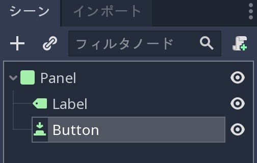
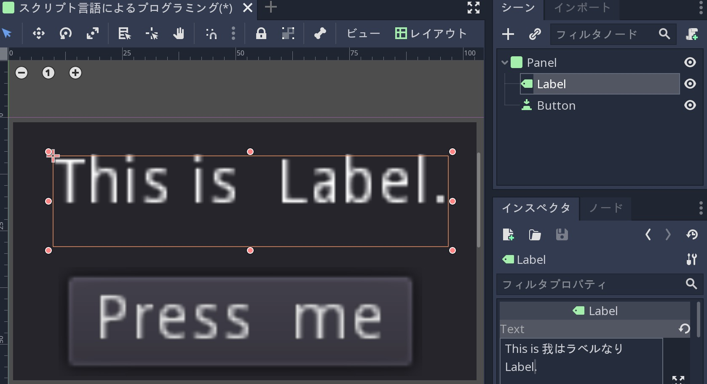
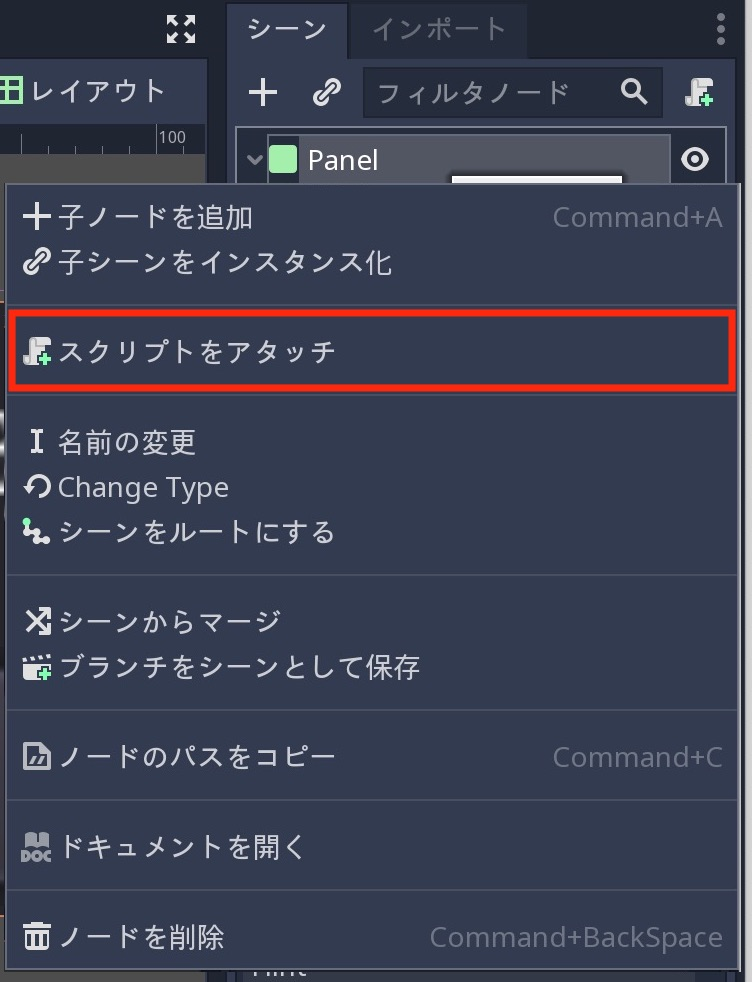
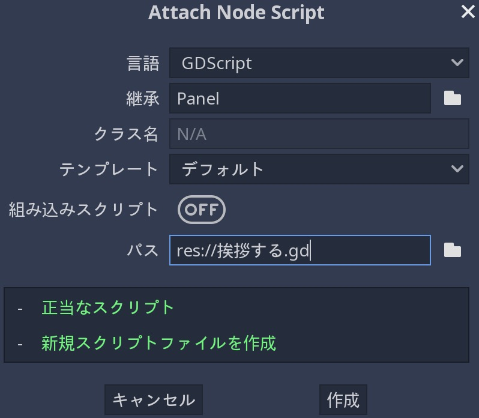
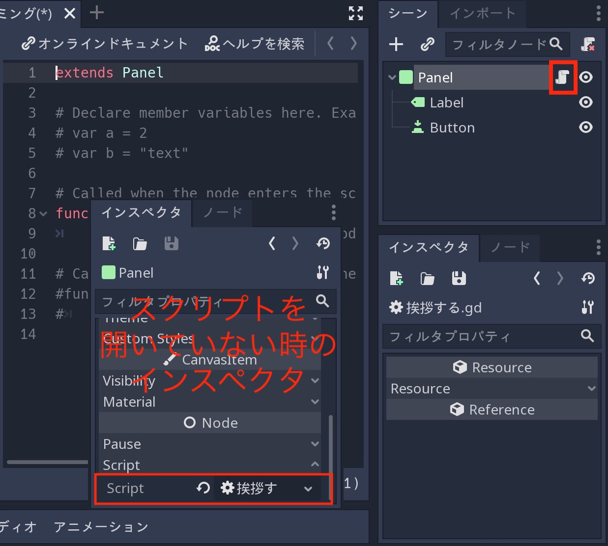
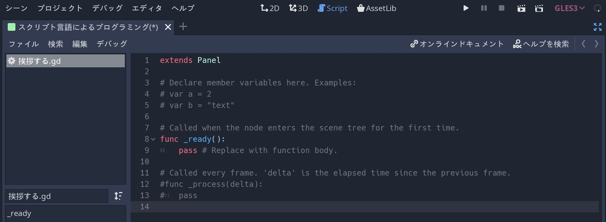
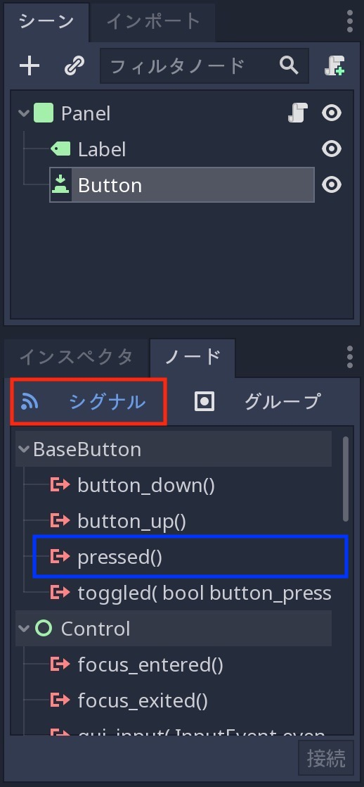
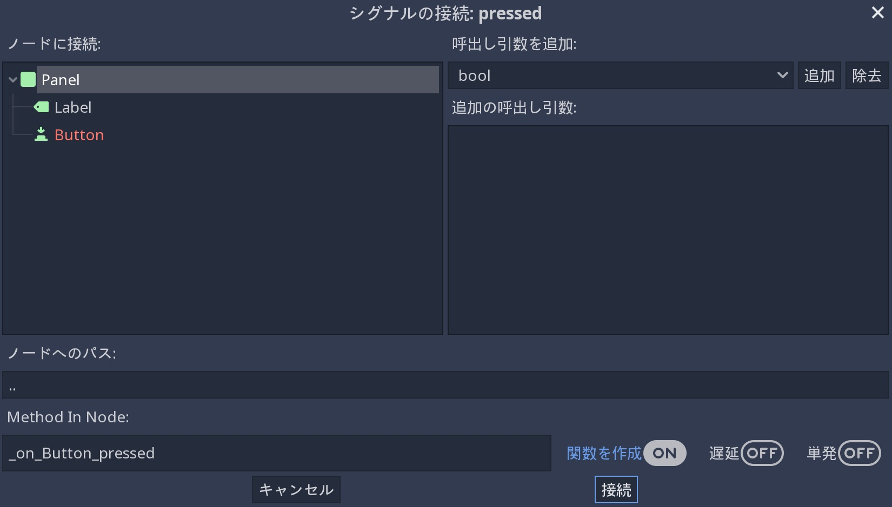
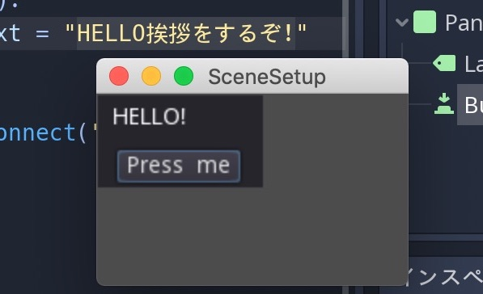
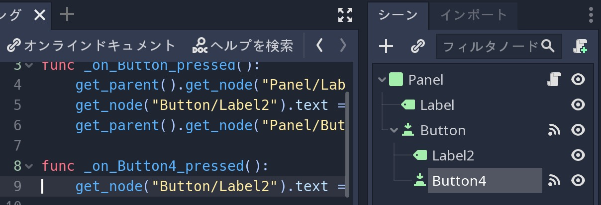

.. _doc_scripting_jp:

スクリプト言語によるプログラミング
====================================================================

.. 英語の原文：スクリプト言語によるプログラミング
   Scripting
   =========

前書き
------------

Godot3.0以前は、ゲームのスクリプトを作成するための唯一の選択肢として、:ref:`GDScript <doc_gdscript_jp>` を使用するだけだった。
現在、Godotには4つの(言い間違いではない。確かに4つ)の公式言語と追加のスクリプト言語を動的に追加する機能がある。

これは、主に提供される柔軟性が大きいため素晴らしいが、言語をサポートする作業がより困難になるのも確かだ。

ただし、Godotの "主要な" 言語はGDScriptとVisualScriptの2つになる。
それらを選択する主な理由は、Godotとの親和性にある。
これにより、開発の進捗がなめらかに進む。
どちらも洗練されたエディタ環境を備えているが、C#とC++は別のIDEで編集する必要がある。
静的に型付けされた言語の大ファンであれば、C#とC++を選ぶべきだろう。

.. 英語の原文：前書き
   Introduction
   ------------

   Before Godot 3.0, the only choice for scripting a game was to use
   :ref:`GDScript<doc_gdscript>`. Nowadays, Godot has four (yes, four!) official languages
   and the ability to add extra scripting languages dynamically!

   This is great, mostly due to the large amount of flexibility provided, but
   it also makes our work supporting languages more difficult.

   The "main" languages in Godot, though, are GDScript and VisualScript. The
   main reason to choose them is their level of integration with Godot, as this
   makes the experience smoother; both have slick editor integration, while
   C# and C++ need to be edited in a separate IDE. If you are a big fan of statically typed languages, go with C# and C++ instead.

GDScript
~~~~~~~~~~~~~~~~

:ref:`GDScript<doc_gdscript_jp>` は、前述通り、Godotで使用される主要言語になる。
Godotとの高度な統合により、他の言語と比較していくつかの利点がある。

* 簡素な優雅さを備え、 `Lua <https://www.lua.org>`_ ・ `Python <https://www.python.org>`_ ・ `Squirrel <http://www.squirrel-lang.org>`_ などの他の言語のユーザに馴染みやすいように設計されている。
* 非常に高速な読み込み(処理)後にコンパイルする。（訳者：読み込みが高速？コンパイルも高速？）
* エディタ統合は、ノードや信号および編集中のシーンに関連する他の多くの項目のコード補完が利用できる(無駄な苦労がない)。
* ベクトル型(ベクトル・変換など)が組み込まれているため、線形代数を頻繁に使用する場合に効率的になっている。
* 静的に型付けされた言語と同じくらい効率的に複数のスレッドをサポートする(Lua・SquirrelなどのVMを避けるための制限の一つ)
* ガーベージコレクタ(メモリ自動解放)を使わないため、決定論により、少しの自動化(とにかく、ほとんどのオブジェクトは参照カウントされること)が行われる。
* 動的な性質により、より多くのパフォーマンスが必要な場合、エンジンを再コンパイルせずに、C++のコードセクションを(GDNativeを介して)簡単に最適化できる。

今回プログラミングに取り組む予定で、プログラミング経験があるならば、動的に型付けされたGDScriptを選ぶべきだ。

.. 訳者メモ：

   ガーベージコレクタと参照カウントの違いが分からない。
   同じにしか思えない。
   ガーベージコレクタの一つに参照カウントが含まれているように思う。
   そして、参照カウントは、実装が難しいように思うのだが・・・処理は単純かもしれないが、参照方法の仕組みに頭を使わなければならないため、人間の能力に委ねることなると思う。
   `参照カウント <https://ja.wikipedia.org/wiki/参照カウント>`_

.. 英語の原文：GDScript
   GDScript
   ~~~~~~~~

   :ref:`GDScript<doc_gdscript>` is, as mentioned above, the main language used in Godot.
   Using it has some positive points compared to other languages due
   to its high integration with Godot:

   * It's simple, elegant, and designed to be familiar for users of other languages such as Lua, Python, Squirrel, etc.
   * Loads and compiles blazingly fast.
   * The editor integration is a pleasure to work with, with code completion for nodes, signals, and many other items pertaining to the scene being edited.
   * Has vector types built-in (such as Vectors, transforms, etc.), making it efficient for heavy use of linear algebra.
   * Supports multiple threads as efficiently as statically typed languages - one of the limitations that made us avoid VMs such as Lua, Squirrel, etc.
   * Uses no garbage collector, so it trades a small bit of automation (most objects are reference counted anyway), by determinism.
   * Its dynamic nature makes it easy to optimize sections of code in C++ (via GDNative) if more performance is required, all without recompiling the engine.

   If you're undecided and have experience with programming, especially dynamically
   typed languages, go for GDScript!

VisualScript
~~~~~~~~~~~~~~~~~~~~~~~~

Godot3.0以降、 :ref:`Visual Scripting<doc_what_is_visual_script_jp>` を提供している。
これは、 "ブロックと接続" 言語の典型的な実装だが、Godotの動作に適合している。
（訳者：ブロックと接続言語とは何？）

ビジュアルスクリプティングは、プログラマではない人・ゲームデザイナ・アーティストたちにもプログラムコードを理解してもらいたい場合に優れた道具になる。

また、プログラマが変化状況の工程(ステートマシン)を示すことや一連の流れの視覚化(カスタムビジュアルノードワークフロー)を構築するために使用することもできる(例えば、対話システムのような)。

.. 訳者メモ：

   "ブロックと接続"とは何？
   `Blocks and Connections <https://analyticscanvas.com/resources/Docs/Help/Getting_Started/Blocks_and_Connections.htm>`_

.. 英語の原文：VisualScript
   VisualScript
   ~~~~~~~~~~~~

   Beginning with 3.0, Godot offers :ref:`Visual Scripting<doc_what_is_visual_script>`. This is a
   typical implementation of a "blocks and connections" language, but
   adapted to how Godot works.

   Visual scripting is a great tool for non-programmers, or even for experienced developers
   who want to make parts of the code more accessible to others,
   like game designers or artists.

   It can also be used by programmers to build state machines or custom
   visual node workflows - for example, a dialogue system.

.NET / C#
~~~~~~~~~~~~~~~~~~

MicrosoftのC#はゲーム開発者で人気があり、
C#は成熟した言語と言うだけでなく、Microsoftからの寛大な寄付のおかげで、公式サポートにあいまった。

ガーベージコレクタに注意する必要はあるが、優れたパフォーマンスと使いやすさを知れば、どちらを選択するかは言わずもがな。

Godotは、 `Mono <https://mono-project.com>`_ .NETランタイムを使用するため、理論的にはサードパーティの.NETライブラリまたは、フレームワークをGodotのスクリプトに使用できる。
また、 `F# <https://fsharp.org>`_ ・ `Boo <http://boo-lang.org>`_ ・ `ClojureCLR <https://www.clojure.org>`_ などの.NETを下支えしているプログラミング言語があったとしても正式サポートはC#のみ。

.. 英語の原文：.NET / C#
   .NET / C#
   ~~~~~~~~~

   As Microsoft's C# is a favorite amongst game developers, we have added
   official support for it. C# is a mature language with tons of code
   written for it, and support was added thanks to
   a generous donation from Microsoft.

   It has an excellent tradeoff between performance and ease of use,
   although one must be aware of its garbage collector.

   Since Godot uses the `Mono <https://mono-project.com>`_ .NET runtime, in theory
   any third-party .NET library or framework can be used for scripting in Godot, as
   well as any Common Language Infrastructure-compliant programming language, such as
   F#, Boo or ClojureCLR. In practice however, C# is the only officially supported .NET option.

GDNative / C++
~~~~~~~~~~~~~~~~~~~~~~~~~~~~

最後に、Godot3.0リリースでの朗報の1つであるGDNativeを使用する場合、Godotを再コンパイル(または再起動)することなくC++でスクリプトを作成できる。

任意のC++バージョンを使用でき、生成された共有ライブラリのコンパイラブランドとバージョンを混在させることはInternal C API(訳者：アクセス修飾子のこと？)があるおかげで、完全に機能する。

この言語は、パフォーマンスに最適な選択肢だが、ゲーム全体で使用する必要は無い。
他の部分はGDScriptまたはVisualScriptで補えるからだ。
ただし、このAPIは、主にGodotの実際のC++APIに似ているため、明確で使いやすいだろう。

GDNativeインタフェイスを介してより多くの言語を使用できるが、正式なサポートをしているわけでは無いことに注意されたし。

.. 英語の原文：GDNative / C++
   GDNative / C++
   ~~~~~~~~~~~~~~

   Finally, one of our brightest additions for the 3.0 release:
   GDNative allows scripting in C++ without needing to recompile (or even
   restart) Godot.

   Any C++ version can be used, and mixing compiler brands and versions for the
   generated shared libraries works perfectly, thanks to our use of an internal C
   API Bridge.

   This language is the best choice for performance and does not need to be
   used throughout an entire game, as other parts can be written in GDScript or Visual
   Script. However the API is clear and easy to use as it resembles, mostly,
   Godot's actual C++ API.

   More languages can be made available through the GDNative interface, but keep in mind
   we don't have official support for them.

Scripting a scene
----------------------------------

このチュートリアルの残りの部分では、ボタンとラベルで構成されるGUIシーンを設定する。
ボタンを押すとラベルが更新されることを実証する。

- スクリプトを記述し、ノードに添付。
- シグナルを介したUI要素の接続。
- シーン内の他のノードに接続できるスクリプトの作成。

実行前に、必ず :ref:`GDScript <doc_gdscript_jp>` リファレンスを熟読すること。
簡素な設計により作られた言語のため、概念部分を把握するのに数分程度を要するだけですむ。

.. 英語の原文：Scripting a scene
   Scripting a scene
   -----------------

   For the rest of this tutorial we'll set up a GUI scene consisting of a
   button and a label, where pressing the button will update the label. This will
   demonstrate:

   - Writing a script and attaching it to a node.
   - Hooking up UI elements via signals.
   - Writing a script that can access other nodes in the scene.

   Before continuing, please make sure to read the :ref:`GDScript<doc_gdscript>` reference.
   It's a language designed to be simple, and the reference is short, so it will not take more
   than a few minutes to get an overview of the concepts.

シーンの設定
~~~~~~~~~~~~~~~~~~~~~~~~

"シーン" タブ(または ``Ctrl+A`` 押下)から接続先の "子ノードを追加" ダイアログを使用して、次のノードで階層を作成する。

| 以下、新規にプロジェクトを作成し、カスタムノードから以下を作成する？
| （Node ⇒ CanvaiItem ⇒ Control ⇒ Panel
| 　　　　　　　　　　　　　　　⇒ Label
| 　　　　　　　　　　　　　　　⇒ Button

- パネル

  * ラベル
  * ボタン

（訳者：ボタンはいくつか種類があるなかから "Standard themed Button." の説明をしている上位ボタン(?)を選ぶ？）

シーンツリーは次のようになる。

2Dエディタを使用して、ボタンとラベルを下の画像のように配置及びサイズ変更する。
インスペクタタブからテキストを設定する。
注意：当然のように日本語は受け付けない。

最後に ``スクリプト言語によるプログラミング.tscn`` などの名前でシーンを保存する。

.. _doc_scripting-adding_a_script_jp:

.. 英語の原文：シーンの設定
   Scene setup
   ~~~~~~~~~~~

   Use the "Add Child Node" dialogue accessed from the Scene tab (or by pressing ``Ctrl+A``) to create a hierarchy with the following
   nodes:

   - Panel

     * Label
     * Button

   The scene tree should look like this:

   .. image:: img/scripting_scene_tree.png

   Use the 2D editor to position and resize the Button and Label so that they
   look like the image below. You can set the text from the Inspector tab.

   .. image:: img/label_button_example.png

   Finally, save the scene with a name such as ``sayhello.tscn``.

   .. _doc_scripting-adding_a_script:

スクリプトを追加する
~~~~~~~~~~~~~~~~~~~~~~~~~~~~~~~~~~~~~~~~

パネルノードを右クリックし、コンテキストメニューから "スクリプトをアタッチ" を選択する。
要は、パネルにスクリプトを添付する。

スクリプト作成(Attach Node Script)ダイアログが表示される。
このダイアログでは、スクリプトの言語・クラス名・及びそのほかの関連オプションを設定できる。

GDScriptでは、ファイル自体がクラスを表しているため、クラス名フィールドは編集できない。

スクリプトをAttach(添付)するノードはパネルになるため、継承フィールドには自動的に "Panel" が入力される。
スクリプトの目標はパネルノードの機能を拡張することであるため、自動入力を受け入れなければならない(訳者：要は、無条件にルートノード(今回の場合はパネル)が設定されることに疑問を持つなと言うことだろう)

最後に、スクリプトのパス名(保存場所)を入力し、作成ボタンをクリックする。

スクリプトが作成され、ノードに追加される。
これは、シーンドックのPanelノードの横にある "スクリプトを開く" アイコンおよび、インスペクタの下のスクリプトプロパティに表示される。

スクリプトを編集するには、赤枠で囲ったこれらのボタンから開く。
これにより、デフォルトのテンプレートが含まれるスクリプトエディタが表示される。

見慣れない関数名に心配は不要だ。
``_ready()`` 関数は、ノードとそのすべての子がアクティブなシーンに入るときに呼び出される。
**Note:** ``_ready()`` はコンストラクタではない。コンストラクタは、 ``_init()`` だ。

.. 英語の原文：スクリプトを追加する
   Adding a script
   ~~~~~~~~~~~~~~~

   Right click on the Panel node, then select "Attach Script" from the context
   menu:

   .. image:: img/add_script.png

   The script creation dialog will pop up. This dialog allows you to set the
   script's language, class name, and other relevant options.

   In GDScript, the file itself represents the class, so
   the class name field is not editable.

   The node we're attaching the script to is a panel, so the Inherits field
   will automatically be filled in with "Panel". This is what we want, as the
   script's goal is to extend the functionality of our panel node.

   Finally, enter a path name for the script and select Create:

   .. image:: img/script_create.png

   The script will then be created and added to the node. You can
   see this as an "Open script" icon next to the node in the Scene tab,
   as well as in the script property under Inspector:

   .. image:: img/script_added.png

   To edit the script, select either of these buttons, both of which are highlighted in the above image.
   This will bring you to the script editor, where a default template will be included:

   .. image:: img/script_template.png

   There's not much there. The ``_ready()`` function is called when the
   node, and all its children, enters the active scene. **Note:** ``_ready()`` is not
   the constructor; the constructor is instead ``_init()``.

スクリプトの役割
~~~~~~~~~~~~~~~~~~~~~~~~~~~~~~~~

スクリプトはノードに動作を追加する。
これは、ノードが機能する方法や他のノード(親・子・兄弟など)との相互作業を制御するために使用される。
スクリプトのローカルスコープはノードになる。
つまり、スクリプトはそのノードが提供する機能を継承する。

.. image:: img/brainslug.jpg
   :alt: エイリアンのような形をしたスクリプトが無気力なおっさんに取り憑いた画像(原著のまま)

.. _doc_scripting_handling_a_signal_jp:

.. 英語の原文：スクリプトの役割
   The role of the script
   ~~~~~~~~~~~~~~~~~~~~~~

   A script adds behavior to a node. It is used to control how the node functions
   as well as how it interacts with other nodes: children, parent, siblings,
   and so on. The local scope of the script is the node. In other words, the script
   inherits the functions provided by that node.

   .. image:: /img/brainslug.jpg

   .. _doc_scripting_handling_a_signal:

信号処理
~~~~~~~~~~~~~~~~

信号(シグナル)は、特定の種類のときに "放出(発信)" され、任意のスクリプトインスタンスを任意の関数に接続できる。
シグナルは主にGUIノードで使用されるが、他のノードにもシグナルがあり、独自のスクリプトでカスタムシグナルを定義することも可能になっている。

今回の説明では、 "押された" シグナルをカスタム関数に接続する。
接続の形式は最初の部分であり、カスタム関数の定義は2番目に説明する。
Godotは、接続作成の方法を2つ提供している。
エディタが提供するビジュアルインタフェイスを使用する方法とコードを使用する方法だ。

チュートリアルシリーズの残りの部分でコードメソッドを使用するが、今後の参考のためエディタインタフェイスを先に説明する。

シーンドックからボタンノードを選択後、 "ノード" タブを選択する。
次に、 "シグナル" が選択されていることを確認する。

次に、 "BaseButton" の下の "pressed()" (上記画像の青枠)を選択し、右下の "接続..." ボタンをクリックしたときに、シグナルの接続ダイアログが開く。

.. _女と接続したいjump:

右下には、接続を作成するための非常に大切なトグルボタンがある。
シグナル送信するためのきっかけ(トリガー)となるメソッド(ここではNodePath)を実装するノードとトリガー用メソッドの名前を決めることだ。
（訳者：2つ名前を決めるかのようだが、1つのようだ。そもそもNodePathとはなんぞや）

左上のセクションには、シーンのノードの一覧が表示され、発信ノードの名前が赤で強調表示される。
ここで "パネル" ノードを選択する。
ノードを選択するとき、下部のNodePathが自動的に更新され、発信ノードから選択したノードへの相対パスを指す。

基本は、メソッド名に発信ノードの名前(この場合は "Button" )が含まれ、 ``_on_[EmitterNode]_[signal_name]`` になる(今回の場合は_on_Button_pressed)。
(Panelを選択しておかなければ表示されない) "関数を作成" チェックボックスがオンになっている場合、エディタは接続を設定する前に関数を生成する。

これで、ビジュアルインタフェイスの使用方法に関するガイドを終了する。
ただし、これはスクリプトチュートリアルにあたるため、学習のために、手動のプロセスに取り組むように。

コーディング作業を我が物にするために、おそらくGodotプログラマが最も使用する関数を紹介する。
:ref:`Node.get_node() <class_Node_method_get_node>`
この関数は、Pathを使用して、スクリプトを所有するノードを基準にして、シーン内の任意の場所のノードを取り出す。

便宜上ソースコード上から ``extends Panel`` 以下すべてを削除した状態で以下の説明に入る。
スクリプト部分は手打ちで対応する。

.. tip::

   手打ちで気にしなければならない注意点は、Tabでインデントを揃えないこと。
   必ず **半角スペース** を使わなければならない。さもなくば、以下のエラーが発生する。

   "Unindent does not match any outer indentation level."

   もしくは、すべてを **Tabに揃える** こと、どちらかに統一しなければならない。
   Tabにする場合は、Macでのショートカットは `command+Shift+I` でTabにかわる。

   ※当然このショートカットは標準仕様に則っているため、変更した場合はこの限りではない。
   *エディタ ⇒ エディタ設定 ⇒ "インデントをタブに変換"*

ボタンとラベルは、パネル直下で同列のため、兄弟として扱われ、 ``_ready()`` 関数に次のコードを入力してボタンを作成する。
（訳者：ボタンとラベルが兄弟だから何？）

.. tabs::
   .. code-tab:: gdscript GDScript

      func _ready():
          get_node("Button")

   .. code-tab:: csharp

      public override void _Ready()
      {
          GetNode("Button");
      }

次に、ボタンが押されたときに呼び出される関数を作成する。

.. tabs::
   .. code-tab:: gdscript GDScript

      func _on_Button_pressed():
          get_node("Label").text = "HELLO挨拶をするぞ!"

   .. code-tab:: csharp

      public void _OnButtonPressed()
      {
          GetNode<Label>("Label").Text = "HELLO!";
      }

最後に、 :ref:`Object.connect() <class_Object_method_connect>` を使用して、ボタンの "pressed" シグナルを ``_ready()`` に接続する。

.. tabs::
   .. code-tab:: gdscript GDScript

      func _ready():
          get_node("Button").connect("pressed", self, "_on_Button_pressed")

   .. code-tab:: csharp

      public override void _Ready()
      {
          GetNode("Button").Connect("pressed", this, nameof(_OnButtonPressed));
      }

最終的なスクリプトは次のようになる。

.. tabs::
   .. code-tab:: gdscript GDScript

      extends Panel

      func _ready():
          get_node("Button").connect("pressed", self, "_on_Button_pressed")

      func _on_Button_pressed():
          get_node("Label").text = "HELLO挨拶をするぞ!"

   .. code-tab:: csharp

      using Godot;

      // 重要： クラス名はファイル名と性格に一致しなければならない。
      // これは、大文字と小文字の区別を意味する。
      public class sayhello : Panel
      {
          public override void _Ready()
          {
              GetNode("Button").Connect("pressed", this, nameof(_OnButtonPressed));
          }

          public void _OnButtonPressed()
          {
              GetNode<Label>("Label").Text = "HELLO!";
          }
      }

シーンを実行し、ボタンをクリックする。
（訳者：当時のことは知らないが、今回実行したことで、メインシーンを定義するように促された）
次の結果が得られる。

ようこそ。
最初のシーンのスクリプト作成を歓迎する。

.. note::

   このチュートリアルに関する一般的な誤解は、 ``get_node(path)`` の仕組みだろう。
   指定されたノードに対して、 ``get_node(path)`` は、その直接の子を検索する。
   上記のコードでは、これはボタンがパネルの子で無ければならないことを意味する。

   （しかし、今回作成したノード構成では、以下のコードに対応できないことに注意すること）
   ボタンがラベルの子である場合、取得するコードは次のようになる。

.. tabs::
   .. code-tab:: gdscript GDScript

      # 原著のコメント訳："今回の場合、ただし、念のため。"
      # しかし、私の執筆時点では、これだけではエラーになってしまった。
      get_node("Label/Button")

   .. code-tab:: csharp

      // Not for this case,
      // but just in case.
      GetNode("Label/Button")

注意：get_node関数は、説明通り、自分自身から見た子を対象とするため、_ready関数で利用した場合エラーになる。
旨く実行する場合は、ボタンノードの親から辿らせると言う一手間を加える必要がある。
その関数が `get_parent` になる。

以下のコードが今回作成したノード構成に対応したコードになる。

.. tabs::
   .. code-tab:: gdscript GDScript

      extends Panel

      func _ready():
          get_parent().get_node("Panel/Button").connect("pressed", self, "_on_Button_pressed")

      func _on_Button_pressed():
          get_parent().get_node("Panel/Label").text = "HELLO挨拶をするぞ!"

原著の執筆時期から大分経過していることを考えれば、昔はこんな書き方を要求されなかったのかもしれない。

原著のコードを使い回せるようなノード構成が以下になる。

Buttonの子として、Label2とButton4がいる。
Button4をクリックすることで、Label2のテキスト部分に文字列を表示させることができる。

`get_node("Button/Label2")`

また、Panelが **root** になりそうだが、 `get_node("/root/Button")` の書き方は許されなかった。
get_node("Panel/Button")は、論外。
そして、どうしても "Panel" から書きたい場合は、ツリー構造のrootから辿ることも可能だ。

`get_tree().get_root().get_node("Panel/Button/Label2")`

何より、ノードはタイプではなく名前で参照されることに注意すること。
（訳者：タイプがどこにあるのか探し出せない）

.. note::

   :ref:`接続ダイアログの右側のパネル <女と接続したいjump>` は、特定の値を接続した関数の引数に結びつけるためのもの。
   様々なタイプの値を追加及び削除できる。

   コードアプローチは、4番目の空配列の ``Array`` 引数でこれを可能にする。
   詳細については、 :ref:`Object.connect() <class_Object_method_connect>` を参照のこと。

.. note::

   Pathについては、 :ref:`NodePath <class_NodePath>` を確認すること。

.. todo::

   リンクの確認。

.. 英語の原文：信号処理
   Handling a signal
   ~~~~~~~~~~~~~~~~~

   Signals are "emitted" when some specific kind of action happens, and they can be
   connected to any function of any script instance. Signals are used mostly in
   GUI nodes, although other nodes have them too, and you can even define custom
   signals in your own scripts.

   In this step, we'll connect the "pressed" signal to a custom function. Forming
   connections is the first part and defining the custom function is the second part.
   For the first part, Godot provides two ways to create connections: through a
   visual interface the editor provides or through code.

   While we will use the code method for the remainder of this tutorial series, let's
   cover how the editor interface works for future reference.

   Select the Button node in the scene tree and then select the "Node" tab. Next,
   make sure that you have "Signals" selected.

   .. image:: img/signals.png

   If you then select "pressed()" under "BaseButton" and click the "Connect..."
   button in the bottom right, you'll open up the connection creation dialogue.

   .. image:: img/connect_dialogue.png

   In the bottom-left are the key things you need to create a connection: a node
   which implements the method you want to trigger (represented here as a
   NodePath) and the name of the method to trigger.

   The top-left section displays a list of your scene's nodes with the emitting
   node's name highlighted in red. Select the "Panel" node here. When you select
   a node, the NodePath at the bottom will automatically update to point to a
   relative path from the emitting node to the selected node.

   By default, the method name will contain the emitting node's name ("Button" in
   this case), resulting in ``_on_[EmitterNode]_[signal_name]``. If you do have the
   "Make Function" check button checked, then the editor will generate the function
   for you before setting up the connection.

   And that concludes the guide on how to use the visual interface. However, this
   is a scripting tutorial, so for the sake of learning, let's dive into the
   manual process!

   To accomplish this, we will introduce a function that is probably the most used
   by Godot programmers: :ref:`Node.get_node() <class_Node_method_get_node>`.
   This function uses paths to fetch nodes anywhere in the scene, relative to the
   node that owns the script.

   For the sake of convenience, delete everything underneath ``extends Panel``.
   You will fill out the rest of the script manually.

   Because the Button and Label are siblings under the Panel
   where the script is attached, you can fetch the Button by typing
   the following underneath the ``_ready()`` function:

   .. tabs::
    .. code-tab:: gdscript GDScript

       func _ready():
           get_node("Button")

    .. code-tab:: csharp

       public override void _Ready()
       {
           GetNode("Button");
       }

   Next, write a function which will be called when the button is pressed:

   .. tabs::
    .. code-tab:: gdscript GDScript

       func _on_Button_pressed():
           get_node("Label").text = "HELLO!"

    .. code-tab:: csharp

       public void _OnButtonPressed()
       {
           GetNode<Label>("Label").Text = "HELLO!";
       }

   Finally, connect the button's "pressed" signal to ``_ready()`` by
   using :ref:`Object.connect() <class_Object_method_connect>`.

   .. tabs::
    .. code-tab:: gdscript GDScript

       func _ready():
           get_node("Button").connect("pressed", self, "_on_Button_pressed")

    .. code-tab:: csharp

       public override void _Ready()
       {
           GetNode("Button").Connect("pressed", this, nameof(_OnButtonPressed));
       }

   The final script should look like this:

   .. tabs::
    .. code-tab:: gdscript GDScript

       extends Panel

       func _ready():
           get_node("Button").connect("pressed", self, "_on_Button_pressed")

       func _on_Button_pressed():
           get_node("Label").text = "HELLO!"

    .. code-tab:: csharp

       using Godot;

       // IMPORTANT: the name of the class MUST match the filename exactly.
       // this is case sensitive!
       public class sayhello : Panel
       {
           public override void _Ready()
           {
               GetNode("Button").Connect("pressed", this, nameof(_OnButtonPressed));
           }

           public void _OnButtonPressed()
           {
               GetNode<Label>("Label").Text = "HELLO!";
           }
       }

   Run the scene and press the button. You should get the following result:

   .. image:: img/scripting_hello.png

   Why, hello there! Congratulations on scripting your first scene.

   .. note::

       A common misunderstanding regarding this tutorial is how ``get_node(path)``
       works. For a given node, ``get_node(path)`` searches its immediate children.
       In the above code, this means that Button must be a child of Panel. If
       Button were instead a child of Label, the code to obtain it would be:

   .. tabs::
    .. code-tab:: gdscript GDScript

       # Not for this case,
       # but just in case.
       get_node("Label/Button")

    .. code-tab:: csharp

       // Not for this case,
       // but just in case.
       GetNode("Label/Button")

   Also, remember that nodes are referenced by name, not by type.

   .. note::

       The right-hand panel of the connect dialogue is for binding specific
       values to the connected function's parameters. You can add and remove
       values of different types.

       The code approach also enables this with a 4th ``Array`` parameter that
       is empty by default. Feel free to read up on the ``Object.connect``
       method for more information.

.. vim:set ts=3 sw=3 tw=0 fenc=utf-8:
