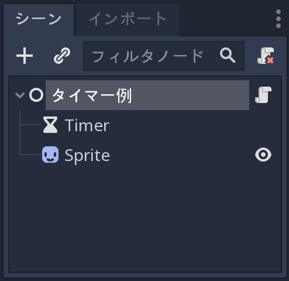
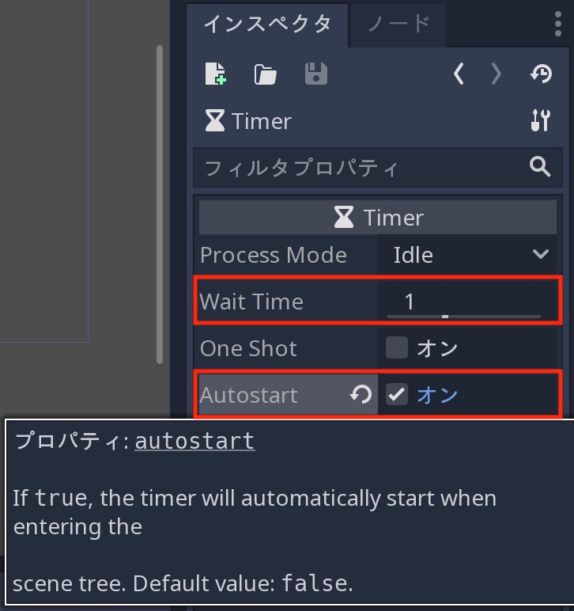
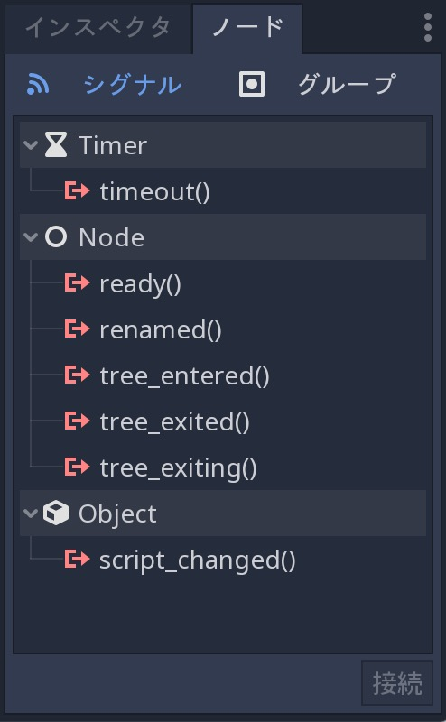
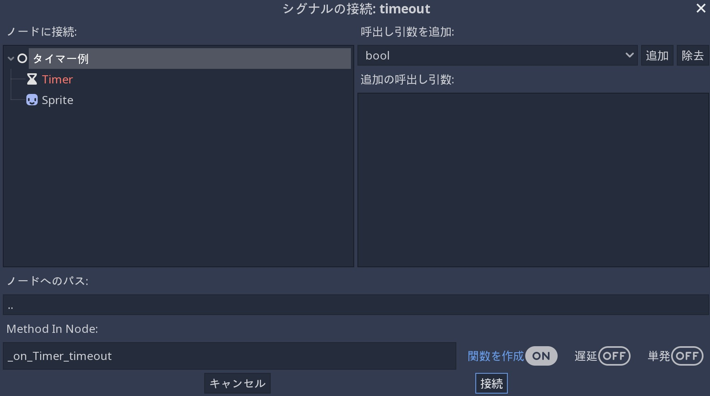
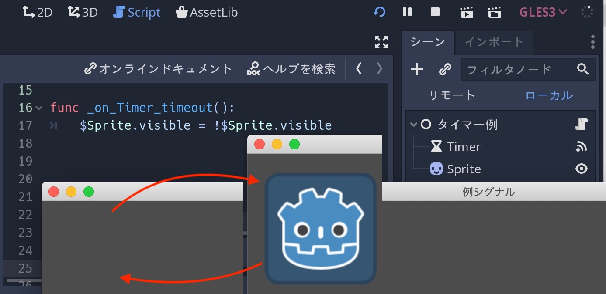
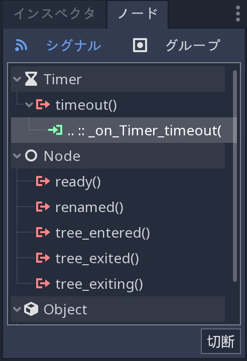

.. _doc_signals_jp:

信号(シグナル)
============================

.. 英語の原文：信号(シグナル)
   Signals
   =======

前書き
------------

シグナルは、Godotの *observer(オブザーバ)* パターンにあたる(Gang of Fourのオリジナルデザインパターン)。
これにより、ノードは、他のノードとのメッセージのやりとりができる。
例えば、ボタンが押されているかどうかを継続的に確認するのでは無く、ボタンが押されたときにシグナルの発信が可能と言うこと。

訳者：ボタンなどをシグナルというオブザーバが監視し、押された場合にオブザーバが押した人間に通知を出すと言うことか。同じ発言に思えるな(しかも日本語がおかしい)。

.. note:: オブザーバパターンの詳細については、 http://gameprogrammingpatterns.com/observer.html (英文)を参照すること。

シグナルは、ゲームオブジェクトを *分離* する方法であり、コードの整理と管理が容易になる(オブジェクト指向)。
ゲームオブジェクトに他のオブジェクトが常に存在することを強制するのでは無く、代わりに、関心のあるすべてのオブジェクトが通知および応答できるシグナルを送信できることを意味する。

以下に、新規プロジェクトを立ち上げ、シグナルの使用方法例を示す。

.. 英語の原文：前書き
   Introduction
   ------------

   Signals are Godot's version of the *observer* pattern. They allow a node to
   send out a message that other nodes can listen for and respond to. For example,
   rather than continuously checking a button to see if it's being pressed, the
   button can emit a signal when it's pressed.

   .. note:: You can read more about the observer pattern here: http://gameprogrammingpatterns.com/observer.html

   Signals are a way to *decouple* your game objects, which leads to better organized
   and more manageable code. Instead of forcing game objects to expect other objects
   to always be present, they can instead emit signals that all interested objects can
   subscribe to and respond to.

   Below you can see some examples of how you can use signals in your own projects.

タイマー例
--------------------

シグナルがどのように機能するかを見るために、 :ref:`Timer <class_Timer>` ノードを使用する。
タイマーだけでなく、 :ref:`Sprite <class_Sprite>` ノードも使う。
新しいノードの作成後に、その2つを子として追加する。
シーンドックで、ノードの名前を "タイマー例" に変更する。

.. todo::

   リンクの確認。

スプライトのTextureには、Godotアイコンまたは、その他の好きな画像を使用できる。
そのためには、スプライトのテクスチャ属性ドロップダウンメニューで ``読込み`` を選択する。
ルートノード(タイマー例ノード)にスクリプトを添付するが、コードの記載はまだしないこと。

シーンドックは以下の通り。

Timerノードのプロパティで、 *Autostart* の横にあるチェックボックスを "On" にする。
これにより、シーンの実行時に、タイマーが自動的に開始される。
*Wait Time* は、1秒のままにしておくこと。

"インスペクタ" タブの隣には、 "ノード" タブがある( :ref:`ドックを移動済み <doc_intro_to_the_editor_interface_jp>`)。
このタブを開いた場合、選択したノードから発信可能なシグナルが表示される(表示されないシグナルは無関係なので、非表示)。
Timerノードの場合、関係するシグナルは、 "timeout" になる。
このシグナルは、タイマーがゼロになるたびに出力される。

.. _信号と合体jump:

"timeout()" シグナルを選び、 "接続..." をクリックする。
このウィンドウからシグナルの接続方法を定義する。

.. todo::

   listenノードとは何？

左側に、シーン内のノードが表示され、シグナルを "listen" ノードを選択する。
タイマーノードは赤であることに注意すること。
これはエラーではないが、シグナルを発しているのがノードであることを見た目で判断できるようにするためだ。
ルートノードを選択する。

.. warning:: ターゲットノードにはスクリプトが添付されている必要がある。
             添付されていない場合エラーメッセージが表示される。
             ゆえに、上記で添付のみを行った。

ウィンドウ下部には、 "Method In Node" 欄がある。
これは、使用するターゲットノードのスクリプト内の関数名になる。
通常のGodotは ``_on_<node_name>_<signal_name>`` と言う命名規則を使用して、この関数を作成しているが、必要に応じて変更可能になっている。

"接続" ボタンクリック後、スクリプト内に関数が作成される。

.. tabs::
   .. code-tab:: gdscript GDScript

      extends Node

      func _on_Timer_timeout():
          pass # 関数本体に置き換える。

   .. code-tab:: csharp

      public class TimerExample : Node
      {
          private void _on_Timer_timeout()
          {
              // Replace with function body.
          }
      }

.. todo::

   プレースホルダーコードとは？

これで、プレースホルダーコードをシグナルの受信時に実行したいコードに置き換えることができるようになった。
次にSpriteノードを点滅させる。

.. tabs::
   .. code-tab:: gdscript GDScript

      extends Node

      func _on_Timer_timeout():
          # Note: `$` 演算子は、 `get_node()` の省略形であるため、
          # `$Sprite` は、 `get_node("Sprite")` と同義になる。
          $Sprite.visible = !$Sprite.visible

   .. code-tab:: csharp

      public class TimerExample : Node
      {
          public void _on_Timer_timeout()
          {
              var sprite = GetNode<Sprite>("Sprite");
              sprite.Visible = !sprite.Visible;
          }
      }

要は、 "Wait TIme" で設定した1秒ごとで点滅をさせている？

.. 英語の原文：タイマー例
   Timer example
   -------------

   To see how signals work, let's try using a :ref:`Timer <class_Timer>` node. Create
   a new scene with a Node and two children: a Timer and a :ref:`Sprite <class_Sprite>`.
   In the Scene dock, rename Node to TimerExample.

   For the Sprite's texture, you can use the Godot icon, or any other image you
   like. Do so by selecting ``Load`` in the Sprite's Texture attribute drop-down menu.
   Attach a script to the root node, but don't add any code to it yet.

   Your scene tree should look like this:

   .. image:: img/signals_node_setup.png

   In the Timer node's properties, check the "On" box next to *Autostart*. This will
   cause the timer to start automatically when you run the scene. You can leave the
   *Wait Time* at 1 second.

   Next to the "Inspector" tab is a tab labeled "Node". Click on this tab and you'll
   see all of the signals that the selected node can emit. In the case of the Timer
   node, the one we're concerned with is "timeout". This signal is emitted whenever
   the Timer reaches ``0``.

   .. image:: img/signals_node_tab_timer.png

   Click on the "timeout()" signal and click "Connect...". You'll see the following
   window, where you can define how you want to connect the signal:

   .. image:: img/signals_connect_dialog_timer.png

   On the left side, you'll see the nodes in your scene and can select the node that
   you want to "listen" for the signal. Note that the Timer node is red - this is
   *not* an error, but is a visual indication that it's the node that is emitting
   the signal. Select the root node.

   .. warning:: The target node *must* have a script attached or you'll receive
                an error message.

   On the bottom of the window is a field labeled "Method In Node". This is the name
   of the function in the target node's script that you want to use. By default,
   Godot will create this function using the naming convention ``_on_<node_name>_<signal_name>``
   but you can change it if you wish.

   Click "Connect" and you'll see that the function has been created in the script:

   .. tabs::
    .. code-tab:: gdscript GDScript

       extends Node

       func _on_Timer_timeout():
           pass # replace with function body

    .. code-tab:: csharp

       public class TimerExample : Node
       {
           private void _on_Timer_timeout()
           {
               // Replace with function body.
           }
       }

   Now we can replace the placeholder code with whatever code we want to run when
   the signal is received. Let's make the Sprite blink:

   .. tabs::
    .. code-tab:: gdscript GDScript

       extends Node

       func _on_Timer_timeout():
           # Note: the `$` operator is a shorthand for `get_node()`,
           # so `$Sprite` is equivalent to `get_node("Sprite")`.
           $Sprite.visible = !$Sprite.visible

    .. code-tab:: csharp

       public class TimerExample : Node
       {
           public void _on_Timer_timeout()
           {
               var sprite = GetNode<Sprite>("Sprite");
               sprite.Visible = !sprite.Visible;
           }
       }

   Run the scene and you'll see the Sprite blinking on and off every second. You can
   change the Timer's *Wait Time* property to alter this.

コードからシグナル接続実施
~~~~~~~~~~~~~~~~~~~~~~~~~~~~~~~~~~~~~~~~~~~~~~~~~~~~

エディタではなく、コードからシグナル接続もできる。
これは、コードを介してノードをインスタンス化するときに必要であり、エディタを使用して接続することはできない。
（コードから生まれたノードはコードでしか制御できないと言うことか）

まず、タイマーの "Node" タブで接続を選択し、切断をクリックしてシグナルを切断する。
（訳者：シーンドックへのノードは追加しなければならないようだ。コードですべてを補うことはできそうにない。）

コードで接続するには、 ``connect`` 関数を使用する。
実行時に接続されるには、 ``_ready()`` で設定する必要がある。
関数の構文は、 ``<source_node>.connect(<signal_name>, <target_node>, <target_function_name>)`` になる。
タイマー接続のコードは次の通り。

.. tabs::
   .. code-tab:: gdscript GDScript

      extends Node

      func _ready():
          $Timer.connect("timeout", self, "_on_Timer_timeout")

      func _on_Timer_timeout():
          $Sprite.visible = !$Sprite.visible

   .. code-tab:: csharp

      public class TimerExample : Node
      {
          public override void _Ready()
          {
              GetNode("Timer").Connect("timeout", this, nameof(_on_Timer_timeout));
          }

          public void _on_Timer_timeout()
          {
              var sprite = GetNode<Sprite>("Sprite");
              sprite.Visible = !sprite.Visible;
          }
      }

結局AutostartをOnにしておかなければ動かないようだ。
コード記載の意味あるのだろうか。
もしくは、コードで制御できるが、チュートリアルなので省略しているだけ？

とりあえず、 `$Timer.autostart([value])` と言うメソッドはある。

.. 英語の原文：コードからシグナル接続実施
   Connecting signals in code
   ~~~~~~~~~~~~~~~~~~~~~~~~~~

   You can also make the signal connection in code rather than with the editor. This
   is usually necessary when you're instancing nodes via code and so you can't use
   the editor to make the connection.

   First, disconnect the signal by selecting the connection in the Timer's "Node"
   tab and clicking disconnect.

   .. image:: img/signals_disconnect_timer.png

   To make the connection in code, we can use the ``connect`` function. We'll put it
   in ``_ready()`` so that the connection will be made on run. The syntax of the
   function is ``<source_node>.connect(<signal_name>, <target_node>, <target_function_name>)``.
   Here is the code for our Timer connection:

   .. tabs::
    .. code-tab:: gdscript GDScript

       extends Node

       func _ready():
           $Timer.connect("timeout", self, "_on_Timer_timeout")

       func _on_Timer_timeout():
           $Sprite.visible = !$Sprite.visible

    .. code-tab:: csharp

       public class TimerExample : Node
       {
           public override void _Ready()
           {
               GetNode("Timer").Connect("timeout", this, nameof(_on_Timer_timeout));
           }

           public void _on_Timer_timeout()
           {
               var sprite = GetNode<Sprite>("Sprite");
               sprite.Visible = !sprite.Visible;
           }
       }

カスタムシグナル
--------------------------------

Godotで独自のカスタムシグナルを宣言することも可能だ。

.. tabs::
   .. code-tab:: gdscript GDScript

      extends Node

      signal my_signal

   .. code-tab:: csharp

      public class Main : Node
      {
          [Signal]
          public delegate void MySignal();
      }

宣言時に、カスタムシグナルがインスペクタに表示され、ノードの組み込みシグナルと同じ方法で接続できる。
（訳者：表示されない。そのため、GUIで操作できない）

コードを介してシグナルを発信するには、 ``emit_signal`` 関数を使用する。
（訳者の愚痴：関数名などの使い方に括弧が付いたり付かなかったりするのはなぜだろう）

.. tabs::
   .. code-tab:: gdscript GDScript

      extends Node

      signal my_signal

      func _ready():
          emit_signal("my_signal")

   .. code-tab:: csharp

      public class Main : Node
      {
          [Signal]
          public delegate void MySignal();

          public override void _Ready()
          {
              EmitSignal(nameof(MySignal));
          }
      }

.. todo::

   どのように使えばいいのかが分からない。何のためのサンプルなのか・・・。

.. 英語の原文：カスタムシグナル
   Custom signals
   --------------

   You can also declare your own custom signals in Godot:

   .. tabs::
    .. code-tab:: gdscript GDScript

       extends Node

       signal my_signal

    .. code-tab:: csharp

       public class Main : Node
       {
           [Signal]
           public delegate void MySignal();
       }

   Once declared, your custom signals will appear in the Inspector and can be connected
   in the same way as a node's built-in signals.

   To emit a signal via code, use the ``emit_signal`` function:

   .. tabs::
    .. code-tab:: gdscript GDScript

       extends Node

       signal my_signal

       func _ready():
           emit_signal("my_signal")

    .. code-tab:: csharp

       public class Main : Node
       {
           [Signal]
           public delegate void MySignal();

           public override void _Ready()
           {
               EmitSignal(nameof(MySignal));
           }
       }

結論
------------

Godotの組み込みノードタイプの多くは、イベントの検出に使用できるシグナルを提供する。
例えば、コインを表す :ref:`Area2D <class_Area2D>` は、プレーヤーの(物理的な)体に衝突するたびに ``body_entered`` シグナルを発し、プレーヤーがそれを適時を知ることができる。

次のセクションでは、 :ref:`doc_your_first_game_jp` にて、様々なゲームコンポーネントを接続するためのシグナルのいくつかの使用法を含む完全なゲームを構築する。

.. 訳者メモ：
   以下の認識をしているが、どちらがどうのように正しいと言うことは無いと思う。
   プレイヤー：実際に競技などに参加している人のこと(選手・競技者・遊戯者など)。
   プレーヤー：再生装置などの物のこと。
   どちらの綴りも "Player" になる。
   その一方で、 "Prayer" は、祈りを意味するため、全く関連が無い。
   と言うことで、上記の使い方に統一する・・・つもり。
   ちなみに、ゲームで操作する時に動く人物や動物などをキャラクタと表現する。

.. todo::

   リンクの確認。

.. 英語の原文：結論
   Conclusion
   ----------

   Many of Godot's built-in node types provide signals you can use to detect
   events. For example, an :ref:`Area2D <class_Area2D>` representing a coin emits
   a ``body_entered`` signal whenever the player's physics body enters its collision
   shape, allowing you to know when the player collected it.

   In the next section, :ref:`doc_your_first_game`, you'll build a complete game
   including several uses of signals to connect different game components.

.. vim:set ts=3 sw=3 tw=0 fenc=utf-8:
