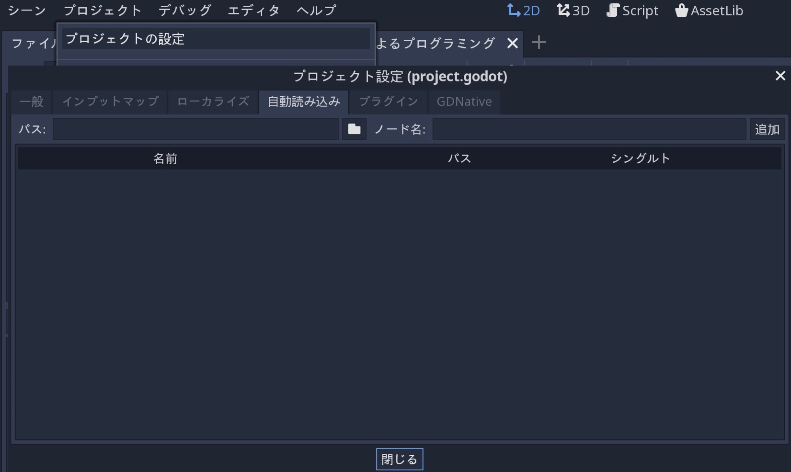
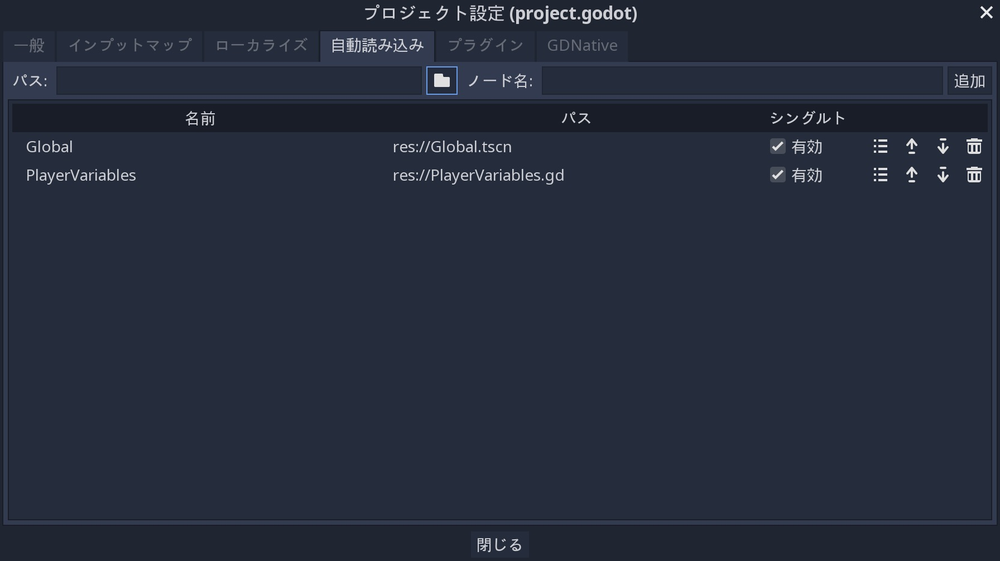
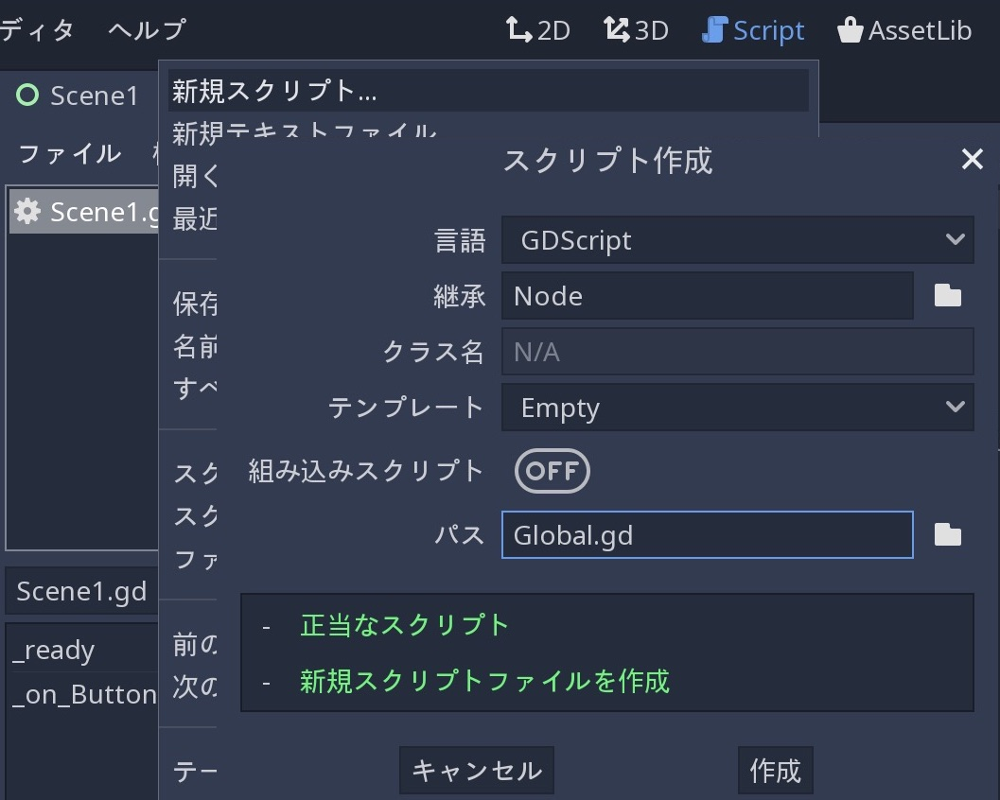
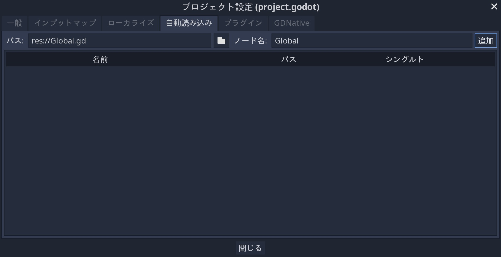

.. _doc_singletons_autoload_jp:

シングルトン(自動読み込み)
====================================================

.. 英語の原文：シングルトン(自動読み込み)
   Singletons (AutoLoad)
   =====================

概論
------------

Godotのシーンシステムは、強力かつ柔軟だが、欠点がある。
複数のシーンで必要な情報(プレイヤーのスコアやイベントリなど)を保存する方法がない。

いくつかの回避策でこれに対処することは可能になるが、独自の制限が付く。

- 他のシーンを子としてロード及びアンロードする "master" シーンを使用する。
  ただし、これは、これらのシーンを個別に実行できなくなり、正しく動作することを期待できないことを意味する。

- 情報は ``user://`` ディスクに保存し、それを必要とするシーンで読み込むが、データの保存と読み込みは頻繁に面倒で遅くなる。

`Singletonパターン(ウィキペディア) <https://ja.wikipedia.org/wiki/Singleton_パターン>`_ は、シーン間で永続的な情報を保存する必要がある一般的なユースケースを解決するための便利なツールになる。
名前が異なる限り、同じシーンまたはクラスを複数のシングルトンに再利用できる。

この概念を使用して、次のオブジェクトを作成する。

- 現在実行されているシーンに関係なく、常に読み込まれる。
- プレイヤー情報などのグローバル変数を保存できる。
- シーンの切り替えとシーン間の遷移を処理できる。
- GDScriptの設計からグローバル変数をサポートしないため、シングルトンのように動作する。

ノードのスクリプトを自動読み込みしたとき、これらの特性が得られる。

.. 英語の原文：概論
   Introduction
   ------------

   Godot's scene system, while powerful and flexible, has a drawback: there is no
   method for storing information (e.g. a player's score or inventory) that is
   needed by more than one scene.

   It's possible to address this with some workarounds, but they come with their
   own limitations:

   -  You can use a "master" scene that loads and unloads other scenes as
      its children. However, this means you can no longer run those scenes
      individually and expect them to work correctly.
   -  Information can be stored to disk in ``user://`` and then loaded by scenes
      that require it, but frequently saving and loading data is cumbersome and
      may be slow.

   The `Singleton Pattern <https://en.wikipedia.org/wiki/Singleton_pattern>`_ is
   a useful tool for solving the common use case where you need to store
   persistent information between scenes. In our case it is possible re-use the
   same scene or class for multiple singletons, so long as they have different
   names.

   Using this concept, you can create objects that:

   -  Are always loaded, no matter which scene is currently running
   -  Can store global variables, such as player information
   -  Can handle switching scenes and between-scene transitions
   -  Act like a singleton, since GDScript does not support global variables by design

   Autoloading nodes and scripts can give us these characteristics.

自動読み込み(AutoLoad)
------------------------

AutoLoadを使用して、 :ref:`Node <class_Node>` を継承するシーンまたはスクリプトを読み込む。

.. todo::

   リンクの確認。

注意：スクリプトをAutoLoadしたとき、ノードが作成され、スクリプトがそれに接続される。
このノードは、他のシーンが読み込まれる前にルートビューポートに追加される。

.. image:: img/singleton.png

シーンまたはスクリプトをAutoLoadするには、メニューから
``プロジェクト ⇒ プロジェクトの設定``
を選択し、 "自動読み込み" タブに切り替える。

ここで、任意の数のシーンまたはスクリプトを追加できる。
リストの各エントリには名前が必要になる。
名前はノードの ``name`` プロパティとして割り当てられる。
グローバルシーンツリーに追加されたエントリの順序は、上下矢印キーを使用して操作できる。

これは、どのノードでも "PlayerVariables" と言う名前のシングルトンにアクセスできることを意味する。

.. tabs::
   .. code-tab:: gdscript GDScript

      var player_vars = get_node("/root/PlayerVariables")
      player_vars.health -= 10

   .. code-tab:: csharp

      var playerVariables = (PlayerVariables)GetNode("/root/PlayerVariables");
      playerVariables.Health -= 10; // Instance field.

"有効" 列がチェックされている場合(標準でチェック済み)、シングルトンに直接アクセスできる。

.. tabs::
   .. code-tab:: gdscript GDScript

      PlayerVariables.health -= 10

   .. code-tab:: csharp

      // Static members can be accessed by using the class name.
      PlayerVariables.Health -= 10;

オートロードオブジェクト(スクリプトやシーン)は、シーンツリーの他のノードと同様にアクセスされることに注意すること。
実際、実行中のシーンツリーを確認したとき、自動読み込みされたノードが表示される。

.. image:: img/autoload_runtime.png

.. todo::

   この画像はどのように用意すればいい？
   リモートから読み込んでいるようだが・・・。

.. 英語の原文：自動読み込み(AutoLoad)
   AutoLoad
   --------

   You can use AutoLoad to load a scene or a script that inherits from
   :ref:`Node <class_Node>`. Note: when autoloading a script, a Node will be
   created and the script will be attached to it. This node will be added to the
   root viewport before any other scenes are loaded.

   .. image:: img/singleton.png

   To autoload a scene or script, select ``Project -> Project Settings`` from the
   menu and switch to the "AutoLoad" tab.

   .. image:: img/autoload_tab.png

   Here you can add any number of scenes or scripts. Each entry in the list
   requires a name, which is assigned as the node's ``name`` property. The order of
   the entries as they are added to the global scene tree can be manipulated using
   the up/down arrow keys.

   .. image:: img/autoload_example.png

   This means that any node can access a singleton named "PlayerVariables" with:

   .. tabs::
    .. code-tab:: gdscript GDScript

      var player_vars = get_node("/root/PlayerVariables")
      player_vars.health -= 10

    .. code-tab:: csharp

       var playerVariables = (PlayerVariables)GetNode("/root/PlayerVariables");
       playerVariables.Health -= 10; // Instance field.

   If the "Enable" column is checked (default true) then the singleton can simply
   be accessed directly:

   .. tabs::
    .. code-tab:: gdscript GDScript

      PlayerVariables.health -= 10

    .. code-tab:: csharp

       // Static members can be accessed by using the class name.
       PlayerVariables.Health -= 10;

   Note that autoload objects (scripts and/or scenes) are accessed just like any
   other node in the scene tree. In fact, if you look at the running scene tree,
   you'll see the autoloaded nodes appear:

   .. image:: img/autoload_runtime.png

カスタムシーンスイッチャー
----------------------------------------------------

今回の説明では、オートロードを使用してシーンスイッチャーの構築方法を示す。
基本的なシーンの切り替えには、 :ref:`SceneTree.change_scene() <class_SceneTree_method_change_scene>` メソッドを使用する(詳細は :ref:`doc_scene_tree_jp` を参照すること)。
ただし、シーンを変更するときに、より複雑な動作が必要な場合、このメソッドはより多くの機能を提供する。

.. todo::

   リンクの確認。

まず、テンプレートのダウンロード( :download:`autoload.zip <files/autoload.zip>` )から始める。

プロジェクトには、 ``Scene1.tscn`` と ``Scene2.tscn`` の2つのシーンが含まれている。
各シーンには、シーン名を表示するラベルと ``pressed()`` シグナルが接続されたボタンが含まれる。
プロジェクトを実行したとき、 ``Scene1.tscn`` が開始される。
ただし、開始ボタンクリックでは何も起こらない。

.. 英語の原文：カスタムシーンスイッチャー
   Custom scene switcher
   ---------------------

   This tutorial will demonstrate building a scene switcher using autoload. For
   basic scene switching, you can use the
   :ref:`SceneTree.change_scene() <class_SceneTree_method_change_scene>`
   method (see :ref:`doc_scene_tree` for details). However, if you need more
   complex behavior when changing scenes, this method provides more functionality.

   To begin, download the template from here:
   :download:`autoload.zip <files/autoload.zip>` and open it in Godot.

   The project contains two scenes: ``Scene1.tscn`` and ``Scene2.tscn``. Each
   scene contains a label displaying the scene name and a button with its
   ``pressed()`` signal connected. When you run the project, it starts in
   ``Scene1.tscn``. However, pressing the button does nothing.

Global.gd
~~~~~~~~~~~~~~~~~~

"Script" タブに切り替えて、Global.gdと言う新しいスクリプトを作成する。
``Node`` から継承していることを確認すること。

次の作業は、このスクリプトを自動読み込みリストに追加する。
メニューから
``プロジェクト ⇒ プロジェクトの設定``
を開き、 "自動読み込み" タブに切り替え ``ファイルを開く`` ボタンをクリックするか、Pathを入力してスクリプトを選択する。
Path欄に ``res://Global.gd`` が入力されているのを確認し、
"Add" ボタンをクリックすることで、自動読み込みリストに追加される。

これで、プロジェクトのシーンを実行するたびに、このスクリプトが常に読み込まれる。

スクリプトに戻り `_ready()` 関数で現在のシーンを取得する必要がある。
現在の(ボタンのある)シーンと ``global.gd`` は両方ともルートの子だが、自動読み込みされたノードは常に最初になる。
これは、ルートの最後の子が常に読み込まれたシーンであることを意味する。

訳者：どういう意味？

.. tabs::
   .. code-tab:: gdscript GDScript

      extends Node

      var current_scene = null

      func _ready():
          var root = get_tree().get_root()
          current_scene = root.get_child(root.get_child_count() - 1)

   .. code-tab:: csharp

      using Godot;
      using System;

      public class Global : Godot.Node
      {
          public Node CurrentScene { get; set; }

          public override void _Ready()
          {
              Viewport root = GetTree().GetRoot();
              CurrentScene = root.GetChild(root.GetChildCount() - 1);
          }
      }

次に、シーンを変更するための関数が必要だ。
この関数は、現在のシーンを解放し、要求されたシーンに置き換える必要がある。

.. tabs::
   .. code-tab:: gdscript GDScript

      func goto_scene(path):
          # この関数は、通常シグナルコールバック、または現在のシーンの他の関数から呼び出される。
          # この時点で現在のシーンを削除することは、まだコードを実行している可能性があるため、軽率だ。
          # これにより、クラッシュまたは予期しない動作が発生してしまうだろう。

          # 解決策は、現在のシーンのコードが実行されていないことが確認できるときに、遅延読み込みで対処する。
          call_deferred("_deferred_goto_scene", path)

      func _deferred_goto_scene(path):
          # 現在のシーンを削除しても安全
          current_scene.free()

          # 新規シーンを読み込む
          var s = ResourceLoader.load(path)

          # 新規シーンをインスタンス化する
          current_scene = s.instance()

          # ルートの子としてアクティブシーンに追加する
          get_tree().get_root().add_child(current_scene)

          # オプションで、SceneTree.change_scene() APIとの互換性を持たせる
          get_tree().set_current_scene(current_scene)

   .. code-tab:: csharp

      public void GotoScene(string path)
      {
          // This function will usually be called from a signal callback,
          // or some other function from the current scene.
          // Deleting the current scene at this point is
          // a bad idea, because it may still be executing code.
          // This will result in a crash or unexpected behavior.

          // The solution is to defer the load to a later time, when
          // we can be sure that no code from the current scene is running:

          CallDeferred(nameof(DeferredGotoScene), path);
      }

      public void DeferredGotoScene(string path)
      {
         // It is now safe to remove the current scene
         CurrentScene.Free();

         // Load a new scene.
         var nextScene = (PackedScene)GD.Load(path);

         // Instance the new scene.
         CurrentScene = nextScene.Instance();

         // Add it to the active scene, as child of root.
         GetTree().GetRoot().AddChild(CurrentScene);

         // Optionally, to make it compatible with the SceneTree.change_scene() API.
         GetTree().SetCurrentScene(CurrentScene);
      }

:ref:`Object.call_deferred() <class_Object_method_call_deferred>` を使うとき、2番目の関数は現在のシーンのすべてのコードが完了した後にのみ実行される。
従い、現在のシーンはまだ使用されている間は削除されない(要は、コードが動いている)。

最終作業として、2つのシーンで空のコールバック関数を埋める必要がある。

.. tabs::
   .. code-tab:: gdscript GDScript

      # 以下 'Scene1.gd' に追加

      func _on_Button_pressed():
          Global.goto_scene("res://Scene2.tscn")

   .. code-tab:: csharp

      // Add to 'Scene1.cs'.

      public void OnButtonPressed()
      {
          var global = (Global)GetNode("/root/Global");
          global.GotoScene("res://Scene2.tscn");
      }

そして、

.. tabs::
   .. code-tab:: gdscript GDScript

      # 以下 'Scene2.gd' に追加

      func _on_Button_pressed():
          Global.goto_scene("res://Scene1.tscn")

   .. code-tab:: csharp

      // Add to 'Scene2.cs'.

      public void OnButtonPressed()
      {
          var global = (Global)GetNode("/root/Global");
          global.GotoScene("res://Scene1.tscn");
      }

プロジェクトを実行し、ボタンクリックでシーン切り替えの動作確認をすること。

注意：シーンが小さい場合、遷移は一瞬で終わる。
ただし、シーンが複雑な場合は、表示されるまでに時間が掛かるだろう。
これを処理する方法については、次の説明を参照すること。
:ref:`doc_background_loading`

.. todo::

   リンクの確認。

.. 英語の原文：Global.gd
   Global.gd
   ~~~~~~~~~

   Switch to the "Script" tab and create a new script called Global.gd. Make sure
   it inherits from ``Node``:

   .. image:: img/autoload_script.png

   The next step is to add this script to the autoLoad list. Open
   ``Project > Project Settings`` from the menu, switch to the "AutoLoad" tab and
   select the script by clicking the ``..`` button or typing its path:
   ``res://Global.gd``. Press "Add" to add it to the autoload list:

   .. image:: img/autoload_tutorial1.png

   Now whenever we run any scene in the project, this script will always be loaded.

   Returning to the script, it needs to fetch the current scene in the
   `_ready()` function. Both the current scene (the one with the button) and
   ``global.gd`` are children of root, but autoloaded nodes are always first. This
   means that the last child of root is always the loaded scene.

   .. tabs::
    .. code-tab:: gdscript GDScript

       extends Node

       var current_scene = null

       func _ready():
           var root = get_tree().get_root()
           current_scene = root.get_child(root.get_child_count() - 1)

    .. code-tab:: csharp

       using Godot;
       using System;

       public class Global : Godot.Node
       {
           public Node CurrentScene { get; set; }

           public override void _Ready()
           {
               Viewport root = GetTree().GetRoot();
               CurrentScene = root.GetChild(root.GetChildCount() - 1);
           }
       }

   Now we need a function for changing the scene. This function needs to free the
   current scene and replace it with the requested one.

   .. tabs::
    .. code-tab:: gdscript GDScript

       func goto_scene(path):
           # This function will usually be called from a signal callback,
           # or some other function in the current scene.
           # Deleting the current scene at this point is
           # a bad idea, because it may still be executing code.
           # This will result in a crash or unexpected behavior.

           # The solution is to defer the load to a later time, when
           # we can be sure that no code from the current scene is running:

           call_deferred("_deferred_goto_scene", path)

       func _deferred_goto_scene(path):
           # It is now safe to remove the current scene
           current_scene.free()

           # Load the new scene.
           var s = ResourceLoader.load(path)

           # Instance the new scene.
           current_scene = s.instance()

           # Add it to the active scene, as child of root.
           get_tree().get_root().add_child(current_scene)

           # Optionally, to make it compatible with the SceneTree.change_scene() API.
           get_tree().set_current_scene(current_scene)

    .. code-tab:: csharp

       public void GotoScene(string path)
       {
           // This function will usually be called from a signal callback,
           // or some other function from the current scene.
           // Deleting the current scene at this point is
           // a bad idea, because it may still be executing code.
           // This will result in a crash or unexpected behavior.

           // The solution is to defer the load to a later time, when
           // we can be sure that no code from the current scene is running:

           CallDeferred(nameof(DeferredGotoScene), path);
       }

       public void DeferredGotoScene(string path)
       {
           // It is now safe to remove the current scene
           CurrentScene.Free();

           // Load a new scene.
           var nextScene = (PackedScene)GD.Load(path);

           // Instance the new scene.
           CurrentScene = nextScene.Instance();

           // Add it to the active scene, as child of root.
           GetTree().GetRoot().AddChild(CurrentScene);

           // Optionally, to make it compatible with the SceneTree.change_scene() API.
           GetTree().SetCurrentScene(CurrentScene);
       }

   Using :ref:`Object.call_deferred() <class_Object_method_call_deferred>`,
   the second function will only run once all code from the current scene has
   completed. Thus, the current scene will not be removed while it is
   still being used (i.e. its code is still running).

   Finally, we need to fill the empty callback functions in the two scenes:

   .. tabs::
    .. code-tab:: gdscript GDScript

       # Add to 'Scene1.gd'.

       func _on_Button_pressed():
           Global.goto_scene("res://Scene2.tscn")

    .. code-tab:: csharp

       // Add to 'Scene1.cs'.

       public void OnButtonPressed()
       {
           var global = (Global)GetNode("/root/Global");
           global.GotoScene("res://Scene2.tscn");
       }

   and

   .. tabs::
    .. code-tab:: gdscript GDScript

       # Add to 'Scene2.gd'.

       func _on_Button_pressed():
           Global.goto_scene("res://Scene1.tscn")

    .. code-tab:: csharp

       // Add to 'Scene2.cs'.

       public void OnButtonPressed()
       {
           var global = (Global)GetNode("/root/Global");
           global.GotoScene("res://Scene1.tscn");
       }

   Run the project and test that you can switch between scenes by pressing
   the button.

   Note: When scenes are small, the transition is instantaneous. However, if your
   scenes are more complex, they may take a noticeable amount of time to appear. To
   learn how to handle this, see the next tutorial: :ref:`doc_background_loading`

.. vim:set ts=3 sw=3 tw=0 fenc=utf-8:
