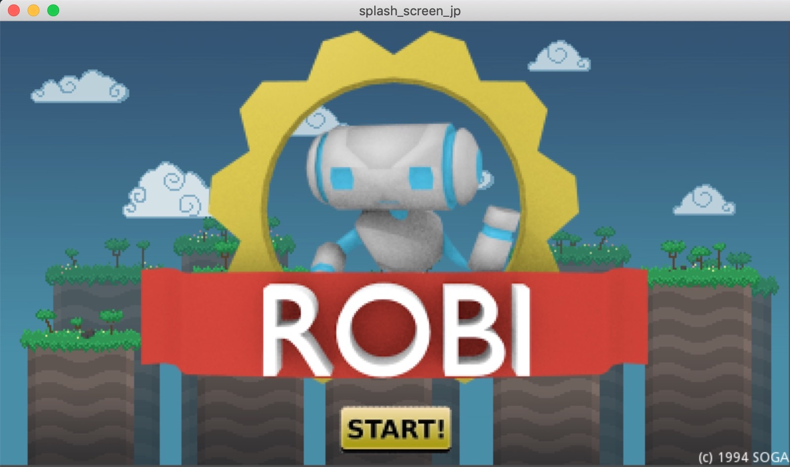
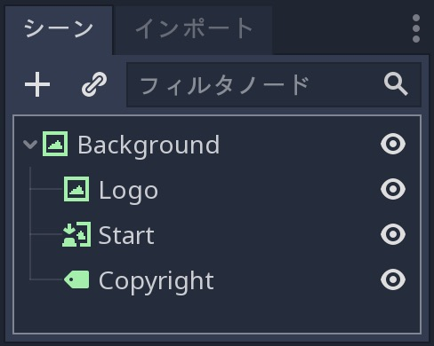
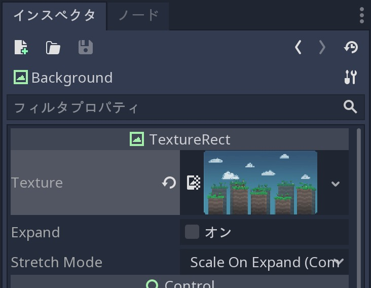
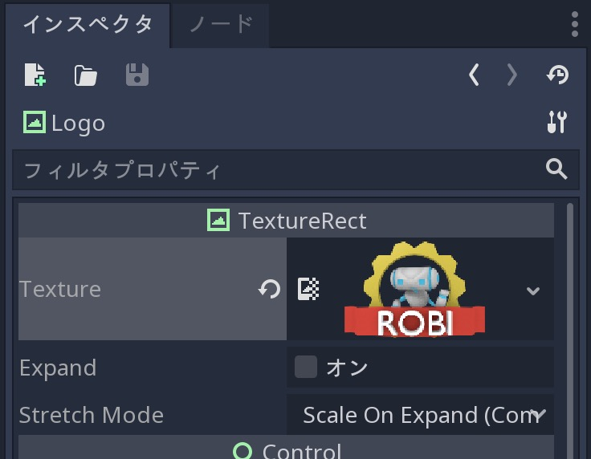
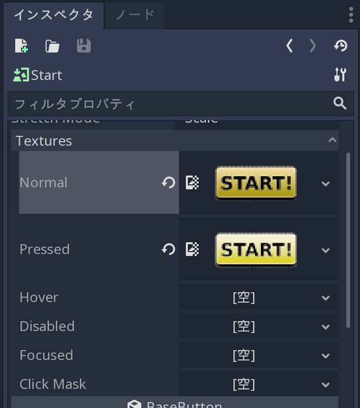
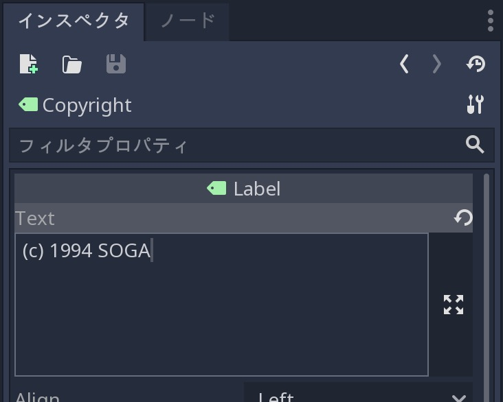
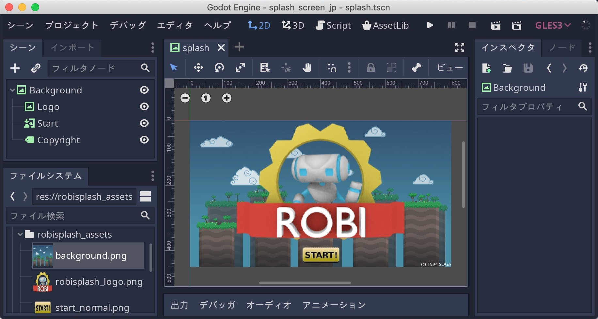

.. _doc_splash_screen_jp:

起動画面(スプラッシュスクリーン)
============================================

.. 英語の原文：起動画面(スプラッシュスクリーン)
   Splash screen
   =============

チュートリアル
----------------------------

これは、GUIサブシステムの仕組みの基本的な考え方を確立するための簡単なチュートリアルになる。
目標は、簡素で静的なスプラッシュスクリーンを作成することだ。

以下は、使用されるアセットを含むファイルだ。
抽出されたファイルはプロジェクトフォルダに直接配置でき、Godotはそれらを自動的にインポートする。

:download:`robisplash_assets.zip <files/robisplash_assets.zip>`.

.. 英語の原文：チュートリアル
   Tutorial
   --------

   This is a simple tutorial to establish the basic idea of how the GUI
   subsystem works. The goal is to create a simple, static
   splash screen.

   .. image:: img/robisplash_result.png

   Following is a file with the assets that will be used. The extracted files can
   be placed directly in your project folder and Godot will import them automatically.

   :download:`robisplash_assets.zip <files/robisplash_assets.zip>`.

設定
------------

プロジェクト設定でディスプレイ解像度を 800x450 に設定し、次のような新しいシーンを設定する。

   ノードの完成画像

"Background" ノードと "Logo" ノードは、 :ref:`TextureRect <class_TextureRect>` 属性を持つ。
画像を表示するには、対応するアセットをテクスチャプロパティにドラッグする。

   バックグラウンドノード

   ロゴノード

"Start" ノードは、 :ref:`TextureButton <class_TextureButton>` になる。
様々な状態の複数の画像を取り込むが、この例ではnormalとpressedのみが提供される。

   スタートノード

最後に、 "Copyright" ノードは、 :ref:`Label <class_Label>` を使う。

   コピーライト

最終的なシーンは次のようになる。

   最終結果

先に進み、プロジェクトを実行する。
この程度に満足ならば、次のチュートリアルに進むこと。

.. todo::

   リンクの確認。

.. 英語の原文：設定
   Setting up
   ----------

   Set the display resolution to 800x450 in Project Settings, and set up a new scene like this:

   .. image:: img/robisplash_scene.png

   The nodes "background" and "logo" are of :ref:`TextureRect <class_TextureRect>`
   type. To display an image, drag the corresponding asset to the texture property.

   .. image:: img/robisplash_background_inspector.png

   The node "start" is a :ref:`TextureButton <class_TextureButton>`.
   It takes several images for different states, but only the normal and
   pressed will be supplied in this example:

   .. image:: img/robisplash_button_inspector.png

   Finally, the node "copyright" is a :ref:`Label <class_Label>`.

   Your final scene should look something like this.

   .. image:: img/robisplash_editor.png

   Go ahead and run the project.  If you're satisfied with the results, continue to
   the next tutorial.

.. vim:set ts=3 sw=3 tw=0 fenc=utf-8:
