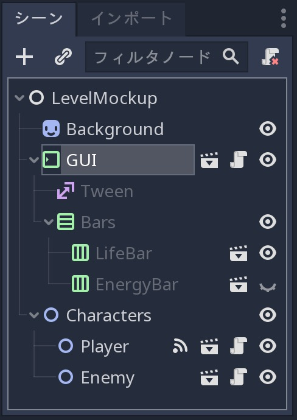
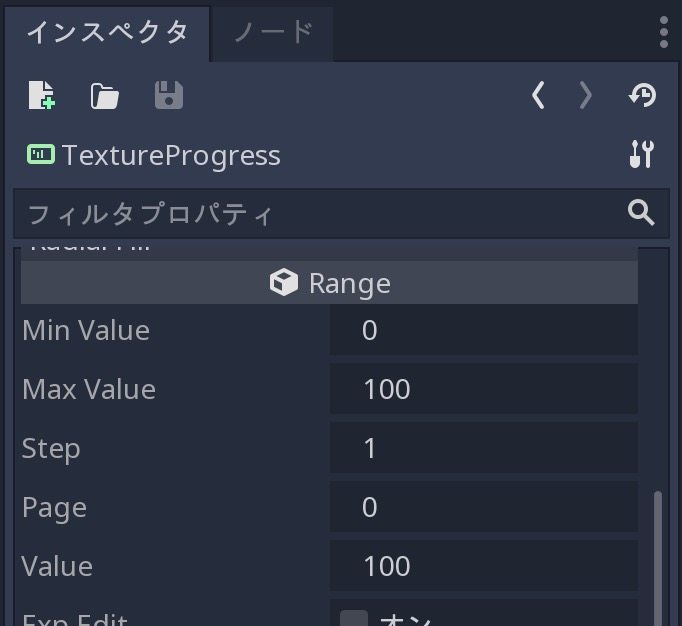
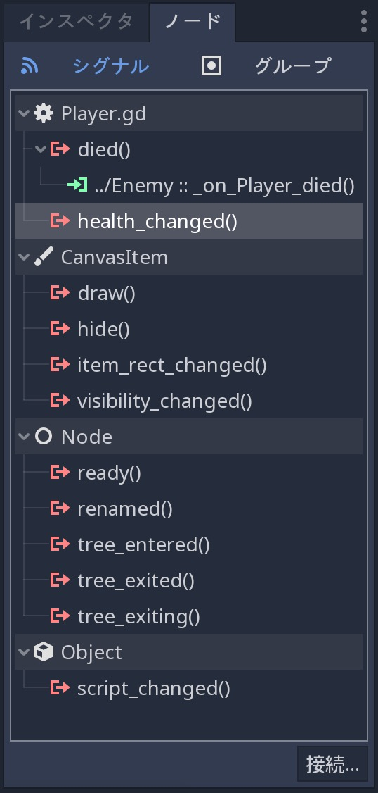
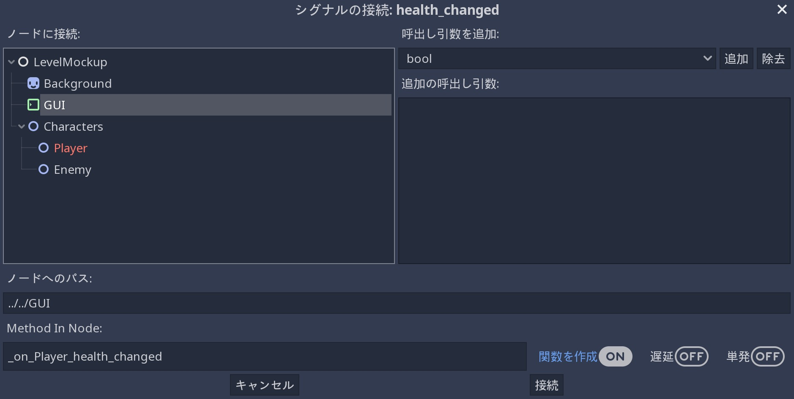
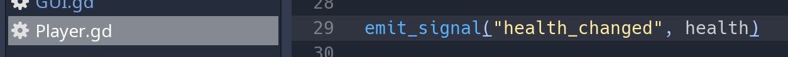
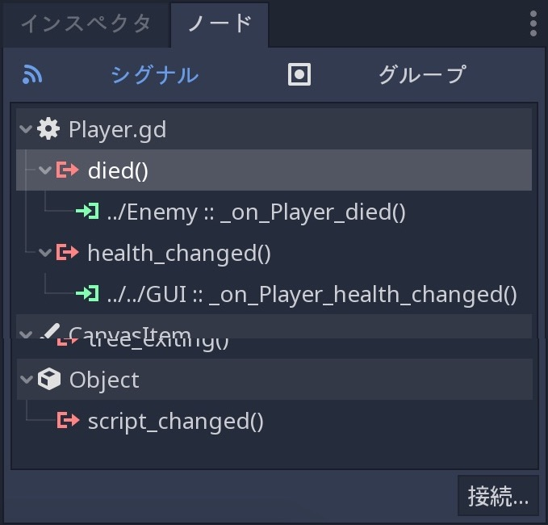

.. _doc_ui_code_a_life_bar_jp:

コードでゲームのUIを制御する
============================

.. 英語の原文：コードでゲームのUIを制御する
   Control the game's UI with code
   ===============================

概論
------------

今回の説明では、プレイヤーをライフバーに接続し、健康障害を視覚化(下記のgifアニメーションで言えば、左上の表示部分に該当)する。

.. figure:: img/lifebar_tutorial_final_result.gif

   作成する物は次の通り。
   プレイヤーが傷害に遭うとき、カウンタとバーがアニメーションする。
   それは、プレイヤーの死によりバーの視覚効果も停止する。

今回の作業要点

- シグナルを使用してプレイヤーをGUIに **connect** する方法。
- GDScriptでGUIを **control** する方法。
- :ref:`Tween <class_Tween>` ノードを使用してライフバーを **animate** する方法。

代わりにインタフェイスの設定方法を身につけたい場合は、 step-by-step のUIチュートリアルを参照すること(訳者：今回の説明のことを指しているのか!?)。

- メインメニュー画面を作成する。
- ゲームのユーザインタフェイスを作成する。

ゲームをコーディングするときは、まず主要なゲームプレイ・主な仕組み・プレイヤーの入力・勝敗条件を構築する。
このとき、UIは少し後回しにしなければならない。
可能であれば、プロジェクトを構成するすべての要素を個別(オブジェクト指向と言う意味合い)に作成する必要がある。
各プレイヤーや独自のスクリプトを備えた独自のシーンに存在する必要があり、UI要素も存在する必要がある。
これにより、バグを防ぎ、プロジェクトを管理しやすくし、様々なチームメンバがゲームの様々な部分で作業できるようにする。

コアゲームプレイとUIの準備ができた場合、何らかの方法でそれらを接続する必要がある。
この例では、一定の時間間隔でプレイヤーを攻撃する敵が存在する。
プレイヤーが攻撃を受けたときにライフバーを更新する必要がある。

これを行うには、 **signals** を使用する。

.. note::

   シグナルは、ObserverパターンのGodot版としてメッセージを送信することができる。
   他のノードは、シグナルを **発信** し、情報を受信するオブジェクトに接続できる。
   これは、ユーザインタフェイスと実績システムに多く使用する強力なツールになる。
   ただし、汎用性の高さはそこまでない。
   2つのノードを接続したとき、ノード間の組み合わせが追加される。
   接続が多い場合、管理が難しくなる。
   詳細については、GDquestの `signals video tutorial(英語版のYouTube動画) <https://youtu.be/l0BkQxF7X3E>`_ を参照すること。

.. todo::

   リンクの確認。

.. 英語の原文：概論
   Intro
   -----

   In this tutorial, you will connect a character to a life bar and animate
   the health loss.

   .. figure:: img/lifebar_tutorial_final_result.gif

      Here's what you'll create: the bar and the counter animate when
      the character takes a hit. They fade when it dies.

   You will learn:

   -  How to **connect** a character to a GUI with signals
   -  How to **control** a GUI with GDscript
   -  How to **animate** a life bar with the :ref:`Tween <class_Tween>` node

   If you want to learn how to set up the interface instead, check out the
   step-by-step UI tutorials:

   -  Create a main menu screen
   -  Create a game user interface

   When you code a game, you want to build the core gameplay first: the
   main mechanics, player input, win and loss conditions. The UI comes a
   bit later. You want to keep all the elements that make up your project
   separate if possible. Each character should be in its own scene, with
   its own scripts, and so should the UI elements. This prevents bugs,
   keeps your project manageable, and allows different team members to work
   on different parts of the game.

   Once the core gameplay and the UI are ready, you'll need to connect them
   somehow. In our example, we have the Enemy who attacks the Player at
   constant time intervals. We want the life bar to update when the Player
   takes damage.

   To do this, we will use **signals**.

   .. note::

       Signals are Godot's version of the Observer pattern. They allow us to send out some message. Other nodes can connect to the object that **emits** the signal and receive the information. It's a powerful tool we use a lot for User Interface and achievement systems. You don't want to use them everywhere, though. Connecting two nodes adds some coupling between them. When there's a lot of connections, they become hard to manage.
       For more information, check out the `signals video tutorial <https://youtu.be/l0BkQxF7X3E>`_ on GDquest.

開始プロジェクトをダウンロードして探索する
------------------------------------------------------------------------------------

Godotプロジェクトをダウンロードする。
:download:`ui_code_life_bar.zip <files/ui_code_life_bar.zip>`
今回の説明に必要なアセットとスクリプトがすべて含まれている。
zipファイルを解凍(展開)し、2つのフォルダ( `start` と `end` )の存在を確認する。

Godotで ``start`` プロジェクトを読み込む。
``ファイルシステムドック`` から LevelMockup.tscn をダブルクリックで開く。
2人のキャラクタが向かい合っているRGBゲームの試作品が開く。
ピンク色の敵は、緑色の正方形が死ぬまで一定の時間間隔で攻撃する。
実際にゲームで遊ぶことができる。基本的な戦闘の仕組みは組み込まれている。
（訳者：全然動かないのだが？）
しかし、キャラクタはライフバーに接続されていないため、 ``GUI`` は何も動かない。
（訳者：要は遊べないってこと？）

.. note::

   今回、ゲームのコーディング方法は古典手法で関わる。
   最初にゲームの核になる部分を実装し、プレイヤーの死をコーディングしてからインタフェイスを追加する。
   この流れは、UIにゲームでの出来事を反映させる作業だ。
   そのため、他のシステムがまだ実装されていない場合は、機能しない。
   試作品の製作工程にて、ゲームテスト前にUIを設計した場合、うまく機能しない場合は最初からUIを再作成する必要が発生する。

   シーンには、背景スプライト・GUI・2つのキャラクタが含まれている。

   GUIシーンが子を表示するように設定されたシーンツリー

GUIシーンは、ゲームのすべてのグラフィカルユーザインタフェイスをカプセル化する。
シーン内に存在するノードへのPathを取得するベアボーンスクリプト(組立キット)が付属している。

.. tabs::
   .. code-tab:: gdscript GDScript

      onready var number_label = $Bars/LifeBar/Count/Background/Number
      onready var bar = $Bars/LifeBar/TextureProgress
      onready var tween = $Tween

   .. code-tab:: csharp

      public class Gui : MarginContainer
      {
          private Tween _tween;
          private Label _numberLabel;
          private TextureProgress _bar;

          public override void _Ready()
          {
              // C# doesn't have an onready feature, this works just the same.
              _bar = (TextureProgress) GetNode("Bars/LifeBar/TextureProgress");
              _tween = (Tween) GetNode("Tween");
              _numberLabel = (Label) GetNode("Bars/LifeBar/Count/Background/Number");
          }
      }

- ``number_label`` はライフカウントを数字で表示する。
  ``Label`` ノードを使う。
- ``bar`` はライフバーそのもの。
  ``TextureProgress`` ノードを使うことで実現している。
- ``tween`` は、他のノードの値やメソッドをアニメーション化して制御するコンポーネントスタイルのノードだ。
  （訳者：だから何？他と異なる説明が気になる）

.. note::

   このプロジェクトでは、ゲームジャム(即興でのゲーム開発)や小さなゲームに適した簡素な部品を使用している。

   プロジェクトルートの `res://` フォルダに、 `LevelMockup` がある。
   これがメインのゲームシーンであり、これから作業するシーンでもある。
   ゲームを構成するすべてのコンポーネントは、 `scenes` フォルダにある。
   `assets` フォルダには、ゲームスプライトとHPカウンタのフォントが含まれている。
   `scripts` フォルダには、敵・プレイヤー・GUIコントローラーのスクリプトがある。

   シーンツリーのノードの右側にあるシーン編集アイコン( "エディタで開く" ボタン)をクリックし、エディタでシーンを開く。
   そのアイコンを認識できるならば、LifeBarとEnergyBarの2種類がサブシーンであることを発見するだろう。

.. figure:: img/lifebar_tutorial_Player_with_editable_children_on.png

   Playerシーンが子を表示するように設定されたシーンツリー
   （訳者：この画像はどうやって用意した？）

.. 英語の原文：開始プロジェクトをダウンロードして探索する
   Download and explore the start project
   --------------------------------------

   Download the Godot project: :download:`ui_code_life_bar.zip <files/ui_code_life_bar.zip>`. It contains all the assets and scripts you
   need to get started. Extract the .zip archive to get two folders: `start` and `end`.

   Load the ``start`` project in Godot. In the ``FileSystem`` dock,
   double click on LevelMockup.tscn to open it. It's an RPG game's mockup
   where 2 characters face each other. The pink enemy attacks and damages
   the green square at regular time intervals, until its death. Feel free
   to try out the game: the basic combat mechanics already work. But as the
   character isn't connected to the life bar, the ``GUI`` doesn't do
   anything.

   .. note::

       This is typical of how you'd code a game: you implement the core gameplay first, handle the player's death, and only then you'll add the interface. That's because the UI listens to what's happening in the game. So it can't work if other systems aren't in place yet.
       If you design the UI before you prototype and test the gameplay, chances are it won't work well and you'll have to re-create it from scratch.

   The scene contains a background sprite, a GUI, and two characters.

   .. figure:: img/lifebar_tutorial_life_bar_step_tut_LevelMockup_scene_tree.png

      The scene tree, with the GUI scene set to display its children

   The GUI scene encapsulates all of the game's Graphical User Interface. It comes with
   a barebones script where we get the path to nodes that exist inside the
   scene:

   .. tabs::
    .. code-tab:: gdscript GDScript

       onready var number_label = $Bars/LifeBar/Count/Background/Number
       onready var bar = $Bars/LifeBar/TextureProgress
       onready var tween = $Tween

    .. code-tab:: csharp

       public class Gui : MarginContainer
       {
           private Tween _tween;
           private Label _numberLabel;
           private TextureProgress _bar;

           public override void _Ready()
           {
               // C# doesn't have an onready feature, this works just the same.
               _bar = (TextureProgress) GetNode("Bars/LifeBar/TextureProgress");
               _tween = (Tween) GetNode("Tween");
               _numberLabel = (Label) GetNode("Bars/LifeBar/Count/Background/Number");
           }
       }

   -  ``number_label`` displays a life count as a number. It's a ``Label``
      node
   -  ``bar`` is the life bar itself. It's a ``TextureProgress`` node
   -  ``tween`` is a component-style node that can animate and control any
      value or method from any other node

   .. note::

       The project uses a simple organisation that works for game jams and tiny games.

       At the root of the project, in the `res://` folder, you will find the `LevelMockup`. That's the main game scene and the one we will work with. All the components that make up the game are in the `scenes/` folder. The `assets/` folder contains the game sprites and the font for the HP counter. In the `scripts/` folder you will find the enemy, the player, and the GUI controller scripts.

       Click the edit scene icon to the right of the node in the scene tree to open the scene in the editor. You'll see the LifeBar and EnergyBar are sub-scenes themselves.

   .. figure:: img/lifebar_tutorial_Player_with_editable_children_on.png

          The scene tree, with the Player scene set to display its children

プレイヤーのmax\_healthでライフバーを設定する
------------------------------------------------------------------------------------------

プレイヤーの現在の健康状態(ライフ)をGUIに何らかの方法で伝え、ライフバーのテクスチャを更新し、画面の左上隅にあるHPカウンタに残りの健康状態を表示する必要がある。
これを実現するために、プレイヤーが攻撃を受けるたびに、プレイヤーの健康状態をGUIに送信する。
GUIは、現在値で ``Lifebar`` および ``Number`` ノードを更新する。

ここで停止して数値を表示できるが、適切な比率で更新するには、バーの ``max_value`` を初期化する必要がある。
是に於いて、最初の作業は、緑色のキャラクタの ``max_health`` を ``GUI`` に伝えることだ。
（訳者：何を言っているのか全く分からない。プレイヤーとキャラクタの使い分けも分からない）

.. tip::

   基本的に、バーの `TextureProgress` の `max_value` は、 `100` に設定されている。
   キャラクタの健康状態を数字で表示する必要が無い場合、 `max_value` プロパティの変更は不要だ。
   そうで無ければ、 `Player` から `GUI` に `"health / max_health * 100"` 率を送信する。

   シーンドックの ``GUI`` 用のスクリプトを開く。
   ``_ready`` 関数では、 ``Player`` の ``max_health`` を新しい変数に保存し、それを ``bar`` の ``max_value`` に使い回す。

   （訳者：画像と説明があっていないのでは？）

.. tabs::
   .. code-tab:: gdscript GDScript

      func _ready():
          var player_max_health = $"../Characters/Player".max_health
          bar.max_value = player_max_health

   .. code-tab:: csharp

      public override void _Ready()
      {
          // Add this below _bar, _tween, and _numberLabel.
          var player = (Player) GetNode("../Characters/Player");
          _bar.MaxValue = player.MaxHealth;
      }

このコードを分解して考える。
``$"../Characters/Player"`` は、シーンツリーから1つ上のノードに移動し、そこからノード取得の省略表現を使った ``Characters/Player`` 表記を用いて、ノードに接続する。
その次の単語( ``.max_health`` )部分は、ノード取得したPlayerノードから ``max_health`` を呼び出す(値取得)。

その呼び出した値を ``bar.max_value`` に割り当てる。
技術的に、2行を1つにまとめられるが、後半で ``player_max_health`` を使い回すため、今回はまとめず、分ける。

``Player.gd`` は、ゲームの開始時に、 ``health`` を ``max_health`` に設定するため、その値で今後作業を進める。
今回 ``max_health`` を使う理由は、2つある。

``health`` が常に ``max_health`` に等しいという保証はない。
将来のゲーム改良にて、プレイヤーが低いライフゲージから新規ゲーム開始と言う、難易度を高くするかもしれないことを考慮している。
（訳者：2つのうち1つ目の説明？）

.. note::

   ゲームでシーンを開いた場合、Godotはシーンドックの順に従い、上から下に1つずつノードを作成する。
   `GUI` と `Player` は同じノードブランチの一部ではない。
   互いに連携するときには、両方の存在確認に、 `_ready` 関数を使用する必要が出てくる。
   Godotは、すべてのノードを読み込み直後、ゲームが開始する直前に `_ready` を呼び出す。
   すべてをセットアップし、ゲームセッションを準備するのに最適な機能だ。
   _readyの詳細： :doc:`scripting_continued_jp`

.. 英語の原文：プレイヤーのmax\_healthでライフバーを設定する
   Set up the Lifebar with the Player's max\_health
   ------------------------------------------------

   We have to tell the GUI somehow what the player's current health is, to
   update the lifebar's texture, and to display the remaining health in the
   HP counter in the top left corner of the screen. To do this we send the
   player's health to the GUI every time they take damage. The GUI will then
   update the ``Lifebar`` and ``Number`` nodes with this value.

   We could stop here to display the number, but we need to initialize the
   bar's ``max_value`` for it to update in the right proportions. The first
   step is thus to tell the ``GUI`` what the green character's
   ``max_health`` is.

   .. tip::

       The bar, a `TextureProgress`, has a `max_value` of `100` by default. If you don't need to display the character's health with a number, you don't need to change its `max_value` property. You send a percentage from the `Player` to the `GUI` instead:  `health / max_health * 100`.

   .. figure:: img/lifebar_tutorial_TextureProgress_default_max_value.png

   Click the script icon to the right of the ``GUI`` in the Scene dock to
   open its script. In the ``_ready`` function, we're going to store the
   ``Player``'s ``max_health`` in a new variable and use it to set the
   ``bar``'s ``max_value``:

   .. tabs::
    .. code-tab:: gdscript GDScript

       func _ready():
           var player_max_health = $"../Characters/Player".max_health
           bar.max_value = player_max_health

    .. code-tab:: csharp

       public override void _Ready()
       {
           // Add this below _bar, _tween, and _numberLabel.
           var player = (Player) GetNode("../Characters/Player");
           _bar.MaxValue = player.MaxHealth;
       }

   Let's break it down. ``$"../Characters/Player"`` is a shorthand that
   goes one node up in the scene tree, and retrieves the
   ``Characters/Player`` node from there. It gives us access to the node.
   The second part of the statement, ``.max_health``, accesses the
   ``max_health`` on the Player node.

   The second line assigns this value to ``bar.max_value``. You could
   combine the two lines into one, but we'll need to use
   ``player_max_health`` again later in the tutorial.

   ``Player.gd`` sets the ``health`` to ``max_health`` at the start of the
   game, so we could work with this. Why do we still use ``max_health``?
   There are two reasons:

   We don't have the guarantee that ``health`` will always equal
   ``max_health``: a future version of the game may load a level where
   the player already lost some health.

   .. note::

       When you open a scene in the game, Godot creates nodes one by one, following the order in your Scene dock, from top to bottom. `GUI` and `Player` are not part of the same node branch. To make sure they both exist when we access each other, we have to use the `_ready` function. Godot calls `_ready` right after it loaded all nodes, before the game starts. It's the perfect function to set everything up and prepare the game session.
       Learn more about _ready: :doc:`scripting_continued`

プレイヤーが損傷したときにシグナルでライフを更新する
--------------------------------------------------------------------------------------------------------

GUIは、 ``Player`` から ``health`` 値の更新を受け取る準備が完了している。
実際の受け渡しには、 **シグナル** を使用する。

.. note::

   `enter_tree` や `exit_tree` のような多くの便利なビルトイン(組み込み済み)シグナルがあり、すべてのノードがそれぞれ作成及び破棄されたときに発信する。
   `signal` キーワードを使用して独自に作成することもできる。
   そして、 `Player` ノードには、 `health_changed` と `died` の2つのシグナルを実装済みだ。

例えば、 ``_process`` 関数で ``Player`` ノードを直接取得し、ライフ値を確認する(シグナルを使わずに、取得する方法)。
この方法でノードにアクセスしたとき、ノード間の密結合が発生する。
小さいプログラムであれば、うまくいくだろう。
ゲーム規模が大きくなった場合、より多くの接続が必要になる。
この方法でノードを取得した場合、すぐに複雑になる。
弊害はそれ以外にあり、 ``_process`` 関数で常に状態の変化を取得する必要が出てくる。
この取得作業は、1秒間に60回行われ、コードの実行順序によりゲームが中断される可能性がある。

特定のフレームで更新される *前* に、別のノードのプロパティを確認するだろう。
これにより、修正が難しい不明瞭なバグが埋め込まれる。
一方、シグナルは変更が発生した直後に発信される。
**保証** ：開発者は新鮮な情報を得られる。
そして、変更が発生した *直後* に接続ノードの状態を更新できる。

.. note::

   シグナルが由来するObserverパターンは、ノードブランチ間の結合を少し追加する。
   しかし、2つのクラス間でノードに直接接続するよりも一般的に軽量で安全だ。
   親ノードがその子から値を取得しても構わない。
   ただし、2種類のブランチで作業している場合は、シグナルを優先する必要がある。
   `Observer pattern(英語) <http://gameprogrammingpatterns.com/observer.html>`_
   の詳細は、ゲームプログラミングパターンを参照すること。
   `full book(英語) <http://gameprogrammingpatterns.com/contents.html>`_
   はオンラインで無料入手できる。

これを念頭に置いて、 ``GUI`` を ``Player`` に接続する作業に取りかかる。
シーンドックの ``Player`` ノードをクリック後、ノードドックに移動する。
これは、選択したノードを監視する場所(ドック)だ。

最初のセクションは ``Player.gd`` で定義されたカスタムシグナルを一覧化している。

- キャラクタの死亡時に ``died`` が出力される。
  UIを非表示にするために、すぐに利用する。
- キャラクタが損傷したとき ``health_changed`` が発信される。

   health\_changedシグナルに接続する

``health_change`` を選択し、右下隅の接続ボタンをクリックし、シグナルの接続ウィンドウを開く。
左側枠からこのシグナルを監視するノードを選択するため、今回は ``GUI`` ノードを選ぶ。
画面の右側では、オプションの値をシグナルでパックできる。
すでに ``Player.gd`` で処理済み。
一般に、このウィンドウを使用して引数の大量投入をしないように気をつけること。
これらの引数はコードから実行するよりも不便だからだ。

   GUIノードが選択された信号の接続ウィンドウ

.. tip::

   オプションで、コードからノードを接続できる。
   ただし、エディタから実行することには2つの利点がある。

   1. Godotは、接続されたスクリプトで新しいコールバック関数を作成できる。
   2. シーンドックでシグナル発信するノードの横にシグナル接続アイコンが表示される。

.. todo::

   パックって何だっけ？

シグナルの接続ウィンドウの説明はまだ続く。
ウィンドウ下部に、選択したノードへのパスがある。
さらにその下の "Method in Node" 欄は、シグナルが発せられたときに呼び出される ``GUI`` ノードのメソッドを入力する場所だ。
このメソッドは、シグナルとともに発信された値を受け取り、それらを処理できるようにする。
右側を確認したとき、初期からオンになっている "関数を作成" ラジオボタン(オプション)が目に付くだろう。
これは ``GUI`` ノード内にメソッドを作成する用のラジオボタンだ。
ウィンドウ下部にある接続ボタンをクリックする。
そうすれば、スクリプトエディタが開き、 ``_on_Player_health_changed`` 関数を作成し、そこにカーソルが移動する。

.. note::

   エディタからノードを接続したとき、Godotは次のパターンのメソッド名を生成する。
   ``_on_[EmitterName]_[signal]_[name]``
   メソッドを既に作成済みの場合、 "関数を作成" オプションはそれを維持する。
   また、メソッド名は任意の名前に置き換えることができる。

   訳者：過去で説明済みなのに、なぜここで説明する？

.. figure:: img/lifebar_tutorial_godot_generates_signal_callback.png

   Godotはコールバックメソッドを作成し、それを表示する(訳者：上記では "関数" 文言を使ったのに)。

関数名の引数部分に、 ``player_health`` を追加する。
プレイヤーが ``health_changed`` シグナルを発信したとき、現在の ``health`` を一緒に送信する準備だ。
コードは次のようになる。

.. tabs::
   .. code-tab:: gdscript GDScript

      func _on_Player_health_changed(player_health):
          pass

   .. code-tab:: csharp

      public void OnPlayerHealthChanged(int playerHealth)
      {
      }

.. note::

   エンジンはPascalCaseをsnake_caseに変換しない。
   C#の例では、メソッド名にPascalCaseを使用し、メソッド引数にcamelCaseを使用する。
   これは、公式の `C# 命名規則(英語説明) <https://docs.microsoft.com/en-us/dotnet/standard/design-guidelines/capitalization-conventions>`_ に従う。

   訳者：何が？

   Player.gdでは、プレイヤーがhealth\_changed信号を発信したとき、そのヘルス値も送信する。

.. _j知能配慮不足jump:

``_on_Player_health_changed`` 内で、 ``update_health`` と呼ばれる2番目の関数を呼び出し、それを ``player_health`` 変数に渡す。
その準備が必要だが、一応この説明のコードを以下に示す。

.. tabs::
   .. code-tab:: gdscript GDScript

      func _on_Player_health_changed(player_health):
          update_health(player_health)

.. note::

   `LifeBar` と `Number` のライフ値を直接更新する。
   このメソッドを使用する2つの理由がある。

   1. この名前は、プレイヤーが攻撃を受けたときにGUIでライフカウントを更新することを将来の自分とチームメイトに明らかにする。
   2. 後でこのメソッドを再利用する。

``_on_Player_health_changed`` の下に、新しい ``update_health`` メソッドを作成する。
new\_valueを唯一の引数として設定する。

.. tabs::
   .. code-tab:: gdscript GDScript

      func update_health(new_value):
          pass

   .. code-tab:: csharp

      public void UpdateHealth(int health)
      {
      }

このメソッドには以下が必要になる。

- ``Number`` ノードの ``text`` を ``new_value`` に設定し、文字列に変換する。
- ``TextureProgress`` の ``value`` を ``new_value`` に設定する。

訳者：言い回しがわかりにくいよね。

.. tabs::
   .. code-tab:: gdscript GDScript

      func update_health(new_value):
          number_label.text = str(new_value)
          bar.value = new_value

   .. code-tab:: csharp

      public void UpdateHealth(int health)
      {
          _numberLabel.Text = health.ToString();
          _bar.Value = health;
      }

.. tip::

   ``str`` は、一部の例外を除き、すべての値をテキストに変換する組み込み関数だ。
   ``Number`` の ``text`` プロパティには文字列を必要とするが、 ``new_value`` を直接割り当てることはできない。

また、 ``_ready`` 関数の末尾に ``update_health`` の呼び出し処理を追加し、ゲームの開始時に ``Number`` ノードの ``text`` を正しい値で初期化する作業が必要になる。
以下がそのコードの一部。

.. tabs::
   .. code-tab:: gdscript GDScript

      update_health(player_max_health)

F5(WindowsOS用)押下でゲームをテストする。
ライフバーは攻撃ごとに更新される。

.. figure:: img/lifebar_tutorial_LifeBar_health_update_no_anim.gif

   プレイヤーが損傷したとき、NumberノードとTextureProgressの両方が更新される。

.. 訳者メモ：

   更新されないため、大幅に加筆した（上記 :ref:`コード追加 <j知能配慮不足jump>` が必要だ）。

.. 英語の原文：プレイヤーが損傷したときにシグナルでライフを更新する
   Update health with a signal when the player takes a hit
   -------------------------------------------------------

   Our GUI is ready to receive the ``health`` value updates from the
   ``Player``. To achieve this we're going to use **signals**.

   .. note::

       There are many useful built-in signals like `enter_tree` and `exit_tree`, that all nodes emit when they are respectively created and destroyed. You can also create your own using the `signal` keyword. On the `Player` node, you'll find two signals we created for you: `died` and `health_changed`.

   Why don't we directly get the ``Player`` node in the ``_process``
   function and look at the health value? Accessing nodes this way creates
   tight coupling between them. If you did it sparingly it may work. As
   your game grows bigger, you may have many more connections. If you get
   nodes this way it gets complex quickly. Not only that: you
   need to listen to the state change constantly in the ``_process``
   function. This check happens 60 times a second and you'll likely break
   the game because of the order in which the code runs.

   On a given frame you may look at another node's property *before* it was
   updated: you get a value from the last frame. This leads to obscure
   bugs that are hard to fix. On the other hand, a signal is emitted right
   after a change happened. It **guarantees** you're getting a fresh piece
   of information. And you will update the state of your connected node
   *right after* the change happened.

   .. note::

       The Observer pattern, that signals derive from, still adds a bit of coupling between node branches. But it's generally lighter and more secure than accessing nodes directly to communicate between two separate classes. It can be okay for a parent node to get values from its children. But you'll want to favor signals if you're working with two separate branches.
       Read Game Programming Patterns for more information on the `Observer pattern <http://gameprogrammingpatterns.com/observer.html>`_.
       The `full book <http://gameprogrammingpatterns.com/contents.html>`_ is available online for free.

   With this in mind, let's connect the ``GUI`` to the ``Player``. Click on
   the ``Player`` node in the scene dock to select it. Head down to the
   Inspector and click on the Node tab. This is the place to connect nodes
   to listen to the one you selected.

   The first section lists custom signals defined in ``Player.gd``:

   -  ``died`` is emitted when the character died. We will use it in a
      moment to hide the UI.
   -  ``health_changed`` is emitted when the character got hit.

   .. figure:: img/lifebar_tutorial_health_changed_signal.png

      We're connecting to the health\_changed signal

   Select ``health_changed`` and click on the Connect button in the bottom
   right corner to open the Connect Signal window. On the left side you can
   pick the node that will listen to this signal. Select the ``GUI`` node.
   The right side of the screen lets you pack optional values with the
   signal. We already took care of it in ``Player.gd``. In general I
   recommend not to add too many arguments using this window as they're
   less convenient than doing it from the code.

   .. figure:: img/lifebar_tutorial_connect_signal_window_health_changed.png

      The Connect Signal window with the GUI node selected

   .. tip::

       You can optionally connect nodes from the code. However doing it from the editor has two advantages:

       1. Godot can write new callback functions for you in the connected script
       2. An emitter icon appears next to the node that emits the signal in the Scene dock

   At the bottom of the window you will find the path to the node you
   selected. We're interested in the second row called "Method in Node".
   This is the method on the ``GUI`` node that gets called when the signal
   is emitted. This method receives the values sent with the signal and
   lets you process them. If you look to the right, there is a "Make
   Function" radio button that is on by default. Click the connect button
   at the bottom of the window. Godot creates the method inside the ``GUI``
   node. The script editor opens with the cursor inside a new
   ``_on_Player_health_changed`` function.

   .. note::

      When you connect nodes from the editor, Godot generates a
      method name with the following pattern: ``_on_EmitterName_signal_name``.
      If you wrote the method already, the "Make Function" option will keep
      it. You may replace the name with anything you'd like.

   .. figure:: img/lifebar_tutorial_godot_generates_signal_callback.png

      Godot writes the callback method for you and takes you to it

   Inside the parentheses after the function name, add a ``player_health``
   argument. When the player emits the ``health_changed`` signal, it will send
   its current ``health`` alongside it. Your code should look like:

   .. tabs::
    .. code-tab:: gdscript GDScript

       func _on_Player_health_changed(player_health):
           pass

    .. code-tab:: csharp

       public void OnPlayerHealthChanged(int playerHealth)
       {
       }

   .. note::

       The engine does not convert PascalCase to snake_case, for C# examples we'll be using
       PascalCase for method names & camelCase for method parameters, which follows the official `C#
       naming conventions. <https://docs.microsoft.com/en-us/dotnet/standard/design-guidelines/capitalization-conventions>`_

   .. figure:: img/lifebar_tutorial_player_gd_emits_health_changed_code.png

      In Player.gd, when the Player emits the health\_changed signal, it also
      sends its health value

   Inside ``_on_Player_health_changed``, let's call a second function called
   ``update_health`` and pass it the ``player_health`` variable.

   .. note::

       We could directly update the health value on `LifeBar` and `Number`. There are two reasons to use this method instead:

       1. The name makes it clear for our future selves and teammates that when the player took damage, we update the health count on the GUI
       2. We will reuse this method a bit later

   Create a new ``update_health`` method below ``_on_Player_health_changed``.
   It takes a new\_value as its only argument:

   .. tabs::
    .. code-tab:: gdscript GDScript

       func update_health(new_value):
           pass

    .. code-tab:: csharp

       public void UpdateHealth(int health)
       {
       }

   This method needs to:

   -  set the ``Number`` node's ``text`` to ``new_value`` converted to a
      string
   -  set the ``TextureProgress``'s ``value`` to ``new_value``

   .. tabs::
    .. code-tab:: gdscript GDScript

       func update_health(new_value):
           number_label.text = str(new_value)
           bar.value = new_value

    .. code-tab:: csharp

       public void UpdateHealth(int health)
       {
           _numberLabel.Text = health.ToString();
           _bar.Value = health;
       }

   .. tip::

       ``str`` is a built-in function that converts about any value to
       text. ``Number``'s ``text`` property requires a string, so we can't
       assign it to ``new_value`` directly

   Also call ``update_health`` at the end of the ``_ready`` function to
   initialize the ``Number`` node's ``text`` with the right value at the
   start of the game. Press F5 to test the game: the life bar updates with
   every attack!

   .. figure:: img/lifebar_tutorial_LifeBar_health_update_no_anim.gif

      Both the Number node and the TextureProgress update when the Player
      takes a hit

Tweenノードで命の損失をアニメーション化する
--------------------------------------------------------------------------------------

これまでの実装で、インタフェイスが機能し、各キャラクタがアニメーションした。
これは、プロパティをアニメーション化するために不可欠なツールとして ``Tween`` ノードを導入するいい機会だ(訳者：今までは別技術でアニメーションしていたってこと？)。
``Tween`` は、特定の期間にわたって開始状態から終了状態までのあらゆる物をアニメーション化する。
例えば、キャラクタが攻撃を受けたときに、 ``TextureProgress`` のライフ値から ``Player`` の新しい ``health`` 値にアニメーションする。

``GUI`` シーンには、 ``tween`` 変数に格納された ``Tween`` 子ノードが既に含まれている。
今回それを使う。
``update_health`` にいくつかの変更を加える。

``Tween`` ノードの ``interpolate_property`` メソッドを使用する。
7つの引数が必要になる。

1. アニメーション化するプロパティを所有するノードへの参照
2. 文字列としてのプロパティの識別子
3. 開始値
4. 終了値
5. 秒単位のアニメーションの継続時間
6. 遷移種類
7. 方程式と組み合わせて使用するイージング(アニメーションをなめらかで自然に見せるための手順)

結合された最後の2つの引数は、緩和方程式に対応する。
これは、値が開始点から終了点までどのように変化するかを制御する。

``GUI`` ノードのスクリプトを開く。
``Number`` ノードはそれ自体を更新するためにテキストを必要とし、 ``Bar`` ノードは浮動小数点または整数を必要とする(訳者：スクリプト内の変数についての説明？)。
``interpolate_property`` メソッドを使用して数値をアニメーション化できるが、テキストを直接アニメーション化することはできない(訳者：話しについて行けない)。
これらの機能を踏まえ、 ``animated_health`` と言う名前の ``GUI`` 変数を定義する作業に入る。

スクリプトの上部で新しい変数を定義し、 ``animated_health`` と言う名前を付け、その値を0に設定する( "``var animated_health = 0``" )。
``update_health`` メソッドに戻り、その処理を削除する。
``animated_health`` 値からアニメーションを想像する(訳者：病気か。実装しろよ)。
``Tween`` ノードの ``interpolate_property`` メソッドを呼び出す。

.. tabs::
   .. code-tab:: gdscript GDScript

      func update_health(new_value):
          tween.interpolate_property(self, "animated_health", animated_health, new_value, 0.6, Tween.TRANS_LINEAR, Tween.EASE_IN)

   .. code-tab:: csharp

      // Add this to the top of your class.
      private float _animatedHealth = 0;

      public void UpdateHealth(int health)
      {
          _tween.InterpolateProperty(this, "_animatedHealth", _animatedHealth, health, 0.6f, Tween.TransitionType.Linear,
          Tween.EaseType.In);
      }

関数内を1つづつ読み解く。

::

   tween.interpolate_property(self, "animated_health", ...

``self`` 上の ``animated_health`` ( 要は ``GUI`` ノードをターゲットにする )
``Tween`` のinterpolate\_propertyは、プロパティの名前を文字列として受け取る。
それが ``"animated_health"`` と書く理由になる。

::

   ... _health", animated_health, new_value, 0.6 ...

開始点は、バーの現在値だ。
まだ、この部分をコーディング対象のままだが、ここは ``animated_health`` に紐付けている。
アニメーションの終点は、 ``health_changed`` の後の ``Player`` の ``health`` になる(要は ``new_value`` )。
そして、 ``0.6`` はアニメーションの秒単位の持続時間になる。

::

   ...  0.6, tween.TRANS_LINEAR, Tween.EASE_IN)

最後の2つの引数は ``Tween`` クラスの定数になる。
``TRANS_LINEAR`` は、アニメーションが線形であることを意味する。
``EASE_IN`` は線形遷移では何もしないが、この最後の引数を提供する必要がある。
提供しなければエラーが発生する。

アニメーションは ``tween.start()`` で、 ``Tween`` ノードがアクティブでない場合、これを1回行うだけになる。
update_healthメソッドの末尾に以下のコードを追加する。

.. tabs::
   .. code-tab:: gdscript GDScript

      if not tween.is_active():
          tween.start()

   .. code-tab:: csharp

      if (!_tween.IsActive())
      {
          _tween.Start();
      }

.. note::

`Player` の `health` プロパティでは、アニメーション化できない(不可能ではない)。
キャラクタは一撃で命を落とすため、細かいアニメーション化が無駄になる。
今回の実装で、死亡時期などの状態管理がずっと簡単になった。
常に別のデータコンテナまたはノードにアニメーションを保存する必要がある。
`tween` ノードは、コード制御されたアニメーションに最適だ。
手作りのアニメーションについては、 `AnimationPlayer` を参照すること。

訳者：ここの説明をプロジェクトに取り込んだ場合、ライフバーのアニメーションが行われなくなる。

.. 英語の原文：Tweenノードで命の損失をアニメーション化する
   Animate the loss of life with the Tween node
   --------------------------------------------

   Our interface is functional, but it could use some animation. That's a
   good opportunity to introduce the ``Tween`` node, an essential tool to
   animate properties. ``Tween`` animates anything you'd like from a start
   to an end state over a certain duration. For example, it can animate the
   health on the ``TextureProgress`` from its current level to the
   ``Player``'s new ``health`` when the character takes damage.

   The ``GUI`` scene already contains a ``Tween`` child node stored in the
   ``tween`` variable. Let's now use it. We have to make some changes to
   ``update_health``.

   We will use the ``Tween`` node's ``interpolate_property`` method. It
   takes seven arguments:

   1. A reference to the node who owns the property to animate
   2. The property's identifier as a string
   3. The starting value
   4. The end value
   5. The animation's duration in seconds
   6. The type of the transition
   7. The easing to use in combination with the equation.

   The last two arguments combined correspond to an easing
   equation. This controls how the value evolves from the start to
   the end point.

   Click the script icon next to the ``GUI`` node to open it again. The
   ``Number`` node needs text to update itself, and the ``Bar`` needs a
   float or an integer. We can use ``interpolate_property`` to animate a
   number, but not to animate text directly. We're going to use it to
   animate a new ``GUI`` variable named ``animated_health``.

   At the top of the script, define a new variable, name it
   ``animated_health``, and set its value to 0. Navigate back to the ``update_health`` method and
   clear its content. Let's animate the ``animated_health`` value. Call the
   ``Tween`` node's ``interpolate_property`` method:

   .. tabs::
    .. code-tab:: gdscript GDScript

       func update_health(new_value):
           tween.interpolate_property(self, "animated_health", animated_health, new_value, 0.6, Tween.TRANS_LINEAR, Tween.EASE_IN)

    .. code-tab:: csharp

       // Add this to the top of your class.
       private float _animatedHealth = 0;

       public void UpdateHealth(int health)
       {
           _tween.InterpolateProperty(this, "_animatedHealth", _animatedHealth, health, 0.6f, Tween.TransitionType.Linear,
               Tween.EaseType.In);
       }

   Let's break down the call:

   ::

       tween.interpolate_property(self, "animated_health", ...

   We target ``animated_health`` on ``self``, that is to say the ``GUI``
   node. ``Tween``'s interpolate\_property takes the property's name as a
   string. That's why we write it as ``"animated_health"``.

   ::

       ... _health", animated_health, new_value, 0.6 ...

   The starting point is the current value the bar's at. We still have to
   code this part, but it's going to be ``animated_health``. The end point
   of the animation is the ``Player``'s ``health`` after the
   ``health_changed``: that's ``new_value``. And ``0.6`` is the animation's
   duration in seconds.

   ::

       ...  0.6, tween.TRANS_LINEAR, Tween.EASE_IN)

   The last two arguments are constants from the ``Tween`` class.
   ``TRANS_LINEAR`` means the animation should be linear. ``EASE_IN``
   doesn't do anything with a linear transition, but we must provide this
   last argument or we'll get an error.

   The animation will not play until we activated the ``Tween`` node with
   ``tween.start()``. We only have to do this once if the node is not
   active. Add this code after the last line:

   .. tabs::
    .. code-tab:: gdscript GDScript

           if not tween.is_active():
               tween.start()

    .. code-tab:: csharp

           if (!_tween.IsActive())
           {
               _tween.Start();
           }

   .. note::

       Although we could animate the `health` property on the `Player`, we shouldn't. Characters should lose life instantly when they get hit. It makes it a lot easier to manage their state, like to know when one died. You always want to store animations in a separate data container or node. The `tween` node is perfect for code-controlled animations. For hand-made animations, check out `AnimationPlayer`.

animated\_healthをライフバーに割り当てる
--------------------------------------------------------------------------------

これで ``animated_health`` 変数がアニメーション化されるが、実際の ``Bar`` および ``Number`` ノードは更新しなくなった。
これを修正する。

これまでのところ update\_health メソッドは次のようになっている。

.. tabs::
   .. code-tab:: gdscript GDScript

      func update_health(new_value):
          tween.interpolate_property(self, "animated_health", animated_health, new_value, 0.6, Tween.TRANS_LINEAR, Tween.EASE_IN)
          if not tween.is_active():
              tween.start()

   .. code-tab:: csharp

      public void UpdateHealth(int health)
      {
          _tween.InterpolateProperty(this, "_animatedHealth", _animatedHealth, health, 0.6f, Tween.TransitionType.Linear,
          Tween.EaseType.In);

          if(!_tween.IsActive())
          {
              _tween.Start();
          }
      }

この特定の事例では、 ``number_label`` は、テキストを受け取るため、 ``_process`` メソッドを使用してアニメーション化する必要がある。
``_process`` 内で、以前のように ``Number`` および ``TextureProgress`` ノードを更新作業をする。

.. tabs::
   .. code-tab:: gdscript GDScript

      func _process(delta):
          number_label.text = str(animated_health)
          bar.value = animated_health

   .. code-tab:: csharp

      public override void _Process(float delta)
      {
          _numberLabel.Text = _animatedHealth.ToString();
          _bar.Value = _animatedHealth;
      }

.. note::

   `number_label` および `bar` は、 `Number` および `TextureProgress` ノードへの参照を格納する変数に当たる。

ゲームで遊び、バーがスムースに動くのを確認する。
しかし、テキストは10進数を表示し、混乱するかもしれない。
そして、ゲームの姿を考慮した場合、ライフバーがより細かくアニメーションするのはいいことだろう。

.. figure:: img/lifebar_tutorial_number_animation_messed_up.gif

   アニメーションはスムースだが、数字の変動が崩れている。

``animated_health`` を四捨五入することで両方の問題を解決できる。
``round_value`` と言う名前のローカル変数を使用し、丸められた ``animated_health`` を保存する。
次に、それを ``number_label.text`` と ``bar.value`` に割り当てる。

.. tabs::
   .. code-tab:: gdscript GDScript

      func _process(delta):
          var round_value = round(animated_health)
          number_label.text = str(round_value)
          bar.value = round_value

   .. code-tab:: csharp

      public override void _Process(float delta)
      {
          var roundValue = Mathf.Round(_animatedHealth);
          _numberLabel.Text = roundValue.ToString();
          _bar.Value = roundValue;
      }

ゲームをもう一度動かし、素敵なブロックアニメーションを確認すること。

.. figure:: img/lifebar_tutorial_number_animation_working.gif

   animated\_health を四捨五入することで、一石二鳥を得られる。

.. tip::

   プレイヤーが攻撃されるたびに、 ``GUI`` は ``_on_Player_health_changed`` から ``update_health`` を呼び出す。
   これによりアニメーションが更新され、 ``_process`` の ``number_label`` と ``bar`` が更新される。
   健康状態が徐々に低下するアニメーションライフバーを目視確認できることは、GUI開発の醍醐味だろう。
   GUIが生き生きと感じられる。
   ``Player`` が3回ダメージを受けた場合、完全にプレイヤーが消え去れることも目視確認できる。

.. 英語の原文：animated\_healthをライフバーに割り当てる
   Assign the animated\_health to the LifeBar
   ------------------------------------------

   Now the ``animated_health`` variable animates but we don't update the
   actual ``Bar`` and ``Number`` nodes anymore. Let's fix this.

   So far, the update\_health method looks like this:

   .. tabs::
    .. code-tab:: gdscript GDScript

       func update_health(new_value):
           tween.interpolate_property(self, "animated_health", animated_health, new_value, 0.6, Tween.TRANS_LINEAR, Tween.EASE_IN)
           if not tween.is_active():
               tween.start()

    .. code-tab:: csharp

       public void UpdateHealth(int health)
       {
           _tween.InterpolateProperty(this, "_animatedHealth", _animatedHealth, health, 0.6f, Tween.TransitionType.Linear,
               Tween.EaseType.In);

           if(!_tween.IsActive())
           {
               _tween.Start();
           }
       }

   In this specific case, because ``number_label`` takes text, we need to
   use the ``_process`` method to animate it. Let's now update the
   ``Number`` and ``TextureProgress`` nodes like before, inside of
   ``_process``:

   .. tabs::
    .. code-tab:: gdscript GDScript

       func _process(delta):
           number_label.text = str(animated_health)
           bar.value = animated_health

    .. code-tab:: csharp

       public override void _Process(float delta)
       {
           _numberLabel.Text = _animatedHealth.ToString();
           _bar.Value = _animatedHealth;
       }

   .. note::

       `number_label` and `bar` are variables that store references to the `Number` and `TextureProgress` nodes.

   Play the game to see the bar animate smoothly. But the text displays
   decimal number and looks like a mess. And considering the style of the
   game, it'd be nice for the life bar to animate in a choppier fashion.

   .. figure:: img/lifebar_tutorial_number_animation_messed_up.gif

      The animation is smooth, but the number is broken

   We can fix both problems by rounding out ``animated_health``. Use a
   local variable named ``round_value`` to store the rounded
   ``animated_health``. Then assign it to ``number_label.text`` and
   ``bar.value``:

   .. tabs::
    .. code-tab:: gdscript GDScript

       func _process(delta):
           var round_value = round(animated_health)
           number_label.text = str(round_value)
           bar.value = round_value

    .. code-tab:: csharp

       public override void _Process(float delta)
       {
           var roundValue = Mathf.Round(_animatedHealth);
           _numberLabel.Text = roundValue.ToString();
           _bar.Value = roundValue;
       }

   Try the game again to see a nice blocky animation.

   .. figure:: img/lifebar_tutorial_number_animation_working.gif

      By rounding out animated\_health, we kill two birds with one stone

   .. tip::

       Every time the player takes a hit, the ``GUI`` calls
       ``_on_Player_health_changed``, which in turn calls ``update_health``. This
       updates the animation and the ``number_label`` and ``bar`` follow in
       ``_process``. The animated life bar that shows the health going down gradually
       is a trick. It makes the GUI feel alive. If the ``Player`` takes 3 damage,
       it happens in an instant.

プレイヤー死亡時のバー表記を縮ませる
------------------------------------------------------------------------

緑のキャラクタが死亡した場合、死のアニメーション化後に消えていく。
この時点で、インタフェイスを表示しないようにする。
キャラクタだけで無く、バー部分も縮ませて寿命が0になるアニメーションをさせる。
複数のアニメーションを並行して管理するため、同じ ``Tween`` ノードを再利用する。

まず、 ``GUI`` は、 ``Player`` の ``died`` シグナルに接続し、いつ死亡したかを知る必要がある。
:kbd:`F1` キーを押して、2Dワークスペースに戻る(訳者：ページによって表記を変えるのはどうにかならないのか)。
シーンドックで ``Player`` ノードを選択し、ノードドックを開く。

``died`` シグナルと紐付けるため、接続ボタンをクリックする。

.. figure:: img/lifebar_tutorial_player_died_signal_enemy_connected.png

   シグナルには既に敵が接続されているだろう。

   原画と異なるのだが・・・。

信号の接続ウィンドウで、 ``GUI`` ノードに再度接続する。
ノードへのPathは ``../../GUI`` であり、 "Method in Node" は ``_on_Player_died`` が入力されている必要がある。
"関数を作成" オプションをオンのままにして、ウィンドウ下部にある接続をクリックする。
これにより、スクリプトワークスペースの ``GUI.gd`` ファイルに移動する。

.. figure:: img_jp/lifebar_tutorial_player_died_connecting_signal_window_jp.jpg

   これらの値は、信号の接続ウィンドウで取得する必要がある。

.. note::

   GUIが新しい情報を必要とするたびに、新しい信号を発信する。
   それらを賢く使用しなければ、追加する信号増加に伴い、管理が難しくなる。

UI要素の伸縮(フェード)をアニメーション化するには、その ``modulate`` プロパティを使用する必要がある。
``modulate`` は、テクスチャの色を乗算する ``Color`` にあたる。

.. note::

   `modulate` は、 `CanvasItem` クラスに由来し、すべての2DおよびUIノードはそれを継承する。
   ノードの可視性を切り替え、シェーダを割り当てる。
   `modulate` で色を変更できる。

``modulate`` は、赤・緑・青・付加情報(透明度？)の4つの色情報を持つ ``Color`` 値を取る。
最初の3つの色情報のいずれかを暗くした場合、インタフェイス全体が暗くなる。
付加情報の値を下げた場合、インタフェイスがフェードアウトする。

2つの色情報の間を自動補完(トゥイーン)する。
透過度が ``1`` の白、つまり完全な不透明度から ``0`` の純粋な白(完全な白)に変化させる。
``_on_Player_died`` メソッドの上部に2つの変数を追加し、それらに ``start_color`` と ``end_color`` と言う名前を付ける。
``Color()`` コントラクタを使用し、2つの ``Color`` 値を作成する。

.. tabs::
   .. code-tab:: gdscript GDScript

      func _on_Player_died():
          var start_color = Color(1.0, 1.0, 1.0, 1.0)
          var end_color = Color(1.0, 1.0, 1.0, 0.0)

   .. code-tab:: csharp

      public void OnPlayerDied()
      {
          var startColor = new Color(1.0f, 1.0f, 1.0f);
          var endColor = new Color(1.0f, 1.0f, 1.0f, 0.0f);
      }

``Color(1.0, 1.0, 1.0, ...)`` は白に対応する。
4番目の引数は、それぞれ ``start_color`` と ``end_color`` の ``1.0`` と ``0.0`` で付加情報となる。

次に、 ``Tween`` ノードの ``interpolate_property`` メソッドを再度呼び出す必要がある。

.. tabs::
   .. code-tab:: gdscript GDScript

      tween.interpolate_property(self, "modulate", start_color, end_color, 1.0, Tween.TRANS_LINEAR, Tween.EASE_IN)

   .. code-tab:: csharp

      _tween.InterpolateProperty(this, "modulate", startColor, endColor, 1.0f, Tween.TransitionType.Linear,
         Tween.EaseType.In);

今回は、 ``modulate`` プロパティを変更し、 ``start_color`` から ``end_color`` にアニメーションする。
継続時間は1秒間で、線形の遷移がある。
ここでも遷移は線形であるため、加速度は重要ではない。
完全な ``_on_Player_died`` は次の通り。

.. tabs::
   .. code-tab:: gdscript GDScript

      func _on_Player_died():
          var start_color = Color(1.0, 1.0, 1.0, 1.0)
          var end_color = Color(1.0, 1.0, 1.0, 0.0)
          tween.interpolate_property(self, "modulate", start_color, end_color, 1.0, Tween.TRANS_LINEAR, Tween.EASE_IN)

   .. code-tab:: csharp

      public void OnPlayerDied()
      {
          var startColor = new Color(1.0f, 1.0f, 1.0f);
          var endColor = new Color(1.0f, 1.0f, 1.0f, 0.0f);

          _tween.InterpolateProperty(this, "modulate", startColor, endColor, 1.0f, Tween.TransitionType.Linear, Tween.EaseType.In);
      }

.. 英語の原文：プレイヤー死亡時のバー表記を縮ませる
   Fade the bar when the Player dies
   ---------------------------------

   When the green character dies, it plays a death animation and fades out.
   At this point, we shouldn't show the interface anymore. Let's fade the
   bar as well when the character died. We will reuse the same ``Tween``
   node as it manages multiple animations in parallel for us.

   First, the ``GUI`` needs to connect to the ``Player``'s ``died`` signal
   to know when it died. Press :kbd:`F1` to jump back to the 2D
   Workspace. Select the ``Player`` node in the Scene dock and click on the
   Node tab next to the Inspector.

   Find the ``died`` signal, select it, and click the Connect button.

   .. figure:: img/lifebar_tutorial_player_died_signal_enemy_connected.png

      The signal should already have the Enemy connected to it

   In the Connecting Signal window, connect to the ``GUI`` node again. The
   Path to Node should be ``../../GUI`` and the Method in Node should show
   ``_on_Player_died``. Leave the Make Function option on and click Connect
   at the bottom of the window. This will take you to the ``GUI.gd`` file
   in the Script Workspace.

   .. figure:: img/lifebar_tutorial_player_died_connecting_signal_window.png

      You should get these values in the Connecting Signal window

   .. note::

       You should see a pattern by now: every time the GUI needs a new piece of information, we emit a new signal. Use them wisely: the more connections you add, the harder they are to track.

   To animate a fade on a UI element, we have to use its ``modulate``
   property. ``modulate`` is a ``Color`` that multiplies the colors of our
   textures.

   .. note::

       `modulate` comes from the `CanvasItem` class, All 2D and UI nodes inherit from it. It lets you toggle the visibility of the node, assign a shader to it, and modify it using a color with `modulate`.

   ``modulate`` takes a ``Color`` value with 4 channels: red, green, blue
   and alpha. If we darken any of the first three channels it darkens the
   interface. If we lower the alpha channel, our interface fades out.

   We're going to tween between two color values: from a white with an
   alpha of ``1``, that is to say at full opacity, to a pure white with an
   alpha value of ``0``, completely transparent. Let's add two variables at
   the top of the ``_on_Player_died`` method and name them ``start_color``
   and ``end_color``. Use the ``Color()`` constructor to build two
   ``Color`` values.

   .. tabs::
    .. code-tab:: gdscript GDScript

       func _on_Player_died():
           var start_color = Color(1.0, 1.0, 1.0, 1.0)
           var end_color = Color(1.0, 1.0, 1.0, 0.0)

    .. code-tab:: csharp

       public void OnPlayerDied()
       {
           var startColor = new Color(1.0f, 1.0f, 1.0f);
           var endColor = new Color(1.0f, 1.0f, 1.0f, 0.0f);
       }

   ``Color(1.0, 1.0, 1.0)`` corresponds to white. The fourth argument,
   respectively ``1.0`` and ``0.0`` in ``start_color`` and ``end_color``,
   is the alpha channel.

   We then have to call the ``interpolate_property`` method of the
   ``Tween`` node again:

   .. tabs::
    .. code-tab:: gdscript GDScript

       tween.interpolate_property(self, "modulate", start_color, end_color, 1.0, Tween.TRANS_LINEAR, Tween.EASE_IN)

    .. code-tab:: csharp

       _tween.InterpolateProperty(this, "modulate", startColor, endColor, 1.0f, Tween.TransitionType.Linear,
         Tween.EaseType.In);

   This time, we change the ``modulate`` property and have it animate from
   ``start_color`` to the ``end_color``. The duration is of one second,
   with a linear transition. Here again, because the transition is linear,
   the easing does not matter. Here's the complete ``_on_Player_died``
   method:

   .. tabs::
    .. code-tab:: gdscript GDScript

       func _on_Player_died():
           var start_color = Color(1.0, 1.0, 1.0, 1.0)
           var end_color = Color(1.0, 1.0, 1.0, 0.0)
           tween.interpolate_property(self, "modulate", start_color, end_color, 1.0, Tween.TRANS_LINEAR, Tween.EASE_IN)

    .. code-tab:: csharp

       public void OnPlayerDied()
       {
           var startColor = new Color(1.0f, 1.0f, 1.0f);
           var endColor = new Color(1.0f, 1.0f, 1.0f, 0.0f);

           _tween.InterpolateProperty(this, "modulate", startColor, endColor, 1.0f, Tween.TransitionType.Linear,
               Tween.EaseType.In);
       }

   And that is it. You may now play the game to see the final result!

   .. figure:: img/lifebar_tutorial_final_result.gif

      The final result. Congratulations for getting there!

   .. note::

       Using the exact same techniques, you can change the color of the bar when the Player gets poisoned, turn the bar red when its health drops low, shake the UI when they take a critical hit... the principle is the same: emit a signal to forward the information from the `Player` to the `GUI` and let the `GUI` process it.

.. vim:set ts=3 sw=3 tw=0 fenc=utf-8:
