.. _doc_ui_game_user_interface_jp:

GUIを設計する
==========================

ここまでの説明で基本が確認できたことだろう。
今回の説明では、ライフバー・エネルギーバー・爆弾とエメラルドカウンタなどの再利用可能なUIコンポーネントを使用し、ゲームのグラフィカルユーザインタフェイス(GUI)を構築する方法を見ていく。
そして、説明を最後まで確認することにより、GDscriptまたはVisualScriptで制御できるゲームGUIを用意できるようになる。

（ライフバーに、ライフラベルとライフゲージを含んでいる。エネルギーバーも同様。）

.. figure:: ./img/ui_gui_design_final_result.png

   最終結果

次の項目が考慮する点だ。

1. 柔軟なUIコンポーネントの作成
2. シーンの継承の使用
3. 複雑なUI構築

プロジェクトファイルをダウンロードすることから始める。
:download:`ui_gui_design.zip <files/ui_gui_design.zip>`
このファイルを展開(解凍)し、 `start/` プロジェクトをインポートする。
`end/` には、最終結果が含まれているため、答え合わせにでも使うこと。

.. note::

   今回の説明は、英語(原著)ではあるが、 `Youtube動画 <https://www.youtube.com/watch?v=y1E_y9AIqow>`_ で確認できる。

.. 英語の原文：GUIを設計する
   Design the GUI
   ==============

   Now that you've nailed the basics, we're going to see how to build a
   game Graphical User Interface (GUI) with reusable UI components: a life bar, an
   energy bar, and bomb and emerald counters. By the end of this tutorial,
   you'll have a game GUI, ready to control with GDscript or VisualScript:

   .. figure:: ./img/ui_gui_design_final_result.png

      The final result

   You'll also learn to:

   1. Create flexible UI components
   2. Use scene inheritance
   3. Build a complex UI

   Download the project files: :download:`ui_gui_design.zip <files/ui_gui_design.zip>` and extract the archive. Import the `start/` project in Godot to follow this tutorial. The `end/` folder contains the final result.

   .. note::

       You can watch this tutorial as a `video on Youtube <https://www.youtube.com/watch?v=y1E_y9AIqow>`_.

UIの分解
----------------

最終的なUIを分解し、使用するコンテナを確認する。
:doc:`タイトル画面の設計 <ui_main_menu_jp>` のように、 `MarginContainer` ノードをルートにして始める(しかし、まだ予習段階であり、Godotに触るのはまだ後だ)。
次に最大3つの列を表示する。

1. 左側のライフカウンタとエネルギーカウンタ
2. その隣にあるライフバーとエネルギーバー
3. 右側の爆弾とエメラルドのカウンタ

ただし、左側のラベルとゲージは同じUI要素(ここでは、まとめた2つを "バー" と言う)に含まれている。
そのため、左側には2つの列(コンテナ)がある(ラベルとゲージの2種類が2つずつではない)Excelで例えれば、1行目と2行目に、それぞれバーを配置しているようなもの。そのため、列と行の使い分けが理解できていない状態だ(英語と日本語の壁かな。それとも、私の理解不足？)。

1. 左側のライフバーとエネルギーバー
2. 右側の爆弾とエメラルドのカウンタ

これにより、コンテナのネストが容易になる。
2つの列を管理するために ``MarginContainer`` に続き、 ``HBoxContainer`` を使用し、画面の境界の周りにいくつかの余白部分を設ける。
2つのバーは ``VBoxContainer`` 内で、積み上がっている。
そして、爆弾とエメラルドカウンタを並べて配置するには、右列に ``HBoxContainer`` を要する。

.. figure:: ./img/ui_gui_step_tutorial_containers_structure.png

   コンテナが4つしかないすっきりしたUIレイアウトを用意できる。

個々のUIコンポーネント内に追加のコンテナが必要になるが、これによりメインのGUIシーンの構造が得られる。
この計画(草案)が整った時に初めてGodotでの(GUI)作業に着手できる。

.. 英語の原文：UIの分解
   Breaking down the UI
   --------------------

   Let's break down the final UI and plan the containers we'll use. As in
   the :doc:`ui_main_menu`, it starts with a ``MarginContainer``.
   Then, we can see up to three columns:

   1. The life and energy counters on the left
   2. The life and energy bars
   3. The bomb and emerald counters on the right

   But the bar's label and the gauge are two parts of the same UI element.
   If we think of them this way, we're left with two columns:

   1. The life and energy bars on the left
   2. The bomb and emerald counters on the right

   This makes it easier to nest containers: we have some margins around the
   border of the screen using a ``MarginContainer``, followed by an
   ``HBoxContainer`` to manage our two columns. The two bars stack on top
   of one another inside a ``VBoxContainer``. And we'll need a last
   ``HBoxContainer`` in the right column to place the bomb and emerald
   counters side-by-side.

   .. figure:: ./img/ui_gui_step_tutorial_containers_structure.png

      We get a clean UI layout with only 4 containers

   We will need extra containers inside the individual UI components, but
   this gives us the main GUI scene's structure. With this plan in place,
   we can jump into Godot and create our GUI.

GUIの基盤部分の作成
--------------------------------------

GUIには、2つのアプローチがある。
要素を別々のシーンで設計し、それらをまとめる。
もしくは、試作品としてすべての要素を単一のシーンにまとめ、後から分解する方法がある。
この方法で、UIの配置と個々の要素の比率をより速く見直せるため、単一のシーンで作業することを勧める。
見栄えがよければ、ノードツリーのセクション全体を再利用可能なサブシーンとして保存できる。
では取りかかる。

まずは、いくつかのコンテナから始める。

新しいシーンを作成し、 ``MarginContainer`` を追加する。
ノードを選択し、 ``GUI`` と言う名前を付ける。

インタフェイスを画面の上部に固定する必要がある。
``GUI`` ノードを選択し、ビューポートの上部にあるレイアウト :ref:`ボタン <あの子にひっつきたいjump>` をクリックし、 ``Top Wide`` を選択する。
``GUI`` ノードは、その親(標準ではビューポート)の上端に固定される。
子UIコンポーネント用のスペースを作るために、垂直軸上で自動的にサイズ変更される。

``GUI.tscn`` と言う名前でシーンを保存する(訳者：保存名を指定したりしなかったりするのだろう)。
次に、GUI全体を作る。

``MarginContainer`` が選択された状態で、インスペクタドックに移動し、Custom Constantsセクションを開く。
そして、各 ``Margin`` プロパティ欄すべてに ``20`` ピクセルを設定する。
次に、 ``HBoxContainer`` ノードを追加する。
これには、左側に2つのバーが含まれ、右側の2つのカウンタから分離される。

``HBoxContainer`` 内でバーを垂直に積み重ねる作業に入る。
``HBoxContainer`` の子として ``VBoxContainer`` を追加し、それに ``Bars`` と言う名前を付ける。
親の ``HBoxContainer`` を再度選択し、今回は、その子として別の ``HBoxContainer`` を追加する。
それに ``Counters`` と言う名前を付ける。
これら4つのコンテナにより、GUIシーンの基盤ができあがった。

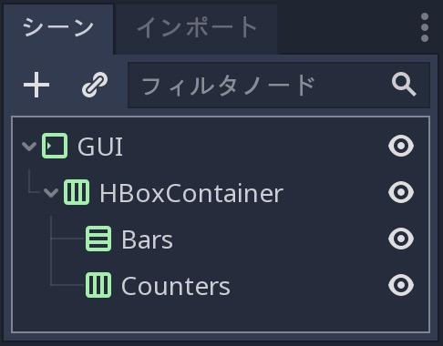

   今回の作業の完成品

.. note::

   この方法で作業できるのは、最初にUIデザインを考え、使用するコンテナについて少し時間をかけて考えたためだ。
   このような取り組み方はまどろっこしさを感じるかもしれない。
   しかし、実際のゲーム開発に携わった場合、それが効率的な作業手順であることが実感できるだろう。
   いかに、経験より勉強が大事かを自覚すべきだが、既にここの説明を見ている時点で勉強しているのだから経験重視している生き物を犬畜生として見ていることだろう(実に素晴らしい価値観だ)。

.. 英語の原文：GUIの基盤部分の作成
   Create the base GUI
   -------------------

   There are two possible approaches to the GUI: we can design elements in
   separate scenes and put them together, or prototype everything in a
   single scene and break it down later. I recommend working with a single
   scene as you can play with your UI's placement and proportions faster
   this way. Once it looks good, you can save entire sections of the node
   tree as reusable sub-scenes. We'll do that in a moment.

   For now, let's start with a few containers.

   Create a new scene and add a ``MarginContainer``. Select the node and name it
   ``GUI``.

   We want our interface to anchor to the top of the screen. Select the ``GUI``
   node and click the Layout button at the top of the viewport. Select the ``Top
   Wide`` option. The ``GUI`` node will anchor to the top edge of its parent, the
   viewport by default. It will resize automatically on the vertical axis to make
   space for its child UI components.

   Save the scene as ``GUI.tscn``. We will put the entire GUI in it.

   With the ``MarginContainer`` selected, head to the inspector and scroll
   down to the custom constants section. Unfold it and click the field next
   to each of the ``Margin`` properties. Set them all to ``20`` pixels.
   Next, add an ``HBoxContainer`` node. This one will contain our two bars
   on the left and separate them from the two counters on the right.

   We want to stack the bars vertically inside the ``HBoxContainer``.
   Add a ``VBoxContainer`` as a child of ``HBoxContainer`` and name it ``Bars``. Select the parent
   ``HBoxContainer`` again and this time, add another ``HBoxContainer`` as a child of it.
   Call it ``Counters``. With these four containers, we have the base for our GUI scene.

   .. figure:: ./img/ui_gui_containers_structure_in_godot.png

      You should have 4 containers that look like this

   .. note::

       We can work this way because we first broke down our UI design
       and took a few moments to think about the containers we'd use. When you
       follow a tutorial like this, it may seem weird. But once you're working
       on real games, you'll see it's an efficient workflow.

バー基盤の作成
~~~~~~~~~~~~~~~~~~~~~~~~~~~~

各バーは、水平に並ぶ2つのサブ要素に分割できる。
左側のライフカウントのラベルと右側のゲージがそうだ。
繰り返しの説明になるが、 ``HBoxContainer`` は素敵な仕事をしてくれる道具(ノード)だ。
``Bars`` ノードを選択し、その中に新規の ``HBoxContainer`` を追加し、 ``Bar`` と言う名前を付ける。

ラベル自体には、少なくとも3つのノードが必要になる。
背景に ``NinePatchRect`` があり、その上(上位レイヤを想像すること)の左側に ``HP(ライフバー)`` または ``EP(エネルギーバー)`` のいずれかのテクスチャ(固定文字用)を追加し、その右側に ``Label`` (流動文字用)を配置する。
必要に応じて ``Control`` ノードをネストする。
``NinePatchRect`` を他の2種類のノードを包含する親として使用する。
通常は、コンテナの役割はUIコンポーネントの整理に役立つため、代わりにコンテナを使用する必要がある(訳者：何の代わり？)。
とにかく、ライフカウンタとゲージの間にスペースを追加するために、後で ``MarginContainer`` が必要になる。
要約Godotを操作する。
まず、 ``Bar`` を選択し、 ``MarginContainer`` を追加し、 ``Count`` と言う名前を付ける。
その配下に、3つのノードを追加するが、気をつける点は、常に ``Count`` ノードを最初に選択してから作業すること。

1. ``NinePatchRect`` ノード：名前 ``Background``
2. ``TextureRect`` ノード：名前 ``Title``
3. ``Label`` ノード：名前 ``Number``

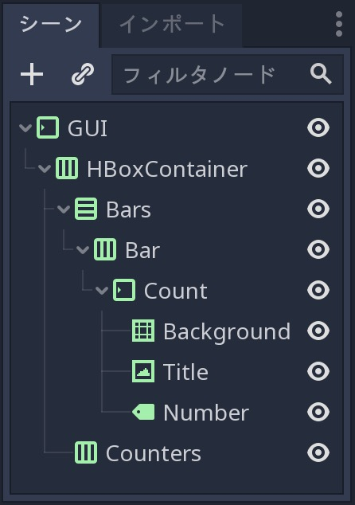

   シーンツリーの完成形。そして、いくつかのテクスチャを投入する準備が整った。

今のところ空のシーンのまま(ノードを追加しただけ)だ。
いくつかのテクスチャを投入する時期がきた。
テクスチャを読み込むには、ファイルシステムドックを開き、
res://assets/GUI
を参照する。

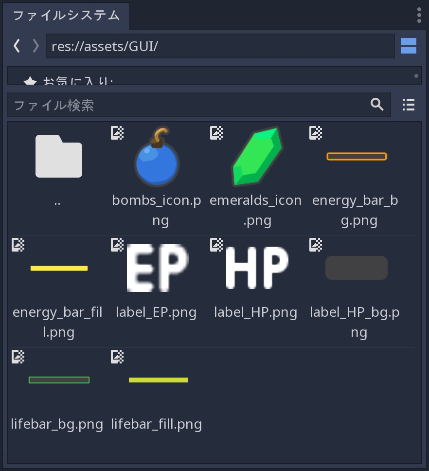

   インタフェイスのスキンに使用するテクスチャの一覧が表示される。

シーンドックから ``Background`` を選択する。
インスペクタドックに、 ``Texture`` プロパティが表示される。
ファイルシステムドックから ``label_HP_bg.png`` をクリックし、 ``Texture`` スロットにドラッグする。

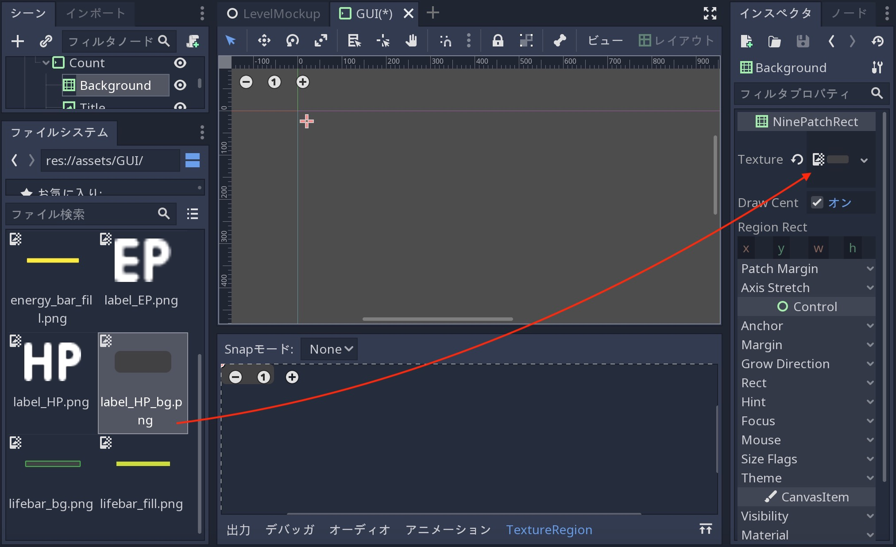

   マウス操作で完結する

親のGUI(MarginContainer)ノードは、コンテナ内の要素に最小サイズを指定するまで、そのサイズを0に強制する。
``Background`` ノードを選択する。
インスペクタドックからRectセクションを開き、 ``Min Size`` を (100, 40) に設定する。
親コンテナとともに、 ``Background`` の大きさが変更される。

次に、 ``Title`` を選択し、 ``label_HP.png`` を ``Texture`` スロットにドラッグ&ドロップする。
``Number`` ノードを選択し、 ``Text`` プロパティのフィールドをクリックし、 ``10`` を入力する。
ビューポートで両方のノード変更が目視確認できる。
それらは、親の ``MarginContainer`` の左上隅に寄せられている。

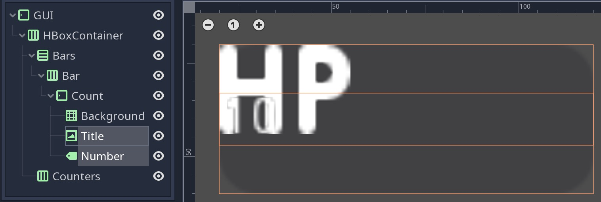

   両方のノードを選択したときの画像

親がコンテナを直接管理しているため、子は自由に移動できない。
``Count`` ノードは常にアンカー・サイズ・位置をリセットする。
ビューポート内のノードを移動及びサイズ変更すれば判明する(訳者：何もできないってこと？)。
次に、3つのテクスチャのいずれかを選択し、Ctrlキーを押したままシーンドックでそれらの順序を変更する。
変更前のサイズと位置に戻る(訳者：戻らなかったが？)。

親コンテナは、直接の子のサイズ・スケール・マージン・アンカーを制御する。
ノードを変更するには、通常のコントロールまたは別のUI要素内にノードをネストする必要がある。
``Background`` を ``Title`` と ``Number`` の親とする。
``Title`` と ``Number`` の両方を選択し、 ``Background`` にドラッグ&ドロップする。

.. figure:: ./img/ui_gui_step_tutorial_bar_nesting_inside_background.png

   Backgroundノードを2つのテクスチャの親として使用することにより、Count(MarginContainer)ノードから制御を奪う。

``Title`` を選択し、インスペクタドックの ``Stretch Mode`` プロパティから ``Keep Centered`` に変更する。
次に、インスペクタから ``Rect`` カテゴリを開き、 ``Size`` プロパティを(50, 40)に変更して、背景の左半分に寄らせる。
次に、 ``Number`` ノードを選択する。ビューポートで、 ``Layout`` メニューをクリックし、 ``Full Rect`` を選ぶ。
ノードは、 ``Background`` に合わせてサイズ変更される。
インスペクタドックに移動し、 ``Align`` プロパティを ``Right`` に変更し、 ``Valign`` プロパティを ``Center`` に変更する。
テキストは、 ``Background`` の右端の中央に移動(スナップ)することだろう。
ノードを水平方向にサイズ変更し、 ``Background`` の右半分を取り、右端に少しパディングを追加した形が完成形だ。

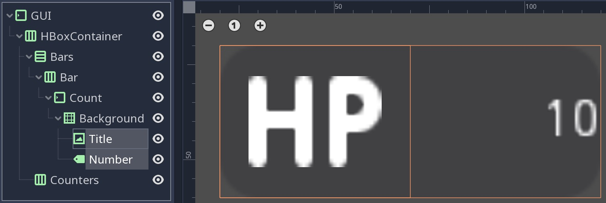

   ノードのバウンディングボックスがビューポートでどのように見えるかを示している。
   大まかな配置で問題ない。現段階では正確性を求めていない。

.. 英語の原文：バー基盤の作成
   Create the bars' base
   ~~~~~~~~~~~~~~~~~~~~~

   Each bar is split into two sub-elements that align horizontally: the
   label with the health count on the left, and the gauge on the right.
   Once again, the ``HBoxContainer`` is the perfect tool for the job.
   Select the ``Bars`` node and add a new ``HBoxContainer`` inside of it.
   Name it ``Bar``.

   The label itself requires at least three nodes: a ``NinePatchRect``
   for the background, on top of which we'll add a texture on the left,
   either ``HP`` or ``EP``, and a ``Label`` on the right for the value. We
   can nest ``Control`` nodes however we want. We could use the
   ``NinePatchRect`` as a parent for the two other elements, as it
   encompasses them. In general, you want to use containers instead, as
   their role is to help organize UI components. We'll need a
   ``MarginContainer`` later anyway to add some space between the life
   count and the gauge. Select the ``Bar`` and add a ``MarginContainer``.
   Name it ``Count``. Inside of it, add three nodes:

   1. A ``NinePatchRect`` named ``Background``
   2. A ``TextureRect`` named ``Title``
   3. And a ``Label`` named ``Number``

   To add the nodes as siblings, always select the ``Count`` node first.

   .. figure:: ./img/ui_gui_step_tutorial_bar_template_1.png

      Your scene tree should look like this. We're ready to throw in some
      textures

   Our scene is still empty. It's time to throw in some textures. To load
   the textures, head to the FileSystem dock to the left of the viewport.
   Browse down to the res://assets/GUI folder.

   .. figure:: ./img/ui_gui_step_tutorial_textures_in_FileSystem_tab.png

      You should see a list of textures that we'll use to skin our
      interface.

   Select the ``Background`` in the Scene dock. In the Inspector, you
   should see a ``Texture`` property. In the FileSystem tab, click and drag
   ``label_HP_bg.png`` onto the ``Texture`` slot. It stays squashed. The
   parent MarginContainer will force its size down to 0 until we force
   elements inside the container to have a minimum size. Select the
   ``Background`` node. In the Inspector, scroll down to the Rect section.
   Set ``Min Size`` to (100, 40). You should see the ``Background`` resize
   along with its parent containers.

   Next, select the ``Title`` and drag and drop ``label_HP.png`` into its
   ``Texture`` slot. Select the ``Number`` node, click the field next to
   the ``Text`` property and type ``10``. This way, we can see both nodes
   in the viewport. They should stack up in the top-left corner of their
   parent ``MarginContainer``.

   .. figure:: ./img/ui_gui_step_tutorial_bar_label_stacked.png

      If you select both nodes, you should see something like this

   As they have a container as their direct parent, we cannot move them
   freely: the ``Count`` node will always reset their anchors, their size
   and position. Try to move and resize the nodes in the viewport. Then,
   select any of the three textures and press Ctrl Up or Ctrl Down to
   reorder them in the Scene dock. They'll snap back to their previous size
   and position.

   Parent containers control the size, the scale, the margins, and the
   anchors of their direct children. To modify the nodes, you must nest
   them inside a regular Control or another UI element. We'll use the
   ``Background`` as a parent for the ``Title`` and ``Number``. Select both
   the ``Title`` and ``Number``, and drag and drop them onto
   ``Background``.

   .. figure:: ./img/ui_gui_step_tutorial_bar_nesting_inside_background.png

      By using the Background node as the two textures' parent, we take
      control away from the Count MarginContainer

   Select the ``Title`` and in the Inspector, change its ``Stretch Mode`` property
   to ``Keep Centered``. Next find the ``Rect`` category in the Inspector and
   change the ``Size`` property to (50, 40) so it only takes the left half of
   the background.  Next, select the ``Number`` node. In the viewport, click the
   ``Layout`` menu and click ``Full Rect``. The node will resize to fit
   the ``Background``. Head to the Inspector and change its ``Align``
   property to ``Right``, and the ``VAlign`` property to ``Center``. The
   text should snap to the center of the ``Background``'s right edge.
   Resize the node horizontally, so it takes the right half of the
   ``Background`` and there's a bit of padding with the right edge.

   .. figure:: ./img/ui_gui_step_tutorial_bar_placed_title_and_label.png

      Here's how the nodes' bounding boxes should look in the viewport.
      Keep it rough, you don't need to place them too precisely for now.

ラベルのフォント置換
~~~~~~~~~~~~~~~~~~~~~~~~~~~~~~~~~~~~~~~~

ラベルのフォントが小さい。
そのため、見やすい大きさに変更する。
``Number`` ノードを選択し、インスペクタドックから ``Control`` クラスの ``Custom Font`` カテゴリにある、 ``Font`` プロパティのフィールドに、 ``新規 Dynamic Font`` を選択する。
もう一度そのフィールドをクリックし、編集をクリックする。

``Dynamic Font`` リソースを入力する。
``Font`` カテゴリを開き、 ``Font Data`` フィールドをクリックし、 ``読込み`` ボタンをクリックする。
ファイルブラウザで assets/font フォルダに移動し、 ``Comfortaa-Bold.ttf`` をダブルクリックして開く。
ビューポートにフォント更新されて表示されるだろう。
そこからフォントサイズを変更するには、Settingsを開き、 ``Size`` プロパティに ``24`` や ``28`` などの大きい値を設定する。

ここで、HPテクスチャに備えるために、テキストのベースライン(数字の下端)が必要になる(テキストの下部パディングを追加)。
これを行うには、 ``DynamicFont`` リソースで、 ``Extra Spacing`` カテゴリ配下の ``Bottom`` プロパティを調整作業に取りかかる。
テキストにいくつかの下部パディングを追加する。
シーンドックの ``Number`` ノードをクリックし、インスペクタドックのLabelクラスに戻り、 ``Valign`` を ``Bottom`` に変更する。
テキストのベースラインを調整するには、 ``Custom Font`` カテゴリの下のフォントフィールドをもう一度クリックし開き、テキストの下部を ``Title`` ノードの下部に揃うまで ``Extra Spacing ⇒ Bottom`` プロパティを調整する。
``2`` ピクセルの値を使用する。

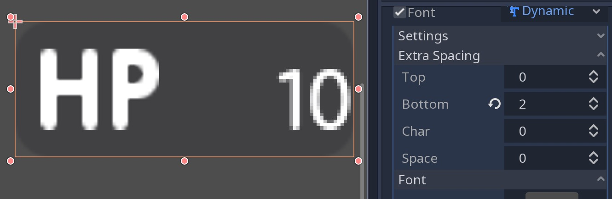

   下部の値が2ピクセルの場合、タイトル下部と一致する。

これで、GUIの最も難しい部分が完成した。
祝杯でも挙げよう。
あとは、単純なノードを手がけるだけだ。

訳者：完成したと思っているのだが、原画と私の完成画が異なるのは気になるところだ。

.. 英語の原文：ラベルのフォント置換
   Replace the Label's font
   ~~~~~~~~~~~~~~~~~~~~~~~~

   The label's font is too small. We need to replace it. Select the
   ``Number`` node and in the Inspector, scroll down to the ``Control``
   class, and find the ``Custom Font`` category. Click the field next to
   the ``Font`` property and click on ``New Dynamic Font``. Click on the
   field again and select Edit.

   You will enter the ``Dynamic Font`` resource. Unfold the ``Font``
   category and click the field next to ``Font Data``. Click the ``Load``
   button. In the file browser, navigate down to the assets/font folder and
   double click ``Comfortaa-Bold.ttf`` to open it. You should see the font
   update in the viewport. Unfold the settings category to change the font
   size. Set the ``Size`` property to a higher value, like ``24`` or
   ``28``.

   We now need the text's baseline, the number's lower edge, to align with
   the HP texture on the left. To do so, still in the ``DynamicFont``
   resource, you can tweak the ``Bottom`` property under the
   ``Extra Spacing`` category. It adds some bottom padding to the text.
   Click the ``Number`` node in the Scene tab to go back to the node's
   properties and change the ``VAlign`` to ``Bottom``. To adjust the text's
   baseline, click on the font field under the ``Custom Font`` category
   again and tweak the ``Bottom`` property until the text aligns with the
   ``Title`` node. I used a value of ``2`` pixels.

   .. figure:: ./img/ui_gui_step_tutorial_number_baseline.png

      With a Bottom value of 2 pixels, the Number aligns with the Title

   With this, we finished the hardest part of the GUI.
   Congratulations! Let's move on to the simpler nodes.

進行状況バーの追加
~~~~~~~~~~~~~~~~~~~~~~~~~~~~~~~~~~~~~~~~

ライフバーには、ラベル(上記で作成済み)とゲージそのものの要素が必要になる。
Godotには、必要な物が揃った ``TextureProgress`` ノードが付属している。

Barノードを選択し、その中に ``TextureProgress`` を追加し、 ``Gauge`` と言う名前を付ける。
インスペクタドックから ``Textures`` セクションを開く。
ファイルシステムドックから ``lifebar_bg.png`` テクスチャを ``Under`` スロットにドラッグ&ドロップする。
``lifebar_fill.png`` 画像で同じ作業として、 ``Progress`` スロットにドラッグ&ドロップする。
インスペクタドックから ``Range`` クラス配下の ``Value`` プロパティを ``50`` に変更し、ゲージがたまるのを確認する。

5つの ``Control`` ノードの、最初のバーを使用する準備ができた。

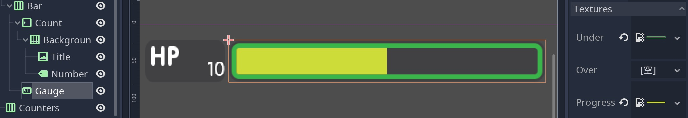

   これで、ライフバーの準備が整った。この最後の部分は短時間で完了した。
   これは、堅牢なコンテナ設定のおかげだ。

.. 英語の原文：進行状況バーの追加
   Add the progress bar
   ~~~~~~~~~~~~~~~~~~~~

   We need one last element to complete our life bar: the gauge itself.
   Godot ships with a ``TextureProgress`` node that has everything we need.

   Select the Bar node and add a ``TextureProgress`` inside of it. Name it
   ``Gauge``. In the inspector unfold the ``Textures`` section. Head to the
   FileSystem dock and drag and drop the ``lifebar_bg.png`` texture onto
   the ``Under`` slot. Do the same with the ``lifebar_fill.png`` image and
   drop it onto the ``Progress`` slot. Under the ``Range`` class in the
   inspector, change the ``Value`` property to ``50`` to see the gauge fill
   up.

   With only five ``Control`` nodes, our first bar is ready to use.

   .. figure:: ./img/ui_gui_step_tutorial_bar_final.png

      That's it, our life bar is ready. This last part was quick, wasn't
      it? That's thanks to our robust container setup.

爆弾とエメラルドカウンタの設計
------------------------------------------------------------

爆弾とエメラレルドのカウンタは、バーの ``Count`` ノードのようなもの。
そのため、これをテンプレートとして使用する。

``Bar`` ノード配下の ``Count`` を選択し、 Ctrl-D(Windows)押下で複製する(配下のノードごとコピーされ、 ``Count2`` と言う名前のノードが作られる)。
大分前に作成した ``Counters(HBoxContainer)`` の下に、新規ノードをドラッグ&ドロップする。
自動的にサイズ変更される。しかし、後から適切な大きさに変更するため、今はこのまま放置する。

``Count2`` ノード名を ``Counter`` にする。
ライフバー(Barノード)での配置を逆にするため、番号を左側にし、テクスチャを右側に配置する(訳者：どのように入れ替える？対応方法が分からないので未対応)。
設定内容は同じまま。
背景( ``NinePatchRect`` )・Title・Numberノードが必要になる。
``Title`` ノードは、 ``TextureRect`` であるため、テクスチャを表示するために必要なノードの種類になる。
シーンドックから ``Title`` ノードを選択し、 ``Icon`` に名称変更する。

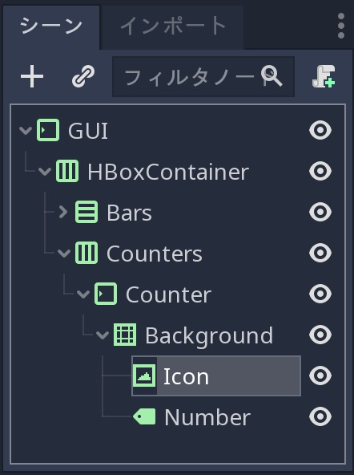

   今回のノードツリーの完成形(過去の作成ノード部分は閉じている)

``Icon`` ノードを選択した状態で、インスペクタドックの上方にある ``Texture`` スロットを確認した場合、コピーした状態の物がそのまま残っているのが分かるだろう。
今回それを変更するため、左側のファイルシステムドックから ``bombs_icon.png`` を選択し、 ``Texture`` にドラッグ&ドロップする(前のテクスチャを消す必要はない。上書きされる)。
シーンドックから ``Icon`` ノードと ``Number`` ノードの両方を選択する。
ビューポートの上部にあるツールバーのLayoutメニューをクリックし、 ``Full Rect`` を選択する。
両方のノードは、 ``Background`` の大きさに調整される。

.. figure:: ./img/ui_gui_step_tutorial_counter_design_2.png

   原画：ノードは背景全体に固定されるが、位置は変わらない。

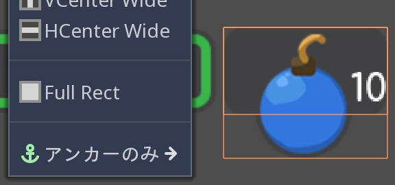

   訳者作：ノードは背景全体に固定されるが、位置は変わらない。何より、テキストとテクスチャの位置も変わらないと言うより、変えられない。

``Number`` のAlignプロパティを変更し、それを ``Background`` の左と中央に移動する作業に取りかかる。
``Number`` ノードを選択し、 ``Align`` プロパティをleftに、 ``Valign`` プロパティをcentreに変更する。
次に、左端を少しサイズ変更するため、 ``Background`` の左端をテキストの間にパディングを追加する(訳者：どうするのか分からないため、未対応)。

.. figure:: ./img/ui_gui_step_tutorial_counter_design_3.png

   原画：左と中央に揃えられたNumberノード

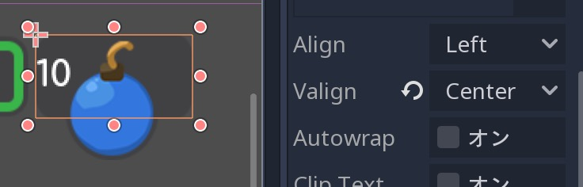

   訳者作：左と中央に揃えられたNumberノード(なぜに枠の大きさが違う？)

アイコンと背景をオーバーラップ(重ねて表示)するには、いくつか調整が必要になる。
まず、背景が少し高いことがあげられる。
これは、最上位のGUIノードによって制御されるマージンコンテナ内にあるのが原因だ。
シーンツリーの上部にあるGUIノードを選択し、できる限り薄くなるように垂直方向に縮小する。
ゲージが極端に小さくなることを防ぐ目的もある。
そのため、コンテナは、その子の最小サイズより小さくすることはできない。
コンテナのマージンも重くなる。

訳者：何の話をしているのか分からない。

Iconノードを選択し、レイアウトメニューをクリックし、 ``Full Rect`` を選択する(再配置が実施される)。
``Background`` の右端に固定するために必要な措置だ。
レイアウトメニューを再度開き、 ``Center Right`` を選択する。
Iconを上に移動し、 ``Background`` で垂直方向の中央に配置する。
（訳者：何のために1度、Full〜を選んだ？）

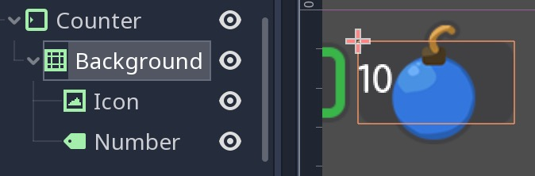

   爆弾アイコンは、背景の右端に固定される。
   カウンタコンテナのサイズを変更し、Iconノードが右側に固定されるようにする。

Barノードの ``Count`` から ``Counter`` を複製したため、 ``Number`` ノードのフォントはオフになっている(訳者：なっていないが？)。
再度 ``Number`` ノードを選択(訳者：Counterノード配下の？)し、 ``Font`` プロパティに移動し、 ``DynamicFont`` リソースをクリックして展開する。
``Extra Spacing`` セクションで、 ``Bottom`` 値を ``0`` に変更し、フォントのベースラインをリセットする。
カウンタは正常に機能し始める。

ビューポートの右端に ``Counters`` アンカーを作成する。
そのためには、 ``Bars`` コンテナに、使用可能なすべての水平スペースを設定する必要がある。
``Bars`` ノードを選択し、 ``Size Flags`` カテゴリの ``Horizontal`` カテゴリから ``Expand`` 値のOnを確認する。
``Bars`` ノードのサイズを変更し、カウンタを画面の右側に追いやる必要がある。

.. figure:: ./img/ui_gui_step_tutorial_counter_design_5.png

   拡大するコンテナは、親から可能なスペースをすべて消費し、他のすべてを途中まで推し進める。

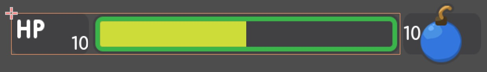

   訳者作成画像：結果が異なっている。

訳者：一通りの作業を終えたが、成功している実感が全く沸かない。

.. 英語の原文：爆弾とエメラルドカウンタの設計
   Design the bomb and emerald counters
   ------------------------------------

   The bomb and emerald counters are like the bar's ``Count`` node. So we'll
   duplicate it and use it as a template.

   Under the ``Bar`` node, select ``Count`` and press Ctrl D to duplicate
   it. Drag and drop the new node under the ``Counters`` ``HBoxContainer``
   at the bottom of the scene tree. You should see it resize automatically.
   Don't worry about this for now, we'll fix the size soon.

   Rename the ``Count2`` node to ``Counter``. Unlike the bars, we want the
   number to be on the left, and an icon to sit on the right. The setup is
   the same: we need a background (a ``NinePatchRect``), the title, and the
   number nodes. The ``Title`` node is a ``TextureRect``, so it's what we
   need to display the icon. In the scene tree, select the ``Title`` node,
   and rename it to ``Icon``.

   .. figure:: ./img/ui_gui_step_tutorial_counter_design_1.png

      Here's how your node tree should look so far

   With the ``Icon`` node selected, in the inspector, scroll to the top to
   see the ``Texture`` slot. Head to the FileSystem dock on the left and
   select the ``bombs_icon.png``. Drag and drop it onto the ``Texture``
   slot. In the Scene Tab select both the ``Icon`` and the ``Number``
   nodes. Click the Layout menu in the toolbar at the top of the viewport
   and select ``Full Rect``. Both nodes will update to fit
   the size of the ``Background``.

   .. figure:: ./img/ui_gui_step_tutorial_counter_design_2.png

      The nodes anchor to the entire Background, but their position is off

   Let's change the ``Number``'s align properties to move it to the left
   and center of the ``Background``. Select the ``Number`` node, change its
   ``Align`` property to left and the ``VAlign`` property to centre. Then
   resize its left edge a little bit to add some padding between the left
   edge of the ``Background`` and the text.

   .. figure:: ./img/ui_gui_step_tutorial_counter_design_3.png

      The Number node aligned to the left and centre

   To overlap the Icon and the background, we need a few tweaks. First, our
   background is a bit too tall. It's because it's inside a margin
   container that is controlled by the top-most GUI node. Select the GUI
   node at the top of the scene tree and downsize it vertically so that
   it's as thin as possible. You'll see the gauge prevents you from making
   it too small. A container cannot be smaller than the minimal size of its
   children. The container's margins also weigh in.

   Select the Icon, click the Layout menu, and select
   ``Full Rect`` to re-center it. We need it to anchor to
   the ``Background``'s right edge. Open the Layout menu again and select
   ``Center Right``. Move the icon up so it is centered vertically with the
   ``Background``.

   .. figure:: ./img/ui_gui_step_tutorial_counter_design_4.png

      The bomb icon anchors to the Background's right edge. Resize the
      Counter container to see the Icon node stick to its right side

   Because we duplicated the ``Counter`` from the bar's ``Count``, the
   ``Number`` node's font is off. Select the ``Number`` node again, head to
   the ``Font`` property, and click it to access the ``DynamicFont``
   resource. In the ``Extra Spacing`` section, change the ``Bottom`` value
   to ``0`` to reset the font's baseline. Our counter now works as
   expected.

   Let's make the ``Counters`` anchor to the right edge of the viewport. To do so,
   we need to set the ``Bars`` container take all the available horizontal space it
   can. Select the ``Bars`` node and scroll down to the ``Size Flags`` category. In
   the ``Horizontal`` category, check the ``Expand`` value. The ``Bars`` node
   should resize and push the counter to the right side of the screen.

   .. figure:: ./img/ui_gui_step_tutorial_counter_design_5.png

      An expanding container eats all the space it can from its parent,
      pushing everything else along the way

バーとカウンタを再利用可能なUIコンポーネントに変える
--------------------------------------------------------------------------------------------------------

1つのバーと1つのカウンタウィジェットがある(訳者：急に新しい言葉が出てきたぞ!!)。
そして、それぞれ2つずつ必要とする。
後からバーのデザインまたは機能を変更する。
UI要素のテンプレートを保存する単一のシーンとバリエーションで動作する子シーンがあると便利だろう。
Godotでは、シーンを継承して、それを実現できる。

.. todo::

   以下の日本語がおかしい。もう一度翻訳し直す。
   その理由は、存在しないノードがあり、その中からBarノードを選択する指示を出している。

``Counter`` ブランチと ``Bar`` ブランチの両方を別々のシーンとして保存し、 ``LifeBar`` ・ ``EnergyBar`` ・ ``BombCounter`` ・ ``EmeraldCounter`` の中から ``Bar(HBoxContainer)`` を選択する。
それを右クリックし、 ``ブランチをシーンとして保存`` をクリックする。
シーンを ``Bar.tscn`` として保存する。
ノードブランチが単一の ``Bar`` ノードに代わるのが確認できる。

.. tip::

   シーンはノードのツリーになる。
   最上位のノードはツリーの **root** であり、階層の最下部の子は **leaves** と言う。
   ルート以外のノードと1つ以上の子は、 **branch** という。
   ノードブランチを個別のシーンにカプセル化するか、他のシーンからアクティブなシーンに読み込み、マージ(統合)できる。
   シーンドックの任意のノードを右クリックし、 ``ブランチをシーンとして保存`` または、 ``シーンからマージ`` を選ぶ。

次に、 ``Counter`` ノードを選択して同じ操作を行う。
``ブランチをシーンとして保存`` を右クリックし、 ``Counter.tscn`` として保存する。
シーンツリーのノードの右側に新しいシーン編集アイコンが表示される。
``Bar`` の隣のシーン編集アイコンをクリックし、対応するシーンを開く。
境界(bounding )ボックス(訳者：どれ？)がコンテンツに合うように ``Bar`` ノードの大きさを変更する。
コントロールノードに名前を付けて配置した方法で、このテンプレートを継承してライフバーを作成する準備が完了した。
``Counter`` についても同様にする。

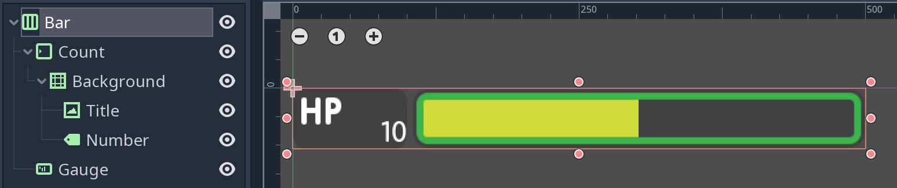

   追加の変更なしで、バーを使用する準備ができた。

.. 英語の原文：バーとカウンタを再利用可能なUIコンポーネントに変える
   Turn the bar and counter into reusable UI components
   ----------------------------------------------------

   We have one bar and one counter widget. But we need two of each. We may
   need to change the bars' design or their functionality later on. It'd be
   great if we could have a single scene to store a UI element's template,
   and child scenes to work on variations. Godot lets us do this with
   Inherited Scenes.

   Let's save both the ``Counter`` and the ``Bar`` branches as separate
   scenes that we'll reduce to create the ``LifeBar``, the ``EnergyBar``,
   the ``BombCounter``, and the ``EmeraldCounter``. Select the ``Bar``
   HBoxContainer. Right click on it and click on ``Save Branch as Scene``.
   Save the scene as ``Bar.tscn``. You should see the node branch turn it
   to a single ``Bar`` node.

   .. tip::

       A scene is a tree of nodes. The topmost node is the tree's
       **root**, and the children at the bottom of the hierarchy are
       **leaves**. Any node other than the root along with one or more children is
       a **branch**. We can encapsulate node branches into separate scenes, or
       load and merge them from other scenes into the active one. Right click
       on any node in the Scene dock and select ``Save Branch as Scene`` or
       ``Merge from Scene``.

   Then, select the ``Counter`` node and do the same. Right click,
   ``Save Branch as Scene``, and save it as ``Counter.tscn``. A new edit
   scene icon appears to the right of the nodes in the scene tree. Click on
   the one next to ``Bar`` to open the corresponding scene. Resize the
   ``Bar`` node so that its bounding box fits its content. The way we named
   and placed the Control nodes, we're ready to inherit this template and
   create the life bar. It's the same for the ``Counter``.

   .. figure:: ./img/ui_gui_step_tutorial_bar_template_scene.png

      With no extra changes, our Bar is ready to use

シーンの継承を使用して残りの要素を作成する
------------------------------------------------------------------------------------

同じように機能する2つのバーが必要だ。
左側にある値のラベルと右側に水平ゲージがある。
唯一の違いは、一方がHPラベルで緑色に対し、もう一方はEP(エネルギーバー？)で緑色であると言うこと。
Godotは、ゲーム内のすべてのバーを再利用するための共通ベースを作成する強力なツールを提供する。
それが **inherited scenes** だ。

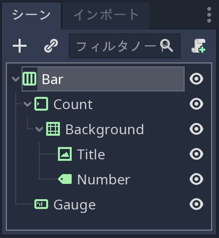

   継承されたシーンは、GUIシーンをすっきりさせるのに役立つ。
   最終的に、コンテナと各UIコンポーネントに対して1つのノードのみが存在する。

継承されたシーンでは、名前の他に、インスペクタドックのすべてのノードのプロパティを変更できる。
親シーンを変更して保存したとき、継承されたすべてのシーンが更新され、変更が反映される。
継承されたシーンの値を変更したときは、常に親のプロパティがオーバーライドされる。
同じ要素のバリエションを必要とすることが多いため、UIに役立つ。
一般的に、UIデザインでは、ボタン・パネルなどは共通の基本スタイルと相互作用を共有する。
手動ですべてのバリエーションにコピーする必要は無い。

上書きするプロパティの横にリロードアイコンが表示される。
クリック後、値を親シーンのデフォルトにリセットする。

.. note::

   ノードツリーまたはGDScriptの ``extends`` キーワードのようなシーンの継承を考えよう。
   継承されたシーンは、その親と同じようにすべてを行えるが、それだけでなくプロパティやリソースをオーバーライドし、追加のノードとスクリプトを追加して機能を拡張できる。

.. todo::

   原画：
   原画に間違いがある。
   変更前のノード名が記載され、変更後のノードを記載している。
   かなり、混乱する。

.. 英語の原文：シーンの継承を使用して残りの要素を作成する
   Use scene inheritance to create the remaining elements
   ------------------------------------------------------

   We need two bars that work the same way: they should feature a label on
   the left, with some value, and a horizontal gauge on the right. The only
   difference is that one has the HP label and is green, while the other is
   called EP and is yellow. Godot gives us a powerful tool to create a
   common base to reuse for all bars in the game: **inherited scenes**.

   .. figure:: img/gui_step_tutorial_gui_scene_hierarchy.png

      Inherited scenes help us keep the GUI scene clean. In the end, we
      will only have containers and one node for each UI component.

   On an inherited scene, you can change any property of every node in the
   inspector, aside from its name. If you modify and save the parent scene,
   all the inherited scenes update to reflect the changes. If you change a
   value in the inherited scene, it will always override the parent's
   property. It's useful for UIs, as they often require variations of the same
   elements. In general, in UI design, buttons, panels etc. share a common
   base style and interactions. We don't want to copy it over to all
   variations manually.

   A reload icon will appear next to the properties you override. Click it
   to reset the value to the parent scene's default.

   .. note::

       Think of scene inheritance like the node tree, or the
       ``extends`` keyword in GDScript. An inherited scene does everything like
       its parent, but you can override properties, resources and add extra
       nodes and scripts to extend its functionality.

ライフバーの構築のためにバーシーンを継承する
~~~~~~~~~~~~~~~~~~~~~~~~~~~~~~~~~~~~~~~~~~~~~~~~~~~~~~~~~~~~~~~~~~~~~~~~~~~~~~~~~~~~~~~~~~~~

今回は、 ``シーン ⇒ 新しい継承したシーン...`` に移動し、 ``Bar`` シーンから新しいシーン(継承ノード)を作成する作業だ。
Barシーンを選択して開く。
[未保存] タブが表示される。
これは、 ``Bar`` に似ているが、ルートを除くすべてのノードが灰色で表示される。
``Meta+S`` を押下により、継承された新しいシーンを ``LifeBar.tscn`` と言う名前で保存する。

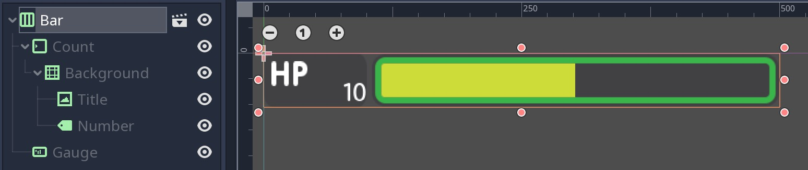

   灰色のノード名を変更することはできない。
   これにより、親シーンが存在していることを実感できる。

そして、ルートまたは最上位ノードの名前を ``LifeBar`` に変更する(訳者：最上位ノードとは？)。
開発者は、常にルートのUIコンポーネント(ノード)を正確に把握できる名付けをする。
名前だけで機能が判断できるようにすべきだ。
そのため、今回の名前は、次に作るノードと区別しやすい名前になっている(次に使う名前は ``EnergyBar`` )。
シーン内の他のノードは、広い用語でコンポーネントの構造を記述する必要があるため、継承されたすべてのシーンで機能する。
``TextureProgress`` および ``Number`` ノードと同様。

.. todo::

   訳者：
   同様？
   何をする？

.. note::

   Webデザインに関わったならば、それはCSSを扱うのと同じ精神でやっていける(訳者：なぜかここに来て精神論)。
   ベースクラスを作成し、修飾子クラスで変種(バリエーション)を追加する。
   基本ボタンクラスからユーザがプロンプトを受け入れたり拒否するための緑ボタンと赤ボタンのバリエーションを揃えている(訳者：プロンプトとは？どうやって使いこなす？色の使い分けは？)。
   新しいクラスには、親要素の名前とそれを変更する方法を説明する追加のキーワードが含まれている(訳者：含まれているから何？)。
   継承されたシーンを作成し、最上位ノードの名前を変更した場合に、同じことが行われる(訳者：何が？同じこととは？名前の変更まで継承される？)。

.. 英語の原文：ライフバーの構築のためにバーシーンを継承する
   Inherit the Bar Scene to build the LifeBar
   ~~~~~~~~~~~~~~~~~~~~~~~~~~~~~~~~~~~~~~~~~~

   Go to ``Scene -> New Inherited Scene`` to create a new type of ``Bar``.
   Select the Bar scene and open it. You should see a new [unsaved] tab,
   that's like your ``Bar``, but with all nodes except the root in grey.
   Press ``Meta+S`` to save the new inherited scene and name it
   ``LifeBar``.

   .. figure:: img/ui_gui_step_tutorial_inherited_scene_parent.png

      You can't rename grey nodes. This tells you they have a parent scene

   First, rename the root or top level node to ``LifeBar``. We always want
   the root to describe exactly what this UI component is. The name
   differentiates this bar from the ``EnergyBar`` we'll create next. The
   other nodes inside the scene should describe the component's structure
   with broad terms, so it works with all inherited scenes. Like our
   ``TextureProgress`` and ``Number`` nodes.

   .. note::

       If you've ever done web design, it's the same spirit as
       working with CSS: you create a base class, and add variations with
       modifier classes. From a base button class, you'll have button-green and
       button-red variations for the user to accept and refuse prompts. The new
       class contains the name of the parent element and an extra keyword to
       explain how it modifies it. When we create an inherited scene and change
       the name of the top level node, we're doing the same thing.

エネルギーバーの設計
~~~~~~~~~~~~~~~~~~~~~~~~~~~~~~

メインの ``Bar`` シーンで ``LifeBar`` シーンを既に設定済みだ。
次に、 ``EnergyBar`` を用意する。

継承された新規シーンを用意し、もう一度 ``Bar.tscn`` シーンを選択して開く。
``Bar`` ルートノードをダブルクリックし、名前を ``EnergyBar`` に変更する。
新規シーンを ``EnergyBar.tscn`` の名前で保存する。
HPテクスチャをEPに置き換え、ゲージのテクスチャを変更する必要がある。

シーンツリーから ``Title`` ノードを選択し、ファイルシステムドックから ``label_EP.png`` ファイルをテクスチャスロットにドラッグ&ドロップする。
``Number`` ノードを選択し、 ``Text`` プロパティを ``14`` などの別の値に変更する。

EPテクスチャはHPのものより小さいことに気づいただろうか。
``Number`` のフォントサイズをより適切に更新する必要がある。
フォントはリソース扱いだ。
このリソースを使用するプロジェクト全体のすべてのノードは、変更するプロパティの影響を受ける。
サイズを ``40`` のような巨大な値に変更し、 ``LifeBar`` または ``Bar`` シーンに切り替える。
テキストサイズが大きくなる。

訳者：以下の原画はHPのままだったぞ？

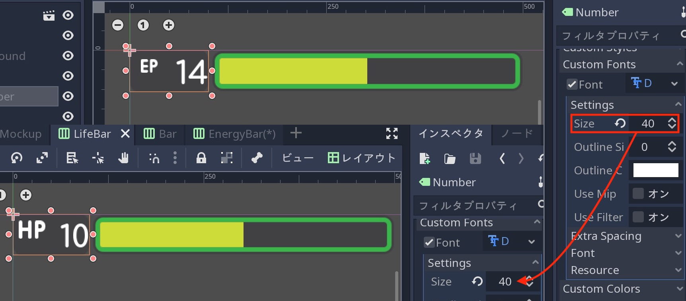

   フォントリソースを変更した場合、それを使用するすべてのノードが影響を受ける(他のノードの大きさも自動変更される)。

このノードでのみフォントサイズを変更するには、フォントリソースの複製を作成する必要がある。
再度 ``Number`` ノードを選択し、インスペクタドックの右上にあるレンチとドライバのアイコンをクリックする。
ドロップダウンメニューから ``ユニークなサブリソースを生成`` オプションを選択する。
Godotは、このノードが使用するすべてのリソースを検索し、独自に複製する。

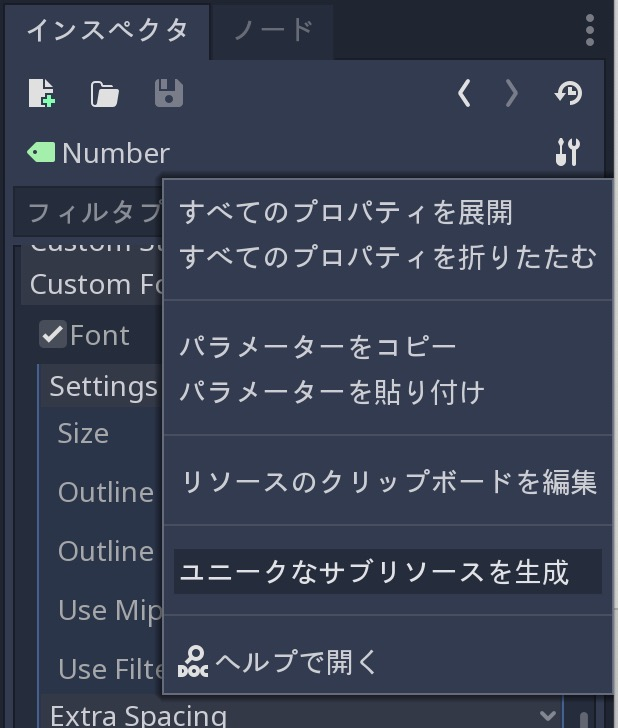

   このオプションを使い、1つのノードのリソースから一意に生成される。

.. tip::

   シーンツリーからノードを ``Meta+D`` で複製したとき、元のノードとリソースを共有することになる。
   ソースノードに影響を与えずにリソースを調整するには、 ``ユニークなサブリソースを生成`` を使用する必要がある。

``Custom Font`` セクションの ``Font`` を開き、 ``Settings ⇒ Size`` を ``20`` や ``22`` などの小さい値に下げる。
サイズ変更が他のシーンに影響していないことを確認後、テキストのベースラインを左側のEPラベルに合わせるために、 ``Bottom`` の間隔値を調整する場合がある。

.. figure:: ./img/ui_gui_step_tutorial_design_EnergyBar_3.png

   HPの同等品よりも小さいフォントのEP Count ウィジェット

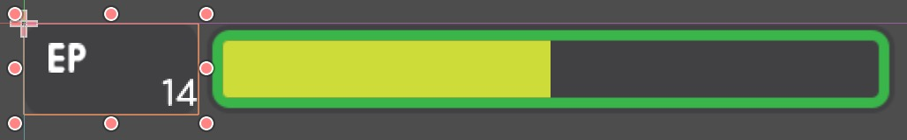

   訳者：原画と大分配置が異なる。どういうこと？

次に、 ``Gauge(TextureProgress)`` ノードを選択する。
``energy_bar_bg.png`` ファイルを ``Under`` スロットにドラッグし、同じ操作として ``Progress`` テクスチャスロットに対して ``energy_bar_fill.png`` をドロップする。

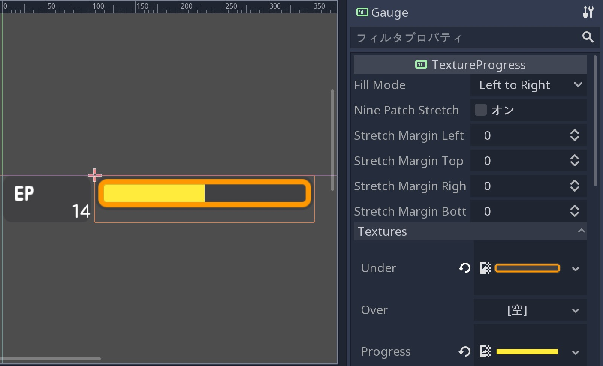

EnergyBarノードがゲージに合うように、ノードのサイズを垂直に変更する。
その大きさがバーの大きさと一致するまで ``Count`` ノードで同じことを実行する。
``Gauge`` の最小サイズは、そのテクスチャに基づいて設定されるため、その下の ``Count`` ノードを縮小することはできない。
これは、 ``Bar`` コンテナが持つ大きさでもある。
当然小さくできる(訳者：結局小さくできるの？できないの？)。

最後に大事なことを付け加える。
``Background`` コンテナの最小サイズは少し大きくなる。
そのコンテナを選択し、 ``Rect`` セクションで ``Min Size`` プロパティを ``80`` ピクセルに変更する(訳者：x軸とy軸しかない状態でどこのピクセルを変える？)。
すぐさま変更が反映され、 ``Title`` および ``Number`` ノードも同様に再配置される。

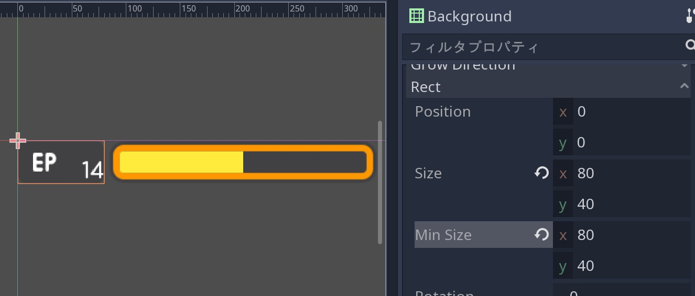

   カウントが小さくなった。

.. tip::

   Countノードのサイズは、Gauge(TextureProgress)の位置に影響する。
   すぐにバーを垂直に揃えるため、カウンタの左マージンを使用し、EPラベルのサイズを変更するのが最適解だろう。
   このように、EnergyBarのCountノードとLifeBarのCountノードは両方とも幅が100ピクセルなので、両方のゲージが完全に整列する。

.. 英語の原文：エネルギーバーの設計
   Design the EnergyBar
   ~~~~~~~~~~~~~~~~~~~~

   We already setup the ``LifeBar``'s design with the main ``Bar`` scene.
   Now we need the ``EnergyBar``.

   Let's create a new inherited scene, and once again select the
   ``Bar.tscn`` scene and open it. Double-click on the ``Bar`` root node and rename it
   to ``EnergyBar``. Save the new scene as ``EnergyBar.tscn``.
   We need to replace the HP texture with EP one, and to
   change the textures on the gauge.

   Head to the FileSystem dock on the left, select the ``Title`` node in
   the Scene tree and drag and drop the ``label_EP.png`` file onto the
   texture slot. Select the ``Number`` node and change the ``Text``
   property to a different value like ``14``.

   You'll notice the EP texture is smaller than the HP one. We should
   update the ``Number``'s font size to better fit it. A font is a
   resource. All the nodes in the entire project that use this resource
   will be affected by any property we change. You can try to change the
   size to a huge value like ``40`` and switch back to the ``LifeBar`` or
   the ``Bar`` scenes. You will see the text increased in size.

   .. figure:: ./img/ui_gui_step_tutorial_design_EnergyBar_1.png

      If we change the font resource, all the nodes that use it are
      affected

   To change the font size on this node only, we must create a copy of the
   font resource. Select the ``Number`` node again and click on the wrench
   and screwdriver icon on the top right of the inspector. In the drop-down
   menu, select the ``Make Sub-Resources Unique`` option. Godot will find
   all the resources this node uses and create unique copies for us.

   .. figure:: ./img/ui_gui_step_tutorial_design_EnergyBar_2.png

      Use this option to create unique copies of the resources for one node

   .. tip::

       When you duplicate a node from the Scene tree, with
       ``Meta+D``, it shares its resources with the original node. You
       need to use ``Make Sub-Resources Unique`` before you can tweak the
       resources without affecting the source node.

   Scroll down to the ``Custom Font`` section and open ``Font``. Lower the
   ``Size`` to a smaller value like ``20`` or ``22``. You may also need to
   adjust the ``Bottom`` spacing value to align the text's baseline with
   the EP label on the left.

   .. figure:: ./img/ui_gui_step_tutorial_design_EnergyBar_3.png

      The EP Count widget, with a smaller font than its HP counterpart

   Now, select the ``TextureProgress`` node. Drag the ``energy_bar_bg.png``
   file onto the ``Under`` slot and do the same for ``energy_bar_fill.png``
   and drop it onto the ``Progress`` texture slot.

   You can resize the node vertically so that its bounding rectangle fits
   the gauge. Do the same with the ``Count`` node until its size aligns
   with that of the bar. Because the minimal size of ``TextureProgress`` is
   set based on its textures, you won't be able to downsize the ``Count``
   node below that. That is also the size the ``Bar`` container will have.
   You may downscale this one as well.

   Last but not least, the ``Background`` container has a minimum size that
   makes it a bit large. Select it and in the ``Rect`` section, change the
   ``Min Size`` property down to ``80`` pixels. It should resize
   automatically and the ``Title`` and ``Number`` nodes should reposition
   as well.

   .. figure:: ./img/ui_gui_step_tutorial_design_EnergyBar_4.png

      The Count looks better now it's a bit smaller

   .. tip::

       The Count node's size affects the position of the
       TextureProgress. As we'll align our bars vertically in a moment, we're
       better off using the Counter's left margin to resize our EP label. This
       way both the EnergyBar's Count and the LifeBar's Count nodes are one
       hundred pixels wide, so both gauges will align perfectly.

爆弾とエメラルドカウンタを準備する
~~~~~~~~~~~~~~~~~~~~~~~~~~~~~~~~~~~~~~~~~~~~~~~~~~~~~~~~~~~~~~~~~~~~

カウンタの作成に取りかかる。
``シーン ⇒ 新しい継承したシーン...`` に移動し、ベースとして ``Counter.tscn`` を選択する。
ルートノードの名前も ``BombCounter`` に変更する。
新規シーンを ``BombCounter.tscn`` として保存する。
今回の準備はこれで完了だ。

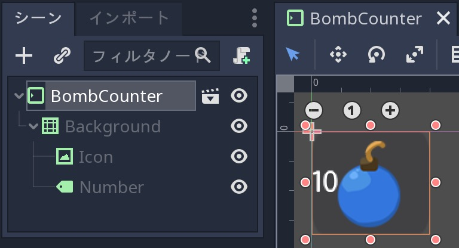

   爆弾カウンタは元のカウンタシーンと同じ

再度 ``シーン ⇒ 新しい継承したシーン...`` に移動し、 ``Counter.tscn`` を選択する。
ルートノードの名前を ``EmeraldCounter`` に変更し、シーンを ``EmeraldCounter.tscn`` として保存する。
次の作業は、主に爆弾アイコンをエメラルドアイコンに置き換える必要がある。
ファイルシステムドックから ``emeralds_icon.png`` を ``Icon`` ノードの ``Texture`` スロットにドラッグする。
``Icon`` は、すでに ``Background`` ノードの右端に固定されているため、その位置を変更は、 ``EmeraldCounter`` コンテナでスケーリング及び再配置される。
エメラルドのアイコンを少しだけ右下に移動する。
キーボードの矢印キーを使用し、その位置を微調整する(訳者：結局どうするの？)。
保存したときに、すべてのUI要素が完成する。

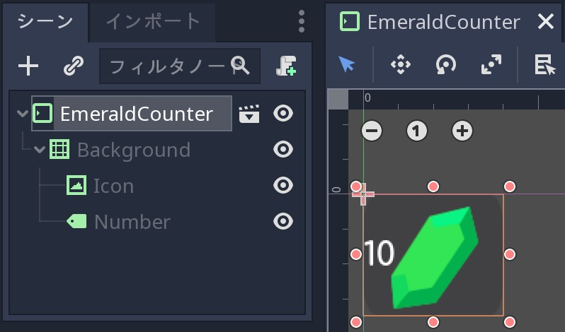

   エメラルドカウンタの完成画

.. 英語の原文：爆弾とエメラルドカウンタを準備する
   Prepare the bomb and emerald counters
   ~~~~~~~~~~~~~~~~~~~~~~~~~~~~~~~~~~~~~

   Let us now take care of the counters. Go to
   ``Scene -> New Inherited Scene`` and select the ``Counter.tscn`` as a
   base. Rename the root node as ``BombCounter`` too.
   Save the new scene as ``BombCounter.tscn``. That's all for this scene.

   .. figure:: ./img/ui_gui_step_tutorial_design_counters_1.png

      The bomb counter is the same as the original Counter scene

   Go to ``Scene -> New Inherited Scene`` again and select ``Counter.tscn``
   once more. Rename the root node ``EmeraldCounter`` and save the scene as ``EmeraldCounter.tscn``.
   For this one, we mainly need to replace the bomb icon
   with the emerald icon. In the FileSystem tab, drag the ``emeralds_icon.png``
   onto the ``Icon`` node's ``Texture`` slot. ``Icon`` already anchors to
   the right edge of the ``Background`` node so we can change its position
   and it will scale and reposition with the ``EmeraldCounter`` container.
   Shift the emerald icon a little bit to the right and down. Use the Arrow
   Keys on the keyboard to nudge its position. Save, and we're done with
   all the UI elements.

   .. figure:: ./img/ui_gui_step_tutorial_design_counters_2.png

      The emerald counter should look something like this

UIコンポーネントを最終GUIに追加する
----------------------------------------------------------------------

メインGUIシーンにすべてのUI要素を追加する。
``GUI.tscn`` シーンを再度開き、 ``Bar`` と ``Counter`` のノードを削除する。
ファイルシステムドックから ``LifeBar.tscn`` を探し、シーンツリーの ``Bars`` コンテナにドラッグ&ドロップする。
``EnergyBar`` についても同じ作業をすること。
それらが垂直に並んでいるのが見えるようになる。

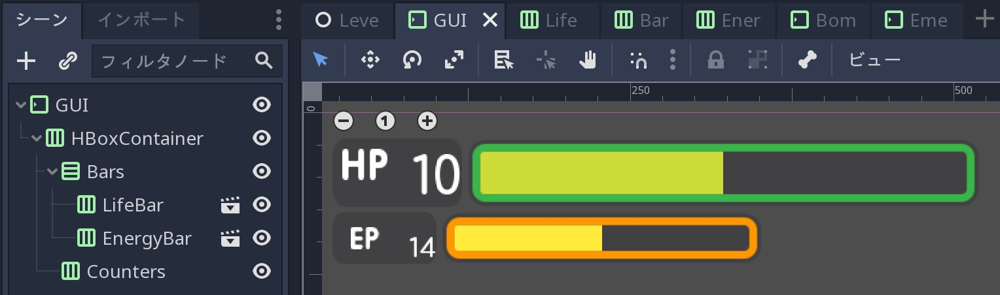

   ライフバーとエネルギーバーは自動整列する

次に、 ``BombCounter.tscn`` および ``EmeraldCounter.tscn`` シーンを ``Counters`` ノードにドラッグ&ドロップする。
自動的に大きさが変更される。

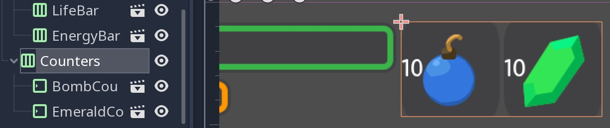

   ノードのサイズを変更し、使用可能なすべての垂直スペースを確保する。

``EmeraldCounter`` と ``BombCounter`` が、 ``Counter.tscn`` で定義した大きさを使用するには、 ``Counters`` コンテナの ``Size Flags`` を変更する必要がある。
``Counters`` ノードを選択し、インスペクタドックの ``Size Flags`` セクションを開く。
``Vertical`` プロパティの ``Fill`` タグのチェックを外し、その代わりに ``Shrink Center`` にチェックを入れる。
コンテナが ``HBoxContainer`` の内側に来ることを確認する。

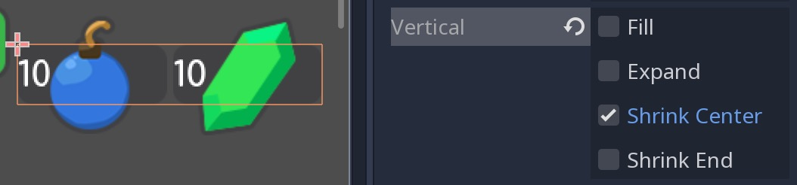

   現在、両方のカウンタは適度な大きさになっている

.. tip::

   ``Counters`` コンテナの ``Min Size`` プロパティを変更し、カウンタの背景の高さを制御する

EnergyBarのEPラベルには小さな問題が1つ残っている。
2本のバーは垂直に整列する必要がある。
``EnergyBar`` ノード横の "エディタで開く" アイコンをクリックして、そのシーンを開く。
``Count`` ノードを選択し、 ``Custom Constants`` セクションの ``Margin Left`` を ``20`` に設定する。
``Rect`` セクションで、ノードの ``Min Size`` を100に設定する。
これは、LifeBarと同じ値にした。
``Count`` の左側にいくらかのマージンがあるだろう。
保存後にGUIシーンに戻ったとき、 ``LifeBar`` と垂直に整列している。

.. figure:: ./img/ui_gui_step_tutorial_assemble_final_gui_4.png

   2つのバーは完全に整列する

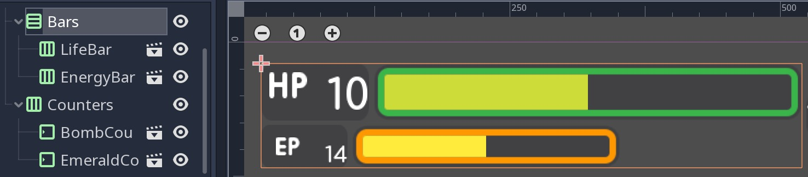

   訳者：しつこいようだが、揃っていないように見えて仕方ない。

.. note::

   少し前に ``EnergyBar`` をこのように設定できた。
   しかし、これは、いつでも任意のシーンに戻って微調整し、変更がプロジェクト全体に反映されることを示している。

.. 英語の原文：UIコンポーネントを最終GUIに追加する
   Add the UI components to the final GUI
   --------------------------------------

   Time to add all the UI elements to the main GUI scene. Open the
   ``GUI.tscn`` scene again, and delete the ``Bar`` and ``Counter`` nodes.
   In the FileSystem dock, find the ``LifeBar.tscn`` and drag and drop it
   onto the ``Bars`` container in the scene tree. Do the same for the
   ``EnergyBar``. You should see them align vertically.

   .. figure:: ./img/ui_gui_step_tutorial_assemble_final_gui_1.png

      The LifeBar and the EnergyBar align automatically

   Now, drag and drop the ``BombCounter.tscn`` and ``EmeraldCounter.tscn`` scenes onto the
   ``Counters`` node. They'll resize automatically.

   .. figure:: ./img/ui_gui_step_tutorial_assemble_final_gui_2.png

      The nodes resize to take all the available vertical space

   To let the ``EmeraldCounter`` and ``BombCounter`` use the size we defined
   in ``Counter.tscn``, we need to change the ``Size Flags`` on the
   ``Counters`` container. Select the ``Counters`` node and unfold the
   ``Size Flags`` section in the Inspector. Uncheck the ``Fill`` tag for
   the ``Vertical`` property, and check ``Shrink Center`` so the container
   centers inside the ``HBoxContainer``.

   .. figure:: ./img/ui_gui_step_tutorial_assemble_final_gui_3.png

      Now both counters have a decent size

   .. tip::

       Change the ``Min Size`` property of the ``Counters`` container
       to control the height of the counters' background.

   We have one small issue left with the EP label on the EnergyBar: the 2
   bars should align vertically. Click the icon next to the ``EnergyBar``
   node to open its scene. Select the ``Count`` node and scroll down to the
   ``Custom Constants`` section. Add a ``Margin Left`` of ``20``. In
   the ``Rect`` section set the node's ``Min Size`` back to 100, the same
   value as on the LifeBar. The ``Count`` should now have some margin on
   the left. If you save and go back to the GUI scene, it will be aligned
   vertically with the ``LifeBar``.

   .. figure:: ./img/ui_gui_step_tutorial_assemble_final_gui_4.png

      The 2 bars align perfectly

   .. note::

       We could have set up the ``EnergyBar`` this way a few moments
       ago. But this shows you that you can go back to any scene anytime, tweak
       it, and see the changes propagate through the project!

GUIをゲームの試作品に配置する
----------------------------------------------------------

今回の説明をまとめるために、ゲームの試作品にGUIを導入する。

ファイルシステムドックに移動し、 ``LevelMockup.tscn`` を開く。

``GUI.tscn`` シーンを ``bg`` ノードの下かつ、 ``Characters`` の上にドラッグ&ドロップする(要は、ノード間に配置・同列配置)。
GUIは、ビューポート全体に合うように拡大縮小される。
レイアウトメニューに移動し、 ``Center Top`` オプションを選択することで、ゲームウィンドウの上端に固定される。
次に、GUIの大きさを垂直方向に可能な限り小さくする。
これで、ゲームのコンテキストでインタフェイスがどのように見えるかを確認できる。

ここまでで、この長い説明の幕引きを迎えることができた。
最終プロジェクトは、
:download:`ui_gui_design.zip <files/ui_gui_design.zip>`
から取得できる。

.. figure:: ./img/ui_gui_design_final_result.png

   最終結果

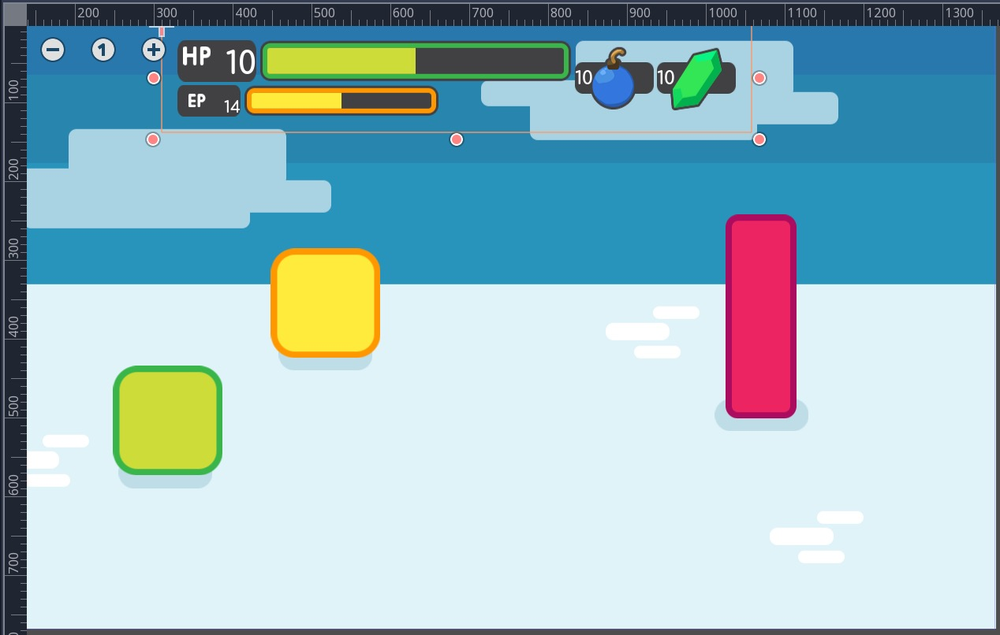

   訳者：しつこいようだが・・・以下略。

.. note::

   **レスポンシブデザインに関する最後の注意事項**

   GUIの大きさを変更した場合、ノード移動に気づくだろうが、テクスチャとテキストに変化しないことにも気づくだろう。
   GUIには、内部のテクスチャに基づいた最小サイズもある。
   ゲームでは、インタフェイスがウェブサイトのように柔軟である必要は無い。
   画面の横向きと縦向きの両方に対応することはほとんど無い。
   どちらか一方に対応するだけで十分だ。
   横向きの一般的な比率は 4:3 から 16:9 の範囲を考慮すればいいだろう。
   それらは、互いに隣接している。
   それがウィンドウサイズを変更したときにGUI要素が水平方向にのみ移動するのに十分な理由になる。

.. 英語の原文：GUIをゲームの試作品に配置する
   Place the GUI onto the game's mockup
   ------------------------------------

   To wrap up the tutorial we're going to insert the GUI onto the game's
   mockup scene.

   Head to the FileSystem dock and open ``LevelMockup.tscn``.

   Drag-and-drop the ``GUI.tscn`` scene right below the ``bg`` node and
   above the ``Characters``. The GUI will scale to fit the entire viewport.
   Head to the Layout menu and select the ``Center Top`` option so it anchors
   to the top edge of the game window. Then resize the GUI to make it as
   small as possible vertically. Now you can see how the interface looks in
   the context of the game.

   Congratulations for getting to the end of this long tutorial. You can
   find the final project here: :download:`ui_gui_design.zip <files/ui_gui_design.zip>`.

   .. figure:: ./img/ui_gui_design_final_result.png

      The final result

   .. note::

       **A final note about Responsive Design**. If you resize the
       GUI, you'll see the nodes move, but the textures and text won't scale.
       The GUI also has a minimum size, based on the textures inside of it. In
       games, we don’t need the interface to be as flexible as that of a
       website. You almost never want to support both landscape and portrait
       screen orientations. It’s one or the other. In landscape orientation,
       the most common ratios range from 4:3 to 16:9. They are close to one
       another. That's why it’s enough for the GUI elements to only move
       horizontally when we change the window size.

.. vim:set ts=3 sw=3 tw=0 fenc=utf-8:
