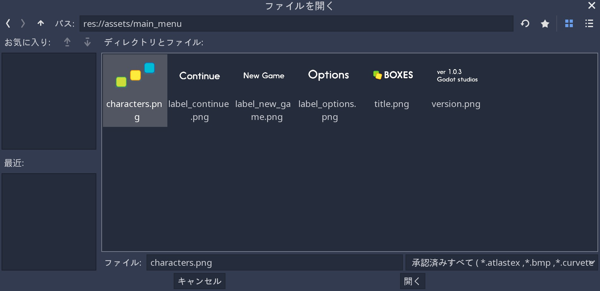
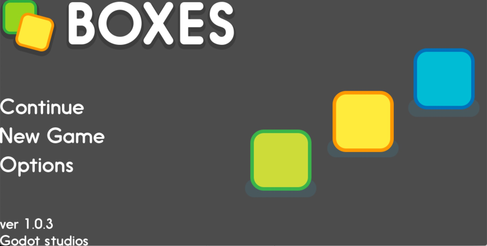

.. _doc_ui_main_menu_jp:

タイトル画面を設計する
============================================

次の2つの説明では、エンジンのUI(ユーザインタフェイス)システムを使用し、2つのレスポンシブUIシーンを段階的に構築する。

1. メインメニュー
2. ライフバー・エネルギーバー・爆弾・マネーカウンタを備えたゲームUI

今回は、ゲームUIを効率的に設計する方法および、Godotのコントロールノードを使用する方法を学習する。
具体的には、視覚的な部分、つまりエディタから行うすべてに焦点を当てている。
ライフバーのコーディングを学ぶには、 :doc:`コードからゲームのUI制御 <ui_code_a_life_bar_jp>` を参照すること。

.. figure:: img/ui_main_menu_design_final_result.png

   完成画像

次のプロジェクトファイルをダウンロードし、解凍(展開)する。
:download:`ui_main_menu_design.zip <files/ui_main_menu_design.zip>`

Godotで ``start/`` プロジェクトをインポートする。
すべてのスプライトは、 ``start/assets/main_menu`` フォルダにある。
``end/`` フォルダには、最終結果が収まっている。

.. note::

   今回の着手前に、 :doc:`コントロールノードとのインタフェイス設計 <ui_introduction_to_the_ui_system_jp>` にて、GodotのUIシステムの仕組みを復習しておくこと。

レスポンシブとは、特定の端末に依存せず、端末に応じて柔軟に画面表示を変更することを指す。
特徴は、1つのファイルで様々な端末に対応すること。
逆に、1つのファイルから様々な端末に対応するためには、計算された設計が事前に要求されると言うこと。

.. 英語の原文：タイトル画面を設計する
   Design a title screen
   =====================

   In the next two tutorials, you will build two responsive UI (user interface)
   scenes step-by-step using the engine's UI system:

   1. A main menu
   2. A game UI with a health bar, energy bar, bomb and money counters

   You will learn how to design game UIs efficiently, and how to use Godot's
   Control nodes. This page focuses on the visual part: everything you do
   from the editor. To learn how to code a life bar,
   read :doc:`ui_code_a_life_bar`

   .. figure:: img/ui_main_menu_design_final_result.png

    The GUI you're going to create

   Download the project files: :download:`ui_main_menu_design.zip
   <files/ui_main_menu_design.zip>` and extract the archive. Import the ``start/``
   project in Godot to follow this tutorial. The ``end/`` folder contains the
   final result. You'll find all the sprites in the ``start/assets/main_menu``
   folder.

   .. note:

     Read the :doc:`ui_introduction_to_the_ui_system` first to learn how Godot’s UI system works

ゲームUIの設計方法
------------------------------------

優れたUIを設計するには、最初に大まかな草案(試作品)を考えることだ。
UIコンポーネントの配置・大きさ・ユーザインタラクション(人の行動に応じて機器が動く)に焦点を当てた簡単な下書きを作る。
ペンと紙で十分な作業だ。
この段階では、派手な装飾を施した最終的な場面を作り上げるべきではない。

次に取りかかるのは、単純な輪郭のみの作成だが、Godotの使用を考慮していいだろう。
これらの作業結果として、試作品が完成し、確実に最終結果への目処を付けられるようにすべきだからだ。

.. figure:: img/ui_design_rough.png

    UIの大まかな計画または草案

試作品にゴテゴテな手を加えず、簡潔さの維持が大事だ。
UIのテストプレイを第三者にさせる前に、ゴテゴテした特殊効果・アニメーション・詳細なイラストを避けることを念押しする。

1. グラフィックスは、本来持つべきゲームの本質を見抜けなくなる目くらましになり、貴重なテストプレイの感想が得られなくなる。
2. 感想が得られた場合の修正を最小限に抑えるためにも最初は小さく作る必要がある。

.. tip::

   常に、最初に簡素なテキストとボックスでインタフェイスが機能するようにすること。
   それらのテクスチャ(オブジェクト)は後で簡単に置き換えることができるためだ。
   プロのUXデザイナは、初期設定の背景や枠組みを使用する。
   カラフルな色や派手な視覚効果を取り除いた場合、UI要素を適切な大きさに配置するのが遙かに簡単になる。
   これは、構築する設計基盤の改善に役立つ。

GodotでUIを設計するには2つの方法がある。

1. すべてを単一のシーンでビルドし、最終的にいくつかのブランチを再利用可能なシーンとして保存する。
2. 再利用可能なコンポーネントのテンプレートシーンを構築し、ベースシーンを継承する特定のコンポーネントを作成する。

UIの最初のバージョンが希望通りに機能しない可能性があるため、最初の説明を実行する。
部品を捨てて、コンポーネントを再設計する可能性がある。
すべてが機能していることを確認できた場合、以下のように、一部の部品を再利用可能にする。

.. figure:: img/ui_main_menu_placeholder_assets.png

   Godotにあるファイル。グラフィックはラフなデザインよりもきれいに見えるが、まだ枠組みしか実装されていない。

.. 英語の原文：ゲームUIの設計方法
   How to design your game UI
   --------------------------

   To design a good UI, you want to come up with a rough mockup first: a
   plain drawing version that focuses on the placement of your UI
   components, their size, and user interaction. Pen and paper is all you
   need. You shouldn't use fancy and final graphics at this stage. Then,
   you only need simple placeholder sprites and you're good to jump into
   Godot. You want to make sure the players can find their way around the
   interface using those placeholders.

   .. figure:: img/ui_design_rough.png

      The UI's rough plan or mockup

   Placeholder doesn't have to mean ugly, but you should keep the graphics
   simple and clean. Avoid special effects, animation, and detailed
   illustration before you have players playtest your UI. Otherwise:

   1. The graphics might skew the players' perception of the experience and
      you'll miss out on valuable feedback
   2. If the User Experience doesn't work, you'll have to redo some sprites

   .. tip::

       Always try to make the interface work with simple text and
       boxes first. It's easy to replace the textures later. Professional UX
       designers often work with plain outlines and boxes in greyscale. When
       you take colors and fancy visuals away, it's a lot easier to size and
       place UI elements properly. It helps you refine the design foundation
       you'll build upon.

   There are two ways to design your UI in Godot. You can:

   1. Build it all in a single scene, and eventually save some branches as
      reusable scenes
   2. Build template scenes for reusable components and create specific
      components that inherit from your base scenes

   We will use the first approach, because the first version of your UI may
   not work as well as you’d like. You’re likely to throw parts away and
   redesign components as you go. When you're sure everything works, it's
   easy to make some parts reusable, as you'll see below.

   .. figure:: img/ui_main_menu_placeholder_assets.png

      The files you'll find in Godot. The graphics look cleaner than on the
      rough design, but they're still placeholders

メインメニューを設計する
------------------------------------------------

エディタを触る前に、草案に基づき、コンテナをネスト(入れ子に)する方法を計画する。

.. 英語の原文：メインメニューを設計する
   Design the main menu
   --------------------

   Before we jump into the editor, we want to plan how we'll nest
   containers based on our mockup image.

UI草案を分解する
~~~~~~~~~~~~~~~~~~~~~~~~~~~~~~~~

適切なコンテナを見つけるための3つの経験則は次の通り。

1. すべてのUI(大きさ問わず・ラベル付きのバー・パネル・ボタン・1つのウィジェットのみですら)を最小にネストされたボックスに分割する。
2. エリアの周りにパディング(余白・詰め物)がある場合、 ``MarginContainer`` を使用する。
3. 要素が行または列に配置されている場合は、 ``HBoxContainer`` または ``VBoxContainer`` を使用する。

これらの決め事は、作業着手を容易にするのに十分であり、簡素なインタフェイスに適している。

メインメニューの場合、最大のボックスはゲームウィンドウ全体になる。
ウィンドウの端と最初のコンポーネントの間にパディングがある。
これは ``MarginContainer`` でなければならない。
次に、画面が2列に分割されるため、 ``HBoxContainer`` を使用する。
左の列では、 ``VBoxContainer`` で行を管理する。
``CenterContainer`` を中心にイラストを中央に配置する。

.. figure:: img/ui_mockup_break_down.png

   3つの経験則を使用して分類されたインタフェイスビルディングブロック

.. tip::

   コンテナは、ウィンドウの解像度と幅と高さの比率に適応する。
   手作業でUI要素を配置することもできるが、コンテナはより速く、より正確で、 **即応** する。

.. 英語の原文：UI草案を分解する
   Break down the UI mockup
   ~~~~~~~~~~~~~~~~~~~~~~~~

   Here are my three rules of thumb to find the right containers:

   1. Break down the UI into nested boxes, from the largest that contains
      everything, to the smallest ones, that encompass one widget, like a
      bar with its label, a panel or a button
   2. If there's some padding around an area, use a ``MarginContainer``
   3. If the elements are arranged in rows or columns, use an
      ``HBoxContainer`` or ``VBoxContainer``

   These rules are enough to get us started, and work well for simple
   interfaces.

   For the main menu, the largest box is the entire game window. There's
   padding between the edges of the window and the first components: this
   should be a ``MarginContainer``. Then, the screen is split into two
   columns, so we'll use an ``HBoxContainer``. In the left column, we'll
   manage the rows with a ``VBoxContainer``. And in the right column, we'll
   center the illustration with a ``CenterContainer``.

   .. figure:: img/ui_mockup_break_down.png

      Interface building blocks, broken down using the three rules of thumb

   .. tip::

       Containers adapt to the window's resolution and width-to-height
       ratio. Although we could place UI elements by hand, containers are
       faster, more precise, and **responsive**.

メインメニューシーンを準備する
~~~~~~~~~~~~~~~~~~~~~~~~~~~~~~~~~~~~~~~~~~~~~~~~~~~~~~~~~~~~

実際に、メインメニューを作成する。
単一のシーンで構築する。
空のシーンを作成するには、 "メニュー ⇒ シーン ⇒ 新規シーン" で用意できるが、最新のGodotであれば、不要なのかな(既に存在する)。

シーンを保存する前に、ルートノードを追加する必要がある。
UIのルートは、最も外側のコンテナまたは要素である必要がある。
この場合、 ``MarginContainer`` を使う。
``MarginContainer`` は、多くの場合、UIの周辺にパディング(余白・詰め物)が必要なため、ほとんどのインタフェイスの出発点として適している。
シーンをディスクに保存するには、 ``Meta+S`` キーを押す(訳者：過去の説明から簡素になっているぞ)。
*MainMenu* と言う名前を付ける。

Meta：Macでは、 ``command`` キー。Windowsでは、 ``Control`` キーのことだろう。

シーンドック ``MarginContainer`` をクリック後、インスペクタドックに移動し、Marginのサイズを変更する。
それは、 ``Control`` クラス内の ``Custom Constants`` セクションにあり、次の変更を加える。

-  Margin Left: *120*
-  Margin Top: *80*
-  Margin Right: *120*
-  Margin Bottom: *80*

コンテナをウィンドウに合わせる。
ビューポート上にあるツールバーで、 ``レイアウト`` を開き、最後のオプションである ``Full Rect`` を選択する。

.. 英語の原文：メインメニューシーンを準備する
   Prepare the Main Menu scene
   ~~~~~~~~~~~~~~~~~~~~~~~~~~~

   Let's create the main menu. We'll build it in a single scene. To create
   an empty scene, click on the Scene menu -> New Scene.

   We have to add a root node before we can save the scene. Your UI's root
   should be the outermost container or element. In this case it's a
   ``MarginContainer``. ``MarginContainer`` is a good starting point for
   most interfaces, as you often need padding around the UI. Press
   ``Meta+S`` to save the scene to the disk. Name it *MainMenu*.

   Select the ``MarginContainer`` again, and head to the inspector to
   define the margins' size. Scroll down the ``Control`` class, to the
   ``Custom Constants`` section. Unfold it. Set the margins as such:

   -  Margin Right: *120*
   -  Margin Top: *80*
   -  Margin Left: *120*
   -  Margin Bottom: *80*

   We want the container to fit the window. In the toolbar above the Viewport, 
   open the ``Layout`` menu and select the last option, ``Full Rect``.

UIスプライトの追加
~~~~~~~~~~~~~~~~~~~~~~~~~~~~~~~~~~~~

MainMenu( ``MarginContainer`` )をクリックし、 ``TextureRect`` を子ノード(UI要素)として作成する。
以下、手順

#. タイトルまたはロゴ
#. 個別のノードとして3つのテキストオプション
#. バージョンノート
#. メインメニューのイラスト

``子ノードを追加`` :ref:`ボタン <子作り求むjump>` をクリックもしくは、キーボード上から ``Meta+A`` 押下する。
``TextureRect`` と入力して対応するノードを見つけ、作成ボタンをクリックする。
新規ノードを選択後、 ``Meta+D`` を5回押下し、合計6つの ``TextureRect`` インスタンスを作成する。

各ノードをクリックし、インスペクタドックから ``Texture`` プロパティを探し出し、 ``[空]`` -> ``読込み`` をクリックする。
ファイルブラウザウィンドウが開くため、そこからスプライト(画像)を選び、テクスチャスロットに読み込む。

   ファイルブラウザを使用したとき、テクスチャを検索して読み込む。

すべての ``TextureRect`` ノードに対して操作を繰り返すこと。
ロゴ・図・3つのメニューオプション・バージョンノートがそれぞれ別個のノードとして必要になる。
次に、シーンドックから各ノード名を変更する。
コンテナにはまだ何も配置していないため、乱雑に受け止められる結果になっているだろう。

   テクスチャがロードされた6つのノード

.. note::

   スプライトとは、画像を合成表示するための技術のこと。

.. csv-table:: ノード名の紐付け
   :header: 画像名, ノード名
   :widths: 5, 5

   title.png, Logo
   label_continue.png, Continue
   label_new_game.png, NewGame
   label_options.png, Options
   version.png, Version
   characters.png, Characters

.. todo::

   noteとして、以下を完記する。
   ゲームで国際化(ローカライズ対応)する場合は、MainMenuに ``TextureRect`` ではなく、 ``Labels`` を使用すること。

   訳者：全く理解できない。そもそもLabelsではなく、Labelだと思うのだが、単純に綴りを間違えた？　それとも、複数形？
   国際化用のボタンを設けて、ボタンクリックで対応させるようにする？そんな説明には見えないが・・・。

.. 英語の原文：UIスプライトの追加
   Add the UI sprites
   ~~~~~~~~~~~~~~~~~~

   Select the ``MarginContainer``, and create the UI elements as
   ``TextureRect`` nodes. We need:

   1. The title, or logo
   2. The three text options, as individual nodes
   3. The version note
   4. And the main menu’s illustration

   Click the ``Add Node`` button or press ``Meta+A`` on your keyboard.
   Start to type ``TextureRect`` to find the corresponding node and press
   enter. With the new node selected, press ``Meta+D`` five times to
   create five extra ``TextureRect`` instances.

   Click each of the nodes to select it. In the inspector, find the ``Texture``
   property and click ``[empty]`` -> ``Load``. A file browser opens and lets
   you pick a sprite to load into the texture slot.

   .. figure:: img/ui_texturerect_load_texture.png

      The file browser lets you find and load textures

   Repeat the operation for all ``TextureRect`` nodes. You should have the
   logo, the illustration, the three menu options and the version note,
   each as a separate node. Then, double click on each of the nodes in the
   Scene tab to rename them. Nothing has been placed in containers yet so this
   should look messy.

   .. figure:: img/ui_main_menu_6_texturerect_nodes.png

      The six nodes, with textures loaded

   .. note::

       If you want to support localization in your game, use
       ``Labels`` for menu options instead of ``TextureRect``.

UI要素を自動的に配置するコンテナの追加
~~~~~~~~~~~~~~~~~~~~~~~~~~~~~~~~~~~~~~~~~~~~~~~~~~~~~~~~~~~~~~~~~~~~~~~~~~~~

メインメニューには、画面の端にマージンがあり、2つに分割されている。
左側には、ロゴとメニューオプションがある。
右側には、プレイヤーがいる。
これを実現するには、次の2つのコンテナのいずれかを使用する。
``HSplitContainer(分割コンテナ)`` または ``HBoxContainer(箱コンテナ)`` のどちらか。

分割コンテナは、領域を2分する。
左右もしくは、上下に分ける。
また、ユーザは、分割した領域の大きさを変更できる(それを無効にもできる)。

箱コンテナは、子を持つ列と同じ数の列に分割する。分割コンテナより優先して使うコンテナとして勧める。

MainMenu( ``MarginContainer`` )が選択されている状態で、 ``HBoxContainer`` を追加する。
次に、 ``HBoxContainer`` の子として2つのコンテナを必要とする。
左側のメニューオプション用の ``VBoxContainer`` と右側の図用の ``CenterContainer`` になる。

   MainMenuの入れ子になった4種類のコンテナがあり、すべてのTextureRectノードはMainMenuの子になっている必要がある。

ノードツリーで、左側にあるすべての ``TextureRect`` ノードを選ぶ。
Logo・Continue・NewGame・Options・Versionの5種類。
それらを ``VBoxContainer`` にドラッグ&ドロップすることで、ノードが自動配置される。

   コンテナはテクスチャを自動移動配置及びサイズ変更する。

今までの作業だけでは、2つの課題が残ったままになっているため、これから解決する。

1. 左側の文字が中央に配置されていない。
2. ロゴと他のUI要素の間に遊び部分(スペース)がない。

文字を右に中央揃えするには、最初に ``CenterContainer`` を選ぶ。
次に、インスペクタドックから ``Size Flags`` カテゴリを開き、 ``Horizontal`` プロパティの ``Expand`` および ``Fill`` を有効にする。
``Vertical`` プロパティについても同様の作業を行う。
これにより、 ``CenterContainer`` は、隣接する ``VBoxContainer`` との距離感をとりながら使用可能な大きさに拡張される。
最後に、Charactersノードを ``CenterContainer`` にドラッグ&ドロップする。
Characters要素は、自動的に中央配置が行われる。

   characterノードは、CenterContainer内に配置した直後に、画面の右半分の中央に調整される。

MenuOptionsと左側のロゴの間隔を開けるために、最後のコンテナとそのsize flagsを使用する。
``VBoxContainer`` をクリックし、 ``Meta+A`` 押下後に、新規ノードとして ``VBoxContainer`` を追加し、 "MenuOptions" と言う名前を付ける。
3つのノード( ``Continue`` ・ ``NewGame`` ・ ``Options`` )を選択し、新しく追加した ``MenuOptions(VBoxContainer)`` 内にドラッグ&ドロップする。
UIのレイアウトは、あるとしてもほとんど変化はない。

   UIのレイアウトを保持するために、他の2つのノード間に今回のコンテナを配置する

MenuOptionsをグループ化後に、コンテナを拡張し、できるだけ多くの垂直方向の空きをつくる。
``MenuOptions`` ノードを選び、インスペクタドックから ``Size Flags`` カテゴリまで移動し、 ``Vertical`` プロパティ内の ``Expand`` および ``Fill`` を有効化する。
コンテナは、使用可能なすべての垂直スペースを占めるように拡張されるが、隣接する ``Logo`` と ``Version`` のノードを考慮した上での拡張だ。

MenuOptionsノードを ``VBoxContainer`` の中央に配置するには、インスペクタドック内の ``Alignment`` プロパティを ``Center`` に変更する。

   MenuOptionsは、UIの左列の垂直方向の中央に配置する必要がある。

最後に、MenuOptionsをいくつか分割する。
インスペクタドック内の ``Custom Constants`` カテゴリを開き、 ``Separation`` 欄に30を設定する。
Enterキー押下で ``Separation`` プロパティが有効化され、MenuOptionsの中で、それぞれのノード間に30ピクセルが追加される。

   最終的なインタフェイス(私が作成した画像であり、冒頭の画像が元画像)

1行もコード追加なしに、正確で応答性の高いメインメニューを完成させた。
（訳者：しかし、元画像とのできが異なるのは気になる）

祝福をあげよう。
最後に、 :download:`ui_main_menu_design.zip <files/ui_main_menu_design.zip>` をダウンロードし、作成したメニューと比較して終わろう。

次のチュートリアルでは、バーとアイテムカウンターを備えたゲームユーザインタフェイスの作成に取り組む。

.. 英語の原文：UI要素を自動的に配置するコンテナの追加
   Add containers to place UI elements automatically
   ~~~~~~~~~~~~~~~~~~~~~~~~~~~~~~~~~~~~~~~~~~~~~~~~~

   Our main menu has some margin around the edges of the screen. It is
   split in two parts: on the left, you have the logo and the menu options.
   On the right, you have the characters. We can use one of two containers
   to achieve this: ``HSplitContainer`` or ``HBoxContainer``. Split
   containers split the area into two: a left and a right side or a top and
   a bottom side. They also allow the user to resize the left and right
   areas using an interactive bar. On the other hand, ``HBoxContainer``
   just splits itself into as many columns as it has children. Although you
   can deactivate the split container's resize behaviour, I recommend to
   favour box containers.

   Select the ``MarginContainer`` and add an ``HBoxContainer``. Then, we
   need two containers as children of our ``HBoxContainer``: a
   ``VBoxContainer`` for the menu options on the left, and a
   ``CenterContainer`` for the illustration on the right.

   .. figure:: img/ui_main_menu_containers_step_1.png

      You should have four nested containers, and the TextureRect nodes
      sitting aside from it

   In the node tree, select all the ``TextureRect`` nodes that should go on
   the left side: the logo, the menu options and the version note. Drag and
   drop them into the ``VBoxContainer``. The nodes should position automatically.

   .. figure:: img/ui_main_menu_containers_step_2.png

      Containers automatically place and resize textures

   We're left with two problems to solve:

   1. The characters on the right aren't centered
   2. There's no space between the logo and the other UI elements

   To center the characters on the right, first select the ``CenterContainer``.
   Then in the Inspector, scroll down to the ``Size Flags`` category and click
   on the field to the right of the ``Vertical`` property, and check ``Expand``
   in addition to ``Fill``. Do the same for the ``Horizontal`` property. This
   makes the ``CenterContainer`` expand into all available space while
   respecting its neighbour ``VBoxContainer``. Finally, drag and drop the
   Characters node into the ``CenterContainer``. The Characters element will center
   automatically.

   .. figure:: img/ui_main_menu_containers_step_3.png

      The character node centers inside the right half of the screen as
      soon as you place it inside the CenterContainer

   To space out the menu options and the logo on the left, we'll use one
   final container and its size flags. Select the ``VBoxContainer`` and
   press ``Meta+A`` to add a new node inside it. Add a second
   ``VBoxContainer`` and name it "MenuOptions". Select all three menu
   options, ``Continue``, ``NewGame`` and ``Options``, and drag and drop
   them inside the new ``VBoxContainer``. The UI's layout should barely
   change, if at all.

   .. figure:: img/ui_main_menu_containers_step_4.png

      Place the new container between the other two nodes to retain the
      UI's layout

   Now we grouped the menu options together, we can tell their container to
   expand to take as much vertical space as possible. Select the
   ``MenuOptions`` node. In the Inspector, scroll down to the
   ``Size Flags`` category. Click on the field to the right of the
   ``Vertical`` property, and check ``Expand`` in addition to ``Fill``. The container expands to
   take all the available vertical space. But it respects its neighbors,
   the ``Logo`` and ``Version`` elements.

   To center the nodes in the ``VBoxContainer``, scroll to the top of the
   Inspector and change the ``Alignment`` property to ``Center``.

   .. figure:: img/ui_main_menu_containers_step_5.png

      The menu options should center vertically in the UI's left column

   To wrap things up, let's add some separation between the menu options.
   Expand the ``Custom Constants`` category below ``Size Flags``, and click
   the field next to the ``Separation`` parameter. Set it to 30. Once you
   press enter, the ``Separation`` property becomes active and Godot adds
   30 pixels between menu options.

   .. figure:: img/ui_main_menu_design_final_result.png

      The final interface

   Without a single line of code, we have a precise and responsive main
   menu.

   Congratulations for getting there! You can download the final
   menu :download:`ui_main_menu_design.zip <files/ui_main_menu_design.zip>`
   to compare with your own. In the next tutorial, you'll
   create a Game User Interface with bars and item counters.

試作品のUIを分解する
~~~~~~~~~~~~~~~~~~~~~~~~~~~~~~~~~~~~~~~~

レスポンシブユーザインタフェイスとは、すべての画面タイプでUIが適切な大きさに自動調整されること。
テレビ画面とコンピュータのディスプレイは、大きさと比率が異なる。
Godotでは、コンテナを使用し、UI要素の位置と大きさを制御する。

ネストの順序は重要になる。
UIが様々な画面比率にうまく適応するかどうかを確認するには、ルートノードを選択し、Qキー押下にて選択モードをアクティブ後、コンテナをクリックして、いずれかの角をクリック&ドラッグし、サイズ変更する。
UIコンポーネントはその内部を流れる必要がある。

コンテナはスプライトを移動するが、スケーリングしない。
これは正常な動作になる。
UIシステムが異なる画面比率を処理できるようにしたいが、ゲーム全体が異なる画面解像度に適応する必要もある。
これを行うために、Godotはウィンドウ全体を上下にスケーリングする。

プロジェクト設定でスケールモードを変更する。

メニュー ⇒ プロジェクト ⇒ プロジェクトの設定 ⇒ 一般タブ ⇒ ウィンドウの左側のDisplayカテゴリ ⇒ Window サブカテゴリ ⇒ Stretchセクション
そこの3つの設定のMode(モード)・Aspect(アスペクト)・Shrink(縮小)は、画面サイズを制御する。
詳細は、 :ref:`doc_multiple_resolutions` を参照すること。

.. 英語の原文：試作品のUIを分解する
   Break down the UI mockup
   ~~~~~~~~~~~~~~~~~~~~~~~~

   A responsive User Interface is all about making sure our UIs scale well on
   all screen types. TV screens and computer displays have different sizes
   and ratios. In Godot, we use containers to control the position and the
   size of UI elements.

   The order in which you nest matters. To see if your
   UI adapts nicely to different screen ratios, select the root node, press
   the Q key to activate the Select Mode, select the container and click
   and drag on one of the container's corners to resize it. The UI
   components should flow inside of it.

   You'll notice that although
   containers move sprites around, they don't scale them. This is normal.
   We want the UI system to handle different screen ratios, but we also
   need the entire game to adapt to different screen resolutions. To do
   this, Godot scales the entire window up and down.

   You can change the scale mode in the project settings: click the Project menu -> Project
   Settings. In the window's left column, look for the Display category.
   Click on the Window sub-category. On the right side of the window,
   you'll find a Stretch section. The three settings, Mode, Aspect, and
   Shrink, control the screen size. For more information, see :ref:`doc_multiple_resolutions`.

.. vim:set ts=3 sw=3 tw=0 fenc=utf-8:
