.. _doc_your_first_game_jp:

人生初のゲーム開発
====================================

.. 英語の原文：人生初のゲーム開発
   Your first game
   ===============

概要
------------

今回は、最初にGodotプロジェクトの作成方法を説明する。
Godotエディタの仕組み・プロジェクトの構成方法・2Dゲームの構築方法が話の中心になる。

.. note:: このプロジェクトは、Godotエンジンの紹介になる。
          プログラミングの経験があることを前提とする。
          プログラミング経験が無い場合は、 :ref:`doc_scripting_jp` から始めること。

今回のゲームは、 "クリープをかわす!" に取り組む。
プレイヤーを長期滞在(生存)させるために、クリープ(敵)を避けなければならない。
最終結果のプレビュは以下の通り。

.. image:: img/dodge_preview.gif

**なぜ2D？** 3Dゲームは、2Dゲームよりも遙かに複雑になる。
ゲーム開発プロセスを十分に理解するまで、2Dに固着する必要がある。

.. 英語の原文：概要
   Overview
   --------

   This tutorial will guide you through making your first Godot
   project. You will learn how the Godot editor works, how to structure
   a project, and how to build a 2D game.

   .. note:: This project is an introduction to the Godot engine. It
             assumes that you have some programming experience already. If
             you're new to programming entirely, you should start here:
             :ref:`doc_scripting`.

   The game is called "Dodge the Creeps!". Your character must move and
   avoid the enemies for as long as possible. Here is a preview of the
   final result:

   .. image:: img/dodge_preview.gif

   **Why 2D?** 3D games are much more complex than 2D ones. You should stick to 2D
   until you have a good understanding of the game development process.

プロジェクトの立ち上げ
--------------------------------------------

Godotの起動後、新しいプロジェクトを作成する。
次に、 :download:`dodge_assets.zip <files/dodge_assets.zip>` をダウンロードする。
これには、ゲーム開発に必要な画像と音が含まれている。
これらのファイルをプロジェクトフォルダに解凍(展開)する。

.. note:: 今回の説明では、エディタに精通していることを前提とする。
          そのため、 :ref:`doc_scenes_and_nodes_jp` を未読の場合は、先にそちらを読んでおくこと。
          プロジェクトの設定やエディタの使用について説明している部分を確認しておくこと。

このゲームは、ポートレートモードを使用するため、ゲームウィンドウのサイズ調整が必要になる。
*プロジェクト ⇒ プロジェクトの設定 ⇒ Display ⇒ Window* から順に開き、横幅(Width)を480にし、縦幅(Height)を720に設定すること。

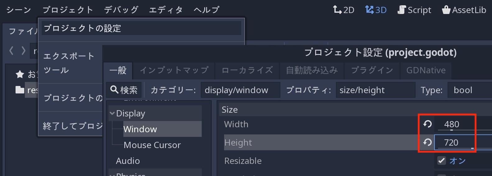

.. todo::

   gif画像を旨く作れないため、英語表記(原画)のままになっている。いずれ日本語版に差し替える。

.. 英語の原文：プロジェクトの立ち上げ
   Project setup
   -------------

   Launch Godot and create a new project. Then, download
   :download:`dodge_assets.zip <files/dodge_assets.zip>` - the images and sounds you'll be
   using to make the game. Unzip these files to your project folder.

   .. note:: For this tutorial, we will assume you are familiar with the
             editor. If you haven't read :ref:`doc_scenes_and_nodes`, do so now
             for an explanation of setting up a project and using the editor.

   This game will use portrait mode, so we need to adjust the size of the
   game window. Click on Project -> Project Settings -> Display -> Window and
   set "Width" to ``480`` and "Height" to ``720``.

プロジェクトの整理
~~~~~~~~~~~~~~~~~~~~~~~~~~~~~~~~~~~~

このプロジェクトでは、 ``プレイヤー`` ・ ``敵`` ・ ``画面表示`` の3つの独立したシーンを作成し、これらをゲームの ``メイン`` シーンに結合する。
大規模なプロジェクトでは、様々なシーンとそのスクリプトを保存するフォルダを作成することで管理しやすくなるだろうが、今回の比較的小さいゲームでは、 ``res://`` と呼ばれるプロジェクトのルートフォルダにシーンとスクリプトを保存する。
プロジェクトフォルダは、左下のファイルシステムドックで確認できる。
（原著では、なぜか最新版のレイアウトに戻っているため、今回はそのレイアウトに合わせる。）

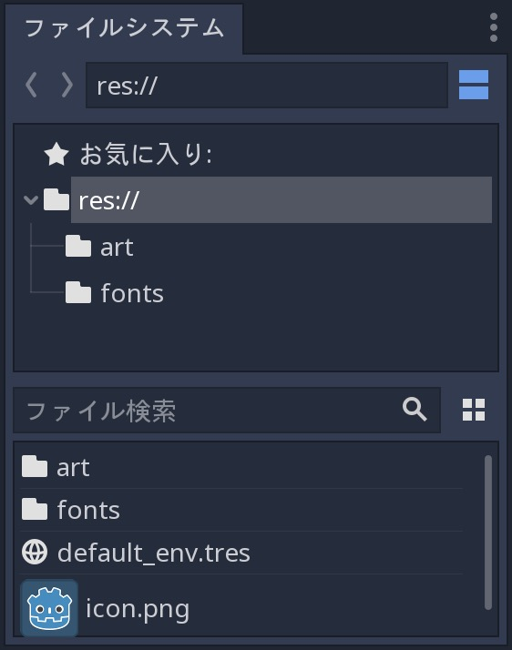

.. 英語の原文：プロジェクトの整理
   Organizing the project
   ~~~~~~~~~~~~~~~~~~~~~~

   In this project, we will make 3 independent scenes: ``Player``,
   ``Mob``, and ``HUD``, which we will combine into the game's ``Main``
   scene. In a larger project, it might be useful to make folders to hold
   the various scenes and their scripts, but for this relatively small
   game, you can save your scenes and scripts in the project's root folder,
   referred to as ``res://``.  You can see your project folders in the FileSystem
   Dock in the lower left corner:

   .. image:: img/filesystem_dock.png

.. 日本語版
   このプロジェクトでは、 ``プレイヤー`` ・ ``敵`` ・ ``画面表示`` の3つの独立したシーンを作成し、これらをゲームの ``メイン`` シーンに結合する。
   大規模なプロジェクトでは、様々なシーンとそのスクリプトを保存するフォルダを作成することで管理しやすくなるだろうが、今回の比較的小さいゲームでは、 ``res://`` と呼ばれるプロジェクトのルートフォルダにシーンとスクリプトを保存する。
   プロジェクトフォルダは、左下のファイルシステムドックで確認できる。
   （原著では、なぜか最新版のレイアウトに戻っているため、今回はそのレイアウトに合わせる。）

プレイヤーシーン
--------------------------------

最初に、4つあるうちの1つである ``プレイヤー`` シーンを作成する。
シーンごとに作成する利点の1つは、ゲームの他の部分を作成する前であっても、それを個別にテストできることにある。

.. 英語の原文：プレイヤーシーン
   Player scene
   ------------

   The first scene we will make defines the ``Player`` object. One of the benefits
   of creating a separate Player scene is that we can test it separately, even
   before we've created other parts of the game.

ノード構造
~~~~~~~~~~~~~~~~~~~~

開始するには、 "カスタムノード ⇒ Area2D" から :ref:`Area2D <class_Area2D>` ノードをシーンに追加する。

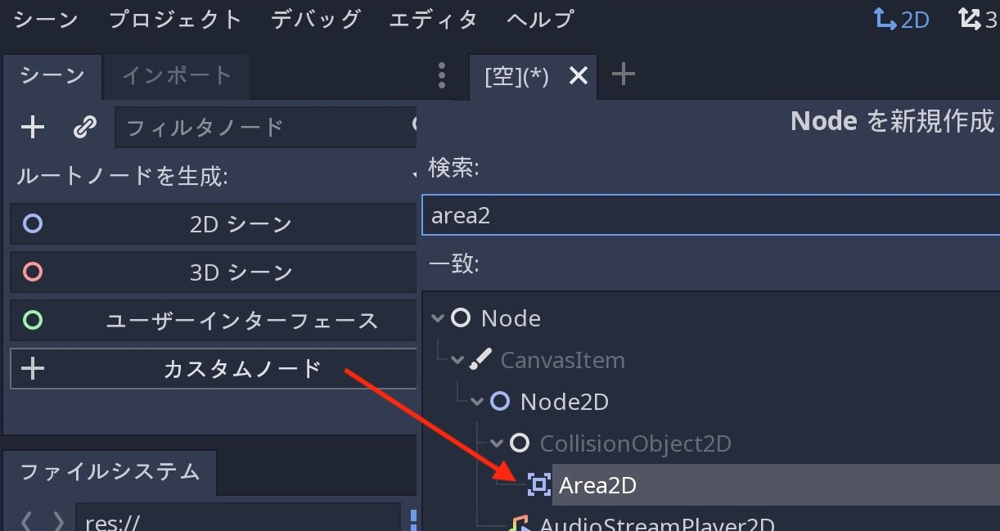

.. todo::

   リンクの確認。

``Area2D`` は、プレイヤーに重なるもしくは、プレイヤーにぶつかるオブジェクトを検出できる。
ノードの名前をクリックし、名前を ``プレイヤー`` に変更する。
これは、シーンのルートノードになる。
機能追加のために、プレイヤーノードに更なるノードを追加する。

.. _ピーターパン現象jump:

``プレイヤー`` ノードへの子追加前に、子を誤操作(移動・サイズ変更)しない作業に取りかかる。
まず、ノードを選択し、ロックの右側にあるアイコンをクリックする。
ツールチップには、 "オブジェクトの子が選択可能で無いことを確認します" と表示される。

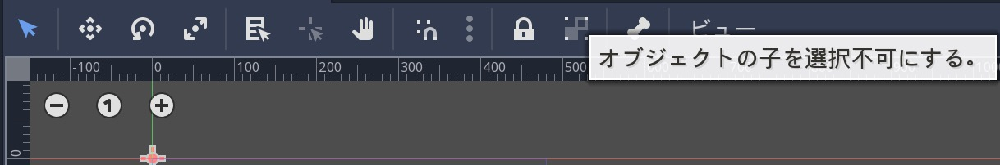

シーンを保存する。
"シーン ⇒ シーンを保存"
もしくは、 ``Ctrl+S`` (Windows/Linux)・
``Command+S`` (Mac)で、保存できる。

保存名： ``Player.tscn``

.. _茶目っ気jump:

.. note:: このプロジェクトでは、Godotの命名規則に従うと思うなよ。日本人ならば、日本語を使うため、命名規則に従えない。しかし、シーンファイルというのは、クラス名でもあるため、シーンを保存するときに、多バイト文字を使わず、英語名に屈する。

          - **GDScript** ：クラス(ノード)はパスカルケースを使用し、変数と関数はスネークケースを使用し、定数はオールキャップを使用する。
            （ :ref:`doc_gdscript_styleguide_jp` を参照のこと）

            訳者：蛇の入れ物？　すべて帽子？ 何の話をしている？

          - **C#** ：クラス・エクスポート変数・メソッドはパスカルケースを使用し、プライベートフィールドは _キャメルケースを使用し、ローカル変数と引数はキャメルケースを使用する。
            （ :ref:`doc_c_sharp_styleguide_jp` を参照のこと）

            訳者：キャメルケース？

            シグナルを接続するときは、メソッド名を正確に入力すること。

.. 英語の原文：ノード構造
   Node structure
   ~~~~~~~~~~~~~~

   To begin, click the "Add/Create a New Node" button and add an :ref:`Area2D <class_Area2D>`
   node to the scene.

   .. image:: img/add_node.png

   With ``Area2D`` we can detect objects that overlap or run into the player.
   Change its name to ``Player`` by clicking on the node's name.
   This is the scene's root node. We can add additional nodes to the player to add
   functionality.

   Before we add any children to the ``Player`` node, we want to make sure we don't
   accidentally move or resize them by clicking on them. Select the node and
   click the icon to the right of the lock; its tooltip says "Makes sure the object's children
   are not selectable."

   .. image:: img/lock_children.png

   Save the scene. Click Scene -> Save, or press ``Ctrl+S`` on Windows/Linux or ``Command+S`` on Mac.

   .. note:: For this project, we will be following the Godot naming conventions.

             - **GDScript**: Classes (nodes) use PascalCase, variables and
               functions use snake_case, and constants use ALL_CAPS (See
               :ref:`doc_gdscript_styleguide`).

             - **C#**: Classes, export variables and methods use PascalCase,
               private fields use _camelCase, local variables and parameters use
               camelCase (See :ref:`doc_c_sharp_styleguide`).  Be careful to type
               the method names precisely when connecting signals.

.. 日本語版
   ``Area2D`` は、プレイヤーに重なるもしくは、プレイヤーにぶつかるオブジェクトを検出できる。
   ノードの名前をクリックし、名前を ``プレイヤー`` に変更する。
   これは、シーンのルートノードになる。
   機能追加のために、プレイヤーにノードを追加する。

   .. _ピーターパン現象jump:

   ``プレイヤー`` ノードへの子追加前に、子を誤操作(移動・サイズ変更)しない作業に取りかかる。
   まず、ノードを選択し、ロックの右側にあるアイコンをクリックする。
   ツールチップには、 "オブジェクトの子が選択可能で無いことを確認します" と表示される。

スプライトアニメーション
~~~~~~~~~~~~~~~~~~~~~~~~~~~~~~~~~~~~~~~~~~~~~~~~

``プレイヤー`` ノードをクリックし、 :ref:`AnimatedSprite <class_AnimatedSprite>` ノードを子として追加する。
``AnimatedSprite`` は、プレイヤーの外観とアニメーションを処理する。
ノードの横に警告記号があることに注意すること。

``AnimatedSprite`` には、 :ref:`SpriteFrames <class_SpriteFrames>` リソースが必要になる。
これは、表示できるアニメーションリストにあたる。
作成するには、インスペクタドックから ``Frames`` プロパティを探しだし、 "[空] ⇒ 新規 SpriteFrames" を選択する。
これにより、SpriteFramesパネルが自動的に開くと思うなよ。原著では自動開口かもしれないが、最新版は開かなかった。

.. _プレイヤー画像jump:

具体的な開き方を言えば、選択後の部分をクリックする必要がある
そうすることで、全画面の下部パネル側(出力やデバッグなどがある)に "SpriteFrames" が現れる。

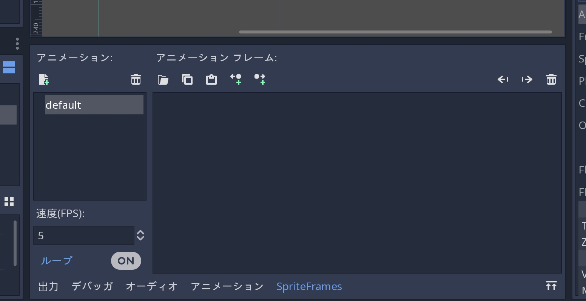

左側にアニメーションリストがある。
"default" をクリックし、名前を "右" に変更する。

次に、 "新規アニメーション" ボタンをクリックし、 "上" と言う名前の2つ目のアニメーションを作成する。
``playerGrey_up[12].png`` と ``playerGrey_walk[12].png`` と言う名前の各アニメーションの2つの画像をパネルの "Animation Frames" 側にドラッグすると思うなよ。

``上`` には、playerGrey_upの2枚画像を "アニメーションフレーム" 上の **リソースを読み込む** ボタンクリック後のウィンドウから選ぶ。

``右`` にも同様に、playerGrey_walkの2枚の画像を同じように読み込む。

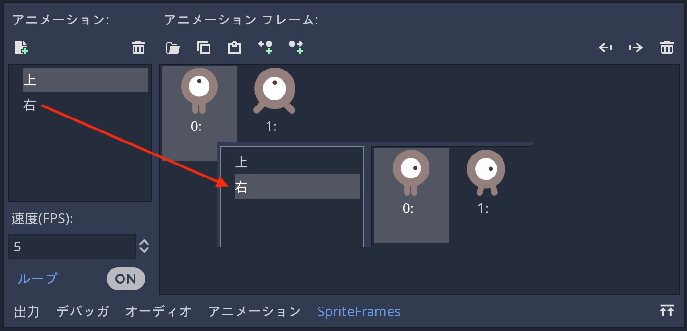

.. _萎縮jump:

プレイヤー画像は、ゲームウィンドウに対して大きいため、縮小作業が必要になる。
``AnimatedSprite`` ノードをクリックし、インスペクタドックの ``Node2D ⇒ Transform ⇒ Scale`` プロパティを ``(0.5, 0.5)`` に設定する。

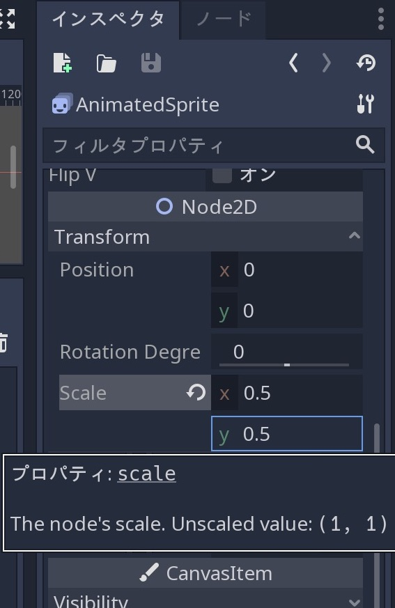

.. _接触jump:

最後に、 :ref:`CollisionShape2D <class_CollisionShape2D>` を ``プレイヤー`` の子として追加する。
これにより、プレイヤーの "被弾箇所" またはその衝突箇所の境界を決められる。
このプレイヤーには、 ``CapsuleShape2D`` ノードにより適切な衝突箇所を決めるため、インスペクタの "Shape" 欄の "[空] -> 新規 CapsuleShape2D" を選ぶ。
2つのサイズハンドルを使用して、Shapeのサイズを変更し、AnimatedSprite(プレイヤー画像)を覆うようにする。

（横幅を決めた後に縦幅を決めた方が楽にできるだろう）

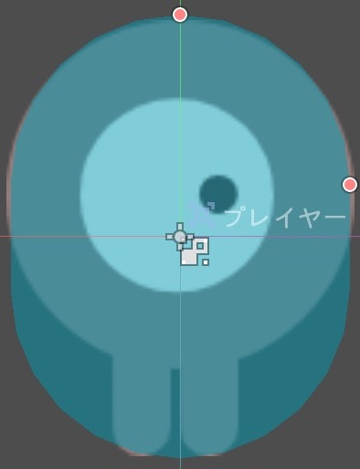

すべての作業が完了した場合、 ``プレイヤー`` シーンは次画像のようになる。

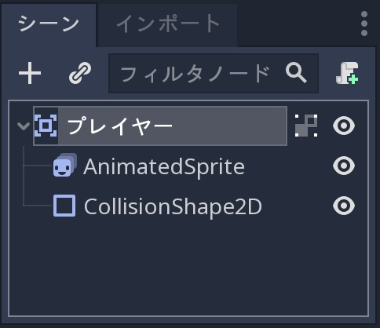

子ノードを選択不可にしているため、プレイヤーノードの右横に今まで見たことのない印が付いている。しかし、その印は、原画にない。

.. todo::

   リンクの確認。

.. 英語の原文：スプライトアニメーション
   Sprite animation
   ~~~~~~~~~~~~~~~~

   Click on the ``Player`` node and add an :ref:`AnimatedSprite <class_AnimatedSprite>` node as a
   child. The ``AnimatedSprite`` will handle the appearance and animations
   for our player. Notice that there is a warning symbol next to the node.
   An ``AnimatedSprite`` requires a :ref:`SpriteFrames <class_SpriteFrames>` resource, which is a
   list of the animations it can display. To create one, find the
   ``Frames`` property in the Inspector and click "[empty]" ->
   "New SpriteFrames". This should automatically open the SpriteFrames panel.

   .. image:: img/spriteframes_panel.png

   On the left is a list of animations. Click the "default" one and rename
   it to "right". Then click the "Add" button to create a second animation
   named "up". Drag the two images for each animation, named ``playerGrey_up[1/2]`` and ``playerGrey_walk[1/2]``,
   into the "Animation Frames" side of the panel:

   .. image:: img/spriteframes_panel2.png

   The player images are a bit too large for the game window, so we need to
   scale them down. Click on the ``AnimatedSprite`` node and set the ``Scale``
   property to ``(0.5, 0.5)``. You can find it in the Inspector under the
   ``Node2D`` heading.

   .. image:: img/player_scale.png

   Finally, add a :ref:`CollisionShape2D <class_CollisionShape2D>` as a child
   of ``Player``. This will determine the player's "hitbox", or the
   bounds of its collision area. For this character, a ``CapsuleShape2D``
   node gives the best fit, so next to "Shape" in the Inspector, click
   "[empty]"" -> "New CapsuleShape2D".  Using the two size handles, resize the
   shape to cover the sprite:

   .. image:: img/player_coll_shape.png

   When you're finished, your ``Player`` scene should look like this:

   .. image:: img/player_scene_nodes.png

.. 日本語版

プレイヤー移動
~~~~~~~~~~~~~~~~~~~~~~~~~~~~

次に、組み込みノードから取得できない機能を追加する必要があるため、スクリプト追加で対応する。
``プレイヤー`` ノードをクリックし、 "Add Script" ボタンをクリックする。

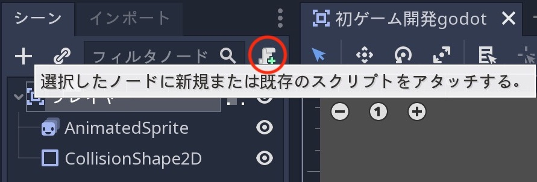

Attach Node Scriptウィンドウでは、初期設定のままにする。
"作成" ボタンをクリックすることで作業が終わる。

.. note:: C#スクリプトまたは他の言語を選びたい場合は、作成前に `言語` ドロップダウンメニューから必要なプログラミング言語を選ぶ。

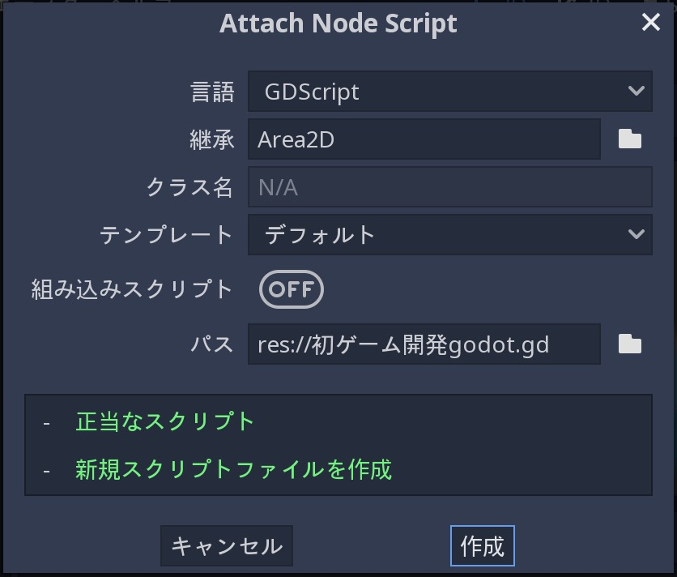

.. note:: 初めてGDScriptに関わる場合は、 :ref:`doc_scripting_jp` を理解しておくこと。

このオブジェクトに必要なメンバ変数を宣言する。

.. tabs::
   .. code-tab:: gdscript GDScript

      extends Area2D

      export var speed = 400  # プレイヤーの移動速度(ピクセル/秒)
      var screen_size  # ゲームウィンドウの大きさ。

   .. code-tab:: csharp

      public class Player : Area2D
      {
          [Export]
          public int Speed = 400; // How fast the player will move (pixels/sec).

          private Vector2 _screenSize; // Size of the game window.
      }

最初の変数 ``speed`` で ``export`` キーワードを付与しているのは、インスペクタドックでその変数の値を変更できるようになる。
これは、ノードの組み込みプロパティのように調整するときに便利だ。
``プレイヤー`` ノードをクリックしたとき、インスペクタドックの "Script Variables" セクションにSpeedプロパティが表示される。
ここで値を変更したとき、スクリプトに記述された値が上書きされることに注意すること。

.. warning:: C#を使用している場合、新しいエクスポート変数またはシグナルを表示する場合に、プロジェクトアセンブリを(再・リ)ビルドする必要がある。
            ビルド後は、エディタウィンドウの下部にある "Mono" をクリックしてMonoパネルを表示し、 "Build Project" ボタンをクリック後に手動で動かす。

            訳者：C#使う気が無いので、本当にこの説明で合っているのか未検証のまま。

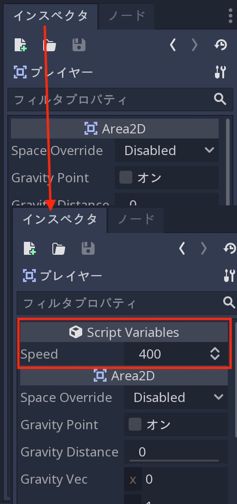

``_ready()`` 関数は、ノードがシーンツリーに入るときに呼び出される。
これは、ゲームウィンドウの大きさを見つけるいい機会になる。

訳者：どういう意味なのか全く理解できない。

.. tabs::
   .. code-tab:: gdscript GDScript

       func _ready():
           screen_size = get_viewport_rect().size

   .. code-tab:: csharp

      public override void _Ready()
      {
          _screenSize = GetViewport().GetSize();
      }

``_process()`` 関数に、プレイヤーの行動を定義する。
``_process()`` はフレームごとに呼び出されるため、これを使用してゲーム要素を更新することは、頻繁に変更される発想に結びつくことだろう。
プレイヤーの行動定義は、次の3種類ある。

- 入力の確認
- 指定された方向への移動
- 適切なアニメーションの再生

まず、入力を確認する必要がある - プレイヤーはキーを押されているか？
このゲームでは、4方向に移動する。
入力アクションは、 "Input Map" の下のプロジェクト設定で定義される(訳者：どこにある？)。
ここで、カスタムイベントを定義し、異なるキー・マウスイベント・またはその他の入力を割り当てることができる。
このデモでは、キーボードの矢印キーに割り当てられているOSイベントを使用する。

キー押下の検出は、 ``Input.is_action_pressed()`` を使用する。
押された場合は ``true`` ・押されていない場合は ``false`` が戻り値になる。

.. tabs::
   .. code-tab:: gdscript GDScript

      func _process(delta):
          var velocity = Vector2()  # プレイヤーの行動
          if Input.is_action_pressed("ui_right"):
              velocity.x += 1
          if Input.is_action_pressed("ui_left"):
              velocity.x -= 1
          if Input.is_action_pressed("ui_down"):
              velocity.y += 1
          if Input.is_action_pressed("ui_up"):
              velocity.y -= 1

          if velocity.length() > 0:
              velocity = velocity.normalized() * speed
              $AnimatedSprite.play()
          else:
              $AnimatedSprite.stop()

   .. code-tab:: csharp

      public override void _Process(float delta)
      {
          var velocity = new Vector2(); // The player's movement vector.

          if (Input.IsActionPressed("ui_right"))
          {
              velocity.x += 1;
          }

          if (Input.IsActionPressed("ui_left"))
          {
              velocity.x -= 1;
          }

          if (Input.IsActionPressed("ui_down"))
          {
              velocity.y += 1;
          }

          if (Input.IsActionPressed("ui_up"))
          {
              velocity.y -= 1;
          }

          var animatedSprite = GetNode<AnimatedSprite>("AnimatedSprite");

          if (velocity.Length() > 0)
          {
              velocity = velocity.Normalized() * Speed;
              animatedSprite.Play();
          }
          else
          {
              animatedSprite.Stop();
          }
      }

``velocity`` 変数を宣言することから始める(この時点では、プレイヤーに動きはない(動いてはならない))。
各キーボード入力を確認し、 ``velocity`` から加速/減速して全体の方向を取得する。
例えば、 ``右`` キーと ``下`` キーを同時に押した場合、結果の ``velocity`` 行動は、 ``(1, 1)`` になる。
この場合、水平方向と垂直方向の動きを追加しているため、プレイヤーは水平方向に移動した場合よりも *早く* 移動する。

速度を *normalized* した場合、 *length* を ``1`` に設定することで、希望の速度移動ができる。
これは、これ以上早い対角線の動きがなくなることを意味する。

（訳者：意味が全く分からない。どこで1を設定している？乗算を防ぐことができるようだが、どこに紐付いている？）

.. todo::

   確認する必要がある。

.. memo

   ``velocity`` 変数を ``(0, 0)`` に設定することから始める(この時点では、プレイヤーに動きはない(動いてはならない))。

   この訳はおかしいよな。0.0に設定しているとは思えないのだが・・・。

.. tip:: 人間生活を過ごしているにもかかわらず、ベクトル演算の利用経験から逃げていた場合、もしくは復習が必要な場合は、 :ref:`doc_vector_math_jp` を参照すること。

         知っておくことは、チュートリアル後の人生にも有益だが、今後のチュートリアルではもう出てこない。

また、AnimatedSpriteアニメーションを開始または停止できるように、プレイヤーが動いているかどうかを確認する。

.. tip:: GDScriptでは、 ``$`` は現在のノードからの相対パスにあるノードを返す。
         ノードが見つからない場合は、 ``null`` を返す。
         AnimatedSpriteは現在のノードの子であるため、 ``$AnimatedSprite`` が使用可能になる。

         ``$`` は、``get_node()`` の省略形。
         従って、上記のコードでは、 ``$AnimatedSprite.play()`` と ``get_node("AnimatedSprite").play()`` は同じ扱いになる。

移動方向が分かったことで、プレイヤーの位置を更新し、 ``clamp()`` を使用して、 ``_process`` 関数の末尾に以下を追加することで、画面から消えないようにする。

.. tabs::
   .. code-tab:: gdscript GDScript

      position += velocity * delta
      position.x = clamp(position.x, 0, screen_size.x)
      position.y = clamp(position.y, 0, screen_size.y)

   .. code-tab:: csharp

      Position += velocity * delta;
      Position = new Vector2(
          x: Mathf.Clamp(Position.x, 0, _screenSize.x),
          y: Mathf.Clamp(Position.y, 0, _screenSize.y)
      );

.. tip:: *Clamping* とは、指定された範囲に囲い込むことを意味する。

"シーンを実行" ( ``F6`` )をクリックし、プレイヤーを全方向に移動させて、動作確認をすること。

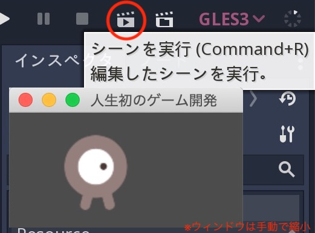

シーンの再生時に開くコンソール出力は、下部パネルの左下にある ``出力`` (青で強調表示される)部分をクリックして閉じる。

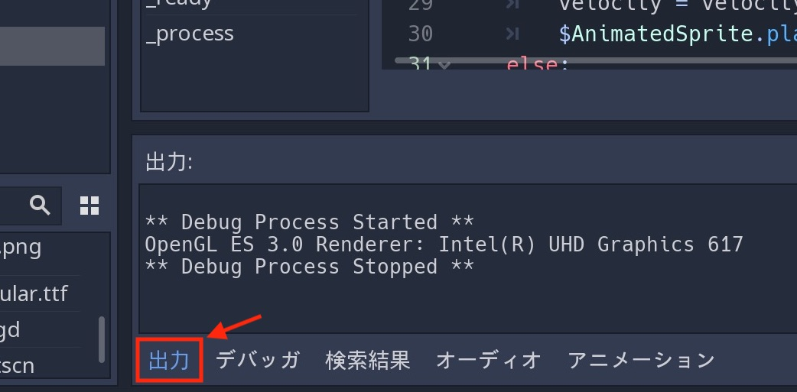

.. warning:: "デバッガ" 画面(Godotエディタの下部パネル)で、 "null instance" を参照するエラーが表示された場合、ノード名の綴りが間違えている可能性がある。
             ノード名は大文字と小文字を区別する。
             ``$NodeName`` または ``get_node("NodeName")`` は、シーンツリーに表示される名前と一致する必要がある。

             .. image:: img_jp/yourFirstGameIntanceErr_jp.jpg

.. 英語の原文：プレイヤー移動
   Moving the player
   ~~~~~~~~~~~~~~~~~

   Now we need to add some functionality that we can't get from a built-in
   node, so we'll add a script. Click the ``Player`` node and click the
   "Add Script" button:

   .. image:: img/add_script_button.png

   In the script settings window, you can leave the default settings alone. Just
   click "Create":

   .. note:: If you're creating a C# script or other languages, select the
               language from the `language` drop down menu before hitting create.

   .. image:: img/attach_node_window.png

   .. note:: If this is your first time encountering GDScript, please read
             :ref:`doc_scripting` before continuing.

   Start by declaring the member variables this object will need:

   .. tabs::
    .. code-tab:: gdscript GDScript

       extends Area2D

       export var speed = 400  # How fast the player will move (pixels/sec).
       var screen_size  # Size of the game window.

    .. code-tab:: csharp

       public class Player : Area2D
       {
           [Export]
           public int Speed = 400; // How fast the player will move (pixels/sec).

           private Vector2 _screenSize; // Size of the game window.
       }

   Using the ``export`` keyword on the first variable ``speed`` allows us to
   set its value in the Inspector. This can be handy for values that you
   want to be able to adjust just like a node's built-in properties. Click on
   the ``Player`` node and you'll see the property now appears in the "Script
   Variables" section of the Inspector. Remember, if you change the value here, it
   will override the value written in the script.

   .. warning:: If you're using C#, you need to (re)build the project assemblies
                whenever you want to see new export variables or signals. This
                build can be manually triggered by clicking the word "Mono" at the
                bottom of the editor window to reveal the Mono Panel, then
                clicking the "Build Project" button.

   .. image:: img/export_variable.png

   The ``_ready()`` function is called when a node enters the scene tree,
   which is a good time to find the size of the game window:

   .. tabs::
    .. code-tab:: gdscript GDScript

       func _ready():
           screen_size = get_viewport_rect().size

    .. code-tab:: csharp

       public override void _Ready()
       {
           _screenSize = GetViewport().GetSize();
       }

   Now we can use the ``_process()`` function to define what the player will do.
   ``_process()`` is called every frame, so we'll use it to update
   elements of our game, which we expect will change often. For the player, we
   need to do the following:

   - Check for input.
   - Move in the given direction.
   - Play the appropriate animation.

   First, we need to check for input - is the player pressing a key? For
   this game, we have 4 direction inputs to check. Input actions are defined
   in the Project Settings under "Input Map". Here, you can define custom events and
   assign different keys, mouse events, or other inputs to them. For this demo,
   we will use the default events that are assigned to the arrow keys on the
   keyboard.

   You can detect whether a key is pressed using
   ``Input.is_action_pressed()``, which returns ``true`` if it is pressed
   or ``false`` if it isn't.

   .. tabs::
    .. code-tab:: gdscript GDScript

       func _process(delta):
           var velocity = Vector2()  # The player's movement vector.
           if Input.is_action_pressed("ui_right"):
               velocity.x += 1
           if Input.is_action_pressed("ui_left"):
               velocity.x -= 1
           if Input.is_action_pressed("ui_down"):
               velocity.y += 1
           if Input.is_action_pressed("ui_up"):
               velocity.y -= 1
           if velocity.length() > 0:
               velocity = velocity.normalized() * speed
               $AnimatedSprite.play()
           else:
               $AnimatedSprite.stop()

    .. code-tab:: csharp

       public override void _Process(float delta)
       {
           var velocity = new Vector2(); // The player's movement vector.

           if (Input.IsActionPressed("ui_right"))
           {
               velocity.x += 1;
           }

           if (Input.IsActionPressed("ui_left"))
           {
               velocity.x -= 1;
           }

           if (Input.IsActionPressed("ui_down"))
           {
               velocity.y += 1;
           }

           if (Input.IsActionPressed("ui_up"))
           {
               velocity.y -= 1;
           }

           var animatedSprite = GetNode<AnimatedSprite>("AnimatedSprite");

           if (velocity.Length() > 0)
           {
               velocity = velocity.Normalized() * Speed;
               animatedSprite.Play();
           }
           else
           {
               animatedSprite.Stop();
           }
       }

   We start by setting the ``velocity`` to ``(0, 0)`` - by default the player
   should not be moving. Then we check each input and add/subtract from the
   ``velocity`` to obtain a total direction. For example, if you hold ``right``
   and ``down`` at the same time, the resulting ``velocity`` vector will be
   ``(1, 1)``. In this case, since we're adding a horizontal and a vertical
   movement, the player would move *faster* than if it just moved horizontally.

   We can prevent that if we *normalize* the velocity, which means we set
   its *length* to ``1``, and multiply by the desired speed. This means no
   more fast diagonal movement.

   .. tip:: If you've never used vector math before, or need a refresher,
            you can see an explanation of vector usage in Godot at :ref:`doc_vector_math`.
            It's good to know but won't be necessary for the rest of this tutorial.

   We also check whether the player is moving so we can start or stop the
   AnimatedSprite animation.

   .. tip:: In GDScript, ``$`` returns the node at the relative path from the current node, or returns ``null`` if the node is not found.
            Since AnimatedSprite is a child of the current node, we can use ``$AnimatedSprite``.

            ``$`` is shorthand for ``get_node()``.
            So in the code above, ``$AnimatedSprite.play()`` is the same as ``get_node("AnimatedSprite").play()``.

   Now that we have a movement direction, we can update the player's position
   and use ``clamp()`` to prevent it from leaving the screen by adding the following
   to the bottom of the ``_process`` function:

   .. tabs::
    .. code-tab:: gdscript GDScript

           position += velocity * delta
           position.x = clamp(position.x, 0, screen_size.x)
           position.y = clamp(position.y, 0, screen_size.y)

    .. code-tab:: csharp

           Position += velocity * delta;
           Position = new Vector2(
               x: Mathf.Clamp(Position.x, 0, _screenSize.x),
               y: Mathf.Clamp(Position.y, 0, _screenSize.y)
           );

   .. tip:: *Clamping* a value means restricting it to a given range.

   Click "Play Scene" (``F6``) and confirm you can move the player
   around the screen in all directions. The console output that opens upon playing
   the scene can be closed by clicking ``Output`` (which should be highlighted in
   blue) in the lower left of the Bottom Panel.

   .. warning:: If you get an error in the "Debugger" panel that refers to a "null instance",
                this likely means you spelled the node name wrong. Node names are case-sensitive
                and ``$NodeName`` or ``get_node("NodeName")`` must match the name you see in the scene tree.

アニメーションの選択
~~~~~~~~~~~~~~~~~~~~~~~~~~~~~~~~~~~~~~~~

プレイヤーが移動可能になったことで、移動する向きに基づき、AnimatedSpriteが再生するアニメーションを変更する。

左移動には ``flip_h`` プロパティから水平反転の "右" アニメーションを用いる。

下移動には ``flip_v`` プロパティから垂直反転の "上" アニメーションを用いる。

このコードを ``_process()`` 関数の末尾に配置する。

.. tabs::
   .. code-tab:: gdscript GDScript

      if velocity.x != 0:
          $AnimatedSprite.animation = "右"
          # bool値の割り当てについては、以下のNoteを参照。
          $AnimatedSprite.flip_v = false
          $AnimatedSprite.flip_h = velocity.x < 0
      elif velocity.y != 0:
          $AnimatedSprite.animation = "上"
          $AnimatedSprite.flip_v = velocity.y > 0

   .. code-tab:: csharp

      if (velocity.x != 0)
      {
          animatedSprite.Animation = "right";
          // See the note below about boolean assignment
          animatedSprite.FlipH = velocity.x < 0;
          animatedSprite.FlipV = false;
      }
      else if(velocity.y != 0)
      {
          animatedSprite.Animation = "up";
          animatedSprite.FlipV = velocity.y > 0;
      }

.. Note:: 上記のコードのbool値の割り当ては、プログラマの一般的な略記になる。
          このコードと上記の略記されたbool値の割り当てを検討すること。

          （訳者：何の話をしている？）

シーンをもう一度再生し、アニメーションが各方向に正しい動きをするか確認すること。
正しい動きが確認できた場合、次の行を ``_ready()`` に追加し、ゲームの開始時にプレイヤーを非表示にする。

.. tabs::
   .. code-tab:: gdscript GDScript

      hide()

   .. code-tab:: csharp

      Hide();

※この状態でゲームを開始した場合、画面には何も表示されない。

.. 英語の原文：アニメーションの選択
   Choosing animations
   ~~~~~~~~~~~~~~~~~~~

   Now that the player can move, we need to change which animation the
   AnimatedSprite is playing based on direction. We have a "right"
   animation, which should be flipped horizontally using the ``flip_h``
   property for left movement, and an "up" animation, which should be
   flipped vertically with ``flip_v`` for downward movement.
   Let's place this code at the end of our ``_process()`` function:

   .. tabs::
    .. code-tab:: gdscript GDScript

           if velocity.x != 0:
               $AnimatedSprite.animation = "right"
               $AnimatedSprite.flip_v = false
               # See the note below about boolean assignment
               $AnimatedSprite.flip_h = velocity.x < 0
           elif velocity.y != 0:
               $AnimatedSprite.animation = "up"
               $AnimatedSprite.flip_v = velocity.y > 0

    .. code-tab:: csharp

           if (velocity.x != 0)
           {
               animatedSprite.Animation = "right";
               // See the note below about boolean assignment
               animatedSprite.FlipH = velocity.x < 0;
               animatedSprite.FlipV = false;
           }
           else if(velocity.y != 0)
           {
               animatedSprite.Animation = "up";
               animatedSprite.FlipV = velocity.y > 0;
           }

   .. Note:: The boolean assignments in the code above are a common shorthand
             for programmers. Consider this code versus the shortened
             boolean assignment above:

             .. tabs::
              .. code-tab :: gdscript GDScript

                if velocity.x < 0:
                    $AnimatedSprite.flip_h = true
                else:
                    $AnimatedSprite.flip_h = false

              .. code-tab:: csharp

                if velocity.x < 0:
                    animatedSprite.FlipH = true
                else:
                    animatedSprite.FlipH = false

   Play the scene again and check that the animations are correct in each
   of the directions. When you're sure the movement is working correctly,
   add this line to ``_ready()``, so the player will be hidden when the game
   starts:

   .. tabs::
    .. code-tab:: gdscript GDScript

       hide()

    .. code-tab:: csharp

       Hide();

衝突の準備
~~~~~~~~~~~~~~~~~~~~

プレイヤーが敵にぶつかったことを ``プレイヤー`` に検出させたいが、そもそも敵を作成しておらず、ぶつかる相手がいない。
Godotの *signal* 機能を用いて疑似発生させるため、問題ない。

コードの ``extends Area2d`` が記述された直後(スクリプトの先頭)に、次を追加する。

.. tabs::
   .. code-tab:: gdscript GDScript

      signal hit

   .. code-tab:: csharp

      // Don't forget to rebuild the project so the editor knows about the new signal.

      [Signal]
      public delegate void Hit();

これは、 "hit" と呼ばれるカスタムシグナルを定義している。
プレイヤーが敵と衝突したことをプレイヤーに検出させるためでもある。
衝突の検出用に、 ``Area2D`` を使用する。
``プレイヤー`` ノードを選択し、 "ノード" タブをクリックし、プレイヤーが発信できるシグナルリストを表示する。

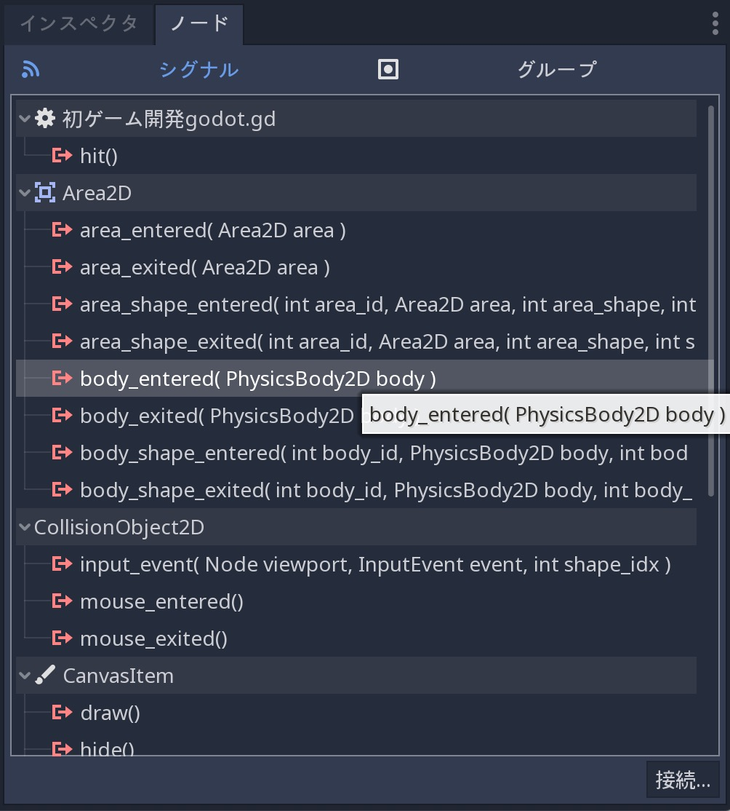

.. role:: strike

余談：上記で作成済みの "hit" シグナルもある。

敵は、 ``RigidBody2D`` ノードになるため、 :strike:`body_entered( Object body )` (訳者：原著と引数名が異なる) 
``body_entered( PhysicsBody2D body)`` シグナルが必要になる(訳者：敵に使うノードとどのような関係がある？)。
これは、敵がプレイヤーに接触したときに送られる信号として扱う。
"接続..." をクリックし、 "シグナルの接続" ウィンドウ内の
"Method In Node" 欄に、 **_on_Player_body_entered** を入力する(入力済みの文字列を削除する)。
そして、そのウィンドウの右下にある "接続" ボタンをクリックする。
Godotはプレイヤーのスクリプトに、関数を自動的に作成する。
この関数は、シグナルが発行されるたびに呼び出される。

.. _既存に接吻jump:

.. tip:: シグナルを接続するときに、今回のような関数作成では無く、既存の関数名に紐付けることもできる。

         .. image:: img_jp/player_signals_MethodInNode_jp.jpg

.. tip:: 
         ちなみに、、、
         関数名を入力した理由は、ノード名に日本語を使っているからであり、英語名(Player)であれば、 "Method In Node" 欄を気にせず "接続" ボタンクリックのみで作業完了だった。

下記のコードを関数に追加する。

.. tabs::
   .. code-tab:: gdscript GDScript

      func _on_Player_body_entered(body):
          hide()  # ぶつかったらプレイヤーは消える。
          emit_signal("hit")
          $CollisionShape2D.set_deferred("disabled", true)

   .. code-tab:: csharp

      public void OnPlayerBodyEntered(PhysicsBody2D body)
      {
          Hide(); // Player disappears after being hit.
          EmitSignal("Hit");
          GetNode<CollisionShape2D>("CollisionShape2D").SetDeferred("disabled", true);
      }

敵がプレイヤーに当たるたびに、シグナルが発生する。
プレイヤーの衝突を無効にして、 ``hit`` シグナルを抑止する必要がある。

.. Note:: 領域の衝突形状を無効にしたとき、衝突処理の途中でエラーが発生する可能性が生まれる。
          ``set_deferred()`` を使用した場合、安全に実行できるようになるまで図形を無効化し、Godotを待機させることができる。

プレイヤーへの最後の仕上げは、新しいゲームを開始するときにプレイヤーの状態を初期値にする関数を追加することだ。

.. tabs::
   .. code-tab:: gdscript GDScript

      func start(pos):
          position = pos
          show()
          $CollisionShape2D.disabled = false

   .. code-tab:: csharp

      public void Start(Vector2 pos)
      {
          Position = pos;
          Show();
          GetNode<CollisionShape2D>("CollisionShape2D").Disabled = false;
      }

.. 英語の原文：衝突の準備
   Preparing for collisions
   ~~~~~~~~~~~~~~~~~~~~~~~~

   We want ``Player`` to detect when it's hit by an enemy, but we haven't
   made any enemies yet! That's OK, because we're going to use Godot's
   *signal* functionality to make it work.

   Add the following at the top of the script, after ``extends Area2d``:

   .. tabs::
    .. code-tab:: gdscript GDScript

       signal hit

    .. code-tab:: csharp

       // Don't forget to rebuild the project so the editor knows about the new signal.

       [Signal]
       public delegate void Hit();

   This defines a custom signal called "hit" that we will have our player
   emit (send out) when it collides with an enemy. We will use ``Area2D`` to
   detect the collision. Select the ``Player`` node and click the "Node" tab
   next to the Inspector tab to see the list of signals the player can emit:

   .. image:: img/player_signals.png

   Notice our custom "hit" signal is there as well! Since our enemies are
   going to be ``RigidBody2D`` nodes, we want the
   ``body_entered( Object body )`` signal; this will be emitted when a
   body contacts the player. Click "Connect.." and then "Connect" again on
   the "Connecting Signal" window. We don't need to change any of these
   settings - Godot will automatically create a function in your player's script.
   This function will be called whenever the signal is emitted - it *handles* the
   signal.

   .. tip:: When connecting a signal, instead of having Godot create a
            function for you, you can also give the name of an existing
            function that you want to link the signal to.

   Add this code to the function:

   .. tabs::
    .. code-tab:: gdscript GDScript

       func _on_Player_body_entered(body):
           hide()  # Player disappears after being hit.
           emit_signal("hit")
           $CollisionShape2D.set_deferred("disabled", true)

    .. code-tab:: csharp

       public void OnPlayerBodyEntered(PhysicsBody2D body)
       {
           Hide(); // Player disappears after being hit.
           EmitSignal("Hit");
           GetNode<CollisionShape2D>("CollisionShape2D").SetDeferred("disabled", true);
       }

   Each time an enemy hits the player, the signal is going to be emitted. We need
   to disable the player's collision so that we don't trigger the ``hit`` signal
   more than once.

   .. Note:: Disabling the area's collision shape can cause an error if it happens
             in the middle of the engine's collision processing. Using ``set_deferred()``
             allows us to have Godot wait to disable the shape until it's safe to
             do so.

   The last piece for our player is to add a function we can call to reset
   the player when starting a new game.

   .. tabs::
    .. code-tab:: gdscript GDScript

       func start(pos):
           position = pos
           show()
           $CollisionShape2D.disabled = false

    .. code-tab:: csharp

       public void Start(Vector2 pos)
       {
           Position = pos;
           Show();
           GetNode<CollisionShape2D>("CollisionShape2D").Disabled = false;
       }

敵のシーン
--------------------

みすみすやられる姿をさらす必要は無い。
敵をかわすための処理を追加するが、予想より複雑さは要求されない作業だ。
敵は画面の端でランダムに出現し、ランダムな方向に直線移動し、画面外に移動することで消滅する。

これを ``敵`` シーンに組み込み、ゲーム内で任意の数の独立した敵を作成するために、 *instance(インスタンス技術)* を用いる。

.. 英語の原文：敵のシーン
   Enemy scene
   -----------

   Now it's time to make the enemies our player will have to dodge. Their
   behavior will not be very complex: mobs will spawn randomly at the edges
   of the screen and move in a random direction in a straight line, then
   despawn when they go offscreen.

   We will build this into a ``Mob`` scene, which we can then *instance* to
   create any number of independent mobs in the game.

ノードの設定
~~~~~~~~~~~~~~~~~~~~~~~~

シーン ⇒ 新規シーン をクリック後に、敵シーンを作成する。

敵シーンは、次のノードを使用する。

-  :ref:`RigidBody2D <class_RigidBody2D>` (名前： ``敵``)

   -  :ref:`AnimatedSprite <class_AnimatedSprite>`
   -  :ref:`CollisionShape2D <class_CollisionShape2D>`
   -  :ref:`VisibilityNotifier2D <class_VisibilityNotifier2D>` (名前： ``Visibility``)

忘れないように ⇒ プレイヤーシーンでの作業と同じように、子を選択できないように :ref:`設定 <ピーターパン現象jump>` すること。

敵ノードの :ref:`RigidBody2D <class_RigidBody2D>` プロパティ(インスペクタドック内)で、 ``Gravity Scale`` を ``0`` に設定し、敵が下に落ちないようにする。
さらに、 ``PhysicsBody2D`` セクションの ``Collision ⇒ Mask`` プロパティをクリックし、最初のチェックボックスからチェックを外す。
これにより、敵同士で衝突することを防ぐことができる。

訳者：プロパティやセクションの使い分けが分けわかめ。
また、値を変更する場合、Enterキーを押すなりして確定させなければ、変更が反映されないため、気をつけること。

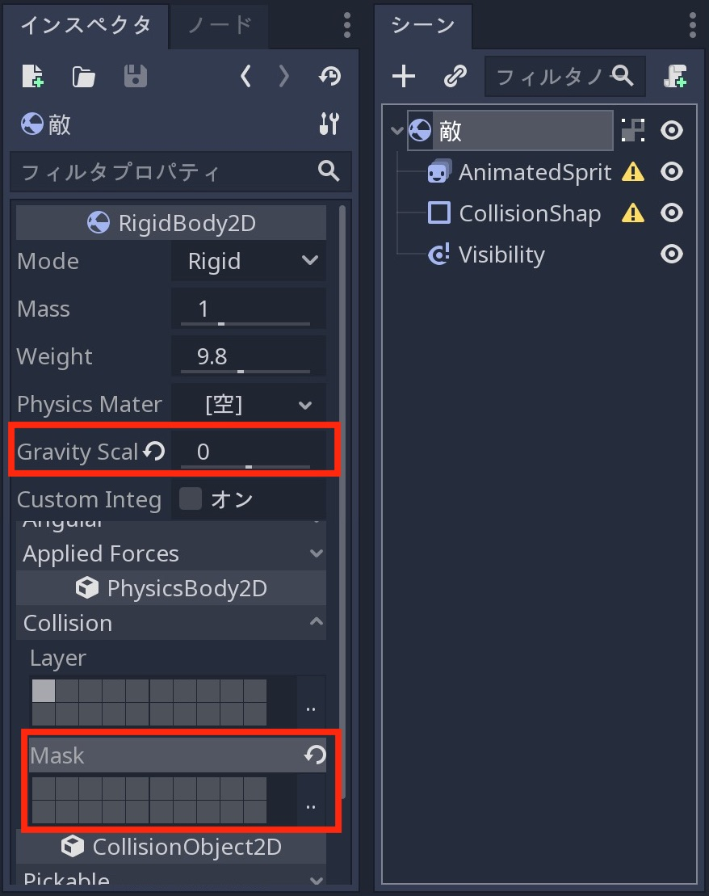

プレイヤー作成時のように、 :ref:`AnimatedSprite <class_AnimatedSprite>` を :ref:`設定 <プレイヤー画像jump>` する。
今回は、 ``歩く`` ・ ``泳ぐ`` ・ ``飛ぶ``  の3つのアニメーションを用いる。
インスペクタの ``Playing`` プロパティを "On" に設定し、以下に示すように "Speed (FPS)" 設定を調整する。
これらのアニメーションのいずれかを無作為に選択し、敵にさまざまな変化を持たせることができるようになった。

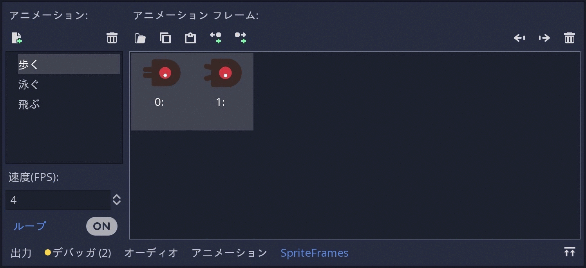

``飛ぶ`` は3FPSに設定し、 ``歩く`` と ``泳ぐ`` は4FPSに設定する。

プレイヤー画像のように、これらの敵画像も :ref:`縮小 <萎縮jump>` させるが、値は異なる。
``AnimatedSprite`` の ``Node2D ⇒ Transform ⇒ Scale`` プロパティを ``(0.75, 0.75)`` に設定する。

``プレイヤー`` シーンのように、衝突検出のために ``CapsuleShape2D`` を :ref:`設定 <接触jump>` する。
図形を画像に揃えるには、 ``Node2D`` の下の ``Transform ⇒ Rotation Degrees`` プロパティを ``90`` に設定する必要がある。

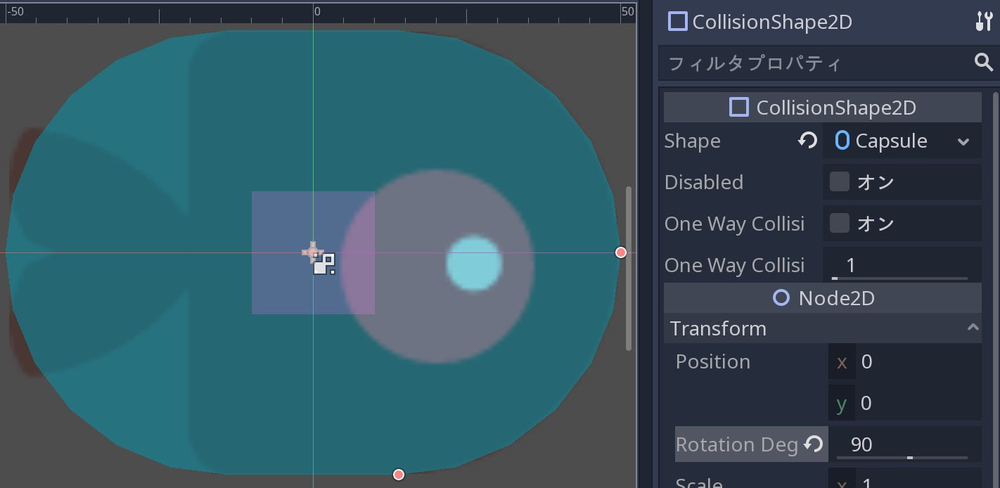

（縦幅を決めた後に横幅を決めた方が楽にできるだろう）

保存名： ``Mob.tscn``

.. todo::

   リンクの確認。

.. 英語の原文：ノードの設定
   Node setup
   ~~~~~~~~~~

   Click Scene -> New Scene and we'll create the Mob.

   The Mob scene will use the following nodes:

   -  :ref:`RigidBody2D <class_RigidBody2D>` (named ``Mob``)

      -  :ref:`AnimatedSprite <class_AnimatedSprite>`
      -  :ref:`CollisionShape2D <class_CollisionShape2D>`
      -  :ref:`VisibilityNotifier2D <class_VisibilityNotifier2D>` (named ``Visibility``)

   Don't forget to set the children so they can't be selected, like you did with the
   Player scene.

   In the :ref:`RigidBody2D <class_RigidBody2D>` properties, set ``Gravity Scale`` to ``0``, so
   the mob will not fall downward. In addition, under the
   ``PhysicsBody2D`` section, click the ``Mask`` property and
   uncheck the first box. This will ensure the mobs do not collide with each other.

   .. image:: img/set_collision_mask.png

   Set up the :ref:`AnimatedSprite <class_AnimatedSprite>` like you did for the player.
   This time, we have 3 animations: ``fly``, ``swim``, and ``walk``. Set the ``Playing``
   property in the Inspector to "On" and adjust the "Speed (FPS)" setting as shown below.
   We'll select one of these animations randomly so that the mobs will have some variety.

   .. image:: img/mob_animations.gif

   ``fly`` should be set to 3 FPS, with ``swim`` and ``walk`` set to 4 FPS.

   Like the player images, these mob images need to be scaled down. Set the
   ``AnimatedSprite``'s ``Scale`` property to ``(0.75, 0.75)``.

   As in the ``Player`` scene, add a ``CapsuleShape2D`` for the
   collision. To align the shape with the image, you'll need to set the
   ``Rotation Degrees`` property to ``90`` under ``Node2D``.

敵のスクリプト
~~~~~~~~~~~~~~~~~~~~~~~~~~~~

``敵`` 用のスクリプトを新規追加し、次のメンバ変数を追加する。

.. tabs::
   .. code-tab:: gdscript GDScript

      extends RigidBody2D

      export var min_speed = 150  # 移動速度の最小値
      export var max_speed = 250  # 移動速度の最大値
      var mob_types = ["歩く", "泳ぐ", "飛ぶ"]

   .. code-tab:: csharp

      public class Mob : RigidBody2D
      {
          // Don't forget to rebuild the project so the editor knows about the new export variables.

          [Export]
          public int MinSpeed = 150; // Minimum speed range.

          [Export]
          public int MaxSpeed = 250; // Maximum speed range.

          private String[] _mobTypes = {"walk", "swim", "fly"};
      }

敵が出現するとき、各敵の移動速度について ``min_speed`` と ``max_speed`` の間からランダムな値を使用する(同じ速度での移動は退屈だろう^^)。
また、3つのアニメーションの名前を含む配列(mob_types)があり、これを使用してランダムなアニメーションを選択する。
スクリプトの配列内の名前とSpriteFramesリソース(AnimatedSpriteノード)で付けた名前の綴りが同じであることを確認すること。

次に、スクリプトの残りの部分を確認する。
``_ready()`` では、3つのアニメーションタイプのいずれかをランダムに選択する。

.. tabs::
   .. code-tab:: gdscript GDScript

      func _ready():
          $AnimatedSprite.animation = mob_types[randi() % mob_types.size()]

   .. code-tab:: csharp

      // C# doesn't implement GDScript's random methods, so we use 'System.Random' as an alternative.
      static private Random _random = new Random();

      public override void _Ready()
      {
          GetNode<AnimatedSprite>("AnimatedSprite").Animation = _mobTypes[_random.Next(0, _mobTypes.Length)];
      }

.. note:: シーンを実行するたびに "random" の順序を変えたい場合は、 ``randomize()`` を使用する必要がある。
          今回は、 ``Main`` シーンで ``randomize()`` を使用するため、ここでは使わない。
          ``randi() % n`` は、 ``0`` と ``n-1`` の間からランダムな整数値を取得する方法だ。

最後の追加は、敵が画面を離れるときに、自滅する処理だ。
``Visibility`` ノードの ``screen_exited()`` シグナルを接続し、次のコードを追加する。

.. tabs::
   .. code-tab:: gdscript GDScript

      func _on_Visibility_screen_exited():
          queue_free()

   .. code-tab:: csharp

      public void OnVisibilityScreenExited()
      {
          QueueFree();
      }

これで `敵` シーンが完成した。

.. 英語の原文：敵のスクリプト
   Enemy script
   ~~~~~~~~~~~~

   Add a script to the ``Mob`` and add the following member variables:

   .. tabs::
    .. code-tab:: gdscript GDScript

       extends RigidBody2D

       export var min_speed = 150  # Minimum speed range.
       export var max_speed = 250  # Maximum speed range.
       var mob_types = ["walk", "swim", "fly"]

    .. code-tab:: csharp

       public class Mob : RigidBody2D
       {
           // Don't forget to rebuild the project so the editor knows about the new export variables.

           [Export]
           public int MinSpeed = 150; // Minimum speed range.

           [Export]
           public int MaxSpeed = 250; // Maximum speed range.

           private String[] _mobTypes = {"walk", "swim", "fly"};
       }

   When we spawn a mob, we'll pick a random value between ``min_speed`` and
   ``max_speed`` for how fast each mob will move (it would be boring if they
   were all moving at the same speed). We also have an array containing the names
   of the three animations, which we'll use to select a random one. Make sure
   you've spelled these the same in the script and in the SpriteFrames resource.

   Now let's look at the rest of the script. In ``_ready()`` we randomly
   choose one of the three animation types:

   .. tabs::
    .. code-tab:: gdscript GDScript

       func _ready():
           $AnimatedSprite.animation = mob_types[randi() % mob_types.size()]

    .. code-tab:: csharp

       // C# doesn't implement GDScript's random methods, so we use 'System.Random' as an alternative.
       static private Random _random = new Random();

       public override void _Ready()
       {
           GetNode<AnimatedSprite>("AnimatedSprite").Animation = _mobTypes[_random.Next(0, _mobTypes.Length)];
       }

   .. note:: You must use ``randomize()`` if you want
             your sequence of "random" numbers to be different every time you run
             the scene. We're going to use ``randomize()`` in our ``Main`` scene,
             so we won't need it here. ``randi() % n`` is the standard way to get
             a random integer between ``0`` and ``n-1``.

   The last piece is to make the mobs delete themselves when they leave the
   screen. Connect the ``screen_exited()`` signal of the ``Visibility``
   node and add this code:

   .. tabs::
    .. code-tab:: gdscript GDScript

       func _on_Visibility_screen_exited():
           queue_free()

    .. code-tab:: csharp

       public void OnVisibilityScreenExited()
       {
           QueueFree();
       }

   This completes the `Mob` scene.

.. _秘部追加jump:

メインシーン
------------------------

今までのシーンをまとめる作業に取りかかる。
新しいシーンを作成し、 :ref:`Node <class_Node>` を追加し、 ``メイン`` に名前変更する。
"Instance" ボタンをクリックし、保存した ``Player.tscn`` を選ぶ。

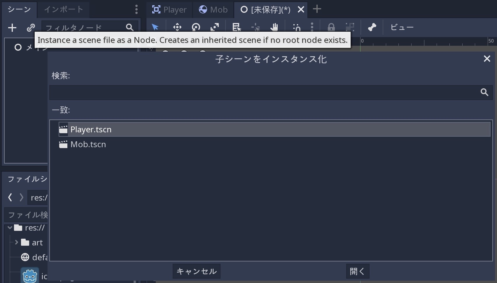

.. memo

   残念ながら冒頭での説明を全く理解せずに取り組んだため、tscnファイルの名前を違う名前で保存したのは秘密のことだ。メニューかどこかに名前を付けて保存する項目があるため、そこから変更する。当然のように、名前を変えたわけではなく、新しい名前で保存しているため、既存ファイルはそのままフォルダに留まっている。手動で削除するしかないようだ。

   Godotプロジェクトから名前を変更せず、フォルダを手動で開き、手動でファイル名を変更した場合、プロジェクトが名前を紐付けられず、プロジェクト自体が機能しなくなる。気をつけること(私は失敗したまま戻せずorz)。
   かつ、 *Main Scene* を設定済みの場合は、それも変更する必要がある。

.. note:: インスタンス化の詳細は、 :ref:`doc_instancing_jp` を参照すること。

次に、以下のノードを ``メイン`` の子として追加し、以下の名前を付ける(秒単位)。

- :ref:`Timer <class_Timer>` (名前： ``敵出現``) - 敵の出現頻度を制御する
- :ref:`Timer <class_Timer>` (名前： ``得点検出``) - 毎秒スコアを増やす
- :ref:`Timer <class_Timer>` (名前： ``開始判定``) - 開始前に遅延させる
- :ref:`Position2D <class_Position2D>` (名前： ``開始位置``) - プレイヤーの開始位置を示す

各 ``Timer`` ノードの ``Wait Time`` プロパティを次のように設定する。

- ``敵出現`` 　： ``0.5``
- ``得点検出`` ： ``1``
- ``開始判定`` ： ``2``

さらに、 ``開始判定`` の ``One Shot`` プロパティを "On" に設定し、 ``開始位置`` ノードの ``Node2D ⇒ Transform ⇒ Position`` を ``(240, 450)`` に設定する。

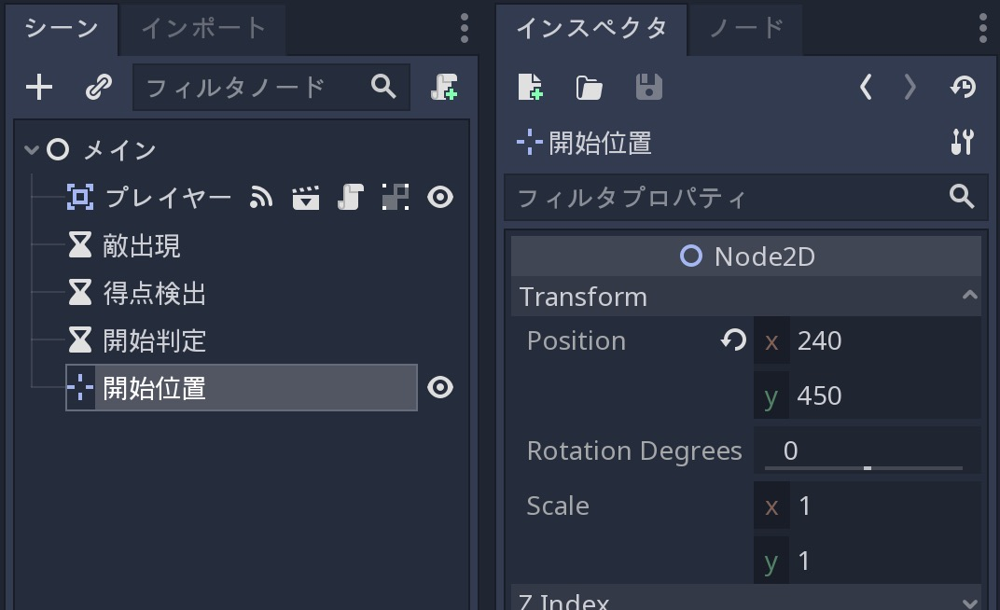

保存名： ``Main.tscn``

.. todo::

   リンクの確認。

.. 英語の原文：メインシーン
   Main scene
   ----------

   Now it's time to bring it all together. Create a new scene and add a
   :ref:`Node <class_Node>` named ``Main``. Click the "Instance" button and select your
   saved ``Player.tscn``.

   .. image:: img/instance_scene.png

   .. note:: See :ref:`doc_instancing` to learn more about instancing.

   Now, add the following nodes as children of ``Main``, and name them as
   shown (values are in seconds):

   -  :ref:`Timer <class_Timer>` (named ``MobTimer``) - to control how often mobs spawn
   -  :ref:`Timer <class_Timer>` (named ``ScoreTimer``) - to increment the score every second
   -  :ref:`Timer <class_Timer>` (named ``StartTimer``) - to give a delay before starting
   -  :ref:`Position2D <class_Position2D>` (named ``StartPosition``) - to indicate the player's start position

   Set the ``Wait Time`` property of each of the ``Timer`` nodes as
   follows:

   -  ``MobTimer``: ``0.5``
   -  ``ScoreTimer``: ``1``
   -  ``StartTimer``: ``2``

   In addition, set the ``One Shot`` property of ``StartTimer`` to "On" and
   set ``Position`` of the ``StartPosition`` node to ``(240, 450)``.

敵の生成
~~~~~~~~~~~~~~~~

メインノードは、敵を画面の端に散らばる状態で生成し続ける。
``メイン`` の子として ``敵配置`` と言う名前の :ref:`Path2D <class_Path2D>` ノードを追加する。
``敵配置`` を選択したとき、エディタの上部にいくつかの新しいボタンが表示される。

.. image:: img/path2d_buttons.png

中央のポイント( "点を空きスペースに追加" )を選択し、表示されている角にポイントをクリックして追加後、敷地(ゲームステージ)が完成する。

.. image:: img/draw_path2d.gif

ポイントをグリッドに合わせるには、 "グリッドにスナップ" を有効化させる。
このオプションは、 "選択したオブジェクトをその場でロック" (鍵マーク)ボタンの左側にある "スナップを使う" ボタンの右側にあり、一連の3つの垂直ドットで表示されている。

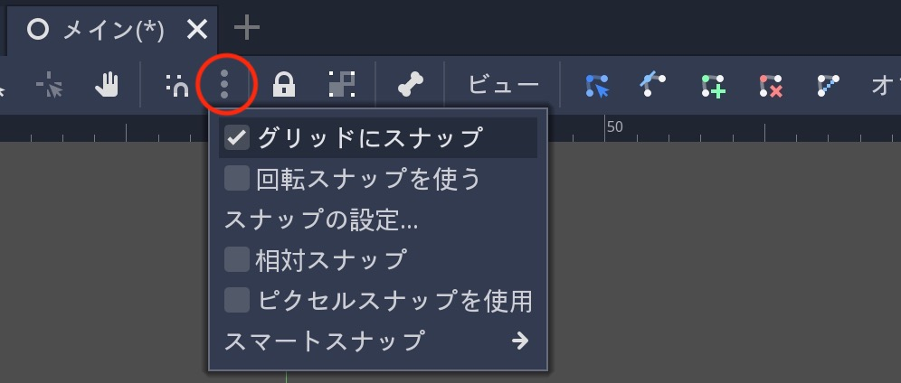

（訳者：そもそもグリッドの表示方法が分からない。うっすら見えている四角形になっている枠がそうか？）

.. important:: 敷地を *時計回り* の順序で描画したとき、敵は *敷地内* ではなく、 *敷地外* から出現する。

               （訳者：私が作成したときは敷地内で敵が生まれるため、ゲームとして成立しない。敷地の範囲は大きく取る必要があるのだろう）

ゲームステージに ``4`` つのポイントを配置した後、 "曲線を閉じる" ボタンをクリックしたときに曲線が完成する。

敷地が定義されたため、 :ref:`PathFollow2D <class_PathFollow2D>` を ``敵配置`` の子として追加し、名前を ``敵出現場所`` にする。
このノードは、敷地周辺に沿って徘徊するため、敵の配置場所と方向がランダムに選ばれる。

.. todo::

   リンクの確認。

.. 英語の原文：敵の産卵
   Spawning mobs
   ~~~~~~~~~~~~~

   The Main node will be spawning new mobs, and we want them to appear at a
   random location on the edge of the screen. Add a :ref:`Path2D <class_Path2D>` node named
   ``MobPath`` as a child of ``Main``. When you select ``Path2D``,
   you will see some new buttons at the top of the editor:

   .. image:: img/path2d_buttons.png

   Select the middle one ("Add Point") and draw the path by clicking to add
   the points at the corners shown. To have the points snap to the grid, make sure "Snap to
   Grid" is checked. This option can be found under the "Snapping options"
   button to the left of the "Lock" button, appearing as a series of three
   vertical dots.

   .. image:: img/draw_path2d.gif

   .. important:: Draw the path in *clockwise* order, or your mobs will spawn
                  pointing *outwards* instead of *inwards*!

   After placing point ``4`` in the image, click the "Close Curve" button and
   your curve will be complete.

   Now that the path is defined, add a :ref:`PathFollow2D <class_PathFollow2D>`
   node as a child of ``MobPath`` and name it ``MobSpawnLocation``. This node will
   automatically rotate and follow the path as it moves, so we can use it
   to select a random position and direction along the path.

メインスクリプト
~~~~~~~~~~~~~~~~~~~~~~~~~~~~~~~~

``メイン`` シーンにスクリプトを追加する。
スクリプトの上部に ``export (PackedScene)`` を追加する。
そうすることで、敵シーンのインスタンス化が可能になる。

.. tabs::
   .. code-tab:: gdscript GDScript

      extends Node

      export (PackedScene) var Mob
      var score

      func _ready():
          randomize()

   .. code-tab:: csharp

      public class Main : Node
      {
          // エディタが新しいエクスポート変数を認識できるように、プロジェクトのリビルドを忘れないこと。

          [Export]
          public PackedScene Mob;

          private int _score;

          // GDScriptのランダムメソッドの代わりに 'System.Random' を使用する。
          private Random _random = new Random();

          public override void _Ready()
          {
          }

          // C#はGDScriptの randi() を使えないため、これを後で使用する。
          private float RandRange(float min, float max)
          {
              return (float)_random.NextDouble() * (max - min) + min;
          }
      }

次に、 "ファイルシステムドック" から ``Mob.tscn`` をクリック&ドラッグし、 ``メイン`` ノードのインスペクタドック配下から ``Script Variables ⇒ Mob`` プロパティを探し、そこまでドラッグ&ドロップする。

（表示されない場合は、メインノードをクリックし直すことで表示されるようになる。）

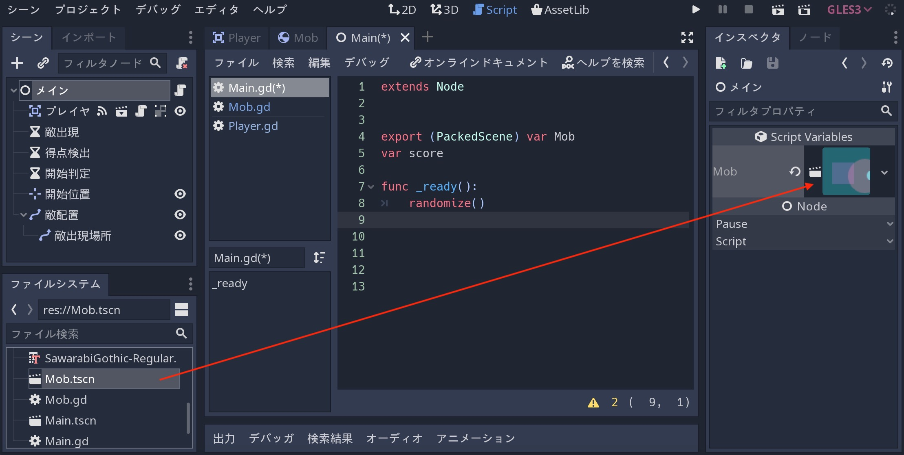

次に、プレイヤーノードをクリックして、 ``hit`` シグナルの :ref:`接続 <信号と合体jump>` 作業に取りかかる。
詳細な接続方法としては、ゲームの終了を知らせる処理用に、 ``game_over`` と言う名前の新しい関数を作成する。
その作成方法は、 "シグナルの接続" ウィンドウの下部にある "Method In Node" ボックスに "game_over" と入力する。

最後に、次のコードと新しいゲームのすべてを設定する ``new_game`` 関数を追加する。

.. tabs::
   .. code-tab:: gdscript GDScript

      func game_over():
          $"得点検出".stop()
          $"敵出現".stop()

      func new_game():
          score = 0
          $"プレイヤー".start($"開始位置".position)
          $"開始判定".start()

   .. code-tab:: csharp

      public void GameOver()
      {
          GetNode<Timer>("MobTimer").Stop();
          GetNode<Timer>("ScoreTimer").Stop();
      }

      public void NewGame()
      {
          _score = 0;

          var player = GetNode<Player>("Player");
          var startPosition = GetNode<Position2D>("StartPosition");
          player.Start(startPosition.Position);

          GetNode<Timer>("StartTimer").Start();
      }

次に、各タイマーノード( ``得点検出(ScoreTimer)`` ・ ``開始判定(StartTimer)`` ・ ``敵出現(MobTimer)`` )の ``timeout()`` シグナルをメインスクリプトに接続するが前半2つは今まで通りに接続して構わない。接続後に、敵出現ノードの接続に取り組む。
``得点検出`` はスコアを1増やす。
``開始判定`` は他の2つのタイマーを開始する。

訳者：【再度の注意喚起】気をつけなければならないことは、私が :ref:`命名規則違反 <茶目っ気jump>` をしていること。
ノード名に日本語名を割り当てたため、 "Method In Node" 欄に以下の関数名を打ち込む作業が発生する。
（日本語を使うことは想定外なのかもしれないが、私の違反では無く、プロジェクトに日本語の解釈を付けないことに非がある）解決は、人任せ(自動生成部分なので解決は不可能)。

.. tabs::
   .. code-tab:: gdscript GDScript

      func _on_ScoreTimer_timeout():
          score += 1

      func _on_StartTimer_timeout():
          $"敵出現".start()
          $"得点検出".start()

   .. code-tab:: csharp

      public void OnStartTimerTimeout()
      {
          GetNode<Timer>("MobTimer").Start();
          GetNode<Timer>("ScoreTimer").Start();
      }

      public void OnScoreTimerTimeout()
      {
          _score++;
      }

``_on_MobTimer_timeout()`` では、敵インスタンスを作成し、 ``Path2D`` (敵配置)に沿ってランダムに配置し、敵を動かす。
``PathFollow2D`` (敵出現場所)ノードは敷地枠に沿って徘徊するため、それを利用して敵の方向と位置を決定する。

``add_child()`` を使用して、新しいインスタンスをシーンに追加する必要があるため、次の作業も必要になる。

シーンドックから ``敵出現`` タイマーノードをクリックし、ノードドックに移動し、 ``timeout()`` をクリックしてシグナルを接続する。

訳者：ここでは "Method In Node" 欄への記入に "_on_MobTimer_timeout" を用いること。

次のコードを追加する。

.. tabs::
   .. code-tab:: gdscript GDScript

      func _on_MobTimer_timeout():
          # Path2Dのランダムな場所を選ぶ。
          $"敵配置"/"敵出現場所".set_offset(randi())

          # 敵インスタンスを作成し、シーンに追加する。
          var mob = Mob.instance()
          add_child(mob)

          # 敵の方向をパスの方向に垂直に設定する。
          var direction = $"敵配置"/"敵出現場所".rotation + PI / 2

          # 敵の位置をランダムな場所に設定する。
          mob.position = $"敵配置"/"敵出現場所".position

          # 方向にランダム性を追加する。
          direction += rand_range(-PI / 4, PI / 4)
          mob.rotation = direction

          # 速度(早さと方向)を設定する。
          mob.linear_velocity = Vector2(rand_range(mob.min_speed, mob.max_speed), 0)
          mob.linear_velocity = mob.linear_velocity.rotated(direction)

   .. code-tab:: csharp

      public void OnMobTimerTimeout()
      {
          // Choose a random location on Path2D.
          var mobSpawnLocation = GetNode<PathFollow2D>("MobPath/MobSpawnLocation");
          mobSpawnLocation.SetOffset(_random.Next());

          // Create a Mob instance and add it to the scene.
          var mobInstance = (RigidBody2D)Mob.Instance();
          AddChild(mobInstance);

          // Set the mob's direction perpendicular to the path direction.
          float direction = mobSpawnLocation.Rotation + Mathf.Pi / 2;

          // Set the mob's position to a random location.
          mobInstance.Position = mobSpawnLocation.Position;

          // Add some randomness to the direction.
          direction += RandRange(-Mathf.Pi / 4, Mathf.Pi / 4);
          mobInstance.Rotation = direction;

          // Choose the velocity.
          mobInstance.SetLinearVelocity(new Vector2(RandRange(150f, 250f), 0).Rotated(direction));
      }

.. important:: 角度を必要とする関数では、GDScriptは度を使わず、 *ラジアン* を使う。
               新しい経験に挑むほどの根性なしで **度の使用** に逃げたい場合は、 ``deg2rad()`` と ``rad2deg()`` の2つの関数を使い、度に変換する必要がある。

               ラジアン：これは、国際単位系 (SI)使われている単位であり、日本での計量法体系には、 "円の半径に等しい長さの弧の中心に対する角度" と言う定義がなされている。

               度： "円周を360等分した弧の中心に対する角度" と言う定義がある。

.. 英語の原文：メインスクリプト
   Main script
   ~~~~~~~~~~~

   Add a script to ``Main``. At the top of the script, we use
   ``export (PackedScene)`` to allow us to choose the Mob scene we want to
   instance.

   .. tabs::
    .. code-tab:: gdscript GDScript

       extends Node

       export (PackedScene) var Mob
       var score

       func _ready():
           randomize()

    .. code-tab:: csharp

       public class Main : Node
       {
           // Don't forget to rebuild the project so the editor knows about the new export variable.

           [Export]
           public PackedScene Mob;

           private int _score;

           // We use 'System.Random' as an alternative to GDScript's random methods.
           private Random _random = new Random();

           public override void _Ready()
           {
           }

           // We'll use this later because C# doesn't support GDScript's randi().
           private float RandRange(float min, float max)
           {
               return (float)_random.NextDouble() * (max - min) + min;
           }
       }

   Drag ``Mob.tscn`` from the "FileSystem" panel and drop it in the
   ``Mob`` property under the Script Variables of the ``Main`` node.

   Next, click on the Player and connect the ``hit`` signal. We want to make a
   new function named ``game_over``, which will handle what needs to happen when a
   game ends. Type "game_over" in the "Method In Node" box at the bottom of the
   "Connecting Signal" window. Add the following code, as well as a ``new_game``
   function to set everything up for a new game:

   .. tabs::
    .. code-tab:: gdscript GDScript

       func game_over():
           $ScoreTimer.stop()
           $MobTimer.stop()

       func new_game():
           score = 0
           $Player.start($StartPosition.position)
           $StartTimer.start()

    .. code-tab:: csharp

       public void GameOver()
       {
           GetNode<Timer>("MobTimer").Stop();
           GetNode<Timer>("ScoreTimer").Stop();
       }

       public void NewGame()
       {
           _score = 0;

           var player = GetNode<Player>("Player");
           var startPosition = GetNode<Position2D>("StartPosition");
           player.Start(startPosition.Position);

           GetNode<Timer>("StartTimer").Start();
       }

   Now connect the ``timeout()`` signal of each of the Timer nodes (``StartTimer``,
   ``ScoreTimer`` ,and ``MobTimer``) to the main script. ``StartTimer`` will start
   the other two timers. ``ScoreTimer`` will increment the score by 1.

   .. tabs::
    .. code-tab:: gdscript GDScript

       func _on_StartTimer_timeout():
           $MobTimer.start()
           $ScoreTimer.start()

       func _on_ScoreTimer_timeout():
           score += 1

    .. code-tab:: csharp

       public void OnStartTimerTimeout()
       {
           GetNode<Timer>("MobTimer").Start();
           GetNode<Timer>("ScoreTimer").Start();
       }

       public void OnScoreTimerTimeout()
       {
           _score++;
       }

   In ``_on_MobTimer_timeout()``, we will create a mob instance, pick a
   random starting location along the ``Path2D``, and set the mob in
   motion. The ``PathFollow2D`` node will automatically rotate as it
   follows the path, so we will use that to select the mob's direction as
   well as its position.

   Note that a new instance must be added to the scene using
   ``add_child()``.

   Now click on ``MobTimer`` in the scene window then head to inspector window,
   switch to node view then click on ``timeout()`` and connect the signal.

   Add the following code:

   .. tabs::
    .. code-tab:: gdscript GDScript

       func _on_MobTimer_timeout():
           # Choose a random location on Path2D.
           $MobPath/MobSpawnLocation.set_offset(randi())
           # Create a Mob instance and add it to the scene.
           var mob = Mob.instance()
           add_child(mob)
           # Set the mob's direction perpendicular to the path direction.
           var direction = $MobPath/MobSpawnLocation.rotation + PI / 2
           # Set the mob's position to a random location.
           mob.position = $MobPath/MobSpawnLocation.position
           # Add some randomness to the direction.
           direction += rand_range(-PI / 4, PI / 4)
           mob.rotation = direction
           # Set the velocity (speed & direction).
           mob.linear_velocity = Vector2(rand_range(mob.min_speed, mob.max_speed), 0)
           mob.linear_velocity = mob.linear_velocity.rotated(direction)

    .. code-tab:: csharp

       public void OnMobTimerTimeout()
       {
           // Choose a random location on Path2D.
           var mobSpawnLocation = GetNode<PathFollow2D>("MobPath/MobSpawnLocation");
           mobSpawnLocation.SetOffset(_random.Next());

           // Create a Mob instance and add it to the scene.
           var mobInstance = (RigidBody2D)Mob.Instance();
           AddChild(mobInstance);

           // Set the mob's direction perpendicular to the path direction.
           float direction = mobSpawnLocation.Rotation + Mathf.Pi / 2;

           // Set the mob's position to a random location.
           mobInstance.Position = mobSpawnLocation.Position;

           // Add some randomness to the direction.
           direction += RandRange(-Mathf.Pi / 4, Mathf.Pi / 4);
           mobInstance.Rotation = direction;

           // Choose the velocity.
           mobInstance.SetLinearVelocity(new Vector2(RandRange(150f, 250f), 0).Rotated(direction));
       }

   .. important:: In functions requiring angles, GDScript uses *radians*,
                  not degrees. If you're more comfortable working with
                  degrees, you'll need to use the ``deg2rad()`` and
                  ``rad2deg()`` functions to convert between the two.

ヘッドアップディスプレイ(HUD)
----------------------------------------------------------

ゲームに必要な最後の欠片はUIになる。
スコア・ "ゲームオーバ" メッセージ・再起動ボタンなどを表示するインタフェイスが必要になる。
新しいシーンを作成し、 ``画面表示`` と言う名前の :ref:`CanvasLayer <class_CanvasLayer>` ノードを追加する。

ちなみに、 "HUD" は、 "heads-up display" の略で、ゲームビューの上部にオーバーレイとして表示される(表面を薄く覆う)情報を指す。

:ref:`CanvasLayer <class_CanvasLayer>` ノードを使用したとき、ゲーム画面とは別に設けられたUI要素を描画するため、プレイヤーや敵などのゲーム要素を邪魔した表示にはならない。

HUDには、次の情報を表示する。

- ゲーム得点。 ``得点検出`` ノードにより変更
- "ゲームオーバ" や "用意！" などのメッセージ
- ゲーム開始の "スタート" ボタンなど。

UI要素は :ref:`Control <class_Control>` ノードが基本になる。
UIを作成するには、子ノード追加用に開いた "Node を新規作成" ウィンドウに表示される :ref:`Control <class_Control>` ノード配下の :ref:`Label <class_Label>` と :ref:`Button <class_Button>` を使う。

``画面表示`` ノードの子として以下を作成する。

- :ref:`Label <class_Label>` 名前： ``スコアラベル``
- :ref:`Label <class_Label>` 名前： ``メッセージラベル``
- :ref:`Button <class_Button>` 名前： ``スタートボタン``
- :ref:`Timer <class_Timer>` 名前： ``メッセージタイマー``

保存名： ``Hud.tscn``

``スコアラベル`` をクリックし、インスペクタの *Text* フィールドに数字のゼロを入力する。
``Control`` ノードの標準フォントは小さいため見にくい。
"Xolonium-Regular.ttf" と言うゲームアセットに含まれるフォントファイルを使用するには、3つの ``Control`` ノードのそれぞれに対して以下を実行すると思うなよ。

以下の手順は、英語版に限るだろう。
もし、英語表記のみで構わないのであれば、以下を実行すること。
しかし、日本語表記などの他バイト文字を扱いたい場合は、もう少し下にスクロールすることで、それ用の説明に入る。

1. "Custom Fonts" で、 "New DynamicFont" を選ぶ。

.. image:: img/custom_font1.png

2. "DynamicFont" をクリックし、 "Font/Font Data" の下で "Load" を選択し、 "Xolonium-Regular.ttf" ファイルを選ぶ。
   また、フォントの ``Size`` も変更する必要がある。
   ``64`` の設定は見やすい大きさだと実感するだろう。

.. image:: img/custom_font2.png

現在、このページを閲覧していると言うことは、日本人かもしくは日本語を扱いたい生命体のはずだ。
たとえナメック語しか話せなくても表示させるだけならば以下の手順で可能になる。

しかし、完全に外部のフォント頼みになるため、躊躇する場合は、英語表記だけに我慢すべきだろう。

今回は、商用利用に使えるフォントを採用する。
それが `Google <https://www.google.co.jp>`_ の `Noto Fonts <https://www.google.com/get/noto/>`_ と言われるフォントだ。

https://github.com/google-fonts-bower/sawarabigothic-bower/blob/master/SawarabiGothic-Regular.ttf

ここから ``View raw`` をクリックし、フォントをダウンロードすること。
``SawarabiGothic-Regular.ttf`` を入手できたが、このファイルをプロジェクトに移さなければならない。
フォルダを作った配下に配置するか、そのままプロジェクトファイル(project.godot)がある場所に配置しても問題ない。

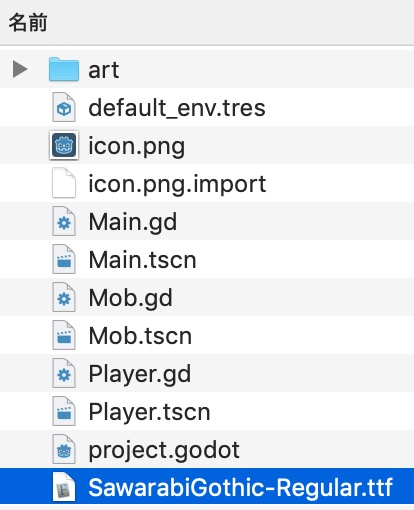

ここ以降の手順は英語版と同じで構わない。

1. "Custom Fonts" で、 "新規 DynamicFont" を選ぶ。

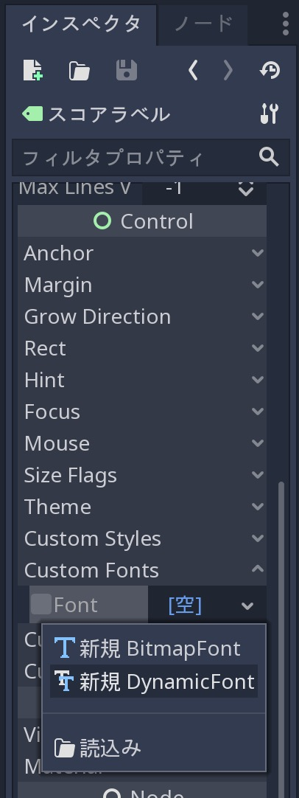

2. "DynamicFont" をクリックし、 "Font/Font Data" の下で "読込み" を選択し、 "SawarabiGothic-Regular.ttf" ファイルを選ぶ。
   また、フォントの ``Size`` も変更する必要がある。
   ``64`` の設定は見やすい大きさだと実感するだろう。

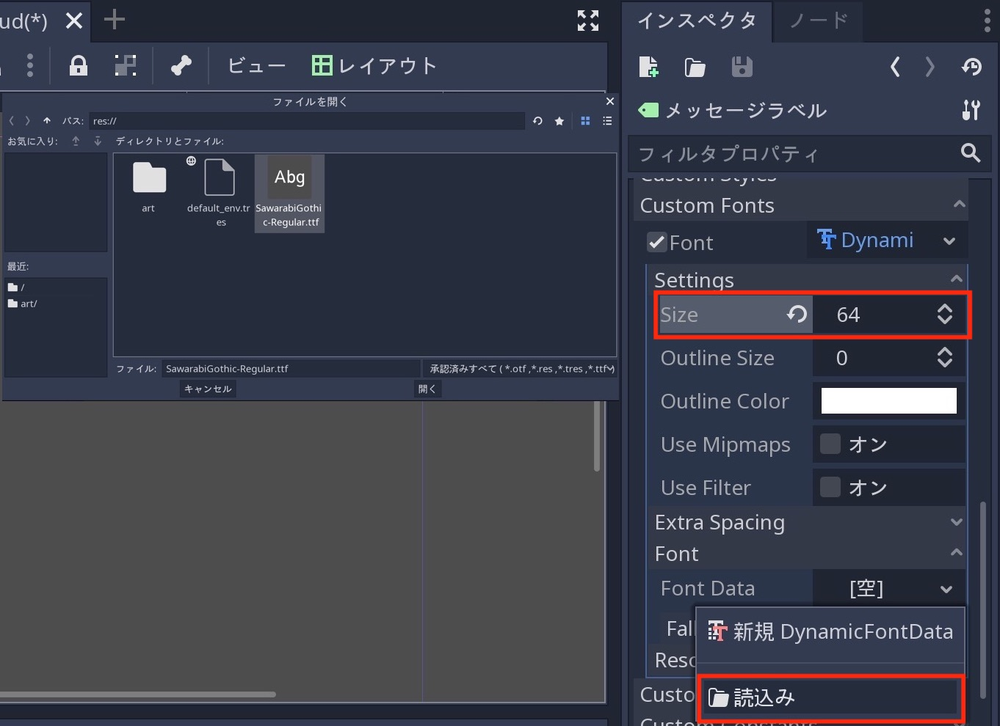

.. note:: **Anchors and Margins：** ``Control`` ノードには位置とサイズがあり、アンカー(Anchor・錨)とマージン(Margin・余白)もある。
          アンカーは、ノードの端を基準点として定義する。
          コントロールノードを移動またはサイズ変更したとき、マージンは自動的に更新される。
          これらは、コントロールノードの端から端までの距離を表す。
          詳しくは、 :ref:`doc_design_interfaces_with_the_control_nodes_jp` を参照すること。

.. _あの子にひっつきたいjump:

以下のようにノードを配置すること。
"アンカーのみ" ボタンをクリックして、Controlノードのアンカーを以下(スクロール下)のように設定する。

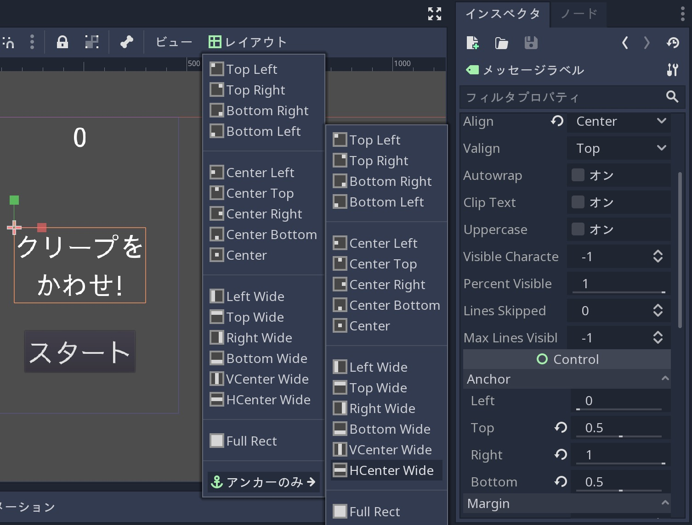

もしくは、手動でノードをドラッグ移動する。

※訳者：現時点では、アンカーとレイアウトの違いが分からない。レイアウトを使う前に、どこかでアンカーを設定した？しかし、アンカーの解除方法が分からない。

.. note::

   このソフトウェアは、 `Apache 2.0ライセンス <https://github.com/googlefonts/japanese/blob/master/LICENSE.txt>`_ で配布されている製作物が含まれています。

.. todo::

   リンクの確認。

.. 英語の原文：ヘッドアップディスプレイ(HUD)
   HUD
   ---

   The final piece our game needs is a UI: an interface to display things
   like score, a "game over" message, and a restart button. Create a new
   scene, and add a :ref:`CanvasLayer <class_CanvasLayer>` node named ``HUD``. "HUD" stands for
   "heads-up display", an informational display that appears as an
   overlay on top of the game view.

   The :ref:`CanvasLayer <class_CanvasLayer>` node lets us draw our UI elements on
   a layer above the rest of the game, so that the information it displays isn't
   covered up by any game elements like the player or mobs.

   The HUD displays the following information:

   -  Score, changed by ``ScoreTimer``.
   -  A message, such as "Game Over" or "Get Ready!"
   -  A "Start" button to begin the game.

   The basic node for UI elements is :ref:`Control <class_Control>`. To create our UI,
   we'll use two types of :ref:`Control <class_Control>` nodes: :ref:`Label <class_Label>`
   and :ref:`Button <class_Button>`.

   Create the following as children of the ``HUD`` node:

   -  :ref:`Label <class_Label>` named ``ScoreLabel``.
   -  :ref:`Label <class_Label>` named ``MessageLabel``.
   -  :ref:`Button <class_Button>` named ``StartButton``.
   -  :ref:`Timer <class_Timer>` named ``MessageTimer``.

   Click on the ``ScoreLabel`` and type a number into the *Text* field in the
   Inspector. The default font for ``Control`` nodes is small and doesn't scale
   well. There is a font file included in the game assets called
   "Xolonium-Regular.ttf". To use this font, do the following for each of
   the three ``Control`` nodes:

   1. Under "Custom Fonts", choose "New DynamicFont"

   .. image:: img/custom_font1.png

   2. Click on the "DynamicFont" you added, and under "Font/Font Data",
      choose "Load" and select the "Xolonium-Regular.ttf" file. You must
      also set the font's ``Size``. A setting of ``64`` works well.

   .. image:: img/custom_font2.png

   .. note:: **Anchors and Margins:** ``Control`` nodes have a position and size,
             but they also have anchors and margins. Anchors define the
             origin - the reference point for the edges of the node. Margins
             update automatically when you move or resize a control node. They
             represent the distance from the control node's edges to its anchor.
             See :ref:`doc_design_interfaces_with_the_control_nodes` for more details.

   Arrange the nodes as shown below. Click the "Anchor" button to
   set a Control node's anchor:

   .. image:: img/ui_anchor.png

   You can drag the nodes to place them manually, or for more precise
   placement, use the following settings:

スコアラベル
~~~~~~~~~~~~~~~~~~~~~~~~

- *Text* ： ``0``
- *Layout* ： "Top Wide"
- *Align* ： "Center"

.. 英語の原文：スコアラベル
   ScoreLabel
   ~~~~~~~~~~

   -  *Text* : ``0``
   -  *Layout* : "Top Wide"
   -  *Align* : "Center"

メッセージラベル
~~~~~~~~~~~~~~~~~~~~~~~~~~~~~~~~

- *Text* ： ``クリープを\nかわせ!``
- *Layout* ： "HCenter Wide"
- *Align* ： "Center"

\n：改行

.. 英語の原文：メッセージラベル
   MessageLabel
   ~~~~~~~~~~~~

   -  *Text* : ``Dodge the Creeps!``
   -  *Layout* : "HCenter Wide"
   -  *Align* : "Center"

スタートボタン
~~~~~~~~~~~~~~~~~~~~~~~~~~~~

- *Text* ： ``スタート``
- *Layout* ： "Center Bottom"
- *Margin* ：

  - Top： ``-200``
  - Bottom： ``-100``

次に、 ``画面表示`` シーンにスクリプトを追加する。

.. tabs::
   .. code-tab:: gdscript GDScript

      extends CanvasLayer

      signal start_game

   .. code-tab:: csharp

      public class HUD : CanvasLayer
      {
          // Don't forget to rebuild the project so the editor knows about the new signal.

          [Signal]
          public delegate void StartGame();
      }

``start_game`` シグナルは、ボタンが押されたことを ``メイン`` ノードに伝える。

.. tabs::
   .. code-tab:: gdscript GDScript

      func show_message(text):
          $"メッセージラベル".text = text
          $"メッセージラベル".show()
          $"メッセージタイマー".start()

   .. code-tab:: csharp

      public void ShowMessage(string text)
      {
          var messageLabel = GetNode<Label>("MessageLabel");
          messageLabel.Text = text;
          messageLabel.Show();

          GetNode<Timer>("MessageTimer").Start();
      }

この関数は、 "用意！" などのメッセージを一時表示するときに呼び出される。
``メッセージタイマー`` で、 ``Wait Time`` を ``2`` に設定し、 ``One Shot`` プロパティを "On" にする。

.. tabs::
   .. code-tab:: gdscript GDScript

      func show_game_over():
          show_message("ゲームオーバ")
          yield($"メッセージタイマー", "timeout")
          $"メッセージラベル".text = "避難だ。\nクリープから!"
          $"メッセージラベル".show()
          yield(get_tree().create_timer(1), 'timeout')
          $"スタートボタン".show()

   .. code-tab:: csharp

      async public void ShowGameOver()
      {
          ShowMessage("Game Over");

          var messageTimer = GetNode<Timer>("MessageTimer");
          await ToSignal(messageTimer, "timeout");

          var messageLabel = GetNode<Label>("MessageLabel");
          messageLabel.Text = "Dodge the\nCreeps!";
          messageLabel.Show();

          GetNode<Button>("StartButton").Show();
      }

この関数は、プレイヤーが負けたときに呼び出される。
2秒間 "ゲームオーバ" が表示され、その後タイトル画面に戻り、一呼吸置いてから "スタート" ボタンが表示される。

.. note:: 一時停止する必要がある場合、タイマーノードを使用する代わりに、シーンツリーの ``create_timer()`` 関数を使用する。
          これは、上記のコードのように、 "スタートボタン" を表示するまでの時間延長に、非常に役立つ。

.. tabs::
   .. code-tab:: gdscript GDScript

      func update_score(score):
          $"スコアラベル".text = str(score)

   .. code-tab:: csharp

      public void UpdateScore(int score)
      {
          GetNode<Label>("ScoreLabel").Text = score.ToString();
      }

この関数はスコアが変わるたびに ``メイン`` によって呼び出される。

``メッセージタイマー(MessageTimer)`` ノードの ``timeout()`` シグナルと ``スタートボタン(StartButton)`` ノードの ``pressed()`` シグナルを接続する。

.. tabs::
   .. code-tab:: gdscript GDScript

      func _on_MessageTimer_timeout():
          $"メッセージラベル".hide()

      func _on_StartButton_pressed():
          $"スタートボタン".hide()
          emit_signal("start_game")

   .. code-tab:: csharp

      public void OnStartButtonPressed()
      {
          GetNode<Button>("StartButton").Hide();
          EmitSignal("StartGame");
      }

      public void OnMessageTimerTimeout()
      {
          GetNode<Label>("MessageLabel").Hide();
      }

.. 英語の原文：スタートボタン
   StartButton
   ~~~~~~~~~~~

   -  *Text* : ``Start``
   -  *Layout* : "Center Bottom"
   -  *Margin* :

      -  Top: ``-200``
      -  Bottom: ``-100``

   Now add this script to ``HUD``:

   .. tabs::
    .. code-tab:: gdscript GDScript

       extends CanvasLayer

       signal start_game

    .. code-tab:: csharp

       public class HUD : CanvasLayer
       {
           // Don't forget to rebuild the project so the editor knows about the new signal.

           [Signal]
           public delegate void StartGame();
       }

   The ``start_game`` signal tells the ``Main`` node that the button
   has been pressed.

   .. tabs::
    .. code-tab:: gdscript GDScript

       func show_message(text):
           $MessageLabel.text = text
           $MessageLabel.show()
           $MessageTimer.start()

    .. code-tab:: csharp

       public void ShowMessage(string text)
       {
           var messageLabel = GetNode<Label>("MessageLabel");
           messageLabel.Text = text;
           messageLabel.Show();

           GetNode<Timer>("MessageTimer").Start();
       }

   This function is called when we want to display a message
   temporarily, such as "Get Ready". On the ``MessageTimer``, set the
   ``Wait Time`` to ``2`` and set the ``One Shot`` property to "On".

   .. tabs::
    .. code-tab:: gdscript GDScript

       func show_game_over():
           show_message("Game Over")
           yield($MessageTimer, "timeout")
           $MessageLabel.text = "Dodge the\nCreeps!"
           $MessageLabel.show()
           yield(get_tree().create_timer(1), 'timeout')
           $StartButton.show()

    .. code-tab:: csharp

       async public void ShowGameOver()
       {
           ShowMessage("Game Over");

           var messageTimer = GetNode<Timer>("MessageTimer");
           await ToSignal(messageTimer, "timeout");

           var messageLabel = GetNode<Label>("MessageLabel");
           messageLabel.Text = "Dodge the\nCreeps!";
           messageLabel.Show();

           GetNode<Button>("StartButton").Show();
       }

   This function is called when the player loses. It will show "Game
   Over" for 2 seconds, then return to the title screen and, after a brief pause,
   show the "Start" button.

   .. note:: When you need to pause for a brief time, an alternative to using a
             Timer node is to use the SceneTree's ``create_timer()`` function. This
             can be very useful to delay, such as in the above code, where we want
             to wait a little bit of time before showing the "Start" button.

   .. tabs::
    .. code-tab:: gdscript GDScript

       func update_score(score):
           $ScoreLabel.text = str(score)

    .. code-tab:: csharp

       public void UpdateScore(int score)
       {
           GetNode<Label>("ScoreLabel").Text = score.ToString();
       }

   This function is called by ``Main`` whenever the score changes.

   Connect the ``timeout()`` signal of ``MessageTimer`` and the
   ``pressed()`` signal of ``StartButton``.

   .. tabs::
    .. code-tab:: gdscript GDScript

       func _on_StartButton_pressed():
           $StartButton.hide()
           emit_signal("start_game")

       func _on_MessageTimer_timeout():
           $MessageLabel.hide()

    .. code-tab:: csharp

       public void OnStartButtonPressed()
       {
           GetNode<Button>("StartButton").Hide();
           EmitSignal("StartGame");
       }

       public void OnMessageTimerTimeout()
       {
           GetNode<Label>("MessageLabel").Hide();
       }

画面表示シーンをメインに接続する
~~~~~~~~~~~~~~~~~~~~~~~~~~~~~~~~~~~~~~~~~~

``画面表示`` シーンの作成が完了したことにより、保存後に ``メイン`` に戻る。
``画面表示`` シーンを ``プレイヤー`` シーンと同じように、 ``メイン`` にインスタンス化するため、ツリーの下部に :ref:`配置 <秘部追加jump>` する。
完全なツリーは次のようになるため、実際の作業と照らし合わせ、作業漏れが無いことを確認すること。

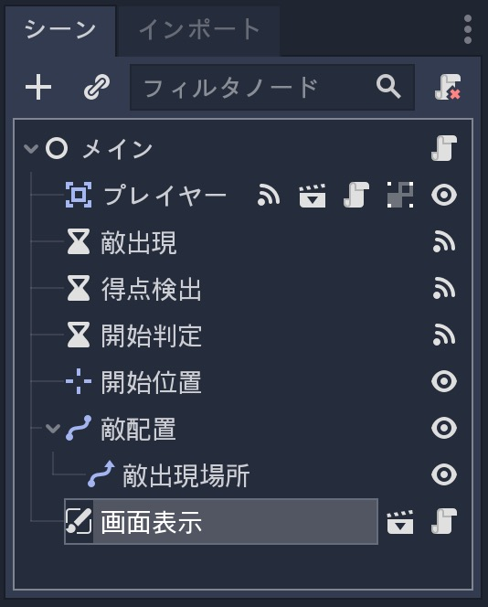

また、ノードの種類を間違えただけであれば、以下の画像のように変更が可能だ。

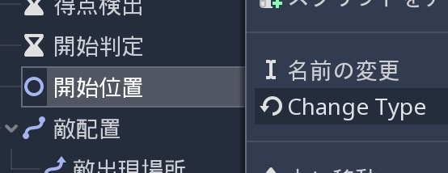

右クリック後に表示されるメニューの中から "Change Type" を選び、出てきたウィンドウから適切なノードを選び、 "変更" ボタンをクリックして作業完了する。

（事前に知っておけば失敗することが無いため、いかに経験が犬畜生より劣る行為かが証明される）
指摘されずとも私は犬より劣ることを自覚していますよ。

次に、 ``画面表示`` での関数を ``メイン`` スクリプトに持ち込む(接続する)必要がある。
これを実現するには、 ``メイン`` シーンにいくつかの追加作業をする。

ノードドックで、画面表示ノードの ``start_game`` シグナルを ``new_game()`` 関数に :ref:`接続 <既存に接吻jump>` する。

``new_game()`` で、スコア表示を更新し、 "用意！" メッセージを表示する。

.. tabs::
   .. code-tab:: gdscript GDScript

      func new_game():
          # 途中処理省略
          $"画面表示".update_score(score)
          $"画面表示".show_message("用意！")

   .. code-tab:: csharp

      var hud = GetNode<HUD>("HUD");
      hud.UpdateScore(_score);
      hud.ShowMessage("Get Ready!");

``game_over()`` では、対応する ``画面表示`` からの関数を呼び出す必要がある。

.. tabs::
   .. code-tab:: gdscript GDScript

      func game_over():
          # 途中処理省略
          $"画面表示".show_game_over()

   .. code-tab:: csharp

      GetNode<HUD>("HUD").ShowGameOver();

最後に、以下を ``_on_ScoreTimer_timeout()`` に追加し、変化するスコアとディスプレイの同期を保つ。

.. tabs::
   .. code-tab:: gdscript GDScript

      func _on_ScoreTimer_timeout():
          # 途中処理省略
          $"画面表示".update_score(score)

   .. code-tab:: csharp

      GetNode<HUD>("HUD").UpdateScore(_score);

これで遊ぶ準備ができた。
"実行" ボタンをクリックする(シーンを実行ボタンではない)。
メインシーンを選択するように求めらたときに、 ``Main.tscn`` を選択する。

.. note::

   もし、ゲームが始まらない場合は、シグナルの紐付けが正しく行われていない可能性がある。
   本来は、接続しているシグナルをダブルクリックした場合、スクリプトに記載した関数に飛ぶことができる。
   それができない場合は、確実に紐付けられていない。

   逃げるのはクリープからであり、ゲーム開発からではない。
   安心するがいい、働くことから逃げてきた私ですら今回のゲームは完成させられた。君にもできる。

- シグナルと関数の結びつき

   - メインシーン

    - プレイヤー(Player)ノード

      - hitシグナル ⇒ game_over関数

      - body_enteredシグナル ⇒ _on_Player_body_entered関数

    - 敵出現(MobTimer)ノード

      - timeoutシグナル ⇒ _on_MobTimer_timeout関数

    - 得点検出(ScoreTimer)ノード

      - timeoutシグナル ⇒ _on_ScoreTimer_timeout関数

    - 開始判定(StartTimer)ノード

      - timeoutシグナル ⇒ _on_StartTimer_timeout関数

    - 画面表示(CanvasLayer)ノード   本来の英語名：HUD

      - start_gameシグナル ⇒ new_game関数

  - 画面表示(CanvasLayer)シーン

    - メッセージタイマー(MessageTimer)ノード

      - timeoutシグナル ⇒ _on_MessageTimer_timeout関数

    - スタートボタン(StartButton)ノード

      - pressedシグナル ⇒ _on_StartButton_pressed関数

  - プレイヤー(Player)シーン

    - メイン(Main)シーンに統合済み。

  - 敵(Mob)シーン

    - メイン(Main)シーンに統合済み。

とはいえ、一度作るのを失敗したとき、シグナルと関数の結びつきをやり直した。
そして、旨く紐付けられず、プロジェクトごと新規に作り直す羽目になった。
それでも最終的に完成できたのだから問題ない。

.. 英語の原文：画面表示シーンをメインに接続する
   Connecting HUD to Main
   ~~~~~~~~~~~~~~~~~~~~~~

   Now that we're done creating the ``HUD`` scene, save it and go back to ``Main``.
   Instance the ``HUD`` scene in ``Main`` like you did the ``Player`` scene, and
   place it at the bottom of the tree. The full tree should look like this,
   so make sure you didn't miss anything:

   .. image:: img/completed_main_scene.png

   Now we need to connect the ``HUD`` functionality to our ``Main`` script.
   This requires a few additions to the ``Main`` scene:

   In the Node tab, connect the HUD's ``start_game`` signal to the
   ``new_game()`` function.

   In ``new_game()``, update the score display and show the "Get Ready"
   message:

   .. tabs::
    .. code-tab:: gdscript GDScript

           $HUD.update_score(score)
           $HUD.show_message("Get Ready")

    .. code-tab:: csharp

           var hud = GetNode<HUD>("HUD");
           hud.UpdateScore(_score);
           hud.ShowMessage("Get Ready!");

   In ``game_over()`` we need to call the corresponding ``HUD`` function:

   .. tabs::
    .. code-tab:: gdscript GDScript

           $HUD.show_game_over()

    .. code-tab:: csharp

           GetNode<HUD>("HUD").ShowGameOver();

   Finally, add this to ``_on_ScoreTimer_timeout()`` to keep the display in
   sync with the changing score:

   .. tabs::
    .. code-tab:: gdscript GDScript

           $HUD.update_score(score)

    .. code-tab:: csharp

           GetNode<HUD>("HUD").UpdateScore(_score);

   Now you're ready to play! Click the "Play the Project" button. You will
   be asked to select a main scene, so choose ``Main.tscn``.

古い敵を削除する
~~~~~~~~~~~~~~~~~~~~~~~~~~~~~~~~

"ゲームオーバ" から新しいゲームを開始するまでに、前のゲームの敵が画面に表示されたままになる(新しく生成されることはないが)。
それらが新しいゲームの開始時にすべて消えていたらやる気も出てくるだろう。

残りの敵を除去するために、 ``画面表示`` ノードによって送信済みの ``start_game`` シグナルを使用する。
ゲームを実行するまで ``メイン`` シーンツリーには ``敵`` ノードが生成されないため、エディタを使用する方法ではシグナルを敵ノードに接続できない。
代わりのコードを用意して補うことにする。

``Mob.gd`` に新しい関数を追加することから始める。
``queue_free()`` は現在のフレームの最後にある現在のノードを削除する。

.. tabs::
   .. code-tab:: gdscript GDScript

      func _on_start_game():
          queue_free()

   .. code-tab:: csharp

      public void OnStartGame()
      {
          QueueFree();
      }

次に、 ``Main.gd`` で、 ``_on_MobTimer_timeout()`` 関数内の末尾に以下を追加する。

.. tabs::
   .. code-tab:: gdscript GDScript

      $"画面表示".connect("start_game", mob, "_on_start_game")

   .. code-tab:: csharp

      GetNode("HUD").Connect("StartGame", mobInstance, "OnStartGame");

この行は、新しい敵ノード( ``mob`` 変数によって参照される)に、 ``_on_start_game()`` 関数を実行させることにより、 ``画面表示`` ノードから送信される ``start_game`` シグナルに応答するように指示する。

（訳者：言い回しがわかりにくい。しかも、ゲームオーバを迎えても敵は消えてくれないのだが・・・。原作でもそうだったため、消えるという認識に齟齬があるのだろう）

.. 英語の原文：古い敵を削除する
   Removing old creeps
   ~~~~~~~~~~~~~~~~~~~

   If you play until "Game Over" and then start a new game the creeps from the
   previous game are still on screen. It would be better if they all disappeared
   at the start of a new game.

   We'll use the ``start_game`` signal that's already being emitted by the ``HUD``
   node to remove the remaining creeps. We can't use the editor to connect the
   signal to the mobs in the way we need because there are no ``Mob`` nodes in the
   ``Main`` scene tree until we run the game. Instead we'll use code.

   Start by adding a new function to ``Mob.gd``. ``queue_free()`` will delete the
   current node at the end of the current frame.

   .. tabs::
    .. code-tab:: gdscript GDScript

       func _on_start_game():
           queue_free()
    
    .. code-tab:: csharp

       public void OnStartGame()
       {
           QueueFree();
       }
             
   Then in ``Main.gd`` add a new line inside the ``_on_MobTimer_timeout()`` function,
   at the end.

   .. tabs::
    .. code-tab:: gdscript GDScript

       $HUD.connect("start_game", mob, "_on_start_game")

    .. code-tab:: csharp
    
       GetNode("HUD").Connect("StartGame", mobInstance, "OnStartGame");

   This line tells the new Mob node (referenced by the ``mob`` variable) to respond
   to any ``start_game`` signal emitted by the ``HUD`` node by running its
   ``_on_start_game()`` function.

仕上げ
------------

これで、ゲームのすべての機能が完成した。
以下は、ゲーム性能向上のために、 "juice(deuce？)" を追加する。
その方法は、自分のアイデアでゲームを自由に拡張することことだ。

.. 英語の原文：仕上げ
   Finishing up
   ------------

   We have now completed all the functionality for our game. Below are some
   remaining steps to add a bit more "juice" to improve the game
   experience. Feel free to expand the gameplay with your own ideas.

ゲーム背景色
~~~~~~~~~~~~~~~~~~~~~~~~

標準の背景は灰色のため、あまり魅力的ではない。
色を変更する方法の1つとして、 :ref:`ColorRect <class_ColorRect>` ノードを使用することだ。
それを ``メイン`` 直下の最初のノードにして、他のノードの後ろに描画されるように変更する。
``ColorRect`` には1つのプロパティ ``Color`` のみがある。
好きな色を選択し、画面を覆うように ``ColorRect`` の大きさをドラッグで変更する。

メイン直下に配置せず、プレイヤーノードより下に配置した場合は、プレイヤーが今回のノードで覆われてしまい、ゲームにならない。
配置場所に気をつけること(敵ノードはコードからの生成になるため、覆われることがない)。

``Sprite`` ノードを使用し、背景画像がある場合はそれを追加することもできる。

.. todo::

   リンクの確認。

.. 英語の原文：ゲーム背景色
   Background
   ~~~~~~~~~~

   The default gray background is not very appealing, so let's change its
   color. One way to do this is to use a :ref:`ColorRect <class_ColorRect>` node.
   Make it the first node under ``Main`` so that it will be drawn behind the other
   nodes. ``ColorRect`` only has one property: ``Color``. Choose a color
   you like and drag the size of the ``ColorRect`` so that it covers the
   screen.

   You could also add a background image, if you have one, by using a
   ``Sprite`` node.

音響効果
~~~~~~~~~~~~~~~~

効果音と音楽は、ゲーム(体験)に魅力を加えるための最も効果的な方法になる。
2つのサウンドファイルを用意済みのため使ってくれ。
バックグラウンドミュージック用の "House In a Forest Loop.ogg" とプレイヤーが負けたときの "gameover.wav" がある。

2つの :ref:`AudioStreamPlayer <class_AudioStreamPlayer>` ノードを ``メイン`` の子として追加する。
そのうちの1つを ``音楽`` とし、もう1つを ``死音`` と名付ける。
それぞれに、 ``Stream`` プロパティを開き、 "読込み" をクリック後に、対応する音源ファイルを選ぶ。

音楽を再生するには、 ``new_game()`` 関数に ``$"音楽".play()`` を追加し、 ``game_over()`` 関数に ``$"音楽".stop()`` を追加する。

最後は、 ``game_over()`` 関数に ``$"死音".play()`` を追加する。

.. todo::

   リンクの確認。

.. 英語の原文：音響効果
   Sound effects
   ~~~~~~~~~~~~~

   Sound and music can be the single most effective way to add appeal to
   the game experience. In your game assets folder, you have two sound
   files: "House In a Forest Loop.ogg" for background music, and
   "gameover.wav" for when the player loses.

   Add two :ref:`AudioStreamPlayer <class_AudioStreamPlayer>` nodes as children of ``Main``. Name one of
   them ``Music`` and the other ``DeathSound``. On each one, click on the
   ``Stream`` property, select "Load", and choose the corresponding audio
   file.

   To play the music, add ``$Music.play()`` in the ``new_game()`` function
   and ``$Music.stop()`` in the ``game_over()`` function.

   Finally, add ``$DeathSound.play()`` in the ``game_over()`` function.

キーボードショートカット
~~~~~~~~~~~~~~~~~~~~~~~~~~~~~~~~~~~~~~~~~~~~~~~~

ゲームは、キーボードで操作するため、キーボードのキー押下で制御できるようにする。
これを行う方法の1つとして、 ``Button`` ノードの "Shortcut" プロパティを利用する。

``画面表示`` シーンで ``スタートボタン`` を選択し、インスペクタで *BaseButton ⇒ Shortcut* プロパティを探す。
"新規 Shortcut" を選択し、 "Shortcut" 項目をクリックする。
2番目の *Shortcut* プロパティが表示される。
"新規 InputEventAction" を選び、新しい "InputEvent" をクリックする。
最後に、 *Action* プロパティに ``ui_select`` と言う名前を付ける。
これは、スペースバーに関連付けられたデフォルトの入力イベントになる。

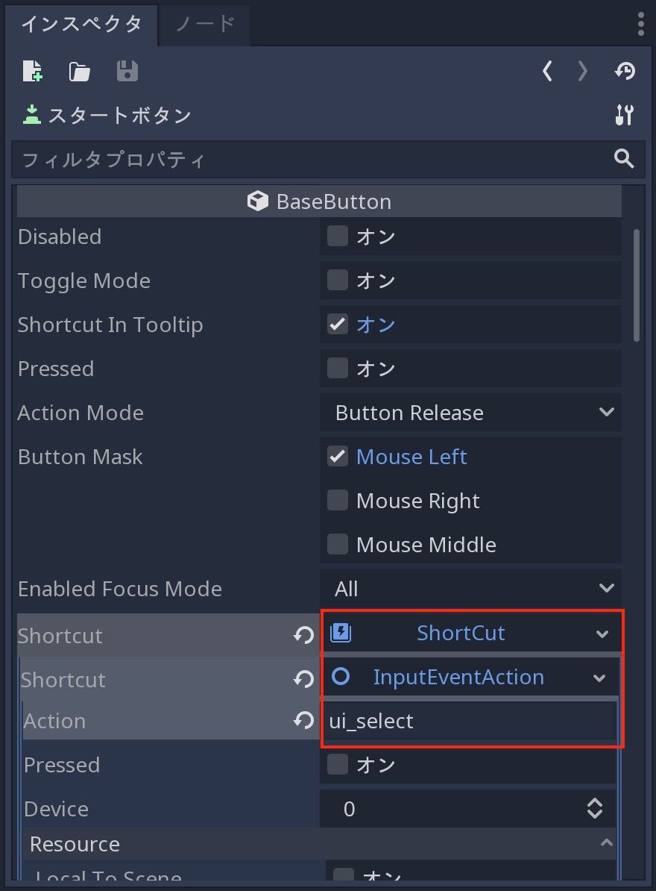

スタートボタンが表示された場合、クリック作業か、スペースバー押下でゲームを開始できるようになる。

.. 英語の原文：キーボードショートカット
   Keyboard Shortcut
   ~~~~~~~~~~~~~~~~~

   Since the game is played with keyboard controls, it would be convenient if we
   could also start the game by pressing a key on the keyboard. One way to do this
   is using the "Shortcut" property of the ``Button`` node.

   In the ``HUD`` scene, select the ``StartButton`` and find its *Shortcut* property
   in the Inspector. Select "New Shortcut" and click on the "Shortcut" item. A
   second *Shortcut* property will appear. Select "New InputEventAction" and click
   the new "InputEvent". Finally, in the *Action* property, type the name ``ui_select``.
   This is the default input event associated with the spacebar.

   .. image:: img/start_button_shortcut.png

   Now when the start button appears, you can either click it or press the spacebar
   to start the game.

プロジェクトファイル
----------------------------------------

今回の完成済みプロジェクトは、次の場所に用意してある(原本・英語版)。

 - https://github.com/kidscancode/Godot3_dodge/releases
 - https://github.com/godotengine/godot-demo-projects

.. 英語の原文：プロジェクトファイル
   Project files
   -------------

   You can find a completed version of this project at these locations:
    - https://github.com/kidscancode/Godot3_dodge/releases
    - https://github.com/godotengine/godot-demo-projects

.. vim:set ts=3 sw=3 tw=0 fenc=utf-8:
